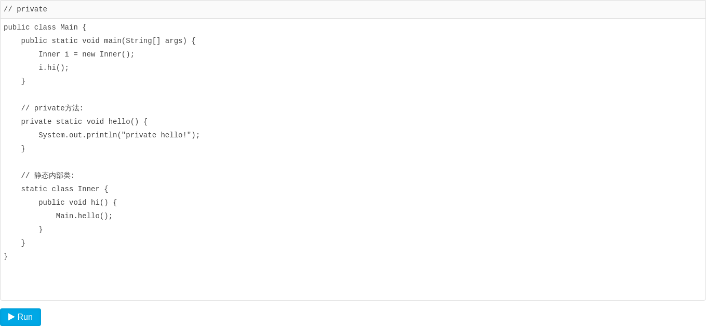

# 作用域

[toc]

### 作用域

在Java中，我们经常看到`public`、`protected`、`private`这些修饰符。在Java中，这些修饰符可以用来限定访问作用域。

​	

### public

定义为`public`的`class`、`interface`可以被其他任何类访问：

```java
package abc;
public class Hello {
    public void hi() {
    }
}
```

上面的`Hello`是`public`，因此，可以被其他包的类访问：

```java
package xyz;
class Main {
    void foo() {
        // Main可以访问Hello
        Hello h = new Hello();
    }
}
```

定义为`public`的`field`、`method`可以被其他类访问，前提是首先有访问`class`的权限：

```java
package abc;
public class Hello {
    public void hi() {
    }
}
```

上面的`hi()`方法是`public`，可以被其他类调用，前提是首先要能访问`Hello`类：

```java
package xyz;
class Main {
    void foo() {
        Hello h = new Hello();
        h.hi();
    }
}
```

### private

定义为`private`的`field`、`method`无法被其他类访问：

```java
package abc;
public class Hello {
    // 不能被其他类调用:
    private void hi() {
    }
    public void hello() {
        this.hi();
    }
}
```

实际上，确切地说，`private`访问权限被限定在`class`的内部，而且与方法声明顺序*无关*。推荐把`private`方法放到后面，因为`public`方法定义了类对外提供的功能，阅读代码的时候，应该先关注`public`方法：

```java
package abc;
public class Hello {
    public void hello() {
        this.hi();
    }
    private void hi() {
    }
}
```

由于Java支持嵌套类，如果一个类内部还定义了嵌套类，那么，嵌套类拥有访问`private`的权限：



定义在一个`class`内部的`class`称为嵌套类（`nested class`），Java支持好几种嵌套类。

### protected

`protected`作用于继承关系。定义为`protected`的字段和方法可以被子类访问，以及子类的子类：

```java
package abc;
public class Hello {
    // protected方法:
    protected void hi() {
    }
}
```

上面的`protected`方法可以被继承的类访问：

```java
package xyz;
class Main extends Hello {
    void foo() {
        // 可以访问protected方法:
        hi();
    }
}
```

### package

最后，包作用域是指一个类允许访问同一个`package`的没有`public`、`private`修饰的`class`，以及没有`public`、`protected`、`private`修饰的字段和方法。

```java
package abc;
// package权限的类:
class Hello {
    // package权限的方法:
    void hi() {
    }
}
```

只要在同一个包，就可以访问`package`权限的`class`、`field`和`method`：

```java
package abc;
class Main {
    void foo() {
        // 可以访问package权限的类:
        Hello h = new Hello();
        // 可以调用package权限的方法:
        h.hi();
    }
}
```

注意，包名必须完全一致，包没有父子关系，`com.apache`和`com.apache.abc`是不同的包。

### 局部变量

在方法内部定义的变量称为局部变量，局部变量作用域从变量声明处开始到对应的块结束。方法参数也是局部变量。

```java
ackage abc;
public class Hello {
    void hi(String name) { // ①
        String s = name.toLowerCase(); // ②
        int len = s.length(); // ③
        if (len < 10) { // ④
            int p = 10 - len; // ⑤
            for (int i=0; i<10; i++) { // ⑥
                System.out.println(); // ⑦
            } // ⑧
        } // ⑨
    } // ⑩
}
```

我们观察上面的`hi()`方法代码：

- 方法参数name是局部变量，它的作用域是整个方法，即①～⑩；
- 变量s的作用域是定义处到方法结束，即②～⑩；
- 变量len的作用域是定义处到方法结束，即③～⑩；
- 变量p的作用域是定义处到if块结束，即⑤～⑨；
- 变量i的作用域是for循环，即⑥～⑧。

使用局部变量时，应该尽可能把局部变量的作用域缩小，尽可能延后声明局部变量。

### final

Java还提供了一个`final`修饰符。`final`与访问权限不冲突，它有很多作用。

用`final`修饰`class`可以阻止被继承：

```java
package abc;
// 无法被继承:
public final class Hello {
    private int n = 0;
    protected void hi(int t) {
        long i = t;
    }
}
```

用`final`修饰`method`可以阻止被子类覆写：

```java
package abc;
public class Hello {
    // 无法被覆写:
    protected final void hi() {
    }
}
```

用`final`修饰`field`可以阻止被重新赋值：

```java
package abc;
public class Hello {
    private final int n = 0;
    protected void hi() {
        this.n = 1; // error!
    }
}
```

用`final`修饰局部变量可以阻止被重新赋值：

```java
package abc;
public class Hello {
    protected void hi(final int t) {
        t = 1; // error!
    }
}
```

### 最佳实践

如果不确定是否需要`public`，就不声明为`public`，即尽可能少地暴露对外的字段和方法。

把方法定义为`package`权限有助于测试，因为测试类和被测试类只要位于同一个`package`，测试代码就可以访问被测试类的`package`权限方法。

一个`.java`文件只能包含一个`public`类，但可以包含多个非`public`类。如果有`public`类，文件名必须和`public`类的名字相同。

### 小结

Java内建的访问权限包括`public`、`protected`、`private`和`package`权限；

Java在方法内部定义的变量是局部变量，局部变量的作用域从变量声明开始，到一个块结束；

`final`修饰符不是访问权限，它可以修饰`class`、`field`和`method`；

一个`.java`文件只能包含一个`public`类，但可以包含多个非`public`类。
