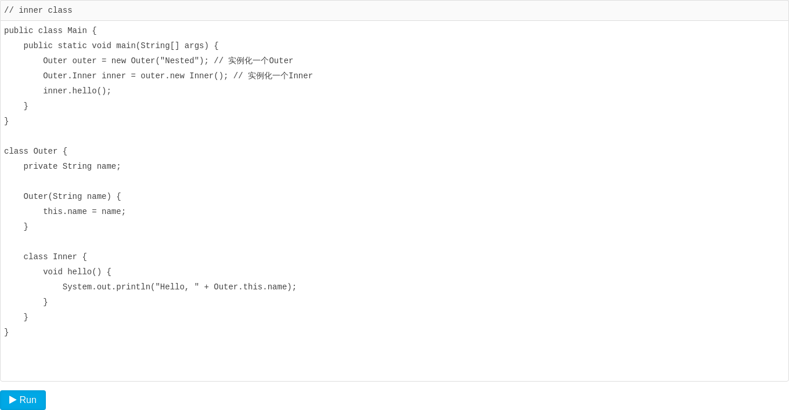

# 内部类

[toc]

### 内部类

在Java程序中，通常情况下，我们把不同的类组织在不同的包下面，对于一个包下面的类来说，它们是在同一层次，**没有父子关系**：

```txt
java.lang
├── Math
├── Runnable
├── String
└── ...
```

还有**一种类，它被定义在另一个类的内部，所以称为`内部类`**（Nested Class）。Java的内部类分为好几种，通常情况用得不多，但也需要了解它们是如何使用的。

### Inner Class

如果一个类定义在另一个类的内部，这个类就是`Inner Class`：

```java
class Outer {
    class Inner {
        // 定义了一个Inner Class
    }
}
```

上述定义的`Outer`是一个普通类，而`Inner`是一个Inner Class，它与普通类有个最大的不同，就是Inner Class的实例不能单独存在，必须依附于一个Outer Class的实例。示例代码如下：



观察上述代码，要实例化一个`Inner`，我们必须首先创建一个`Outer`的实例，然后，调用`Outer`实例的`new`来创建`Inner`实例：

```java
Outer.Inner inner = outer.new Inner();
```

这是因为Inner Class除了有一个`this`指向它自己，还隐含地持有一个Outer Class实例，可以用`Outer.this`访问这个实例。所以，实例化一个Inner Class不能脱离Outer实例。

Inner Class和普通Class相比，除了能引用Outer实例外，还有一个额外的“特权”，就是可以修改Outer Class的`private`字段，因为Inner Class的作用域在Outer Class内部，所以能访问Outer Class的`private`字段和方法。

观察Java编译器编译后的`.class`文件可以发现，`Outer`类被编译为`Outer.class`，而`Inner`类被编译为`Outer$Inner.class`。

### Anonymous Class

还有一种定义Inner Class的方法，它不需要在Outer Class中明确地定义这个Class，而是在方法内部，通过匿名类（Anonymous Class）来定义。示例代码如下：


观察`asyncHello()`方法，我们在方法内部实例化了一个`Runnable`。`Runnable`本身是接口，接口是不能实例化的，所以这里实际上是定义了一个实现了`Runnable`接口的匿名类，并且通过`new`实例化该匿名类，然后转型为`Runnable`。在定义匿名类的时候就必须实例化它，定义匿名类的写法如下：

> 在我们开发的过程中常常会碰到多线程的问题，对于多线程的实现方式主要有两种：**实现Runnable接口、继承Thread类。**

```java
Runnable r = new Runnable() {
    // 实现必要的抽象方法...
};
```

匿名类和Inner Class一样，可以访问Outer Class的`private`字段和方法。之所以我们要定义匿名类，是因为在这里我们通常不关心类名，比直接定义Inner Class可以少写很多代码。

观察Java编译器编译后的`.class`文件可以发现，`Outer`类被编译为`Outer.class`，而匿名类被编译为`Outer$1.class`。如果有多个匿名类，Java编译器会将每个匿名类依次命名为`Outer$1`、`Outer$2`、`Outer$3`……

除了接口外，匿名类也完全可以继承自普通类。观察以下代码：


`map1`是一个普通的`HashMap`实例，但`map2`是一个匿名类实例，只是该匿名类继承自`HashMap`。`map3`也是一个继承自`HashMap`的匿名类实例，并且添加了`static`代码块来初始化数据。观察编译输出可发现`Main$1.class`和`Main$2.class`两个匿名类文件。

### Static Nested Class

最后一种内部类和Inner Class类似，但是使用`static`修饰，称为静态内部类（Static Nested Class）：


用`static`修饰的内部类和Inner Class有很大的不同，它不再依附于`Outer`的实例，而是一个完全独立的类，因此无法引用`Outer.this`，但它可以访问`Outer`的`private`静态字段和静态方法。如果把`StaticNested`移到`Outer`之外，就失去了访问`private`的权限。

### 小结

Java的内部类可分为Inner Class、Anonymous Class和Static Nested Class三种：

- Inner Class和Anonymous Class本质上是相同的，都必须依附于Outer Class的实例，即隐含地持有`Outer.this`实例，并拥有Outer Class的`private`访问权限；
- Static Nested Class是独立类，但拥有Outer Class的`private`访问权限。
