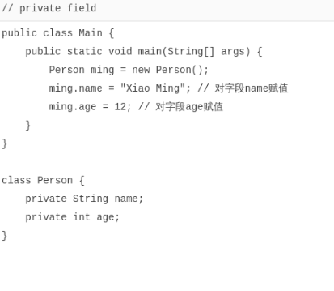
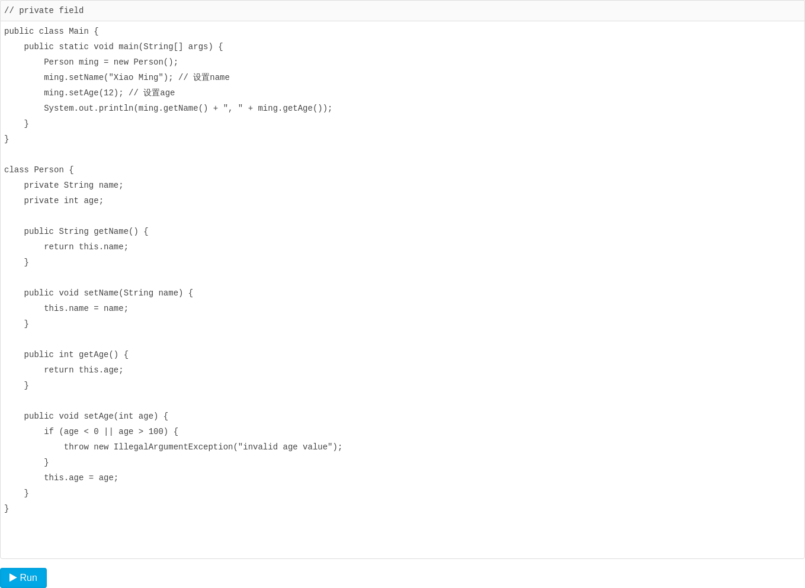
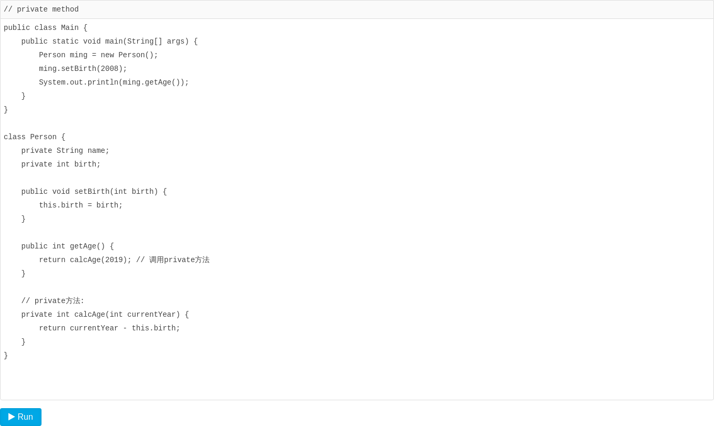
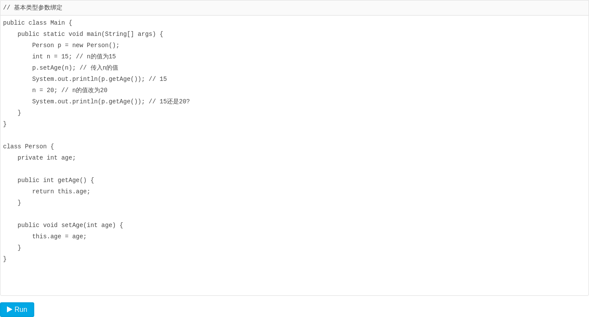
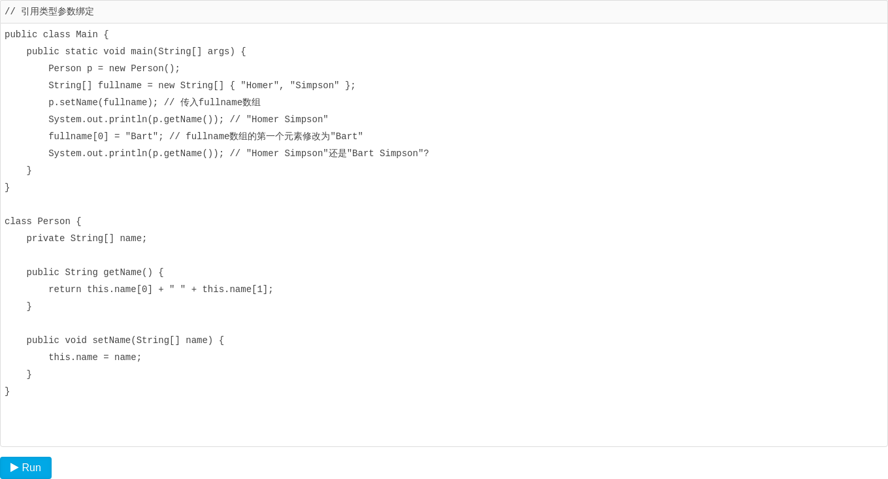
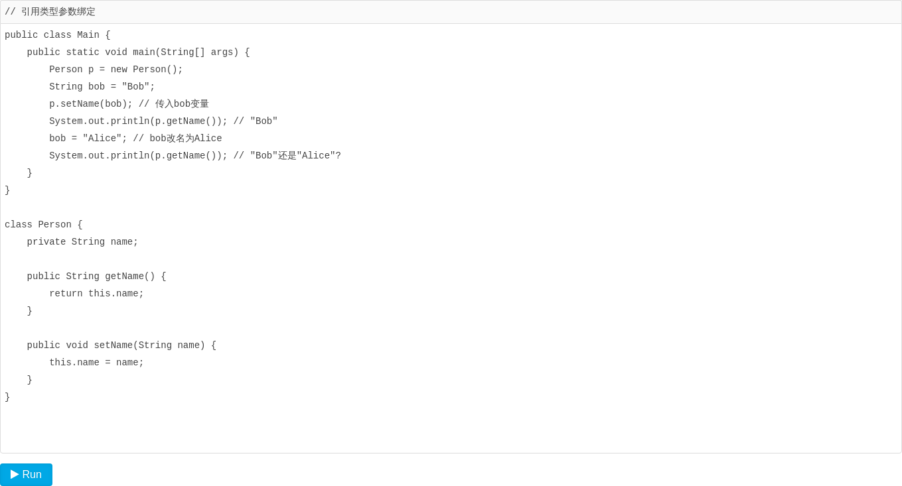
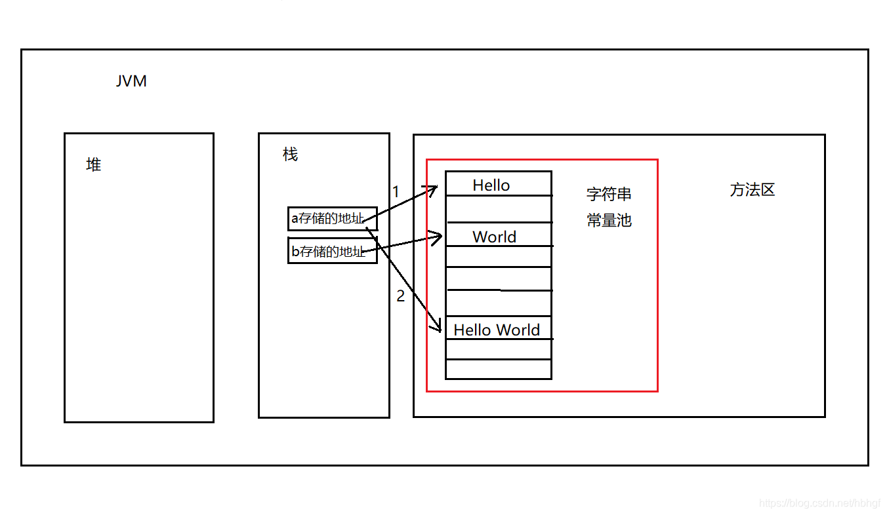
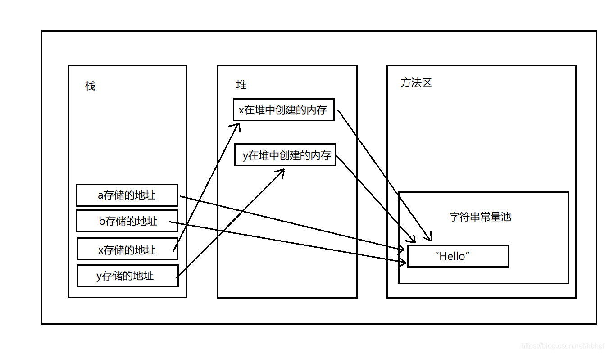

# 方法

[toc]

### 方法

一个`class`可以包含多个`field`，例如，我们给`Person`类就定义了两个`field`：

```java
class Person {
    public String name;
    public int age;
}
```

但是，直接把`field`用`public`暴露给外部可能会破坏封装性。比如，代码可以这样写：

```java
Person ming = new Person();
ming.name = "Xiao Ming";
ming.age = -99; // age设置为负数
```

显然，直接操作`field`，容易造成逻辑混乱。为了避免外部代码直接去访问`field`，我们可以用`private`修饰`field`，拒绝外部访问：

```java
class Person {
    private String name;
    private int age;
}
```

试试`private`修饰的`field`有什么效果：



是不是编译报错？把访问`field`的赋值语句去了就可以正常编译了。

把`field`从`public`改成`private`，外部代码不能访问这些`field`，那我们定义这些`field`有什么用？怎么才能给它赋值？怎么才能读取它的值？

所以我们需要使用方法（`method`）来让外部代码可以间接修改`field`：



虽然外部代码不能直接修改`private`字段，但是，外部代码可以调用方法`setName()`和`setAge()`来间接修改`private`字段。在方法内部，我们就有机会检查参数对不对。比如，`setAge()`就会检查传入的参数，参数超出了范围，直接报错。这样，外部代码就没有任何机会把`age`设置成不合理的值。

对`setName()`方法同样可以做检查，例如，不允许传入`null`和空字符串：

```java
public void setName(String name) {
    if (name == null || name.isBlank()) {
        throw new IllegalArgumentException("invalid name");
    }
    this.name = name.strip(); // 去掉首尾空格
}
```

同样，外部代码不能直接读取`private`字段，但可以通过`getName()`和`getAge()`间接获取`private`字段的值。

所以，一个类通过定义方法，就可以给外部代码暴露一些操作的接口，同时，内部自己保证逻辑一致性。

调用方法的语法是`实例变量.方法名(参数);`。一个方法调用就是一个语句，所以不要忘了在末尾加`;`。例如：`ming.setName("Xiao Ming");`。

### 定义方法

从上面的代码可以看出，定义方法的语法是：

```java
修饰符 方法返回类型 方法名(方法参数列表) {
    若干方法语句;
    return 方法返回值;
}
```

方法返回值通过`return`语句实现，如果没有返回值，返回类型设置为`void`，可以省略`return`。

### private方法

有`public`方法，自然就有`private`方法。和`private`字段一样，`private`方法不允许外部调用，那我们定义`private`方法有什么用？

定义`private`方法的理由是内部方法是可以调用`private`方法的。例如：



观察上述代码，`calcAge()`是一个`private`方法，外部代码无法调用，但是，内部方法`getAge()`可以调用它。

此外，我们还注意到，这个`Person`类只定义了`birth`字段，没有定义`age`字段，获取`age`时，通过方法`getAge()`返回的是一个实时计算的值，并非存储在某个字段的值。这说明方法可以封装一个类的对外接口，调用方不需要知道也不关心`Person`实例在内部到底有没有`age`字段。

### this变量

在方法内部，可以使用一个隐含的变量`this`，它始终指向当前实例。因此，通过`this.field`就可以访问当前实例的字段。

如果没有命名冲突，可以省略`this`。例如：

```java
class Person {
    private String name;
    public String getName() {
        return name; // 相当于this.name
    }
}
```

但是，如果有局部变量和字段重名，那么局部变量优先级更高，就必须加上`this`：

```java
class Person {
    private String name;
    public void setName(String name) {
        this.name = name; // 前面的this不可少，少了就变成局部变量name了
    }
}
```

### 方法参数

方法可以包含0个或任意个参数。方法参数用于接收传递给方法的变量值。调用方法时，必须严格按照参数的定义一一传递。例如：

```java
class Person {
    ...
    public void setNameAndAge(String name, int age) {
        ...
    }
}
```

调用这个`setNameAndAge()`方法时，必须有两个参数，且第一个参数必须为`String`，第二个参数必须为`int`：

```java
Person ming = new Person();
ming.setNameAndAge("Xiao Ming"); // 编译错误：参数个数不对
ming.setNameAndAge(12, "Xiao Ming"); // 编译错误：参数类型不对
```

### 可变参数

可变参数用`类型...`定义，可变参数相当于数组类型：

```java
class Group {
    private String[] names;
    public void setNames(String... names) {
        this.names = names;
    }
}
```

上面的`setNames()`就定义了一个可变参数。调用时，可以这么写：

```java
Group g = new Group();
g.setNames("Xiao Ming", "Xiao Hong", "Xiao Jun"); // 传入3个String
g.setNames("Xiao Ming", "Xiao Hong"); // 传入2个String
g.setNames("Xiao Ming"); // 传入1个String
g.setNames(); // 传入0个String
```

完全可以把可变参数改写为`String[]`类型：

```java
class Group {
    private String[] names;
    public void setNames(String[] names) {
        this.names = names;
    }
}
```

但是，调用方需要自己先构造`String[]`，比较麻烦。例如：

```java
Group g = new Group();
g.setNames(new String[] {"Xiao Ming", "Xiao Hong", "Xiao Jun"}); // 传入1个String[]
```

另一个问题是，调用方可以传入`null`：

```java
Group g = new Group();
g.setNames(null);
```

而可变参数可以保证无法传入`null`，因为传入0个参数时，接收到的实际值是一个空数组而不是`null`。

### 参数绑定

调用方把参数传递给实例方法时，调用时传递的值会按参数位置一一绑定。

那什么是参数绑定？

我们先观察一个基本类型参数的传递：



运行代码，从结果可知，修改外部的局部变量`n`，不影响实例`p`的`age`字段，原因是`setAge()`方法获得的参数，复制了`n`的值，因此，`p.age`和局部变量`n`互不影响。

==结论：`基本类型`参数的传递，是调用方值的复制。双方各自的后续修改，互不影响==。

我们再看一个传递引用参数的例子：




注意到`setName()`的参数现在是一个数组。一开始，把`fullname`数组传进去，然后，修改`fullname`数组的内容，结果发现，实例`p`的字段`p.name`也被修改了！

==结论：`引用类型`参数的传递，调用方的变量，和接收方的参数变量，指向的是同一个对象。双方任意一方对这个对象的修改，都会影响对方（因为指向同一个对象嘛）==。

有了上面的结论，我们再看一个例子：



不要怀疑引用参数绑定的机制，试解释为什么上面的代码两次输出都是`"Bob"`。	

> `String类`的存储是通过`final修饰`的`char[]数组`来存放结果的。`不可更改`。所以每次当外部一个`String类型`的引用传递到方法内部时候，只是把外部`String类型`变量的引用传递给了方法参数变量。对的。外部`String变量`和方法参数变量都是实际`char[]数组`的`引用`而已。所以当我们在`方法内部改变`这个参数的引用时候，因为`char[]数组不可改变`，所以每次`新建变量`都是`新建一个新的String实例`。很显然外部`String类型`变量没有指向`新的String实例`。所以也就不会获取到新的更改。
>
> **从String源码可见，我们可以知道一下信息：**
> a）String是最终类，因为是final修饰的class,不可被继承，也无重写一说。
> b)实际存储字符串的是一个数组，并且是final修饰的，分配空间之后内存地址不变。
> c)所有成员变量都是private final修饰的，并且没有提供对应的XXXSetter方法，不允许外部修改这些字段，并且 只能对它们赋值一次。
> d)涉及value数组的操作（上面只提供了部分源码）都使用了拷贝数组元素的方法,保证了不能在内部修改字符数组
> 所以说**String在初始化之后是不可变的。**
>
> ```java
> String a = "Hello";
> String b = "World";
> a = a + b;
> System.out.println(a);	//Hello World
> ```
>
> 如上输出结果为“`Hello World`”，实际内存变化如下图所示。第二次的a会在方法区的字符串常量池中重新分配一个内存存放“Hello World”，并存放其内存地址，而之前a存放的内存地址中的Hello不会发生任何变化。
>
> 
>
> ##### 对String类进行扩展说明：
>
> ● String类中不同的构造方法在调用时对应在JVM中的操作是不同的。
>
> ```java
> String a = "Hello";
> String b = "Hello";
> System.out.println(a == b);	//true
> 
> String x = new String("World");
> String y = new String("World");
> System.out.println(x == y);	//false
> ```
>
> 如上代码中的两个输出结果是不一样的。第一个输出为“true”，第二个输出为“false”。这是因为：
>
> `String a = "Hello";`创建对象时，JVM会首先检查方法区中的字符串常量池中是否存在一个内存空间中存放有“Hello”，没有，故在字符串常量池中分配一个内存空间存放“Hello”；
>
> `String b = "Hello";`创建对象时，方法区中的字符串常量池中已经存在一个内存空间中存放有“Hello”，故直接将字符串常量池中"Hello"的地址返回给b，故a == b，所以第一个输出为true。
>
> `String x = new String("World");`创建对象时，首先会在堆中创建一块内存空间，然后将这个内存的地址返回给x(引用，在栈中)。然后因为“World”是字符串常量，JVM首先会去方法区中的字符串常量池中查看是否存在一个内存空间中存放有“World”，没有，故在字符串常量池中分配一个内存空间存放“World”，并将这个内存空间的地址存入刚刚堆中创建出来的内存空间(对象)中。
>
> `String y = new String("World");`创建对象时，首先会在堆中创建一块内存空间，然后将这个内存的地址返回给y(引用，在栈中)。然后因为“World”是字符串常量，方法区中的字符串常量池中查看已经存在一个内存空间中存放有“World”，故直接将字符串常量池中"World"的地址返回给刚刚堆中创建出来的内存空间(对象)中。
>
> 以上文字描述可如下图所示：
>
> 

### 小结

- 方法可以让外部代码安全地访问实例字段；
- 方法是一组执行语句，并且可以执行任意逻辑；
- 方法内部遇到return时返回，void表示不返回任何值（注意和返回null不同）；
- 外部代码通过public方法操作实例，内部代码可以调用private方法；
- 理解方法的参数绑定。
