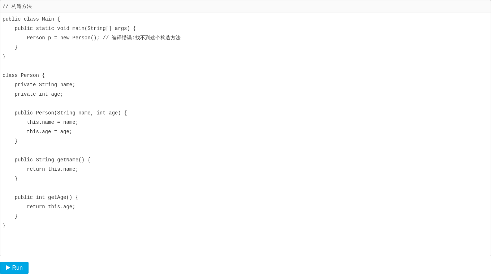
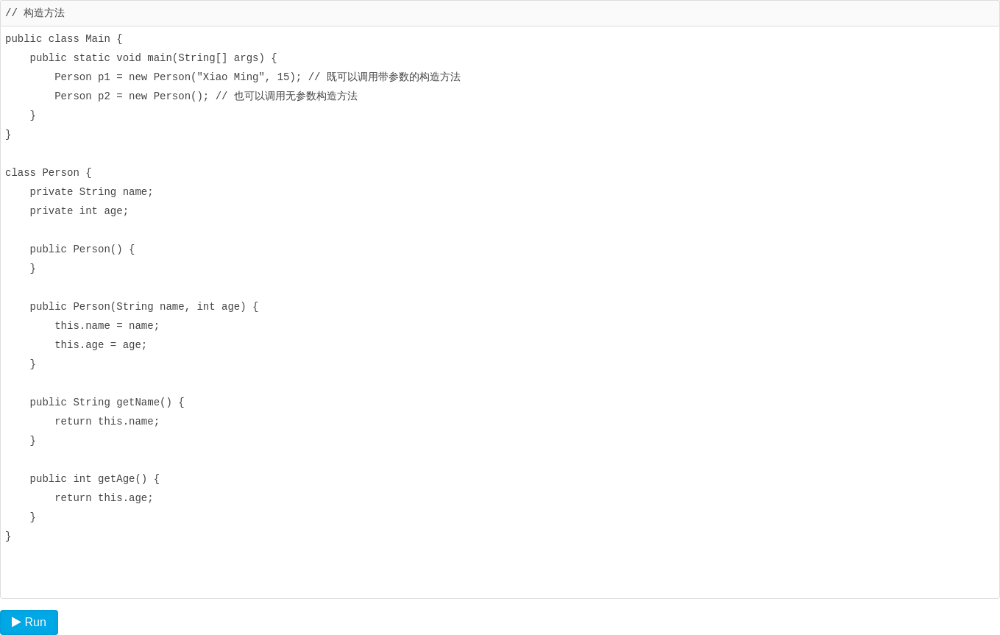

# 构造方法

[toc]

### 构造方法

------

创建实例的时候，我们经常需要同时初始化这个实例的字段，例如：

```java
Person ming = new Person();
ming.setName("小明");
ming.setAge(12);
```

初始化对象实例需要3行代码，而且，如果忘了调用`setName()`或者`setAge()`，这个实例内部的状态就是不正确的。

能否在创建对象实例时就把内部字段全部初始化为合适的值？

完全可以。

这时，我们就需要`构造方法`。

创建实例的时候，实际上是通过`构造方法`来`初始化实例`的。我们先来定义一个`构造方法`，能在创建`Person`实例的时候，一次性传入`name`和`age`，完成初始化：


由于`构造方法`是如此特殊，所以`构造方法`的`名称`就是`类名`。`构造方法`的参数没有限制，在方法内部，也可以编写任意语句。但是，和普通方法相比，**构造方法没有返回值**（也没有`void`），调用构造方法，必须用`new`操作符。

### 默认构造方法

是不是任何`class`都有构造方法？是的。

那前面我们并没有为`Person`类编写构造方法，为什么可以调用`new Person()`？

原因是如果一个`类没有定义构造方法`，`编译器会自动为我们生成`一个默认构造方法，它**没有参数**，也没有执行语句，类似这样：

```java
class Person {
    public Person() {
    }
}
```

要特别注意的是，如果我们自定义了一个构造方法，那么，编译器就*不再*自动创建默认构造方法：



如果既要能使用`带参数`的构造方法，又想保留`不带参数`的构造方法，那么只能把两个构造方法`都定义`出来：



没有在构造方法中初始化字段时，引用类型的字段默认是`null`，数值类型的字段用默认值，`int`类型默认值是`0`，布尔类型默认值是`false`：

```java
class Person {
    private String name; // 默认初始化为null
    private int age; // 默认初始化为0
    public Person() {
    }
}
```

也可以对字段直接进行初始化：

```java
class Person {
    private String name = "Unamed";
    private int age = 10;
}
```

那么问题来了：既对字段进行初始化，又在构造方法中对字段进行初始化：

```java
class Person {
    private String name = "Unamed";
    private int age = 10;
    public Person(String name, int age) {
        this.name = name;
        this.age = age;
    }
}
```

当我们创建对象的时候，`new Person("Xiao Ming", 12)`得到的对象实例，字段的初始值是啥？

在Java中，创建对象实例的时候，按照如下顺序进行初始化：

1. 先初始化字段，例如，`int age = 10;`表示字段初始化为`10`，`double salary;`表示字段默认初始化为`0`，`String name;`表示引用类型字段默认初始化为`null`；
2. 执行构造方法的代码进行初始化。

因此，构造方法的代码由于后运行，所以，`new Person("Xiao Ming", 12)`的字段值最终由构造方法的代码确定。

### 多构造方法

可以定义多个构造方法，在通过`new`操作符调用的时候，编译器通过构造方法的参数数量、位置和类型自动区分：

```java
class Person {
    private String name;
    private int age;
    public Person(String name, int age) {
        this.name = name;
        this.age = age;
    }
    public Person(String name) {
        this.name = name;
        this.age = 12;
    }
    public Person() {
    }
}
```

如果调用`new Person("Xiao Ming", 20);`，会自动匹配到构造方法`public Person(String, int)`。

如果调用`new Person("Xiao Ming");`，会自动匹配到构造方法`public Person(String)`。

如果调用`new Person();`，会自动匹配到构造方法`public Person()`。

一个构造方法可以调用其他构造方法，这样做的目的是便于代码复用。调用其他构造方法的语法是`this(…)`：

```java
class Person {
    private String name;
    private int age;
    public Person(String name, int age) {
        this.name = name;
        this.age = age;
    }
    public Person(String name) {
        this(name, 18); // 调用另一个构造方法Person(String, int)
    }
    public Person() {
        this("Unnamed"); // 调用另一个构造方法Person(String)
    }
}

```

### 小结

实例在创建时通过`new`操作符会调用其对应的构造方法，构造方法用于初始化实例；

没有定义构造方法时，编译器会自动创建一个默认的无参数构造方法；

可以定义多个构造方法，编译器根据参数自动判断；

可以在一个构造方法内部调用另一个构造方法，便于代码复用。
