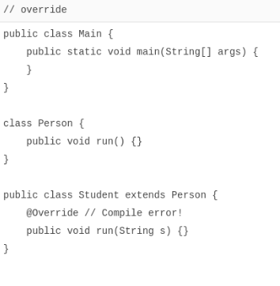
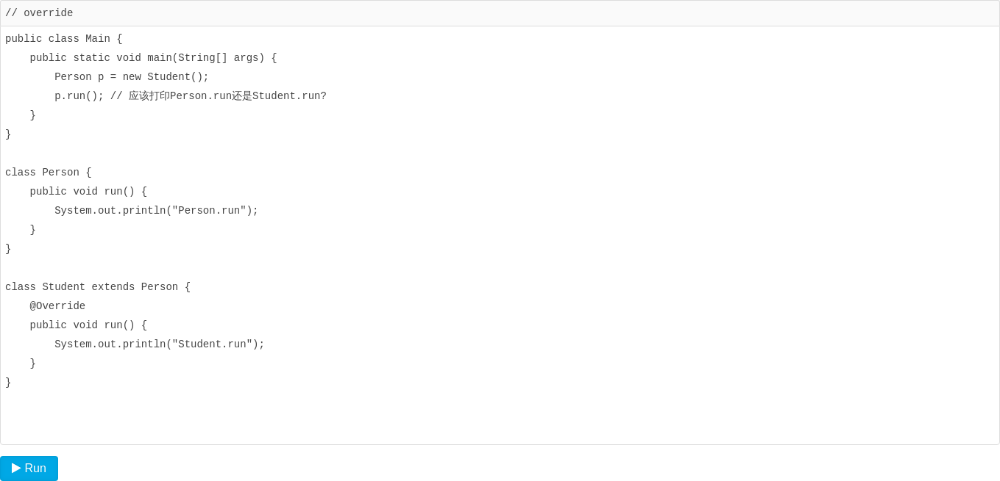
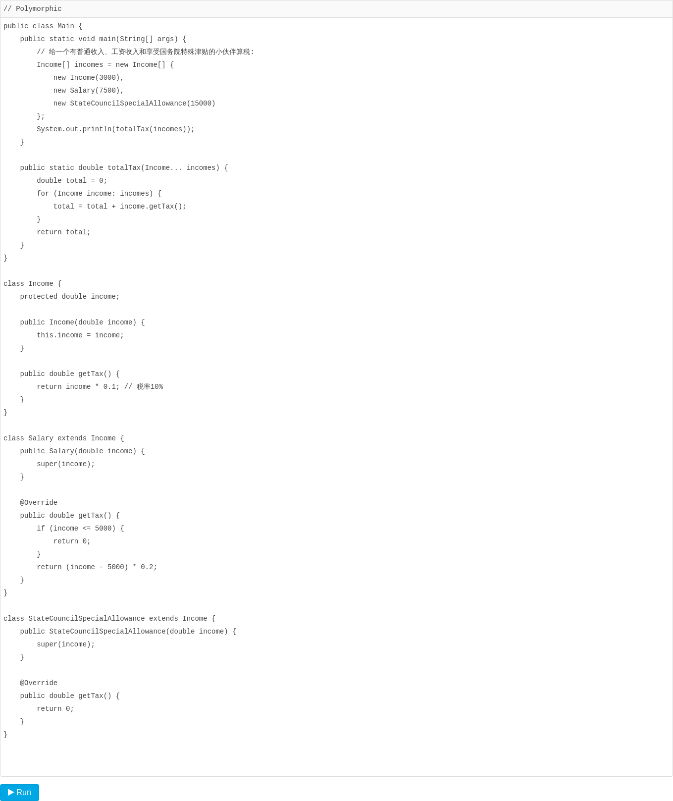

# 多态

[toc]

### 多态引言

------

在`继承`关系中，`子类`如果定义了一个与`父类`方法**签名完全相同**的方法，被称为`覆写（Override）`。

例如，在`Person`类中，我们定义了`run()`方法：

```java
class Person {
    public void run() {
        System.out.println("Person.run");
    }
}
```

在子类`Student`中，覆写这个`run()`方法：

```java
class Student extends Person {
    @Override
    public void run() {
        System.out.println("Student.run");
    }
}
```

**`Override`**和`Overload`不同的是，如果**方法签名不同**，就是`Overload`，`Overload`方法是一个**新方法**；如果方法签名相同，并且返回值也相同，就是**`Override`**。

> 注意：方法名相同，方法参数相同，但方法返回值不同，也是不同的方法。在Java程序中，出现这种情况，编译器会报错。

```java
class Person {
    public void run() { … }
}
class Student extends Person {
    // 不是Override，因为参数不同:
    public void run(String s) { … }
    // 不是Override，因为返回值不同:
    public int run() { … }
}
```

加上`@Override`可以让编译器帮助检查是否进行了正确的覆写。希望进行覆写，但是不小心写错了方法签名，编译器会报错。



但是`@Override`不是必需的。

在上一节中，我们已经知道，`引用变量`的`声明类型`可能与其`实际类型`不符，例如：

```java
Person p = new Student();
```

现在，我们考虑一种情况，如果子类覆写了父类的方法：



那么，一个实际类型为`Student`，引用类型为`Person`的变量，调用其`run()`方法，调用的是`Person`还是`Student`的`run()`方法？

运行一下上面的代码就可以知道，实际上调用的方法是`Student`的`run()`方法。因此可得出结论：

**Java的实例方法调用是基于`运行时`的`实际类型`的动态调用，而非`变量的声明类型`。**

这个非常重要的特性在**面向对象编程中**称之为`多态`。它的英文拼写非常复杂：`Polymorphic`。

### 多态

多态是指，针对**某个类型的方法调用，其真正执行的方法取决于运行时期实际类型的方法**。例如：

```JAVA
Person p = new Student();
p.run(); // 无法确定运行时究竟调用哪个run()方法
```

有童鞋会问，从上面的代码一看就明白，肯定调用的是`Student`的`run()`方法啊。

但是，假设我们编写这样一个方法：

```java
public void runTwice(Person p) {
    p.run();
    p.run();
}
```

它传入的参数类型是`Person`，我们是无法知道传入的参数实际类型究竟是`Person`，还是`Student`，还是`Person`的其他子类，因此，也无法确定调用的是不是`Person`类定义的`run()`方法。

所以，多态的特性就是，运行期才能动态决定调用的子类方法。对某个类型调用某个方法，执行的实际方法可能是某个子类的覆写方法。这种不确定性的方法调用，究竟有什么作用？

我们还是来举栗子。

假设我们定义一种收入，需要给它报税，那么先定义一个`Income`类：

```java
class Income {
    protected double income;
    public double getTax() {
        return income * 0.1; // 税率10%
    }
}
```

对于工资收入，可以减去一个基数，那么我们可以从`Income`派生出`SalaryIncome`，并覆写`getTax()`：

```java
class Salary extends Income {
    @Override
    public double getTax() {
        if (income <= 5000) {
            return 0;
        }
        return (income - 5000) * 0.2;
    }
}
```

如果你享受国务院特殊津贴，那么按照规定，可以全部免税：

```java
class StateCouncilSpecialAllowance extends Income {
    @Override
    public double getTax() {
        return 0;
    }
}
```

现在，我们要编写一个报税的财务软件，对于一个人的所有收入进行报税，可以这么写：

```java
public double totalTax(Income... incomes) {
    double total = 0;
    for (Income income: incomes) {
        total = total + income.getTax();
    }
    return total;
}
```

来试一下：



观察`totalTax()`方法：利用多态，`totalTax()`方法只需要和`Income`打交道，它完全不需要知道`Salary`和`StateCouncilSpecialAllowance`的存在，就可以正确计算出总的税。如果我们要新增一种稿费收入，只需要从`Income`派生，然后正确覆写`getTax()`方法就可以。把新的类型传入`totalTax()`，不需要修改任何代码。

可见，多态具有一个非常强大的功能，就是**允许添加更多类型的子类实现功能扩展，却不需要修改基于父类的代码**。

### 覆写Object方法

因为所有的`class`最终都继承自`Object`，而`Object`定义了几个重要的方法：

- `toString()`：把instance输出为`String`；
- `equals()`：判断两个instance是否逻辑相等；
- `hashCode()`：计算一个instance的哈希值。

在必要的情况下，我们可以覆写`Object`的这几个方法。例如：

```java
class Person {
    ...
    // 显示更有意义的字符串:
    @Override
    public String toString() {
        return "Person:name=" + name;
    }
    // 比较是否相等:
    @Override
    public boolean equals(Object o) {
        // 当且仅当o为Person类型:
        if (o instanceof Person) {
            Person p = (Person) o;
            // 并且name字段相同时，返回true:
            return this.name.equals(p.name);
        }
        return false;
    }
    // 计算hash:
    @Override
    public int hashCode() {
        return this.name.hashCode();
    }
}
```

### 调用super

在`子类`的`覆写`方法中，如果要调用`父类`的`被覆写`的方法，可以通过`super`来调用。例如：

```java
class Person {
    protected String name;
    public String hello() {
        return "Hello, " + name;
    }
}
class Student extends Person {
    @Override
    public String hello() {
        // 调用父类的hello()方法:
        return super.hello() + "!";
    }
}
```

### final

`继承`可以`允许子类覆写`父类的方法。如果一个`父类不允许`子类对它的某个方法进行覆写，可以把该方法标记为`final`。用`final`修饰的方法不能被`Override`：

```java
class Person {
    protected String name;
    public final String hello() {
        return "Hello, " + name;
    }
}
class Student extends Person {
    // compile error: 不允许覆写
    @Override
    public String hello() {
    }
}
```

如果一个类不希望任何其他类继承自它，那么可以把这个类本身标记为`final`。用`final`修饰的类不能被继承：

```java
final class Person {
    protected String name;
}
// compile error: 不允许继承自Person
class Student extends Person {
}
```

对于一个类的实例字段，同样可以用`final`修饰。用`final`修饰的字段在初始化后不能被修改。例如：

```java
class Person {
    public final String name = "Unamed";
}
```

对`final`字段重新赋值会报错：

```java
Person p = new Person();
p.name = "New Name"; // compile error!
```

可以在构造方法中初始化final字段：

```java
class Person {
    public final String name;
    public Person(String name) {
        this.name = name;
    }
}
```

这种方法更为常用，因为可以保证实例一旦创建，其`final`字段就不可修改。

### 小结

- 子类可以覆写父类的方法（Override），覆写在子类中改变了父类方法的行为；
- Java的方法调用总是作用于运行期对象的实际类型，这种行为称为多态；
- `final`修饰符有多种作用：
    - `final`修饰的方法可以阻止被覆写；
    - `final`修饰的class可以阻止被继承；
    - `final`修饰的field必须在创建对象时初始化，随后不可修改。
