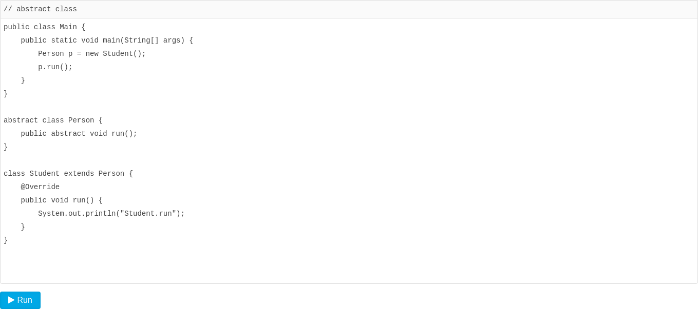

# 抽象类

[toc]

### 抽象类说明

由于多态的存在，每个子类都可以覆写父类的方法，例如：

```java
class Person {
    public void run() { … }
}
class Student extends Person {
    @Override
    public void run() { … }
}
class Teacher extends Person {
    @Override
    public void run() { … }
}
```

从`Person`类派生的`Student`和`Teacher`都可以覆写`run()`方法。

如果父类`Person`的`run()`方法没有实际意义，能否去掉方法的执行语句？

```java
class Person {
    public void run(); // Compile Error!
}
```

答案是不行，会导致编译错误，因为定义方法的时候，必须实现方法的语句。

能不能去掉父类的`run()`方法？

答案还是不行，因为去掉父类的`run()`方法，就失去了多态的特性。例如，`runTwice()`就无法编译：

```java
public void runTwice(Person p) {
    p.run(); // Person没有run()方法，会导致编译错误
    p.run();
}
```

如果`父类`的**方法本身不需要实现任何功能，仅仅是为了定义方法签名，目的是让子类去覆写它**，那么，可以把`父类`的方法声明为`抽象方法`：

```java
class Person {
    public abstract void run();
}
```

把一个方法声明为`abstract`，表示它是一个**抽象方法**，本身没有实现任何方法语句。因为这个抽象方法本身是无法执行的，所以，`Person`类也无法被实例化。编译器会告诉我们，无法编译`Person`类，因为它包含抽象方法。

必须把`Person`类本身也声明为`abstract`，才能正确编译它：

```java
abstract class Person {
    public abstract void run();
}
```

### 抽象类

如果一个`class`定义了方法，但没有具体执行代码，这个方法就是抽象方法，抽象方法用`abstract`修饰。

因为无法执行抽象方法，因此这个类也必须申明为抽象类（abstract class）。

使用`abstract`修饰的类就是抽象类。我们`无法实例化一个抽象类`：

```java
Person p = new Person(); // 编译错误
```

无法实例化的抽象类有什么用？

因为`抽象类`本身被设计成`只能用于被继承`，因此，抽象类可以强迫子类实现其定义的抽象方法，否则编译会报错。因此，**抽象方法实际上相当于定义了“规范”**。

例如，`Person`类定义了抽象方法`run()`，那么，在实现子类`Student`的时候，就必须覆写`run()`方法：



### 面向抽象编程

当我们定义了抽象类`Person`，以及具体的`Student`、`Teacher`子类的时候，我们可以通过抽象类`Person`类型去引用具体的子类的实例：

```java
Person s = new Student();
Person t = new Teacher();
```

这种引用抽象类的好处在于，我们对其进行方法调用，并不关心`Person`类型变量的具体子类型：

```java
// 不关心Person变量的具体子类型:
s.run();
t.run();
```

同样的代码，如果引用的是一个新的子类，我们仍然不关心具体类型：

```java
// 同样不关心新的子类是如何实现run()方法的：
Person e = new Employee();
e.run();
```

这种尽量引用高层类型，避免引用实际子类型的方式，称之为面向抽象编程。

面向抽象编程的本质就是：

- 上层代码只定义规范（例如：`abstract class Person`）；
- 不需要子类就可以实现业务逻辑（正常编译）；
- 具体的业务逻辑由不同的子类实现，调用者并不关心。

### 小结

- 通过`abstract`定义的方法是`抽象方法`，它只有`定义`，没有`实现`。**抽象方法定义了子类必须实现的接口规范**；
- 定义了抽象方法的class必须被定义为抽象类，从抽象类继承的子类必须实现抽象方法；
- 如果不实现抽象方法，则该子类仍是一个抽象类；
- 面向抽象编程使得调用者只关心抽象方法的定义，不关心子类的具体实现。
