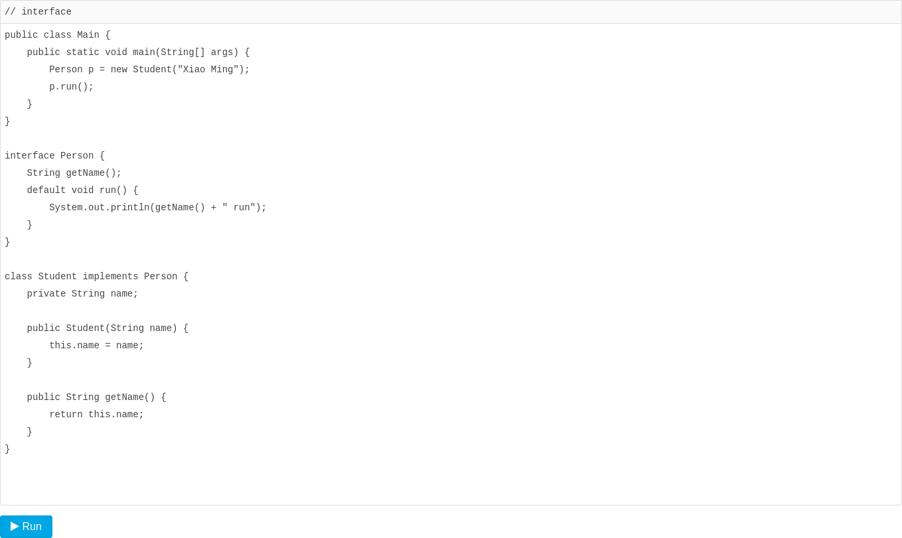

# 接口

[toc]

### 接口

------

在`抽象类`中，`抽象方法`本质上是`定义接口规范`：即**规定高层类的`接口`**，从而保证所有子类都有相同的接口实现，这样，多态就能发挥出威力。

如果一个`抽象类`没有字段，所有方法全部都是`抽象方法`：

```java
abstract class Person {
    public abstract void run();
    public abstract String getName();
}
```

就可以把该抽象类改写为接口：`interface`。

在Java中，使用`interface`可以声明一个接口：

```java
interface Person {
    void run();
    String getName();
}
```

所谓`interface`，就是比`抽象类`还要`抽象`的`纯抽象接口`，因为它连**字段都不能有**。因为`接口`定义的所有方法默认都是`public abstract`的，所以这两个修饰符不需要写出来（写不写效果都一样）。

当一个具体的`class`去实现一个`interface`时，需要使用`implements`关键字。举个例子：

```java
class Student implements Person {
    private String name;
    public Student(String name) {
        this.name = name;
    }
    @Override
    public void run() {
        System.out.println(this.name + " run");
    }
    @Override
    public String getName() {
        return this.name;
    }
}
```

我们知道，在Java中，一个`类`只能继承自`另一个类`，`不能从多个类继承`。但是，一个`类`可以实现多个`interface`，例如：

```java
class Student implements Person, Hello { // 实现了两个interface
    ...
}
```

### 术语

注意区分术语：

**Java的接口**特指`interface`的定义，表示一个`接口类型`和一组`方法签名`，

而**编程接口**泛指`接口规范`，如`方法签名`，`数据格式`，`网络协议`等。

抽象类和接口的对比如下：

|            | abstract class       | interface                   |
| :--------- | :------------------- | :-------------------------- |
| 继承       | 只能extends一个class | 可以implements多个interface |
| 字段       | 可以定义实例字段     | 不能定义实例字段            |
| 抽象方法   | 可以定义抽象方法     | 可以定义抽象方法            |
| 非抽象方法 | 可以定义非抽象方法   | 可以定义default方法         |

### 接口继承

一个`interface`可以继承自另一个`interface`。`interface`继承自`interface`使用`extends`，它相当于扩展了接口的方法。例如：

```java
interface Hello {
    void hello();
}
interface Person extends Hello {
    void run();
    String getName();
}
```

此时，`Person`接口继承自`Hello`接口，因此，`Person`接口现在实际上有3个抽象方法签名，其中一个来自继承的`Hello`接口。

### 继承关系

合理设计`interface`和`abstract class`的继承关系，可以充分复用代码。一般来说，**公共逻辑**适合放在`abstract class`中，**具体逻辑**放到各个子类，而接口层次代表抽象程度。可以参考Java的集合类定义的一组接口、抽象类以及具体子类的继承关系：

```txt
┌───────────────┐
│   Iterable    │
└───────────────┘
        ▲                ┌───────────────────┐
        │                │      Object       │
┌───────────────┐        └───────────────────┘
│  Collection   │                  ▲
└───────────────┘                  │
        ▲     ▲          ┌───────────────────┐
        │     └──────────│AbstractCollection │
┌───────────────┐        └───────────────────┘
│     List      │                  ▲
└───────────────┘                  │
              ▲          ┌───────────────────┐
              └──────────│   AbstractList    │
                         └───────────────────┘
                                ▲     ▲
                                │     │
                                │     │
                     ┌────────────┐ ┌────────────┐
                     │ ArrayList  │ │ LinkedList │
                     └────────────┘ └────────────┘
```

在使用的时候，实例化的对象永远只能是某个具体的子类，但总是通过接口去引用它，因为接口比抽象类更抽象：

```java
List list = new ArrayList(); // 用List接口引用具体子类的实例
Collection coll = list; // 向上转型为Collection接口
Iterable it = coll; // 向上转型为Iterable接口
```

### default方法

在接口中，可以定义`default`方法。例如，把`Person`接口的`run()`方法改为`default`方法：



实现类可以不必覆写`default`方法。`default`方法的目的是，当我们需要给接口新增一个方法时，会涉及到修改全部子类。如果新增的是`default`方法，那么子类就不必全部修改，只需要在需要覆写的地方去覆写新增方法。

`default`方法和抽象类的普通方法是有所不同的。因为`interface`没有字段，`default`方法无法访问字段，而抽象类的普通方法可以访问实例字段。

### 小结

Java的接口（interface）定义了纯抽象规范，一个类可以实现多个接口；

接口也是数据类型，适用于向上转型和向下转型；

接口的所有方法都是抽象方法，接口不能定义实例字段；

接口可以定义`default`方法（JDK>=1.8）。
