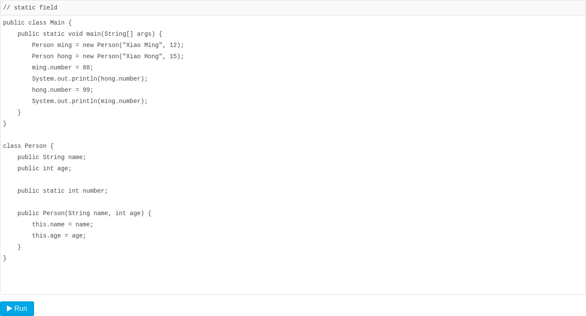
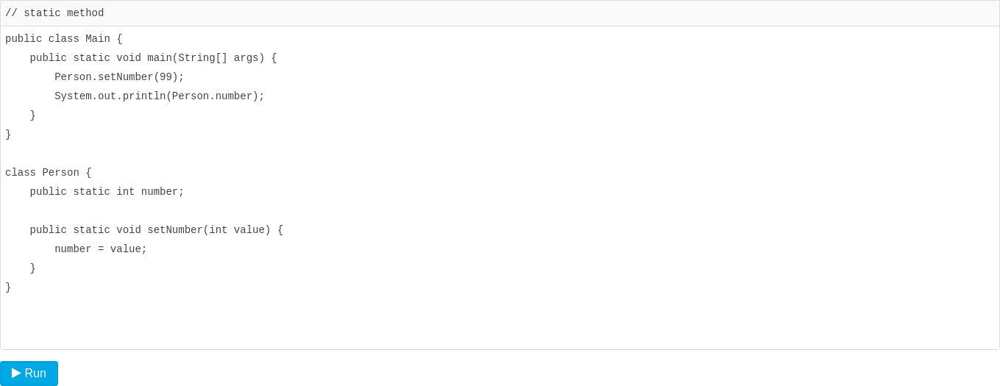

# 静态字段和静态方法

在一个`class`中定义的`字段`，我们称之为`实例字段`。实例字段的特点是，**每个实例都有独立的字段，各个实例的同名字段互不影响**。

还有一种字段，是用`static`修饰的字段，称为静态字段：`static field`。

`实例字段`在每个`实例`中都有自己的一个`独立“空间”`，但是`静态字段`只有一个`共享“空间”`，所有实例都会`共享该字段`。举个例子：

```java
class Person {
    public String name;
    public int age;
    // 定义静态字段number:
    public static int number;
}
```

我们来看看下面的代码：



对于静态字段，无论修改哪个`实例`的`静态字段`，效果都是一样的：所有`实例`的`静态字段`都被修改了，原因是**静态字段并不属于实例**：

```txt
        ┌──────────────────┐
ming ──▶│Person instance   │
        ├──────────────────┤
        │name = "Xiao Ming"│
        │age = 12          │
        │number ───────────┼──┐    ┌─────────────┐
        └──────────────────┘  │    │Person class │
                              │    ├─────────────┤
                              ├───▶│number = 99  │
        ┌──────────────────┐  │    └─────────────┘
hong ──▶│Person instance   │  │
        ├──────────────────┤  │
        │name = "Xiao Hong"│  │
        │age = 15          │  │
        │number ───────────┼──┘
        └──────────────────┘
```

虽然`实例`可以访问`静态字段`，但是它们指向的其实都是`Person class`的静态字段。所以，**所有实例共享一个静态字段**。

因此，不推荐用`实例变量.静态字段`去访问静态字段，因为**在Java程序中，实例对象并没有静态字段**。在代码中，实例对象能访问静态字段只是因为编译器可以根据实例类型自动转换为`类名.静态字段`来访问静态对象。

**推荐用类名来访问静态字段**。可以把静态字段理解为描述`class`本身的字段（非实例字段）。对于上面的代码，更好的写法是：

```java
Person.number = 99;
System.out.println(Person.number);
```

### 静态方法

有静态字段，就有静态方法。用`static`修饰的方法称为`静态方法`。

调用实例方法必须通过一个实例变量，而**调用静态方法则不需要实例变量，通过类名就可以调用**。静态方法类似其它编程语言的函数。例如：

因为静态方法属于`class`而不属于实例，因此，静态方法内部，无法访问`this`变量，也无法访问实例字段，它**只能访问静态字段**。

通过实例变量也可以调用静态方法，但这只是编译器自动帮我们把实例改写成类名而已。

通常情况下，**通过实例变量访问静态字段和静态方法，会得到一个编译警告**。

**静态方法经常用于工具类**。例如：

- Arrays.sort()
- Math.random()

静态方法也经常用于辅助方法。注意到Java程序的入口`main()`也是静态方法。

### 接口的静态字段

因为`interface`是一个纯抽象类，所以它不能定义实例字段。但是，`interface`是可以有静态字段的，并且静态字段必须为`final`类型：

```java
public interface Person {
    public static final int MALE = 1;
    public static final int FEMALE = 2;
}
```

实际上，因为`interface`的字段只能是`public static final`类型，所以我们可以把这些修饰符都去掉，上述代码可以简写为：

```java
public interface Person {
    // 编译器会自动加上public statc final:
    int MALE = 1;
    int FEMALE = 2;
}
```

编译器会自动把该字段变为`public static final`类型。

### 练习

给`Person`类增加一个静态字段`count`和静态方法`getCount()`，统计实例创建的个数。

```java
public class Person {
    private static int count = 0; // 静态字段count，用于统计实例创建的个数

    public Person() {
        count++; // 在构造函数中每次创建实例时，count加1
    }

    public static int getCount() { // 静态方法getCount，返回实例创建的个数
        return count;
    }
}
```

```java
public class Main {
    public static void main(String[] args) {
        Person person1 = new Person();
        Person person2 = new Person();
        Person person3 = new Person();

        int count = Person.getCount();
        System.out.println("实例创建的个数: " + count); // 输出：实例创建的个数: 3
    }
}
```

### 小结

- 静态字段属于所有实例“`共享`”的字段，实际上是属于`class`的字段；
- 调用`静态方法`不需要`实例`，无法访问`this`，但可以访问`静态字段`和其他`静态方法`；
- 静态方法常用于`工具类`和`辅助方法`。

