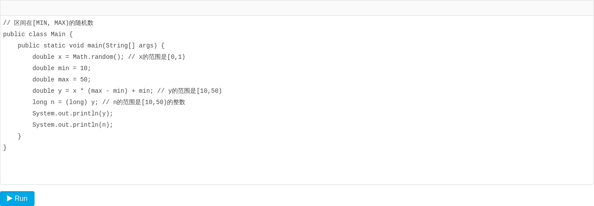
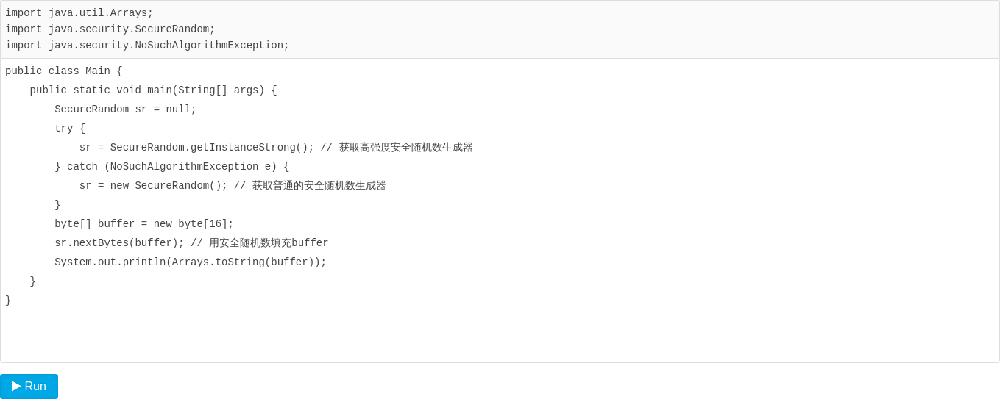

# 常用工具类

[toc]

### 常用工具类

Java的核心库提供了大量的现成的类供我们使用。本节我们介绍几个常用的工具类。

### Math

顾名思义，`Math`类就是用来进行数学计算的，它提供了大量的**静态方法**来便于我们实现数学计算：

求绝对值：

```java
Math.abs(-100); // 100
Math.abs(-7.8); // 7.8
```

取最大或最小值：

```java
Math.max(100, 99); // 100
Math.min(1.2, 2.3); // 1.2
```

计算xy次方：

```java
Math.pow(2, 10); // 2的10次方=1024
```

计算√x：

```java
Math.sqrt(2); // 1.414...
```

计算ex次方：

```java
Math.exp(2); // 7.389...
```

计算以e为底的对数：

```java
Math.log(4); // 1.386...
```

计算以10为底的对数：

```java
Math.log10(100); // 2
```

三角函数：

```java
Math.sin(3.14); // 0.00159...
Math.cos(3.14); // -0.9999...
Math.tan(3.14); // -0.0015...
Math.asin(1.0); // 1.57079...
Math.acos(1.0); // 0.0
```

Math还提供了几个数学常量：

```java
double pi = Math.PI; // 3.14159...
double e = Math.E; // 2.7182818...
Math.sin(Math.PI / 6); // sin(π/6) = 0.5
```

生成一个随机数x，x的范围是`0 <= x < 1`：

```java
Math.random(); // 0.53907... 每次都不一样
```

如果我们要生成一个区间在[MIN, MAX)的随机数，可以借助Math.random()实现，计算如下：



有些童鞋可能注意到Java标准库还提供了一个`StrictMath`，它提供了和`Math`几乎一模一样的方法。这两个类的区别在于，由于浮点数计算存在误差，不同的平台（例如x86和ARM）计算的结果可能不一致（指误差不同），因此，`StrictMath`保证所有平台计算结果都是完全相同的，而`Math`会尽量针对平台优化计算速度，所以，绝大多数情况下，使用`Math`就足够了。

### HexFormat

在处理`byte[]`数组时，我们经常需要与十六进制字符串转换，自己写起来比较麻烦，用Java标准库提供的`HexFormat`则可以方便地帮我们转换。

要将`byte[]`数组转换为十六进制字符串，可以用`formatHex()`方法：

```java
import java.util.HexFormat;
public class Main {
    public static void main(String[] args) throws InterruptedException {
        byte[] data = "Hello".getBytes();
        HexFormat hf = HexFormat.of();
        String hexData = hf.formatHex(data); // 48656c6c6f
    }
}
```

如果要定制转换格式，则使用定制的`HexFormat`实例：

```java
// 分隔符为空格，添加前缀0x，大写字母:
HexFormat hf = HexFormat.ofDelimiter(" ").withPrefix("0x").withUpperCase();
hf.formatHex("Hello".getBytes())); // 0x48 0x65 0x6C 0x6C 0x6F
```

从十六进制字符串到`byte[]`数组转换，使用`parseHex()`方法：

```java
byte[] bs = HexFormat.of().parseHex("48656c6c6f");
System.out.println(Arrays.toString(bs)); // 输出: [72, 101, 108, 108, 111]
System.out.println(new String(bs)); // 输出: Hello
```

### Random

`Random`用来创建`伪随机数`。所谓`伪随机数`，是指只要给定一个初始的种子，产生的随机数序列是完全一样的。

要生成一个随机数，可以使用`nextInt()`、`nextLong()`、`nextFloat()`、`nextDouble()`：

```java
Random r = new Random();
r.nextInt(); // 2071575453,每次都不一样
r.nextInt(10); // 5,生成一个[0,10)之间的int
r.nextLong(); // 8811649292570369305,每次都不一样
r.nextFloat(); // 0.54335...生成一个[0,1)之间的float
r.nextDouble(); // 0.3716...生成一个[0,1)之间的double
```

有童鞋问，每次运行程序，生成的随机数都是不同的，没看出*伪随机数*的特性来。

这是因为我们创建`Random`实例时，如果不给定种子，就使用系统当前时间戳作为种子，因此每次运行时，种子不同，得到的伪随机数序列就不同。

如果我们在创建`Random`实例时指定一个种子，就会得到完全确定的随机数序列：


前面我们使用的`Math.random()`实际上内部调用了`Random`类，所以它也是伪随机数，只是我们无法指定种子。

### SecureRandom

有`伪随机数`，就有`真随机数`。实际上真正的真随机数只能通过量子力学原理来获取，而我们想要的是一个不可预测的安全的随机数，`SecureRandom`就是用来创建**安全的随机数**的：

```java
SecureRandom sr = new SecureRandom();
System.out.println(sr.nextInt(100));
```

`SecureRandom`无法指定种子，它使用RNG（random number generator）算法。JDK的`SecureRandom`实际上有多种不同的底层实现，有的使用安全随机种子加上伪随机数算法来产生安全的随机数，有的使用真正的随机数生成器。实际使用的时候，可以优先获取高强度的安全随机数生成器，如果没有提供，再使用普通等级的安全随机数生成器：



`SecureRandom`的安全性是通过操作系统提供的安全的随机种子来生成随机数。这个种子是通过CPU的热噪声、读写磁盘的字节、网络流量等各种随机事件产生的“熵”。

在密码学中，安全的随机数非常重要。如果使用不安全的伪随机数，所有加密体系都将被攻破。因此，时刻牢记必须使用`SecureRandom`来产生安全的随机数。

**需要使用安全随机数的时候，必须使用SecureRandom，绝不能使用Random！**

### 小结

Java提供的常用工具类有：

- Math：数学计算
- Random：生成伪随机数
- SecureRandom：生成安全的随机数
