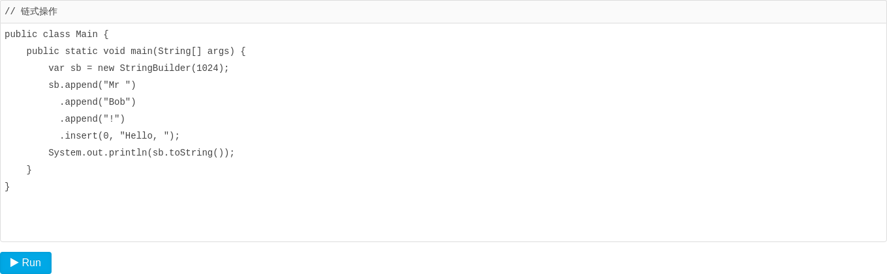
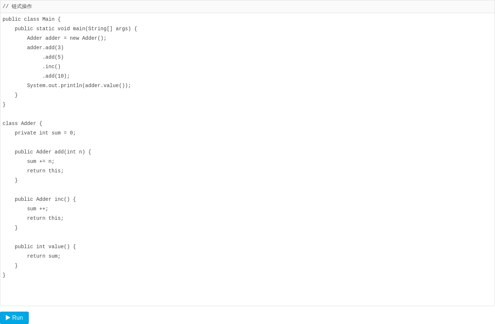

# StringBuilder

[toc]

Java编译器对`String`做了特殊处理，使得我们可以直接用`+`拼接字符串。

考察下面的循环代码：

```java
String s = "";
for (int i = 0; i < 1000; i++) {
    s = s + "," + i;
}
```

虽然可以直接拼接字符串，但是，在循环中，每次循环都会创建新的字符串对象，然后扔掉旧的字符串。这样，绝大部分字符串都是临时对象，不但浪费内存，还会影响GC效率。

为了能高效拼接字符串，Java标准库提供了`StringBuilder`，它是一个可变对象，可以预分配缓冲区，这样，往`StringBuilder`中新增字符时，不会创建新的临时对象：

```java
StringBuilder sb = new StringBuilder(1024);
for (int i = 0; i < 1000; i++) {
    sb.append(',');
    sb.append(i);
}
String s = sb.toString();
```

`StringBuilder`还可以进行链式操作：



如果我们查看`StringBuilder`的源码，可以发现，进行链式操作的关键是，定义的`append()`方法会返回`this`，这样，就可以不断调用自身的其他方法。

仿照`StringBuilder`，我们也可以设计支持链式操作的类。例如，一个可以不断增加的计数器：



注意：对于普通的字符串`+`操作，并不需要我们将其改写为`StringBuilder`，因为Java编译器在编译时就自动把多个连续的`+`操作编码为`StringConcatFactory`的操作。在运行期，`StringConcatFactory`会自动把字符串连接操作优化为数组复制或者`StringBuilder`操作。

你可能还听说过`StringBuffer`，这是Java早期的一个`StringBuilder`的线程安全版本，它通过同步来保证多个线程操作`StringBuffer`也是安全的，但是同步会带来执行速度的下降。

`StringBuilder`和`StringBuffer`接口完全相同，现在完全没有必要使用`StringBuffer`。

### 小结

`StringBuilder`是可变对象，用来高效拼接字符串；

`StringBuilder`可以支持链式操作，实现链式操作的关键是返回实例本身；

`StringBuffer`是`StringBuilder`的线程安全版本，现在很少使用。