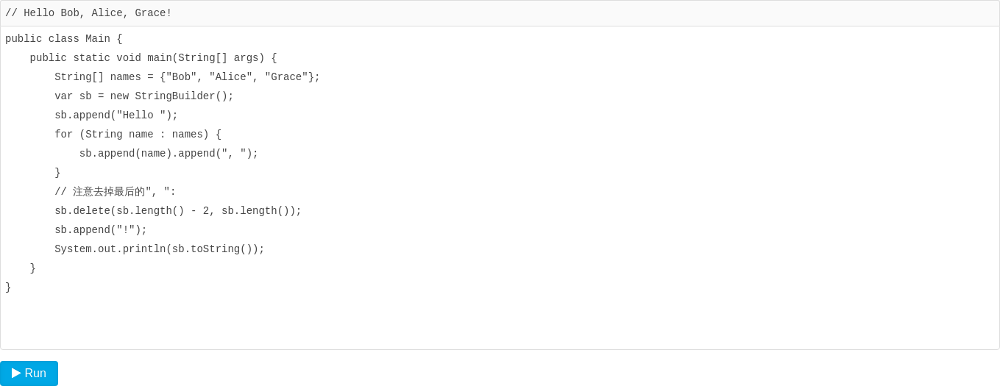
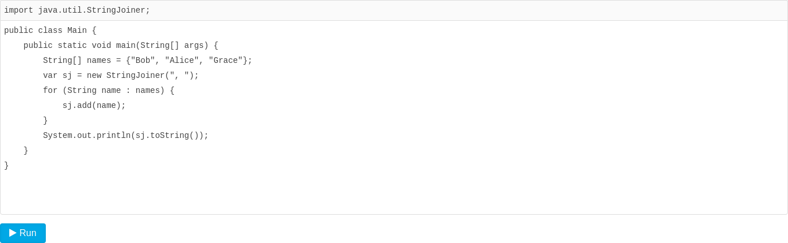
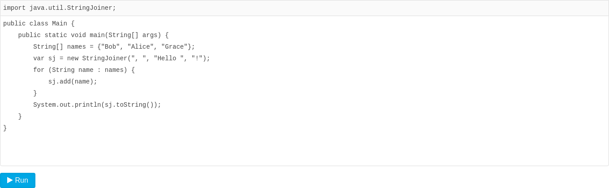

# StringJoiner

[toc]

### StringJoiner

------

要高效拼接字符串，应该使用`StringBuilder`。

很多时候，我们拼接的字符串像这样：



类似用分隔符拼接数组的需求很常见，所以Java标准库还提供了一个`StringJoiner`来干这个事：



慢着！用`StringJoiner`的结果少了前面的`"Hello "`和结尾的`"!"`！遇到这种情况，需要给`StringJoiner`指定“开头”和“结尾”：



### String.join()

`String`还提供了一个静态方法`join()`，这个方法在内部使用了`StringJoiner`来拼接字符串，在不需要指定“开头”和“结尾”的时候，用`String.join()`更方便：

```java
String[] names = {"Bob", "Alice", "Grace"};
var s = String.join(", ", names);
```

### 小结

用指定分隔符拼接字符串数组时，使用`StringJoiner`或者`String.join()`更方便；

用`StringJoiner`拼接字符串时，还可以额外附加一个“开头”和“结尾”。

