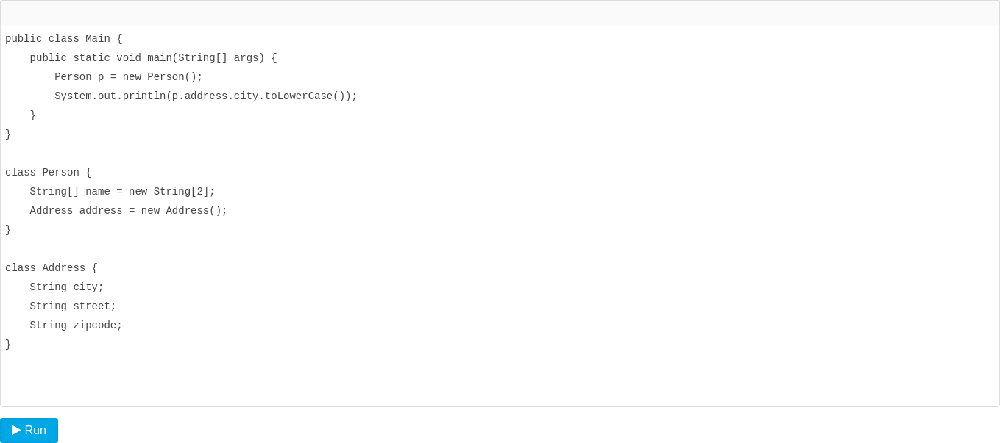

​	

# NullPointerException

### NullPointerException

在所有的`RuntimeException`异常中，Java程序员最熟悉的恐怕就是`NullPointerException`了。

`NullPointerException`即空指针异常，俗称NPE。如果一个对象为`null`，调用其方法或访问其字段就会产生`NullPointerException`，这个异常通常是由JVM抛出的，例如：


指针这个概念实际上源自C语言，Java语言中并无指针。我们定义的变量实际上是引用，Null Pointer更确切地说是Null Reference，不过两者区别不大。

### 处理NullPointerException

如果遇到`NullPointerException`，我们应该如何处理？首先，必须明确，`NullPointerException`是一种代码逻辑错误，遇到`NullPointerException`，遵循原则是早暴露，早修复，严禁使用`catch`来隐藏这种编码错误：

```java
// 错误示例: 捕获NullPointerException
try {
    transferMoney(from, to, amount);
} catch (NullPointerException e) {
}
```

好的编码习惯可以极大地降低`NullPointerException`的产生，例如：

```java
public class Person {
    private String name = "";
}
```

使用空字符串`""`而不是默认的`null`可避免很多`NullPointerException`，编写业务逻辑时，用空字符串`""`表示未填写比`null`安全得多。

返回空字符串`""`、空数组而不是`null`：

```java
public String[] readLinesFromFile(String file) {
    if (getFileSize(file) == 0) {
        // 返回空数组而不是null:
        return new String[0];
    }
    ...
}
```

这样可以使得调用方无需检查结果是否为`null`。

如果调用方一定要根据`null`判断，比如返回`null`表示文件不存在，那么考虑返回`Optional<T>`：

```java
public Optional<String> readFromFile(String file) {
    if (!fileExist(file)) {
        return Optional.empty();
    }
    ...
}
```

这样调用方必须通过`Optional.isPresent()`判断是否有结果。

### 定位NullPointerException

如果产生了`NullPointerException`，例如，调用`a.b.c.x()`时产生了`NullPointerException`，原因可能是：

- `a`是`null`；
- `a.b`是`null`；
- `a.b.c`是`null`；

确定到底是哪个对象是`null`以前只能打印这样的日志：

```java
System.out.println(a);
System.out.println(a.b);
System.out.println(a.b.c);
```

从Java 14开始，如果产生了`NullPointerException`，JVM可以给出详细的信息告诉我们`null`对象到底是谁。我们来看例子：



可以在`NullPointerException`的详细信息中看到类似`... because "<local1>.address.city" is null`，意思是`city`字段为`null`，这样我们就能快速定位问题所在。

这种增强的`NullPointerException`详细信息是Java 14新增的功能，但默认是关闭的，我们可以给JVM添加一个`-XX:+ShowCodeDetailsInExceptionMessages`参数启用它：

```java
java -XX:+ShowCodeDetailsInExceptionMessages Main.java
```

### 小结

`NullPointerException`是Java代码常见的逻辑错误，应当早暴露，早修复；

可以启用Java 14的增强异常信息来查看`NullPointerException`的详细错误信息。
