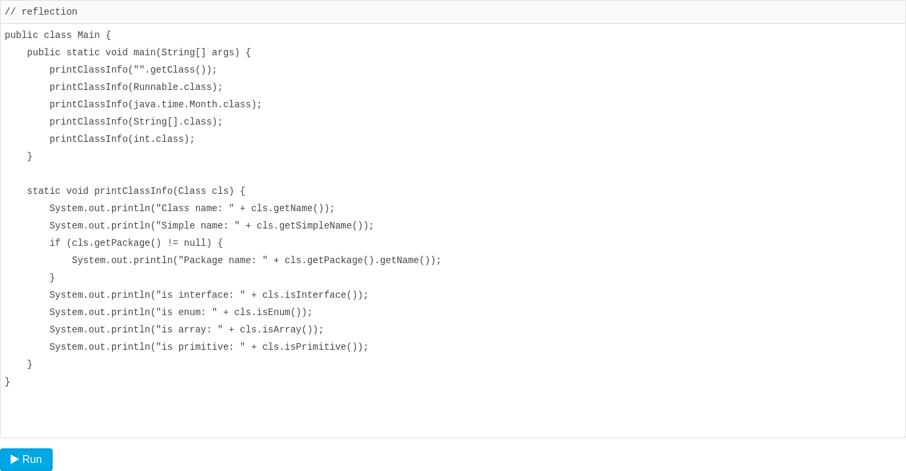

### Class类

除了`int`等基本类型外，Java的其他类型全部都是`class`（包括`interface`）。例如：

- `String`
- `Object`
- `Runnable`
- `Exception`
- …

仔细思考，我们可以得出结论：`class`（包括`interface`）的本质是数据类型（`Type`）。无继承关系的数据类型无法赋值：

```java
Number n = new Double(123.456); // OK
String s = new Double(123.456); // compile error!
```

而`class`是由JVM在执行过程中动态加载的。JVM在第一次读取到一种`class`类型时，将其加载进内存。

每加载一种`class`，JVM就为其创建一个`Class`类型的实例，并关联起来。

注意：这里的`Class`类型是一个名叫`Class`的`class`。它长这样：

```java
public final class Class {
    private Class() {}
}
```

以`String`类为例，当JVM加载`String`类时，它首先读取`String.class`文件到内存，然后，为`String`类创建一个`Class`实例并关联起来：

```java
Class cls = new Class(String);
```

这个`Class`实例是JVM内部创建的，如果我们查看JDK源码，可以发现`Class`类的构造方法是`private`，只有JVM能创建`Class`实例，我们自己的Java程序是无法创建`Class`实例的。

所以，JVM持有的每个`Class`实例都指向一个数据类型（`class`或`interface`）：

```txt
┌───────────────────────────┐
│      Class Instance       │──────> String
├───────────────────────────┤
│name = "java.lang.String"  │
└───────────────────────────┘
┌───────────────────────────┐
│      Class Instance       │──────> Random
├───────────────────────────┤
│name = "java.util.Random"  │
└───────────────────────────┘
┌───────────────────────────┐
│      Class Instance       │──────> Runnable
├───────────────────────────┤
│name = "java.lang.Runnable"│
└───────────────────────────┘
```

一个`Class`实例包含了该`class`的所有完整信息：

```txt
┌───────────────────────────┐
│      Class Instance       │──────> String
├───────────────────────────┤
│name = "java.lang.String"  │
├───────────────────────────┤
│package = "java.lang"      │
├───────────────────────────┤
│super = "java.lang.Object" │
├───────────────────────────┤
│interface = CharSequence...│
├───────────────────────────┤
│field = value[],hash,...   │
├───────────────────────────┤
│method = indexOf()...      │
└───────────────────────────┘
```

由于JVM为每个加载的`class`创建了对应的`Class`实例，并在实例中保存了该`class`的所有信息，包括类名、包名、父类、实现的接口、所有方法、字段等，因此，如果获取了某个`Class`实例，我们就可以通过这个`Class`实例获取到该实例对应的`class`的所有信息。

**这种通过`Class`实例获取`class`信息的方法称为反射（Reflection）。**

如何获取一个`class`的`Class`实例？有三个方法：

方法一：直接通过一个`class`的静态变量`class`获取：

```java
Class cls = String.class;
```

方法二：如果我们有一个实例变量，可以通过该实例变量提供的`getClass()`方法获取：

```java
String s = "Hello";
Class cls = s.getClass();
```

方法三：如果知道一个`class`的完整类名，可以通过静态方法`Class.forName()`获取：

```java
Class cls = Class.forName("java.lang.String");
```

因为`Class`实例在JVM中是唯一的，所以，上述方法获取的`Class`实例是同一个实例。可以用`==`比较两个`Class`实例：

```java
Class cls1 = String.class;
String s = "Hello";
Class cls2 = s.getClass();
boolean sameClass = cls1 == cls2; // true
```

注意一下`Class`实例比较和`instanceof`的差别：

```java
Integer n = new Integer(123);
boolean b1 = n instanceof Integer; // true，因为n是Integer类型
boolean b2 = n instanceof Number; // true，因为n是Number类型的子类
boolean b3 = n.getClass() == Integer.class; // true，因为n.getClass()返回Integer.class
boolean b4 = n.getClass() == Number.class; // false，因为Integer.class!=Number.class
```

用`instanceof`不但匹配指定类型，还匹配指定类型的子类。而用`==`判断`class`实例可以精确地判断数据类型，但不能作子类型比较。

通常情况下，我们应该用`instanceof`判断数据类型，因为面向抽象编程的时候，我们不关心具体的子类型。只有在需要精确判断一个类型是不是某个`class`的时候，我们才使用`==`判断`class`实例。

因为反射的目的是为了获得某个实例的信息。因此，当我们拿到某个`Object`实例时，我们可以通过反射获取该`Object`的`class`信息：

```java
void printObjectInfo(Object obj) {
    Class cls = obj.getClass();
}
```

要从`Class`实例获取获取的基本信息，参考下面的代码：



注意到数组（例如`String[]`）也是一种类，而且不同于`String.class`，它的类名是`[Ljava.lang.String;`。此外，JVM为每一种基本类型如`int`也创建了`Class`实例，通过`int.class`访问。

如果获取到了一个`Class`实例，我们就可以通过该`Class`实例来创建对应类型的实例：

```java
// 获取String的Class实例:
Class cls = String.class;
// 创建一个String实例:
String s = (String) cls.newInstance();
```

上述代码相当于`new String()`。通过`Class.newInstance()`可以创建类实例，它的局限是：只能调用`public`的无参数构造方法。带参数的构造方法，或者非`public`的构造方法都无法通过`Class.newInstance()`被调用。

### 动态加载

JVM在执行Java程序的时候，并不是一次性把所有用到的class全部加载到内存，而是第一次需要用到class时才加载。例如：

```java
// Main.java
public class Main {
    public static void main(String[] args) {
        if (args.length > 0) {
            create(args[0]);
        }
    }
    static void create(String name) {
        Person p = new Person(name);
    }
}
```

当执行`Main.java`时，由于用到了`Main`，因此，JVM首先会把`Main.class`加载到内存。然而，并不会加载`Person.class`，除非程序执行到`create()`方法，JVM发现需要加载`Person`类时，才会首次加载`Person.class`。如果没有执行`create()`方法，那么`Person.class`根本就不会被加载。

这就是JVM动态加载`class`的特性。

动态加载`class`的特性对于Java程序非常重要。利用JVM动态加载`class`的特性，我们才能在运行期根据条件加载不同的实现类。例如，Commons Logging总是优先使用Log4j，只有当Log4j不存在时，才使用JDK的logging。利用JVM动态加载特性，大致的实现代码如下：

```java
// Commons Logging优先使用Log4j:
LogFactory factory = null;
if (isClassPresent("org.apache.logging.log4j.Logger")) {
    factory = createLog4j();
} else {
    factory = createJdkLog();
}
boolean isClassPresent(String name) {
    try {
        Class.forName(name);
        return true;
    } catch (Exception e) {
        return false;
    }
}
```

这就是为什么我们只需要把Log4j的jar包放到classpath中，Commons Logging就会自动使用Log4j的原因。

### 小结

JVM为每个加载的`class`及`interface`创建了对应的`Class`实例来保存`class`及`interface`的所有信息；

获取一个`class`对应的`Class`实例后，就可以获取该`class`的所有信息；

通过Class实例获取`class`信息的方法称为反射（Reflection）；

JVM总是动态加载`class`，可以在运行期根据条件来控制加载class。
