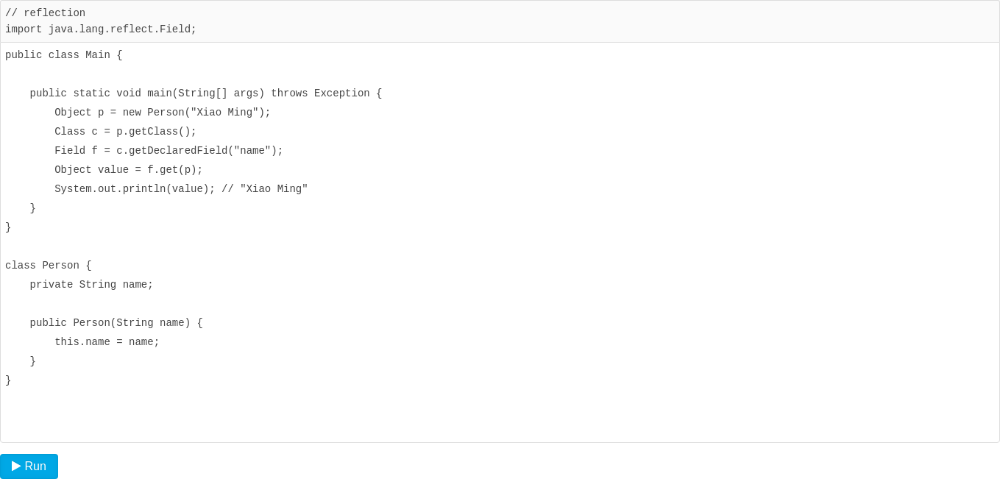
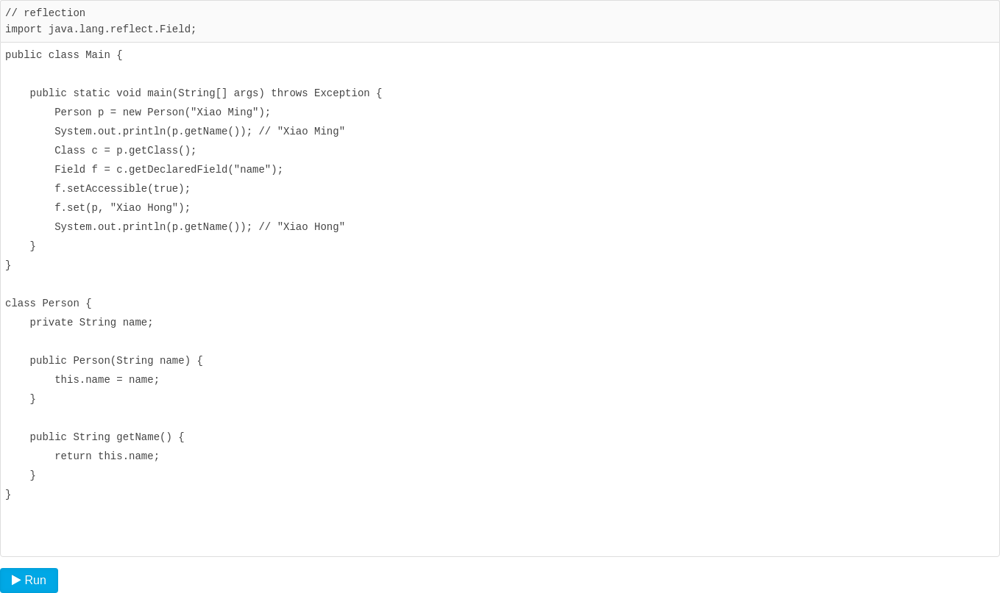

### 访问字段

对任意的一个`Object`实例，只要我们获取了它的`Class`，就可以获取它的一切信息。

我们先看看如何通过`Class`实例获取字段信息。`Class`类提供了以下几个方法来获取字段：

- `Field getField(name)`：根据字段名获取某个public的field（`包括`父类）
- `Field getDeclaredField(name)`：根据字段名获取当前类的某个field（`不包括`父类）
- `Field[] getFields()`：获取所有public的field（`包括`父类）
- `Field[] getDeclaredFields()`：获取当前类的所有field（`不包括`父类）

我们来看一下示例代码：


上述代码首先获取`Student`的`Class`实例，然后，分别获取`public`字段、继承的`public`字段以及`private`字段，打印出的`Field`类似：

```java
public int Student.score
public java.lang.String Person.name
private int Student.grade
```

一个`Field`对象包含了一个字段的所有信息：

- `getName()`：返回字段名称，例如，`"name"`；
- `getType()`：返回字段类型，也是一个`Class`实例，例如，`String.class`；
- `getModifiers()`：返回字段的修饰符，它是一个`int`，不同的bit表示不同的含义。

以`String`类的`value`字段为例，它的定义是：

```java
public final class String {
    private final byte[] value;
}
```

我们用反射获取该字段的信息，代码如下：

```java
Field f = String.class.getDeclaredField("value");
f.getName(); // "value"
f.getType(); // class [B 表示byte[]类型
int m = f.getModifiers();
Modifier.isFinal(m); // true
Modifier.isPublic(m); // false
Modifier.isProtected(m); // false
Modifier.isPrivate(m); // true
Modifier.isStatic(m); // false
```

### 获取字段值

利用反射拿到字段的一个`Field`实例只是第一步，我们还可以拿到一个实例对应的该字段的值。

例如，对于一个`Person`实例，我们可以先拿到`name`字段对应的`Field`，再获取这个实例的`name`字段的值：



上述代码先获取`Class`实例，再获取`Field`实例，然后，用`Field.get(Object)`获取指定实例的指定字段的值。

运行代码，如果不出意外，会得到一个`IllegalAccessException`，这是因为`name`被定义为一个`private`字段，正常情况下，`Main`类无法访问`Person`类的`private`字段。要修复错误，可以将`private`改为`public`，或者，在调用`Object value = f.get(p);`前，先写一句：

```java
f.setAccessible(true);
```

调用`Field.setAccessible(true)`的意思是，别管这个字段是不是`public`，一律允许访问。

可以试着加上上述语句，再运行代码，就可以打印出`private`字段的值。

有童鞋会问：如果使用反射可以获取`private`字段的值，那么类的封装还有什么意义？

答案是正常情况下，我们总是通过`p.name`来访问`Person`的`name`字段，编译器会根据`public`、`protected`和`private`决定是否允许访问字段，这样就达到了数据封装的目的。

而反射是一种非常规的用法，使用反射，首先代码非常繁琐，其次，它更多地是给工具或者底层框架来使用，目的是在不知道目标实例任何信息的情况下，获取特定字段的值。

此外，`setAccessible(true)`可能会失败。如果JVM运行期存在`SecurityManager`，那么它会根据规则进行检查，有可能阻止`setAccessible(true)`。例如，某个`SecurityManager`可能不允许对`java`和`javax`开头的`package`的类调用`setAccessible(true)`，这样可以保证JVM核心库的安全。

### 设置字段值

通过Field实例既然可以获取到指定实例的字段值，自然也可以设置字段的值。

设置字段值是通过`Field.set(Object, Object)`实现的，其中第一个`Object`参数是指定的实例，第二个`Object`参数是待修改的值。示例代码如下：



运行上述代码，打印的`name`字段从`Xiao Ming`变成了`Xiao Hong`，说明通过反射可以直接修改字段的值。

同样的，修改非`public`字段，需要首先调用`setAccessible(true)`。

### 小结

Java的反射API提供的`Field`类封装了字段的所有信息：

通过`Class`实例的方法可以获取`Field`实例：`getField()`，`getFields()`，`getDeclaredField()`，`getDeclaredFields()`；

通过Field实例可以获取字段信息：`getName()`，`getType()`，`getModifiers()`；

通过Field实例可以读取或设置某个对象的字段，如果存在访问限制，要首先调用`setAccessible(true)`来访问非`public`字段。

通过反射读写字段是一种非常规方法，它会破坏对象的封装。
