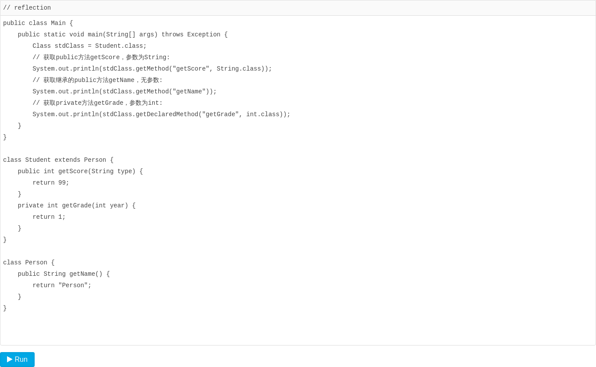
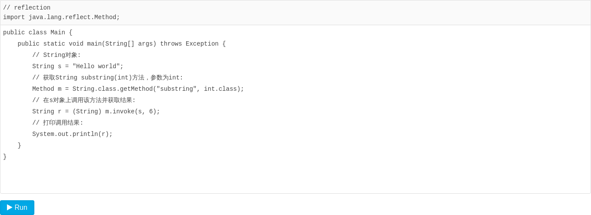
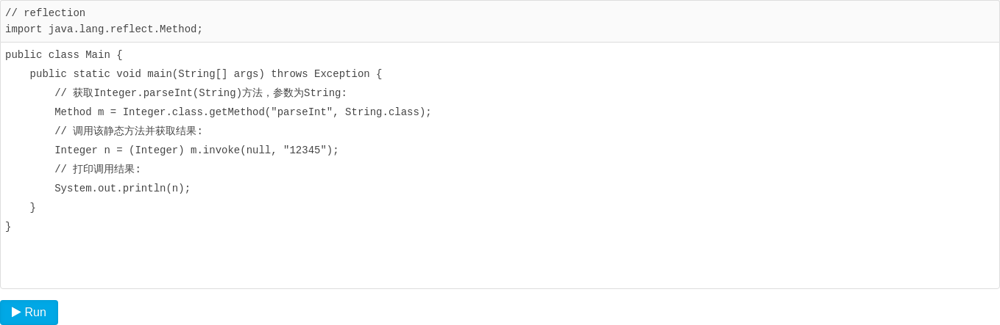
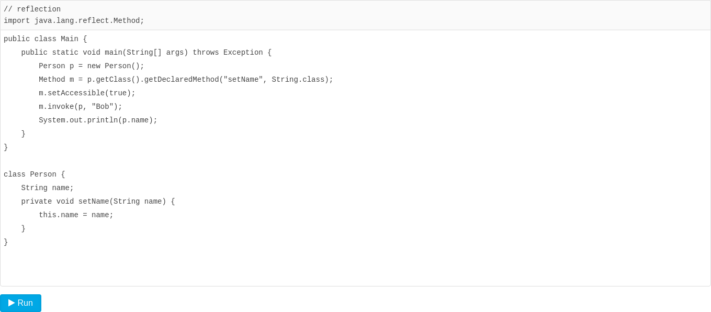
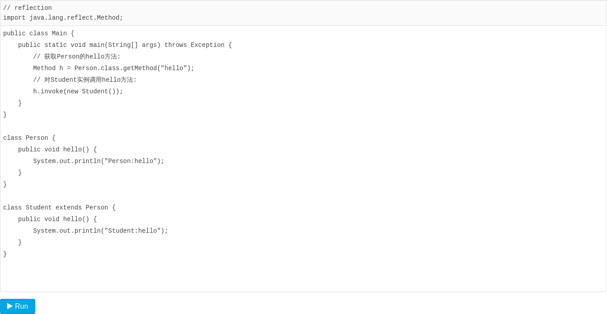

### 调用方法

我们已经能通过`Class`实例获取所有`Field`对象，同样的，可以通过`Class`实例获取所有`Method`信息。`Class`类提供了以下几个方法来获取`Method`：

- `Method getMethod(name, Class...)`：获取某个`public`的`Method`（包括父类）
- `Method getDeclaredMethod(name, Class...)`：获取当前类的某个`Method`（不包括父类）
- `Method[] getMethods()`：获取所有`public`的`Method`（包括父类）
- `Method[] getDeclaredMethods()`：获取当前类的所有`Method`（不包括父类）

我们来看一下示例代码：



上述代码首先获取`Student`的`Class`实例，然后，分别获取`public`方法、继承的`public`方法以及`private`方法，打印出的`Method`类似：

```java
public int Student.getScore(java.lang.String)
public java.lang.String Person.getName()
private int Student.getGrade(int)
```

一个`Method`对象包含一个方法的所有信息：

- `getName()`：返回方法名称，例如：`"getScore"`；
- `getReturnType()`：返回方法返回值类型，也是一个Class实例，例如：`String.class`；
- `getParameterTypes()`：返回方法的参数类型，是一个Class数组，例如：`{String.class, int.class}`；
- `getModifiers()`：返回方法的修饰符，它是一个`int`，不同的bit表示不同的含义。

### 调用方法

当我们获取到一个`Method`对象时，就可以对它进行调用。我们以下面的代码为例：

```java
String s = "Hello world";
String r = s.substring(6); // "world"
```

如果用反射来调用`substring`方法，需要以下代码：



注意到`substring()`有两个重载方法，我们获取的是`String substring(int)`这个方法。思考一下如何获取`String substring(int, int)`方法。

对`Method`实例调用`invoke`就相当于调用该方法，`invoke`的第一个参数是对象实例，即在哪个实例上调用该方法，后面的可变参数要与方法参数一致，否则将报错。

### 调用静态方法

如果获取到的Method表示一个静态方法，调用静态方法时，由于无需指定实例对象，所以`invoke`方法传入的第一个参数永远为`null`。我们以`Integer.parseInt(String)`为例：



### 调用非public方法

和Field类似，对于非public方法，我们虽然可以通过`Class.getDeclaredMethod()`获取该方法实例，但直接对其调用将得到一个`IllegalAccessException`。为了调用非public方法，我们通过`Method.setAccessible(true)`允许其调用：



此外，`setAccessible(true)`可能会失败。如果JVM运行期存在`SecurityManager`，那么它会根据规则进行检查，有可能阻止`setAccessible(true)`。例如，某个`SecurityManager`可能不允许对`java`和`javax`开头的`package`的类调用`setAccessible(true)`，这样可以保证JVM核心库的安全。

### 多态

我们来考察这样一种情况：一个`Person`类定义了`hello()`方法，并且它的子类`Student`也覆写了`hello()`方法，那么，从`Person.class`获取的`Method`，作用于`Student`实例时，调用的方法到底是哪个？



运行上述代码，发现打印出的是`Student:hello`，因此，使用反射调用方法时，仍然遵循多态原则：即总是调用实际类型的覆写方法（如果存在）。上述的反射代码：

```java
Method m = Person.class.getMethod("hello");
m.invoke(new Student());
```

实际上相当于：

```java
Person p = new Student();
p.hello();
```

### 小结

Java的反射API提供的Method对象封装了方法的所有信息：

通过`Class`实例的方法可以获取`Method`实例：`getMethod()`，`getMethods()`，`getDeclaredMethod()`，`getDeclaredMethods()`；

通过`Method`实例可以获取方法信息：`getName()`，`getReturnType()`，`getParameterTypes()`，`getModifiers()`；

通过`Method`实例可以调用某个对象的方法：`Object invoke(Object instance, Object... parameters)`；

通过设置`setAccessible(true)`来访问非`public`方法；

通过反射调用方法时，仍然遵循多态原则。
