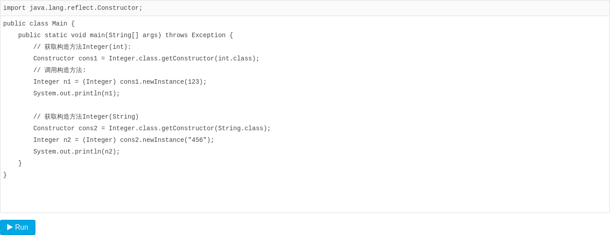

### 调用构造方法

我们通常使用`new`操作符创建新的实例：

```java
Person p = new Person();
```

如果通过反射来创建新的实例，可以调用Class提供的newInstance()方法：

```java
Person p = Person.class.newInstance();
```

调用`Class.newInstance()`的局限是，它只能调用该类的**public无参数构造方法**。如果构造方法带有参数，或者不是public，就无法直接通过Class.newInstance()来调用。

为了调用任意的构造方法，Java的反射API提供了`Constructor对象`，它包含一个构造方法的所有信息，可以创建一个实例。Constructor对象和Method非常类似，不同之处仅在于它是一个构造方法，并且，调用结果总是返回实例：

通过Class实例获取Constructor的方法如下：

- `getConstructor(Class...)`：获取某个`public`的`Constructor`；
- `getDeclaredConstructor(Class...)`：获取某个`Constructor`；
- `getConstructors()`：获取所有`public`的`Constructor`；
- `getDeclaredConstructors()`：获取所有`Constructor`。

注意`Constructor`总是当前类定义的构造方法，和父类无关，因此不存在多态的问题。

调用非`public`的`Constructor`时，必须首先通过`setAccessible(true)`设置允许访问。`setAccessible(true)`可能会失败。

### 小结

`Constructor`对象封装了构造方法的所有信息；

通过`Class`实例的方法可以获取`Constructor`实例：`getConstructor()`，`getConstructors()`，`getDeclaredConstructor()`，`getDeclaredConstructors()`；

通过`Constructor`实例可以创建一个实例对象：`newInstance(Object... parameters)`； 通过设置`setAccessible(true)`来访问非`public`构造方法。
