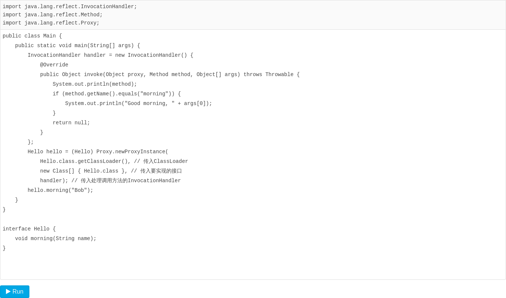

### 动态代理

我们来比较Java的`class`和`interface`的区别：

- 可以实例化`class`（非`abstract`）；
- 不能实例化`interface`。

所有`interface`类型的变量总是通过某个实例向上转型并赋值给接口类型变量的：

```java
CharSequence cs = new StringBuilder();
```

有没有可能不编写实现类，直接在运行期创建某个`interface`的实例呢？

这是可能的，因为Java标准库提供了一种动态代理（Dynamic Proxy）的机制：可以在运行期动态创建某个`interface`的实例。

什么叫运行期动态创建？听起来好像很复杂。所谓动态代理，是和静态相对应的。我们来看静态代码怎么写：

定义接口：

```java
public interface Hello {
    void morning(String name);
}
```

编写实现类：

```java
public class HelloWorld implements Hello {
    public void morning(String name) {
        System.out.println("Good morning, " + name);
    }
}
```

创建实例，转型为接口并调用：

```java
Hello hello = new HelloWorld();
hello.morning("Bob");
```

这种方式就是我们通常编写代码的方式。

还有一种方式是动态代码，我们仍然先定义了接口`Hello`，但是我们并不去编写实现类，而是直接通过JDK提供的一个`Proxy.newProxyInstance()`创建了一个`Hello`接口对象。这种没有实现类但是在运行期动态创建了一个接口对象的方式，我们称为动态代码。**`JDK`提供的动态创建`接口`对象的方式，就叫`动态代理`**。

一个最简单的动态代理实现如下：



在运行期动态创建一个`interface`实例的方法如下：

1. 定义一个`InvocationHandler`实例，它负责实现接口的方法调用；

2. 通过

    ```
    Proxy.newProxyInstance()
    ```

    创建

    ```
    interface
    ```

    实例，它需要3个参数：

    1. 使用的`ClassLoader`，通常就是接口类的`ClassLoader`；
    2. 需要实现的接口数组，至少需要传入一个接口进去；
    3. 用来处理接口方法调用的`InvocationHandler`实例。

3. 将返回的`Object`强制转型为接口。

动态代理实际上是JVM在运行期动态创建class字节码并加载的过程，它并没有什么黑魔法，把上面的动态代理改写为静态实现类大概长这样：

```java
public class HelloDynamicProxy implements Hello {
    InvocationHandler handler;
    public HelloDynamicProxy(InvocationHandler handler) {
        this.handler = handler;
    }
    public void morning(String name) {
        handler.invoke(
           this,
           Hello.class.getMethod("morning", String.class),
           new Object[] { name });
    }
}
```

其实就是JVM帮我们自动编写了一个上述类（不需要源码，可以直接生成字节码），并不存在可以直接实例化接口的黑魔法。

### 小结

Java标准库提供了动态代理功能，允许在运行期动态创建一个接口的实例；

动态代理是通过`Proxy`创建代理对象，然后将接口方法“代理”给`InvocationHandler`完成的。
