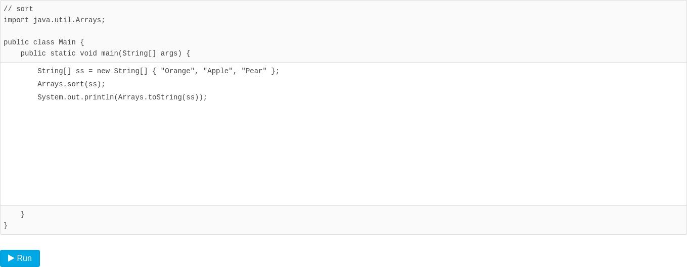
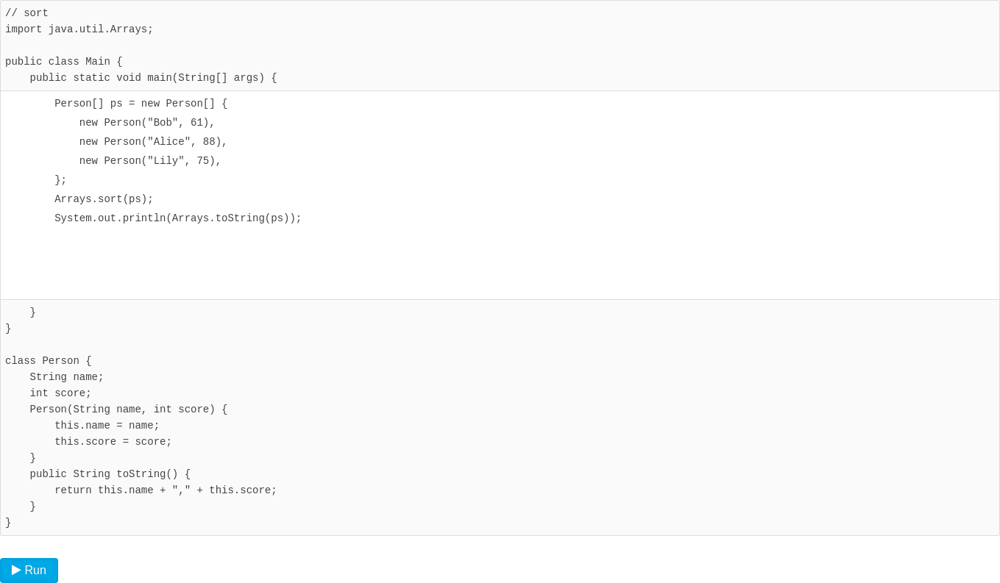
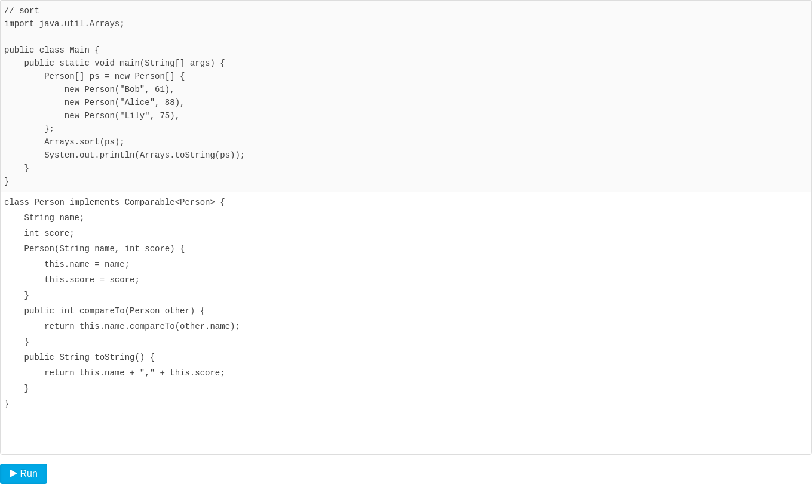

#### 使用泛型

使用`ArrayList`时，如果不定义泛型类型时，泛型类型实际上就是`Object`：

```java
// 编译器警告:
List list = new ArrayList();
list.add("Hello");
list.add("World");
String first = (String) list.get(0);
String second = (String) list.get(1);
```

此时，只能把`<T>`当作`Object`使用，没有发挥泛型的优势。

当我们定义泛型类型`<String>`后，`List<T>`的泛型接口变为强类型`List<String>`：

```java
// 无编译器警告:
List<String> list = new ArrayList<String>();
list.add("Hello");
list.add("World");
// 无强制转型:
String first = list.get(0);
String second = list.get(1);
```

当我们定义泛型类型`<Number>`后，`List<T>`的泛型接口变为强类型`List<Number>`：

```java
List<Number> list = new ArrayList<Number>();
list.add(new Integer(123));
list.add(new Double(12.34));
Number first = list.get(0);
Number second = list.get(1);
```

编译器如果能自动推断出泛型类型，就可以省略后面的泛型类型。例如，对于下面的代码：

```java
List<Number> list = new ArrayList<Number>();
```

编译器看到泛型类型`List<Number>`就可以自动推断出后面的`ArrayList<T>`的泛型类型必须是`ArrayList<Number>`，因此，可以把代码简写为：

```java
// 可以省略后面的Number，编译器可以自动推断泛型类型：
List<Number> list = new ArrayList<>();
```

### 泛型接口

除了`ArrayList<T>`使用了泛型，还可以在接口中使用泛型。例如，`Arrays.sort(Object[])`可以对任意数组进行排序，但待排序的元素必须实现`Comparable<T>`这个泛型接口：

```java
public interface Comparable<T> {
    /**
     * 返回负数: 当前实例比参数o小
     * 返回0: 当前实例与参数o相等
     * 返回正数: 当前实例比参数o大
     */
    int compareTo(T o);
}
```

可以直接对`String`数组进行排序：



这是因为`String`本身已经实现了`Comparable<String>`接口。如果换成我们自定义的`Person`类型试试：



运行程序，我们会得到`ClassCastException`，即无法将`Person`转型为`Comparable`。我们修改代码，让`Person`实现`Comparable<T>`接口：



运行上述代码，可以正确实现按`name`进行排序。

也可以修改比较逻辑，例如，按`score`从高到低排序。请自行修改测试。

### 小结

使用泛型时，把泛型参数`<T>`替换为需要的class类型，例如：`ArrayList<String>`，`ArrayList<Number>`等；

可以省略编译器能自动推断出的类型，例如：`List<String> list = new ArrayList<>();`；

不指定泛型参数类型时，编译器会给出警告，且只能将`<T>`视为`Object`类型；

可以在接口中定义泛型类型，实现此接口的类必须实现正确的泛型类型。
