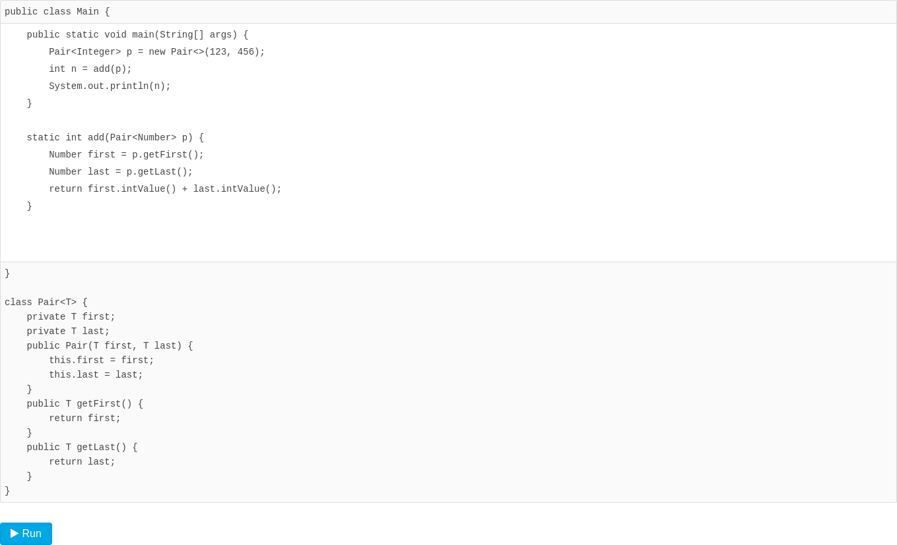
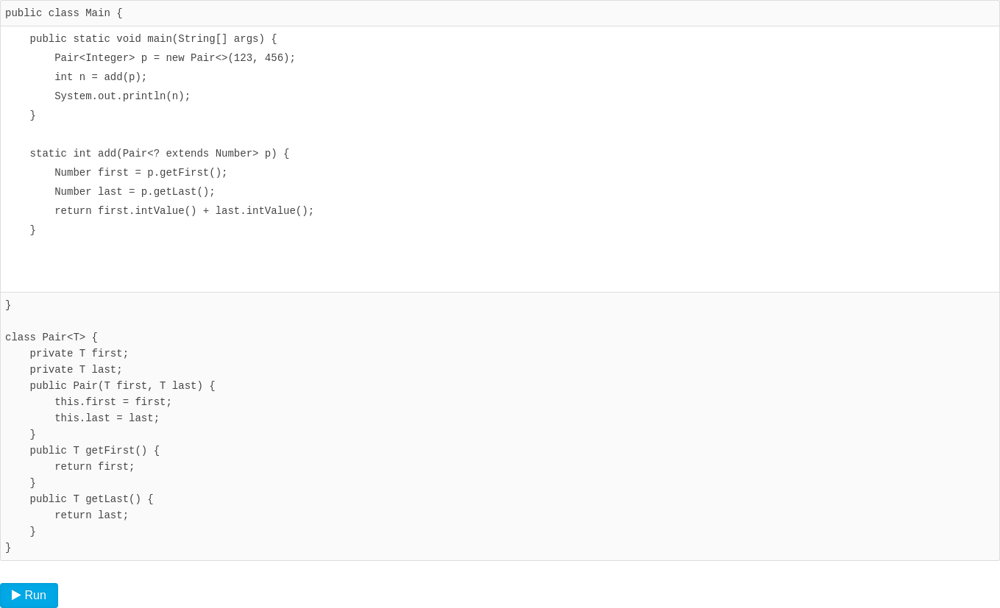
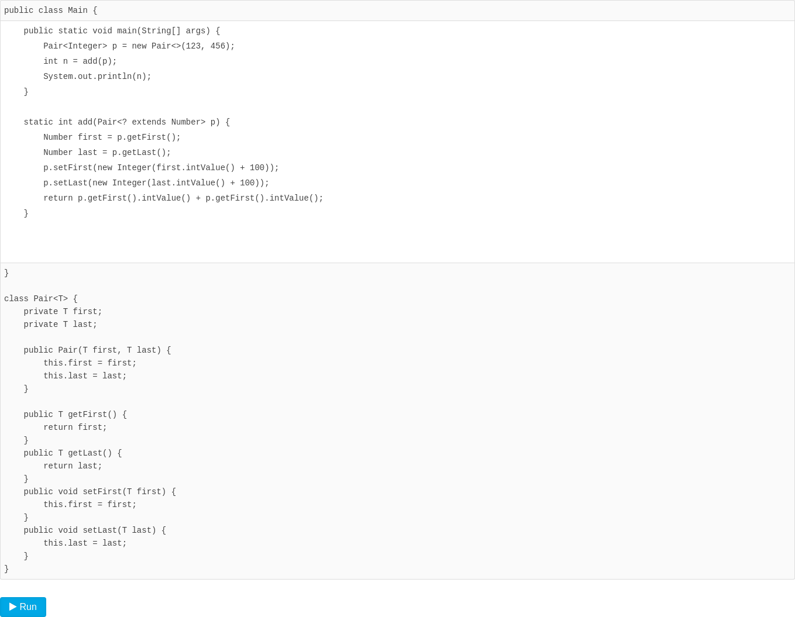

# extends通配符

我们前面已经讲到了泛型的继承关系：`Pair<Integer>`不是`Pair<Number>`的子类。

假设我们定义了`Pair<T>`：

```java
public class Pair<T> { ... }
```

然后，我们又针对`Pair<Number>`类型写了一个静态方法，它接收的参数类型是`Pair<Number>`：

```java
public class PairHelper {
    static int add(Pair<Number> p) {
        Number first = p.getFirst();
        Number last = p.getLast();
        return first.intValue() + last.intValue();
    }
}
```

上述代码是可以正常编译的。使用的时候，我们传入：

```java
int sum = PairHelper.add(new Pair<Number>(1, 2));
```

注意：传入的类型是`Pair<Number>`，实际参数类型是`(Integer, Integer)`。

既然实际参数是`Integer`类型，试试传入`Pair<Integer>`：



直接运行，会得到一个编译错误：

```java
incompatible types: Pair<Integer> cannot be converted to Pair<Number>
```

原因很明显，因为`Pair<Integer>`不是`Pair<Number>`的子类，因此，`add(Pair<Number>)`不接受参数类型`Pair<Integer>`。

但是从`add()`方法的代码可知，传入`Pair<Integer>`是完全符合内部代码的类型规范，因为语句：

```java
Number first = p.getFirst();
Number last = p.getLast();
```

实际类型是`Integer`，引用类型是`Number`，没有问题。问题在于方法参数类型定死了只能传入`Pair<Number>`。

有没有办法使得方法参数接受`Pair<Integer>`？办法是有的，这就是使用`Pair<? extends Number>`使得方法接收所有泛型类型为`Number`或`Number`子类的`Pair`类型。我们把代码改写如下：



这样一来，给方法传入`Pair<Integer>`类型时，它符合参数`Pair<? extends Number>`类型。这种使用`<? extends Number>`的泛型定义称之为上界通配符（Upper Bounds Wildcards），即把泛型类型`T`的上界限定在`Number`了。

除了可以传入`Pair<Integer>`类型，我们还可以传入`Pair<Double>`类型，`Pair<BigDecimal>`类型等等，因为`Double`和`BigDecimal`都是`Number`的子类。

如果我们考察对`Pair<? extends Number>`类型调用`getFirst()`方法，实际的方法签名变成了：

```java
<? extends Number> getFirst();
```

即返回值是`Number`或`Number`的子类，因此，可以安全赋值给`Number`类型的变量：

```java
Number x = p.getFirst();
```

然后，我们不可预测实际类型就是`Integer`，例如，下面的代码是无法通过编译的：

```java
Integer x = p.getFirst();
```

这是因为实际的返回类型可能是`Integer`，也可能是`Double`或者其他类型，编译器只能确定类型一定是`Number`的子类（包括`Number`类型本身），但具体类型无法确定。

我们再来考察一下`Pair<T>`的`set`方法：



不出意外，我们会得到一个编译错误：

```cmd
incompatible types: Integer cannot be converted to CAP#1
where CAP#1 is a fresh type-variable:
    CAP#1 extends Number from capture of ? extends Number
```

编译错误发生在`p.setFirst()`传入的参数是`Integer`类型。有些童鞋会问了，既然`p`的定义是`Pair<? extends Number>`，那么`setFirst(? extends Number)`为什么不能传入`Integer`？

原因还在于擦拭法。如果我们传入的`p`是`Pair<Double>`，显然它满足参数定义`Pair<? extends Number>`，然而，`Pair<Double>`的`setFirst()`显然无法接受`Integer`类型。

这就是`<? extends Number>`通配符的一个重要限制：方法参数签名`setFirst(? extends Number)`无法传递任何`Number`的子类型给`setFirst(? extends Number)`。

这里唯一的例外是可以给方法参数传入`null`：

```java
p.setFirst(null); // ok, 但是后面会抛出NullPointerException
p.getFirst().intValue(); // NullPointerException
```

### extends通配符的作用

如果我们考察Java标准库的`java.util.List<T>`接口，它实现的是一个类似“可变数组”的列表，主要功能包括：

```java
public interface List<T> {
    int size(); // 获取个数
    T get(int index); // 根据索引获取指定元素
    void add(T t); // 添加一个新元素
    void remove(T t); // 删除一个已有元素
}
```

现在，让我们定义一个方法来处理列表的每个元素：

```java
int sumOfList(List<? extends Integer> list) {
    int sum = 0;
    for (int i=0; i<list.size(); i++) {
        Integer n = list.get(i);
        sum = sum + n;
    }
    return sum;
}
```

为什么我们定义的方法参数类型是`List<? extends Integer>`而不是`List<Integer>`？从方法内部代码看，传入`List<? extends Integer>`或者`List<Integer>`是完全一样的，但是，注意到`List<? extends Integer>`的限制：

- 允许调用`get()`方法获取`Integer`的引用；
- 不允许调用`set(? extends Integer)`方法并传入任何`Integer`的引用（`null`除外）。

因此，方法参数类型`List<? extends Integer>`表明了该方法内部只会读取`List`的元素，不会修改`List`的元素（因为无法调用`add(? extends Integer)`、`remove(? extends Integer)`这些方法。换句话说，这是一个对参数`List<? extends Integer>`进行只读的方法（恶意调用`set(null)`除外）。

### 使用extends限定T类型

在定义泛型类型`Pair<T>`的时候，也可以使用`extends`通配符来限定`T`的类型：

```java
public class Pair<T extends Number> { ... }
```

现在，我们只能定义：

```java
Pair<Number> p1 = null;
Pair<Integer> p2 = new Pair<>(1, 2);
Pair<Double> p3 = null;
```

因为`Number`、`Integer`和`Double`都符合`<T extends Number>`。

非`Number`类型将无法通过编译：

```java
Pair<String> p1 = null; // compile error!
Pair<Object> p2 = null; // compile error!
```

因为`String`、`Object`都不符合`<T extends Number>`，因为它们不是`Number`类型或`Number`的子类。

### 小结

使用类似`<? extends Number>`通配符作为方法参数时表示：

- 方法内部可以调用获取`Number`引用的方法，例如：`Number n = obj.getFirst();`；
- 方法内部无法调用传入`Number`引用的方法（`null`除外），例如：`obj.setFirst(Number n);`。

即一句话总结：使用`extends`通配符表示可以读，不能写。

使用类似`<T extends Number>`定义泛型类时表示：

- 泛型类型限定为`Number`以及`Number`的子类。
