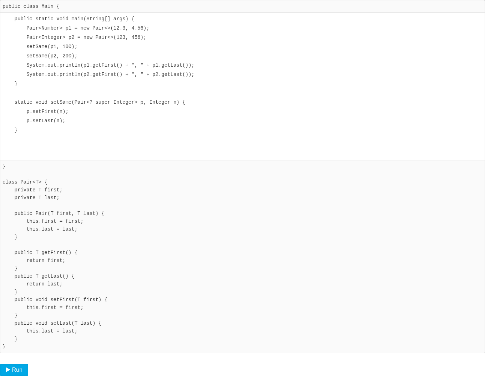
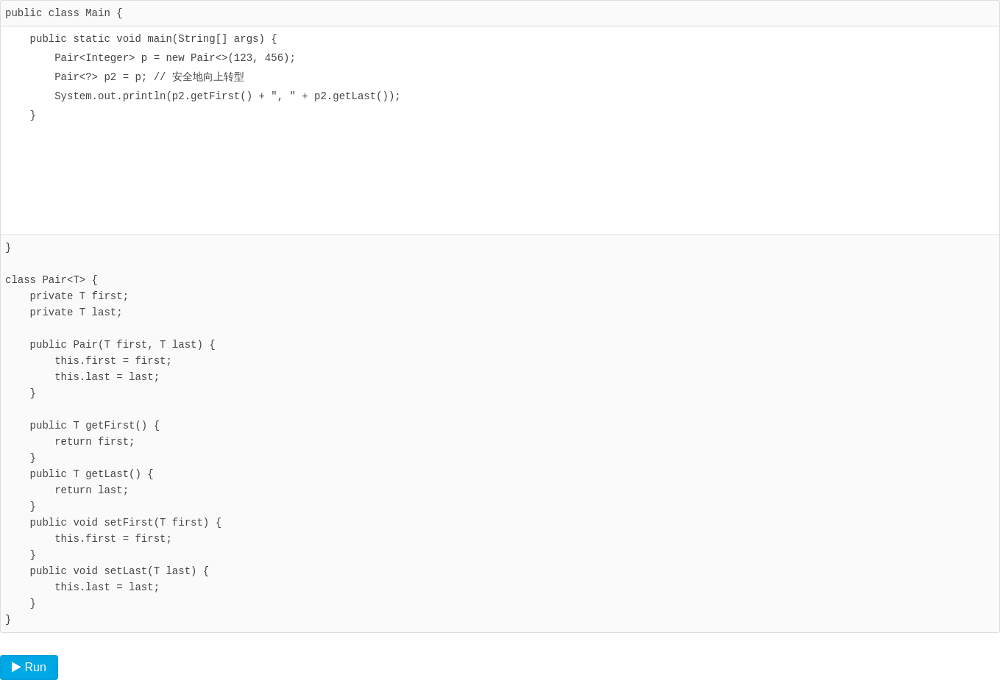

## super通配符

我们前面已经讲到了泛型的继承关系：`Pair<Integer>`不是`Pair<Number>`的子类。

考察下面的`set`方法：

```java
void set(Pair<Integer> p, Integer first, Integer last) {
    p.setFirst(first);
    p.setLast(last);
}
```

传入`Pair<Integer>`是允许的，但是传入`Pair<Number>`是不允许的。

和`extends`通配符相反，这次，我们希望接受`Pair<Integer>`类型，以及`Pair<Number>`、`Pair<Object>`，因为`Number`和`Object`是`Integer`的父类，`setFirst(Number)`和`setFirst(Object)`实际上允许接受`Integer`类型。

我们使用`super`通配符来改写这个方法：

```java
void set(Pair<? super Integer> p, Integer first, Integer last) {
    p.setFirst(first);
    p.setLast(last);
}
```

注意到`Pair<? super Integer>`表示，方法参数接受所有泛型类型为`Integer`或`Integer`父类的`Pair`类型。

下面的代码可以被正常编译：



考察`Pair<? super Integer>`的`setFirst()`方法，它的方法签名实际上是：

```java
void setFirst(? super Integer);
```

因此，可以安全地传入`Integer`类型。

再考察`Pair<? super Integer>`的`getFirst()`方法，它的方法签名实际上是：

```java
? super Integer getFirst();
```

这里注意到我们无法使用`Integer`类型来接收`getFirst()`的返回值，即下面的语句将无法通过编译：

```java
Integer x = p.getFirst();
```

因为如果传入的实际类型是`Pair<Number>`，编译器无法将`Number`类型转型为`Integer`。

注意：虽然`Number`是一个抽象类，我们无法直接实例化它。但是，即便`Number`不是抽象类，这里仍然无法通过编译。此外，传入`Pair<Object>`类型时，编译器也无法将`Object`类型转型为`Integer`。

唯一可以接收`getFirst()`方法返回值的是`Object`类型：

```java
Object obj = p.getFirst();
```

因此，使用`<? super Integer>`通配符表示：

- 允许调用`set(? super Integer)`方法传入`Integer`的引用；
- 不允许调用`get()`方法获得`Integer`的引用。

唯一例外是可以获取`Object`的引用：`Object o = p.getFirst()`。

换句话说，使用`<? super Integer>`通配符作为方法参数，表示方法内部代码对于参数只能写，不能读。

### 对比extends和super通配符

我们再回顾一下`extends`通配符。作为方法参数，`<? extends T>`类型和`<? super T>`类型的区别在于：

- `<? extends T>`允许调用读方法`T get()`获取`T`的引用，但不允许调用写方法`set(T)`传入`T`的引用（传入`null`除外）；
- `<? super T>`允许调用写方法`set(T)`传入`T`的引用，但不允许调用读方法`T get()`获取`T`的引用（获取`Object`除外）。

一个是允许读不允许写，另一个是允许写不允许读。

先记住上面的结论，我们来看Java标准库的`Collections`类定义的`copy()`方法：

```java
public class Collections {
    // 把src的每个元素复制到dest中:
    public static <T> void copy(List<? super T> dest, List<? extends T> src) {
        for (int i=0; i<src.size(); i++) {
            T t = src.get(i);
            dest.add(t);
        }
    }
}
```

它的作用是把一个`List`的每个元素依次添加到另一个`List`中。它的第一个参数是`List<? super T>`，表示目标`List`，第二个参数`List<? extends T>`，表示要复制的`List`。我们可以简单地用`for`循环实现复制。在`for`循环中，我们可以看到，对于类型`<? extends T>`的变量`src`，我们可以安全地获取类型`T`的引用，而对于类型`<? super T>`的变量`dest`，我们可以安全地传入`T`的引用。

这个`copy()`方法的定义就完美地展示了`extends`和`super`的意图：

- `copy()`方法内部不会读取`dest`，因为不能调用`dest.get()`来获取`T`的引用；
- `copy()`方法内部也不会修改`src`，因为不能调用`src.add(T)`。

这是由编译器检查来实现的。如果在方法代码中意外修改了`src`，或者意外读取了`dest`，就会导致一个编译错误：

```java
public class Collections {
    // 把src的每个元素复制到dest中:
    public static <T> void copy(List<? super T> dest, List<? extends T> src) {
        ...
        T t = dest.get(0); // compile error!
        src.add(t); // compile error!
    }
}
```

这个`copy()`方法的另一个好处是可以安全地把一个`List<Integer>`添加到`List<Number>`，但是无法反过来添加：

```java
// copy List<Integer> to List<Number> ok:
List<Number> numList = ...;
List<Integer> intList = ...;
Collections.copy(numList, intList);
// ERROR: cannot copy List<Number> to List<Integer>:
Collections.copy(intList, numList);
```

而这些都是通过`super`和`extends`通配符，并由编译器强制检查来实现的。

### PECS原则

何时使用`extends`，何时使用`super`？为了便于记忆，我们可以用PECS原则：Producer Extends Consumer Super（生产者扩展消费者超级）。

即：如果需要返回`T`，它是生产者（Producer），要使用`extends`通配符；如果需要写入`T`，它是消费者（Consumer），要使用`super`通配符。

还是以`Collections`的`copy()`方法为例：

```java
public class Collections {
    public static <T> void copy(List<? super T> dest, List<? extends T> src) {
        for (int i=0; i<src.size(); i++) {
            T t = src.get(i); // src是producer
            dest.add(t); // dest是consumer
        }
    }
}
```

需要返回`T`的`src`是生产者，因此声明为`List<? extends T>`，需要写入`T`的`dest`是消费者，因此声明为`List<? super T>`。

### 无限定通配符

我们已经讨论了`<? extends T>`和`<? super T>`作为方法参数的作用。实际上，Java的泛型还允许使用无限定通配符（Unbounded Wildcard Type），即只定义一个`?`：

```java
void sample(Pair<?> p) {
}
```

因为`<?>`通配符既没有`extends`，也没有`super`，因此：

- 不允许调用`set(T)`方法并传入引用（`null`除外）；
- 不允许调用`T get()`方法并获取`T`引用（只能获取`Object`引用）。

换句话说，既不能读，也不能写，那只能做一些`null`判断：

```java
static boolean isNull(Pair<?> p) {
    return p.getFirst() == null || p.getLast() == null;
}
```

大多数情况下，可以引入泛型参数`<T>`消除`<?>`通配符：

```java
static <T> boolean isNull(Pair<T> p) {
    return p.getFirst() == null || p.getLast() == null;
}
```

`<?>`通配符有一个独特的特点，就是：`Pair<?>`是所有`Pair<T>`的超类：



上述代码是可以正常编译运行的，因为`Pair<Integer>`是`Pair<?>`的子类，可以安全地向上转型。

### 小结

使用类似`<? super Integer>`通配符作为方法参数时表示：

- 方法内部可以调用传入`Integer`引用的方法，例如：`obj.setFirst(Integer n);`；
- 方法内部无法调用获取`Integer`引用的方法（`Object`除外），例如：`Integer n = obj.getFirst();`。

即使用`super`通配符表示只能写不能读。

使用`extends`和`super`通配符要遵循PECS原则。

无限定通配符`<?>`很少使用，可以用`<T>`替换，同时它是所有`<T>`类型的超类。
