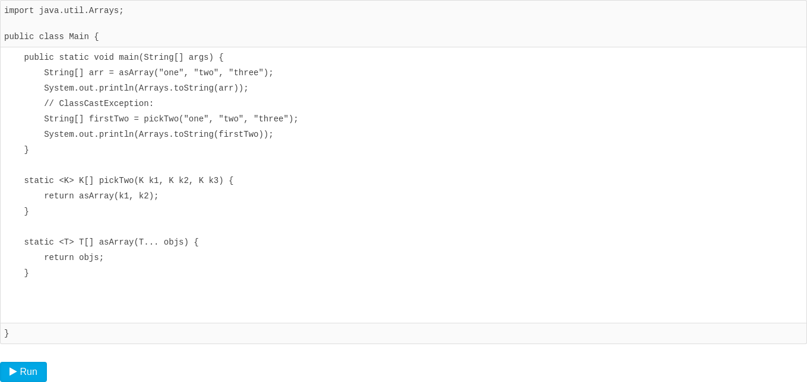

## 泛型和反射

Java的部分反射API也是泛型。例如：`Class<T>`就是泛型：

```java
// compile warning:
Class clazz = String.class;
String str = (String) clazz.newInstance();
// no warning:
Class<String> clazz = String.class;
String str = clazz.newInstance();
```

调用`Class`的`getSuperclass()`方法返回的`Class`类型是`Class<? super T>`：

```JAVA
Class<? super String> sup = String.class.getSuperclass();
```

构造方法`Constructor<T>`也是泛型：

```JAVA
Class<Integer> clazz = Integer.class;
Constructor<Integer> cons = clazz.getConstructor(int.class);
Integer i = cons.newInstance(123);
```

我们可以声明带泛型的数组，但不能用`new`操作符创建带泛型的数组：

```java
Pair<String>[] ps = null; // ok
Pair<String>[] ps = new Pair<String>[2]; // compile error!
```

必须通过强制转型实现带泛型的数组：

```java
@SuppressWarnings("unchecked")
Pair<String>[] ps = (Pair<String>[]) new Pair[2];
```

使用泛型数组要特别小心，因为数组实际上在运行期没有泛型，编译器可以强制检查变量`ps`，因为它的类型是泛型数组。但是，编译器不会检查变量`arr`，因为它不是泛型数组。因为这两个变量实际上指向同一个数组，所以，操作`arr`可能导致从`ps`获取元素时报错，例如，以下代码演示了不安全地使用带泛型的数组：

```java
Pair[] arr = new Pair[2];
Pair<String>[] ps = (Pair<String>[]) arr;
ps[0] = new Pair<String>("a", "b");
arr[1] = new Pair<Integer>(1, 2);
// ClassCastException:
Pair<String> p = ps[1];
String s = p.getFirst();
```

要安全地使用泛型数组，必须扔掉`arr`的引用：

```java
@SuppressWarnings("unchecked")
Pair<String>[] ps = (Pair<String>[]) new Pair[2];
```

上面的代码中，由于拿不到原始数组的引用，就只能对泛型数组`ps`进行操作，这种操作就是安全的。

带泛型的数组实际上是编译器的类型擦除：

```java
Pair[] arr = new Pair[2];
Pair<String>[] ps = (Pair<String>[]) arr;
System.out.println(ps.getClass() == Pair[].class); // true
String s1 = (String) arr[0].getFirst();
String s2 = ps[0].getFirst();
```

所以我们不能直接创建泛型数组`T[]`，因为擦拭后代码变为`Object[]`：

```java
// compile error:
public class Abc<T> {
    T[] createArray() {
        return new T[5];
    }
}
```

必须借助`Class<T>`来创建泛型数组：

```java
T[] createArray(Class<T> cls) {
    return (T[]) Array.newInstance(cls, 5);
}
```

我们还可以利用可变参数创建泛型数组`T[]`：

```java
public class ArrayHelper {
    @SafeVarargs
    static <T> T[] asArray(T... objs) {
        return objs;
    }
}
String[] ss = ArrayHelper.asArray("a", "b", "c");
Integer[] ns = ArrayHelper.asArray(1, 2, 3);
```

### 谨慎使用泛型可变参数

在上面的例子中，我们看到，通过：

```java
static <T> T[] asArray(T... objs) {
    return objs;
}
```

似乎可以安全地创建一个泛型数组。但实际上，这种方法非常危险。以下代码来自《Effective Java》的示例：



直接调用`asArray(T...)`似乎没有问题，但是在另一个方法中，我们返回一个泛型数组就会产生`ClassCastException`，原因还是因为擦拭法，在`pickTwo()`方法内部，编译器无法检测`K[]`的正确类型，因此返回了`Object[]`。

如果仔细观察，可以发现编译器对所有可变泛型参数都会发出警告，除非确认完全没有问题，才可以用`@SafeVarargs`消除警告。

如果在方法内部创建了泛型数组，最好不要将它返回给外部使用。

更详细的解释请参考《[Effective Java](https://www.oreilly.com/library/view/effective-java-3rd/9780134686097/)》“Item 32: Combine generics and varargs judiciously”。

### 小结

部分反射API是泛型，例如：`Class<T>`，`Constructor<T>`；

可以声明带泛型的数组，但不能直接创建带泛型的数组，必须强制转型；

可以通过`Array.newInstance(Class<T>, int)`创建`T[]`数组，需要强制转型；

同时使用泛型和可变参数时需要特别小心。
