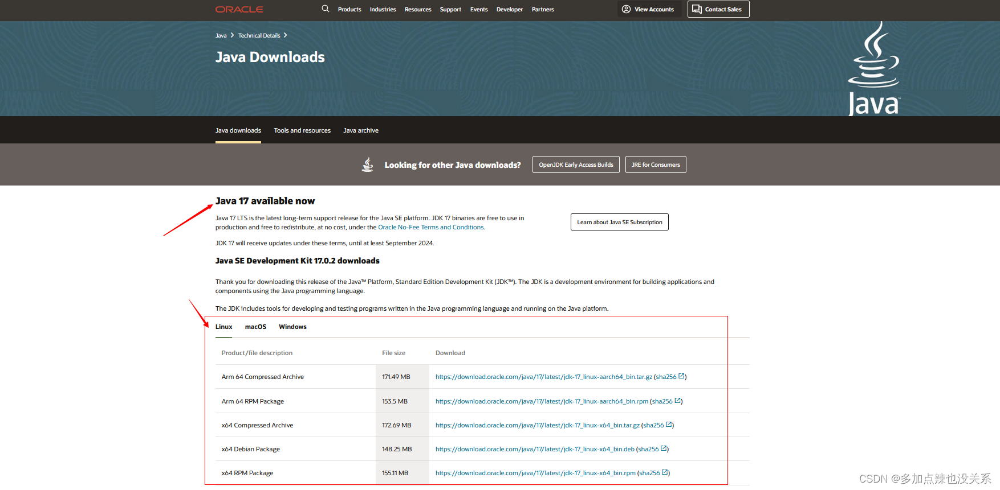
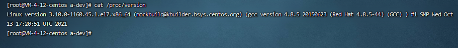
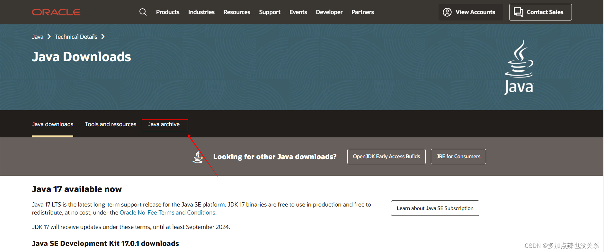
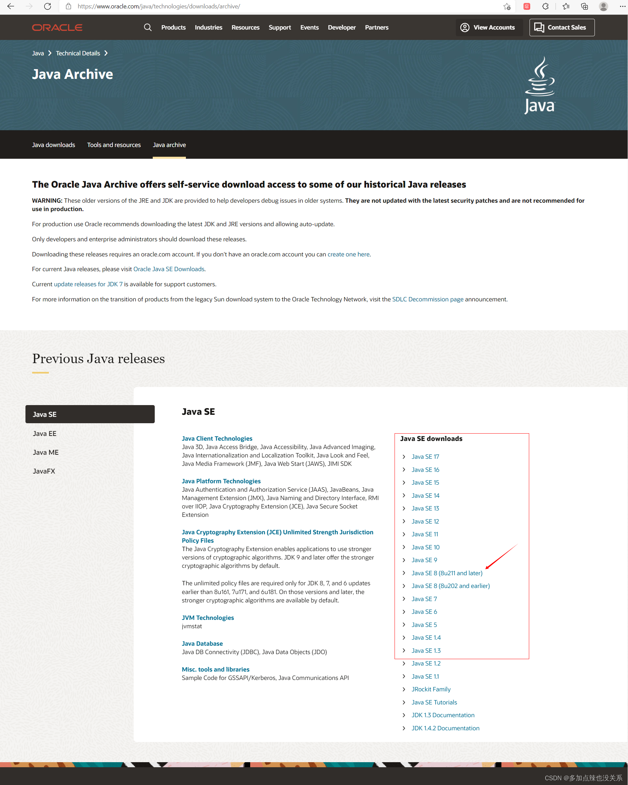
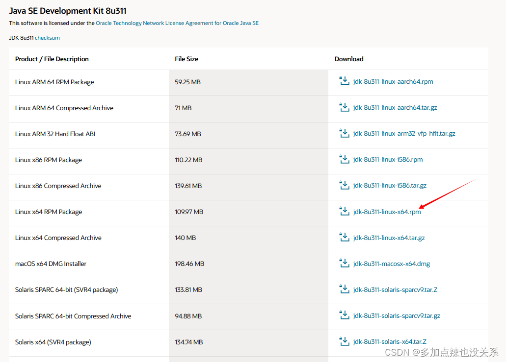
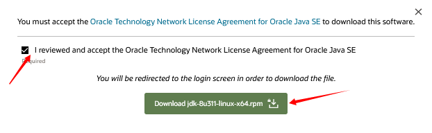
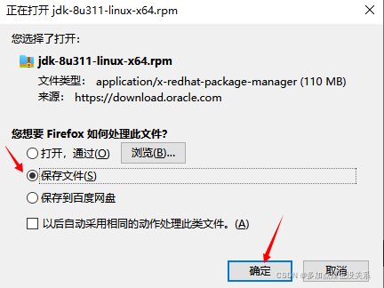
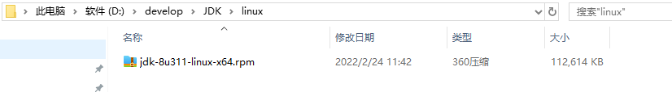
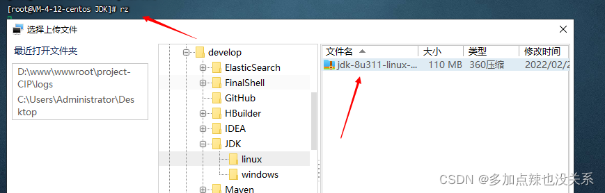

## 前言

今天刚买了一台服务器，上面什么都没有，正好可以出一期 Linux 上配置java环境的教程


可以看到我这个服务器上面是没有配置过 java 环境的，也没有 JDK

## 一、JDK 下载

如果你电脑已经下载了 jdk ，那就恭喜你可以跳过这一步了

jdk 的下载路径：https://www.oracle.com/java/technologies/downloads


可以看到目前 JDK 的版本已经更新到 17 了，如果你想用最新的 JDK 就可以在上图框选部分下载系统对应的 JDK 安装包了

在此之前你得先查看下你服务器上的系统，根据操作系统下载对应符合的 JDK 版本

如何查看？

Linux 上查看操作系统，命令 `cat /proc/version`


可以看到我服务器上面的是 64 位的处理器，那么我就得选 64 位 JDK 安装包了

那如果想要下载以前版本的 jdk 呢？

可以点击 `java archive` ，查看 java 档案


往下拉就可以看到旧版本的 jdk 了，一般我们用得最多的版本是 jdk 8 了，因为比较稳定，而且企业里面大部分都是用 JDK8 的


点击你想要下载的 jdk 版本，比如：我选择了 jdk 8，然后我要下载到 [linux 操作系统](https://so.csdn.net/so/search?q=linux 操作系统&spm=1001.2101.3001.7020)下，并且处理器是 64位的，那我就选择这个，点击下载就可以了（这里我下载的是 .rpm 安装包）


我接受


这里需要登陆 Orcle 账号，如果你没有可以申请一个，不想申请下面我也提供了该 JDK 的网盘下载

下载保存




## 二、Linux

### 1、jdk 安装

以下我也提供了我在 linux 下使用的 jdk 8

百度网盘下载链接

链接：[百度网盘](https://pan.baidu.com/s/1nANy0XyDpB2Yy04zkgl9Aw)
提取码：5w5t

首先我在 `/` 目录下创建了一个 `a-dev` 的文件夹，用于存放 JDK


再创建个 `JDK` 的文件夹


将刚刚下载好的 JDK 上传至该文件夹，可使用 `rz` 命令进行上传文件，有些终端工具可以直接上传文件，比如：FinalShell 等等


注意：如果你的 `rz` 命令不可以用，则先输入 `yum -y install lrzsz` 命令安装 `rz`，就可以正常使用了

可以看到安装包已经上传上来了


因为我下载的是 .rpm 文件，所以得用 rpm 命令进行安装

```shell
# 直接安装
rpm -ivh xxx.rpm
12
```


安装成功之后可以去 /usr 目录下查看是否有 `java` 的文件夹


如果有就证明安装成功了。

### 2、环境变量的配置

我们需要修改 /etc/profile 文件

```shell
# 编辑 /etc/profile
vi /etc/profile
12
```


将以下内容复制上去

```bash
JAVA_HOME=/usr/java/jdk1.8.0_311-amd64
PATH=$JAVA_HOME/bin:$PATH
CLASSPATH=.:$JAVA_HOME/lib/dt.jar:$JAVA_HOME/lib/tools.jar
export JAVA_HOME
export PATH
export CLASSPATH
123456
```

注意：这个 `JAVA_HOME=xxxxxx` 填写的是你JDK目录


所以我这里填写的就是 `JAVA_HOME=/usr/java/jdk1.8.0_311-amd64`

拖到文本最后，按 `i` 编辑文本，复制上述配置


按 `Esc` 退出编辑状态，`:wq!` 强制保存并且退出

保存并且关闭 profile 文件，再执行 `source /etc/profile` 命令让修改的生效


### 3、检测是否配置成功

可以查看 JDK 版本检测是否安装配置 java 环境成功

命令：`java -version`


如果能够查看到 JDK 的版本信息就表示成功了
