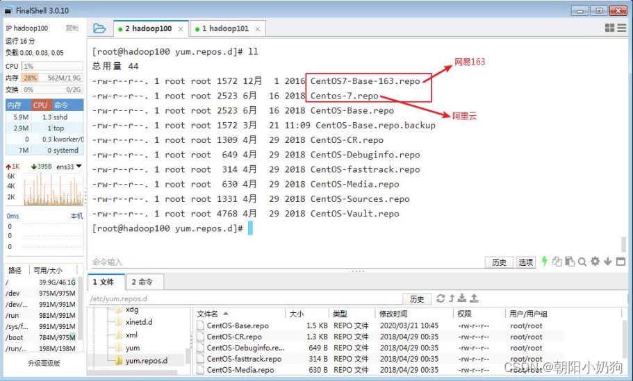

# Linux下deb包和rpm包区别

## linux安装软件的三种方式

- `deb`，`rpm`，`yum`，`apt-get`安装
- `源码编译`安装
- `二进制`安装

## Linux下deb包和rpm包区别

有的系统只支持使用`rpm包`安装，有的只支持`deb包`安装，**混乱安装会导致系统问题**。

`rpm`包主要用于`redhat及分支`如`redhat`，`centos`，`Fedora`等
而`deb`包主要用于`debian及分支`如`debian`，`ubuntu`等。
`rpm`包相对来说版本**不是最新的，但是比较稳定**；而`deb`包则相对来说**版本比较新，一般某个新软件出来说可能有deb包，但是使用过程中容易引起bugs**。

## 1 rmp包

**rmp** 是 ***LINUX 下的一种软件的可执行程序***，你只要安装它就可以了。这种软件安装包通常是一个RPM包（Redhat Linux Packet Manager，就是Redhat的包管理器），后缀是`.rpm`。

rmp是Red Hat公司随Redhat Linux推出了一个软件包管理器，通过它能够更加轻松容易地实现软件的安装。

### 1.1 **RPM包的名称格式**（**Apache-1.3.23-11.i386.rpm**）：

```txt
“apache” 软件名称
“1.3.23-11”软件的版本号，主版本和此版本
“i386”是软件所运行的硬件平台，Intel 32位处理器的统称
“rpm”文件扩展名，代表RPM包
```

### 1.2 **相关操作：**

```bash
 rpm -ivh rpm包名    	#安装软件，下面是参数说明
 						##-i ：install ,安装
    					##-v : --verbose ,显示详细信息
    					##-h:–hash,进度条
    					##–nodeps :安装前不需要检查依赖
 rpm -Uvh rpm包名 		#升级软件
 rpm -e rpm包名          #卸载软件，其中如果在加上选项–nodeps ，表示卸载软件时，不检查依赖。这样会使那些使用软件包的软件在此之后可能会不能正常工作
 rpm -qpi rpm包名        #查询软件包的详细信息：执行
 						###由于软件包比较多，一般会采取过滤。类如： rpm -qa | grep rpm软件包 
 rpm -qf rpm包名         #查询某个文件是属于那个rpm包的
 rpm -qpl rpm包名        #查该软件包会向系统里面写入哪些文件 
```

## 2 deb

deb 是 Unix 系统(其实主要是 Linux )下的安装包，基于 tar 包，因此本身会记录文件的权限(读/写/可执行)以及所有者/用户组。由于 Unix 类系统对权限、所有者、组的严格要求，而 deb 格式安装包又经常会涉及到系统比较底层的操作，所以**权限等的设置尤其重要**。

deb 包本身有三部分组成：**数据包**,包含实际安装的程序数据，文件名为 data.tar.XXX；**安装信息及控制脚本包**，包含 deb 的安装说明，标识，脚本等，文件名为 control.tar.gz；最后一个是 **deb 文件的一些二进制数据**，包括文件头等信息，一般看不到，在某些软件中打开可以看到。

deb 本身可以使用不同的压缩方式。tar 格式并不是一种压缩格式，而是直接把分散的文件和目录集合在一起，并记录其权限等数据信息。之前提到过的 data.tar.XXX，这里 XXX 就是经过压缩后的后缀名。deb 默认使用的压缩格式为 gzip 格式，所以最常见的就是 data.tar.gz。常有的压缩格式还有 bzip2 和 lzma，其中 lzma 压缩率最高，但压缩需要的 CPU 资源和时间都比较长。

**data.tar.gz**包含的是实际安装的程序数据，而在安装过程中，该包里的数据会被直接解压到根目录(即 / )，因此在打包之前需要根据文件所在位置设置好相应的文件/[目录树](https://so.csdn.net/so/search?q=目录树&spm=1001.2101.3001.7020)。

而 **control.tar.gz** 则包含了一个 deb 安装的时候所需要的控制信息。一般有 5 个文件：control，用了记录软件标识，版本号，平台，依赖信息等数据；preinst，在解包data.tar.gz 前运行的脚本；postinst，在解包数据后运行的脚本；prerm，卸载时，在删除文件之前运行的脚本；postrm，在删除文件之后运行的脚本；在 Cydia 系统中，Cydia 的作者 Saurik 另外添加了一个脚本，extrainst_，作用与 postinst 类似。

### 2.1 相关操作：

```bash
sudo dpkg -i xxx.deb     # 安装软件包xxx.deb
sudo dpkg -R xxx         # 安装目录xxx下所有的软件包
sudo dpkg -r xxx.deb     # 卸载软件包xxx.deb，但是保留软件配置信息。有些软件会有个人设置的一些配置
sudo dpkg -P xxx.deb     # 卸载软件包xxx.deb，且删除软件配置信息。
sudo dpkg -I xxx         # 搜索软件包
sudo dpkg -l             # 列出所有已安装的deb包，同时显示版本号以及简短说明
sudo dkpg -p xxx         # 查看包的具体信息
sudo dkpg -L xxx         # 查看一个软件包安装到系统里面的文件目录信息。很多人抱怨用了Ubuntu或者Debian以后，不知道自己的软件给安装到什么地方了，其实就可以用这个命令来查找
```

## 3 yum

YUM（全称为 Yellow dog Updater, Modified）是一个在 Fedora 和 RedHat 以及 CentOS
中的 Shell 前端软件包管理器。基于 RPM 包管理，能够从指定的服务器自动下载 RPM 包
并且安装，可以**自动处理依赖性关系**，并且一次安装所有依赖的软件包，无须繁琐地一次
次下载、安装。

### 3.1 **基本语法**

```bash
yum [选项] [参数]
```

**选项说明**

> -y :对所有的提问都回答"yes"

**参数说明**

> install：安装rpm软件包
> update:更新rpm软件包
> check-update :检查是否有可用的更新rpm软件包
> remove ：删除指定的rpm软件包
> list ：显示软件包信息
> clean :清理yum过期的缓存
> deplist：显示yum软件包的所有依赖关系

**例子**

```bash
#用yum的方式安装firefoc
yum -y install firefox
```

### 3.2 **修改网络yum源**

默认的系统 YUM 源，需要连接国外 apache 网站，网速比较慢，可以修改关联的网络
YUM 源为国内镜像的网站，比如网易 163,aliyun 等
1）安装 wget, wget 用来从指定的 URL 下载文件

```bash
[root@hadoop101 ~] yum install wget
```

2）在/etc/yum.repos.d/目录下，备份默认的 repos 文件,

```bash
[root@hadoop101 yum.repos.d] pwd
/etc/yum.repos.d
[root@hadoop101 yum.repos.d] cp CentOS-Base.repo CentOS-Base
.repo.backup
```

3）下载网易 163 或者是 aliyun 的 repos 文件,任选其一，

```bash
[root@hadoop101 yum.repos.d] wget
http://mirrors.aliyun.com/repo/Centos-7.repo //阿里云
[root@hadoop101 yum.repos.d] wget
http://mirrors.163.com/.help/CentOS7-Base-163.repo //网易 163
```


4）使用下载好的 repos 文件替换默认的 repos 文件
例如:用 CentOS7-Base-163.repo 替换 CentOS-Base.repo

```bash
[root@hadoop101 yum.repos.d]# mv CentOS7-Base-163.repo CentOS-Base.repo
```

5）清理旧缓存数据，缓存新数据

```bash
[root@hadoop101 yum.repos.d]#yum clean all
[root@hadoop101 yum.repos.d]#yum makecache
yum makecache 就是把服务器的包信息下载到本地电脑缓存起来
```

6）测试

```bash
[root@hadoop101 yum.repos.d]# yum list | grep firefox
[root@hadoop101 ~]#yum 
```

### 3.3 **解压缩安装**

1. 将你要安装的软件压缩包上传到服务器上再进行安装操作

2. 将文件移动到/usr/tomcat/下，并解压！(示例)

    ```bash
    [root@kuangshen kuangshen]# mv apache-tomcat-9.0.22.tar.gz /usr
    [root@kuangshen kuangshen]# cd /usr
    [root@kuangshen usr]# ls
    apache-tomcat-9.0.22.tar.gz
    [root@kuangshen usr]# tar -zxvf apache-tomcat-9.0.22.tar.gz   # 解压
    ```

3. 运行Tomcat，进入bin目录，和我们以前在Windows下看的都是一样的

    ```bash
    # 执行：startup.sh -->启动tomcat
    # 执行：shutdown.sh -->关闭tomcat
    ./startup.sh
    ./shutdown.sh
    ```

4. 确保Linux的防火墙端口是开启的，如果是阿里云，需要保证阿里云的安全组策略是开放的！

    ```bash
    # 查看firewall服务状态
    systemctl status firewalld
    
    # 开启、重启、关闭、firewalld.service服务
    # 开启
    service firewalld start
    # 重启
    service firewalld restart
    # 关闭
    service firewalld stop
    
    # 查看防火墙规则
    firewall-cmd --list-all    # 查看全部信息
    firewall-cmd --list-ports  # 只看端口信息
    
    # 开启端口
    开端口命令：firewall-cmd --zone=public --add-port=80/tcp --permanent
    重启防火墙：systemctl restart firewalld.service
    
    命令含义：
    --zone #作用域
    --add-port=80/tcp  #添加端口，格式为：端口/通讯协议
    --permanent   #永久生效，没有此参数重启后失效
    ```

## 4 apt

apt是Linux软件包管理工具。
apt是一个命令行实用程序，用于在Ubuntu、Debian和相关Linux发行版上安装、更新、删除和管理deb软件包。
apt是为交互使用而设计的。最好在shell脚本中使用apt-get和apt-cache，因为它们在不同版本之间向后兼容，并且有更多选项和功能。
大多数apt命令必须以具有sudo权限的用户身份运行。

### 4.1 基本操作

```bash
apt update
#从软件源服务器获取最新的软件信息并缓存到本地。
#因为很多apt的其他命令都是要通过比对版本信息来进行操作的，如果每次都去对比线上的版本信息效率肯定不理想，也没必要，所以做了一个缓存的机制。

apt upgrade
# 从本地仓库中对比系统中所有已安装的软件，如果有新版本的话则进行升级

apt list
#列出本地仓库中所有的软件包名

apt list [package]
#从本地仓库中查找指定的包名，支持通配符，比如"apt list zlib*“就能列出以zlib开头的所有包名

apt list --installed
#列出系统中所有已安装的包名

apt search [key]
#与list类似，通过给出的关键字进行搜索，列出所有的包和其描述

apt show [package]
#列出指定包的详细情况，包名要填写完整。

apt install [package]
#安装指定的包，并同时安装其依赖的其他包。

apt remove [package]
#卸载包，但不删除相关配置文件。包名支持通配符

apt autoremove
#卸载因安装软件自动安装的依赖，而现在又不需要的依赖包

apt purge [package]
#卸载包，同时删除相关配置文件。包名支持通配符

apt clean
#删除所有已下载的软件包

apt autoclean
#类似clean，但删除的是过期的包（即已不能下载或者是无用的包）
```

**注意事项：**

- [apt与apt-get的区别](https://blog.csdn.net/nzjdsds/article/details/86290329?ops_request_misc=%7B%22request%5Fid%22%3A%22166193682016782414926713%22%2C%22scm%22%3A%2220140713.130102334..%22%7D&request_id=166193682016782414926713&biz_id=0&utm_medium=distribute.pc_search_result.none-task-blog-2~all~sobaiduend~default-3-86290329-null-null.142^v44^pc_rank_34_default_2&utm_term=apt-get、&spm=1018.2226.3001.4187)
    apt 命令的引入就是为了解决命令过于分散的问题，它包括了 apt-get 命令出现以来使用最广泛的功能选项，以及 apt-cache 和 apt-config 命令中很少用到的功能。

    在使用 apt 命令时，用户不必再由 apt-get 转到 apt-cache 或 apt-config，而且 apt 更加结构化，并为用户提供了管理软件包所需的必要选项。

- /etc/apt/sources.list
    -是包管理工具 apt 所用的记录软件包仓库位置的配置文件