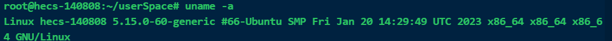

# Ubuntu基础操作（华为云操作留痕）

[toc]

## 命令

### 系统相关

有时候我们`安装软件`或者`搭建服务`的时候，需要了解`当前系统的版本信息`，下面几个命令可以帮助我们查看当前`ubuntu系统`的`版本信息`。

#### 一

```shell
cat /proc/version
```


> ```shell
> #linux内核版本号
> Linux version 5.15.0-60-generic (buildd@lcy02-amd64-054) 
> #gcc编译器版本号 =>       
> gcc version 11.3.0 
> #Ubuntu版本号
> Ubuntu 11.3.0-1ubuntu1~22.04       				       	
> ```

#### 二

```shell
uname -a
```



> 显示`linux`的`内核版本`和`系统`是`多少位`的：`X86_64`代表`系统`是`64位`的。

#### 三

```shell
lsb_release -a
```


> 这个命令显示的比较简洁，解释如下:
>
> ```shell
> #类别是ubuntu
> Distributor ID: Ubuntu
> 
> #22年4月1月发布的稳定版本
> #LTS是Long Term Support：长时间支持版本  三年 ，一般是18个月
> Description:    Ubuntu 22.04.1 LTS
> 
> #发行日期或者是发行版本号
> Release:        22.04 
> 
> #ubuntu的代号名称
> Codename:       jammy 
> ```

### 文件夹相关

```shell
#回到用户目录
cd ~

#新建文件夹
mkdir 文件夹名称
#例如：mkdir userSpace    新建了一个userSpace目录

#查看当前目录的文件
ls

#重命名文件夹(当前目录)
mv 旧的文件名/ 新文件夹名/

#进入指定文件夹
cd 文件夹名称

#删除文件夹
rmdir 文件夹名
```

### 文件相关

```shell
#新建文件
touch 文件
#例如 touch readMe.txt

#查看文本文件内容
cat readMe.txt
```

#### 基于vim的文件操作

```shell
#打开文件或新建打开文件
vim readMe.txt
#若当前目录readMe.txt不存在则会新建

#只读文件，不做其他操作
vim -R readMe.txt
```

> 其他操作请见 ==[vim操作手册](./2_vim操作手册.md)== (`typroa`按住`Ctrl`点击链接打开)

### 其他

```shell
#清空终端输出
clear
```

