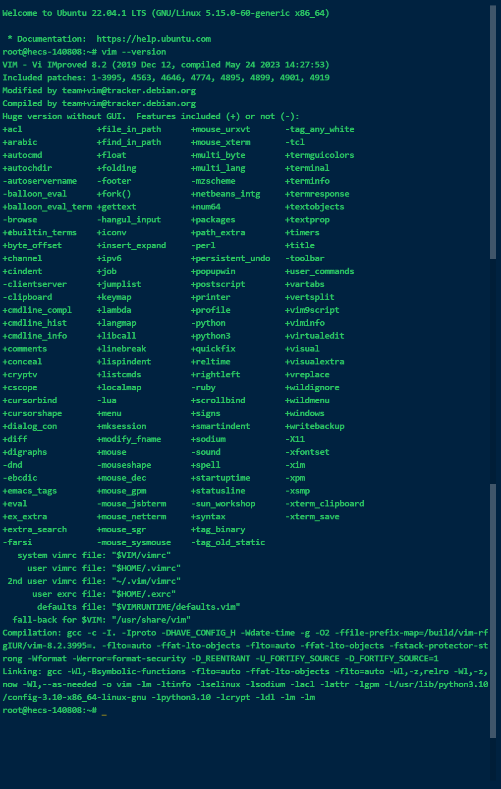
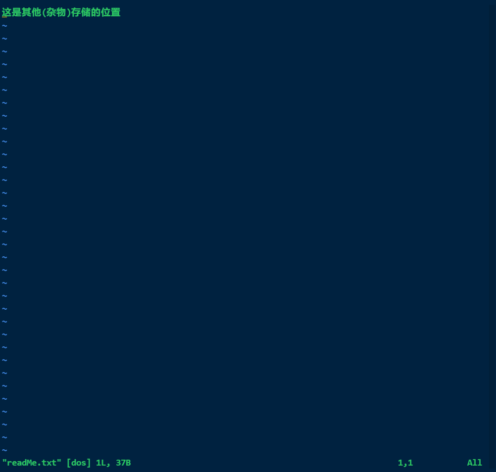
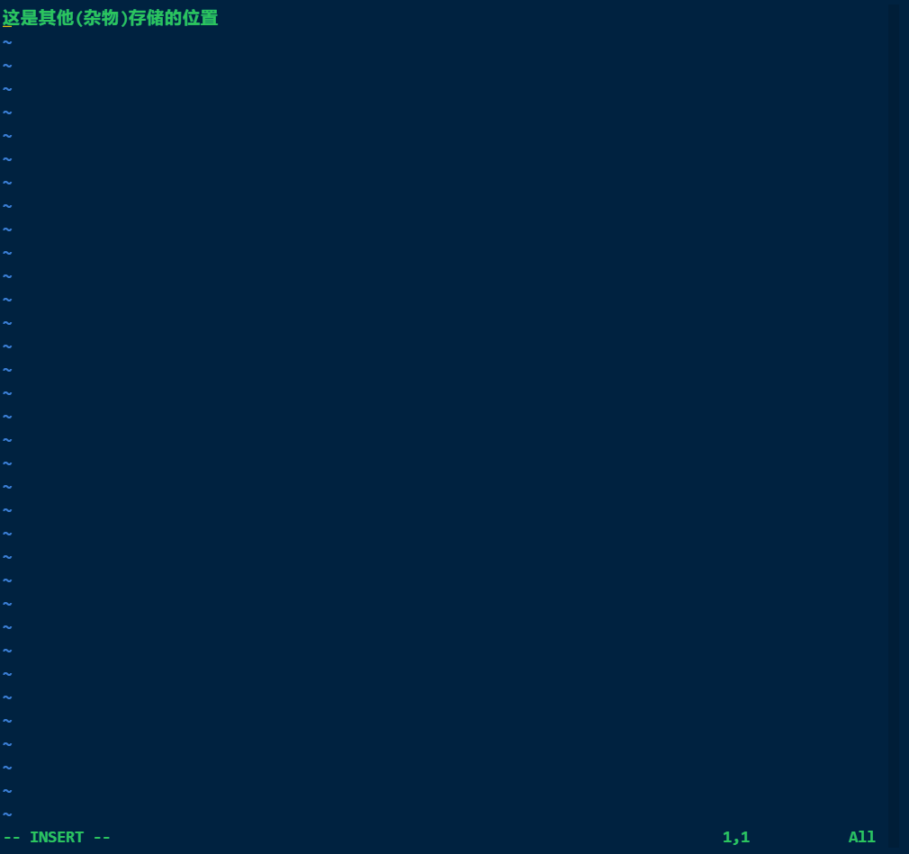

# Vim基础操作手册（Ubuntu）

[toc]

## 安装

在 `Ubuntu` 中，安装 `Vim` 可以使用 `apt` 命令，该命令可以从`系统的软件源`中**安装**`软件包`。您可以通过以下命令安装` Vim`：

```shell
#更新系统中的程序（本地重新与软件源中的比对）
sudo apt update

#安装vim
sudo apt install vim
```

这将从 `Ubuntu` 软件源下载并安装 `Vim`。

**检查是否安装成功**

```shell
vim --version
```



如果出现`vim版本`和`运行情况`，说明`已经存在vim`程序。否说明没有安装`vim`程序,参考`vim 安装文档`进行安装。

## 基本配置

**运行**

```shell
sudo vim /etc/vim/vimrc
```

打开`vim`的`配置文件`，如下图

## 使用

### 创建或打开文件（普通模式）

```shell
vim 文件名

#例如
#vim readMe.txt
#如果存在vimEditorFile文件，则打开文件，如果不存在则在内存中创建一个vimEditorFile.txt文件，没有进行保存文件是不存在的

"set number
"set autoindent
"set cursorline
"set ruler
"set tabstop=4
```



### 编辑文本（插入模式）

```shell
按下 i 进入编辑，此时在窗体最底部会出现 -- INSERT -- 
```



> **`普通模式` ==> `插入模式`**
>
> 进入`vi/vim`后按字母“`i`”或“`I`”即可进入**编辑**状态(**`插入模式`**),另外还可以用`a` 或` A`命令，`o` 或 `O`命令；他们的区别在于：
>
> | **a** |  在当前光标位置后面开始插入  |
> | :---: | :--------------------------: |
> | **A** |     在当前行行末开始插入     |
> | **i** |   **在当前光标前开始插入**   |
> | **I** | **在当前光标行行首开始插入** |
> | **o** | 从当前光标开始下一行开始插入 |
> | **O** | 从当前光标开始前一行开始插入 |

### 退出

`退出`的时候分为4种情况：

1. **`保存退出`**
   - 按“`Esc`”键后 此时的“`插入`”会`消失`，再`输入`“`：`”之后在`输入命令`时直接输入“`wq`”；也可以用`快捷键`按`Shift+zz` 就可以**保存修改内容并退出**。
2. **`正常退出`**
3. **`不保存退出`**
   - 当修改修改了一部分内容后发现修改错了，此时就会进行`不保存退出`按“`Esc`”键后，再输入“`：`”之后在`输入命令`时直接输入“`q`” 。
4. **`强制退出`**
   -  按“`Esc`”键后，再输入“`：`”之后在`输入命令`时直接输入“`q!`”。


|   **命令**   |               **说明**               |
| :----------: | :----------------------------------: |
|      :w      |               `保存 `                |
|    **:q**    |  `正常退出`，即退出未被编辑过的文件  |
|      :!      |              覆盖原文件              |
|   **:q!**    |  `强行退出` ，即丢弃所做改动并退出   |
|   **:wq**    | `保存退出` ，即保存修改内容并退出vim |
| **shift+ZZ** |             等同于`:wq`              |

> 其他参考 [Ctrl + 点击](https://blog.csdn.net/yiweii/article/details/107544881)


