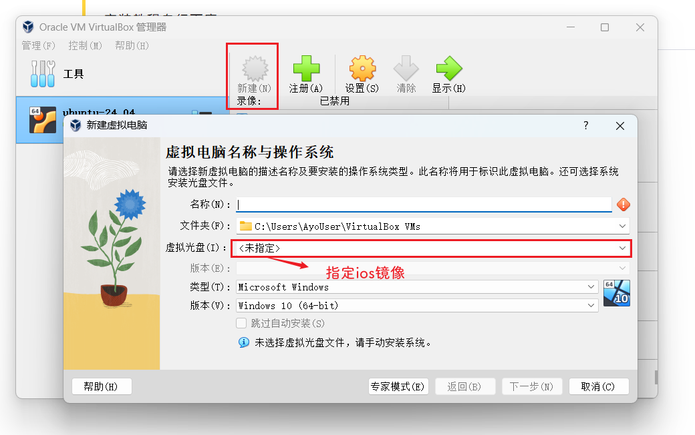

## 1.安装Oracle VM VirtualBox

下载地址：https://www.virtualbox.org/wiki/Downloads

> 安装教程自行百度

## 2.下载ubuntu镜像

自己去官网下载或者找国内的镜像下载

推荐国内的镜像下载地址有

1. 网易：https://mirrors.163.com/
2. USTC：https://mirrors.ustc.edu.cn/
3. 阿里：https://developer.aliyun.com/mirror/
4. 清华：https://mirrors.tuna.tsinghua.edu.cn/

## 3.Oracle VM VirtualBox内安装镜像



基本上全程无脑操作

## 4.SSH访问虚拟机设置

有时我们需要在宿主机（host）中用SecureCRT或Xshell等软件SSH连接到虚拟机，但是会发现SSH无法连接到虚拟机，如何解决这个问题？

参考VirtualBox给出的文档，VirutalBox的网络类型有6种，新建的虚拟机默认设置是“`网络地址转换（NAT）`”，这种方式支持虚拟机（guest）之间互相连通，支持`虚拟机`连接到`宿主机`（host）和Internet（如果宿主机已连接至Internet的话），但是**宿主机或Internet连接到虚拟机要配置端口转发**。默认情况下虚拟机没有配置端口转发，从而导致宿主机无法连接到虚拟机。

“`仅主机（Host-Only）网络`”这种方式支持虚拟机之间、虚拟机到宿主机、宿主机到虚拟机的连通，如果虚拟机不需要连接到Internet，可以采用这种方式。

| Bridged Adapter模式  | **NAT模式**            | **Internal模式**                             | **Host-only Adapter模式** |                                          |
| -------------------- | ---------------------- | -------------------------------------------- | ------------------------- | ---------------------------------------- |
| **虚拟机与宿主机**   | 处于同一网段，彼此互通 | 虚拟机能访问宿主机；宿主机不能访问虚拟机     | 彼此不通                  | 虚拟机能访问宿主机；宿主机不能访问虚拟机 |
| **虚拟机与虚拟机**   | 处于同一网段，彼此互通 | 彼此不通                                     | 彼此互通，处于同一网段    | 彼此互通，处于同一网段                   |
| **虚拟机与其他主机** | 处于同一网段，彼此互通 | 虚拟机能访问其他主机；其他主机不能访问虚拟机 | 彼此不通                  | 彼此不通；需要设置                       |
| **虚拟机与互联网**   | 虚拟机可以上网         | 虚拟机可以上网                               | 虚拟机不能上网            | 彼此不通；需要设置                       |


### 虚拟机开启两个网卡


### 网络配置

启动虚拟机查看网卡情况

```shell
rockfane@ubuntu:~$ ip a
1: lo: <LOOPBACK,UP,LOWER_UP> mtu 65536 qdisc noqueue state UNKNOWN group default qlen 1000
    link/loopback 00:00:00:00:00:00 brd 00:00:00:00:00:00
    inet 127.0.0.1/8 scope host lo
       valid_lft forever preferred_lft forever
    inet6 ::1/128 scope host
       valid_lft forever preferred_lft forever
2: enp0s3: <BROADCAST,MULTICAST,UP,LOWER_UP> mtu 1500 qdisc fq_codel state UP group default qlen 1000
    link/ether 08:00:27:e5:a3:29 brd ff:ff:ff:ff:ff:ff
    inet 10.0.2.15/24 brd 192.168.10.255 scope global dynamic enp0s3
       valid_lft 557sec preferred_lft 557sec
    inet6 fe80::a00:27ff:fee5:a329/64 scope link
       valid_lft forever preferred_lft forever
3: enp0s8: <BROADCAST,MULTICAST> mtu 1500 qdisc noop state DOWN group default qlen 1000
    link/ether 08:00:27:82:5d:3e brd ff:ff:ff:ff:ff:ff
```

发现只有一张网卡在工作，此时`enp0s8`未进行工作

>Ubuntu 18.04 LTS 之后的版本都改用 Netplan 来管理网络配置
>
>Netplan默认配置文件在`/etc/netplan`目录下

进入到目录`/etc/netplan`


此时发现`/etc/netplan`下只有`50-cloud-init.yaml`文件（ps:有些教程说的是修改`00-installer-config.yaml`,/etc/netplan下正常只有一个yaml，直接修改对应yaml就行，每个系统的yaml文件名称可能不一样）,修改`50-cloud-init.yaml`文件

```shell
sudo vim /etc/netplan/50-cloud-init.yaml
```


```shell
#配置一 => 需要执行添加默认路由网关的命令（参考ping8.8.8.8）
network:
    ethernets:
        enp0s3:
            dhcp4: false
            addresses: [10.0.2.16/24]  #配置静态ip
        enp0s8: 
            dhcp4: true
    version: 2
#配置二
network:
  ethernets:
    enp0s3:
      dhcp4: false
      addresses:
        - 10.0.2.16/24
      nameservers:
        addresses:
          - 114.114.114.114
          - 8.8.8.8
      routes:
        - to: 0.0.0.0/0
          via: 10.0.2.2
          metric: 100
    enp0s8:
      dhcp4: true
  version: 2

# <gateway-ip> 应替换为 enp0s3 接口对应的网关IP地址。网关IP地址通常是你的路由器或网络设备的IP地址。
#metric 是可选的，它可以用来设定路由优先级，如果有多个路由到相同目的地。
```

>仅主机网卡只配置静态ip保证与物理机互联
>
>NAT网卡直接从DHCP服务器获取地址

重启网络

```shell
sudo netplan apply
```

再次查看网络状态

```shell
ip addr
1: lo: <LOOPBACK,UP,LOWER_UP> mtu 65536 qdisc noqueue state UNKNOWN group default qlen 1000
    link/loopback 00:00:00:00:00:00 brd 00:00:00:00:00:00
    inet 127.0.0.1/8 scope host lo
       valid_lft forever preferred_lft forever
    inet6 ::1/128 scope host
       valid_lft forever preferred_lft forever
2: enp0s3: <BROADCAST,MULTICAST,UP,LOWER_UP> mtu 1500 qdisc fq_codel state UP group default qlen 1000
    link/ether 08:00:27:e5:a3:29 brd ff:ff:ff:ff:ff:ff
    inet 10.0.2.16/24 brd 192.168.10.255 scope global enp0s3
       valid_lft forever preferred_lft forever
    inet6 fe80::a00:27ff:fee5:a329/64 scope link
       valid_lft forever preferred_lft forever
3: enp0s8: <BROADCAST,MULTICAST,UP,LOWER_UP> mtu 1500 qdisc fq_codel state UP group default qlen 1000
    link/ether 08:00:27:82:5d:3e brd ff:ff:ff:ff:ff:ff
    inet 192.168.56.102/24 brd 10.0.3.255 scope global dynamic enp0s8
       valid_lft 82987sec preferred_lft 82987sec
    inet6 fe80::a00:27ff:fe82:5d3e/64 scope link
       valid_lft forever preferred_lft forever
```

两张网卡都在工作

### 验证

>  物理机ip: 192.168.0.4

##### 虚拟机和物理机通信

```shell
root@ayoubuntu:~# ping 192.168.0.4
PING 192.168.0.4 (192.168.0.4) 56(84) bytes of data.
64 bytes from 192.168.0.4: icmp_seq=1 ttl=127 time=1.96 ms
64 bytes from 192.168.0.4: icmp_seq=2 ttl=127 time=2.01 ms
64 bytes from 192.168.0.4: icmp_seq=3 ttl=127 time=1.66 ms
64 bytes from 192.168.0.4: icmp_seq=4 ttl=127 time=1.77 ms
64 bytes from 192.168.0.4: icmp_seq=5 ttl=127 time=1.93 ms
64 bytes from 192.168.0.4: icmp_seq=6 ttl=127 time=1.53 ms
```

## 5.配置SSH

首先需要检查 SSH 是否已在 Ubuntu 上安装。SSH 是一个常见的工具，通常在 Ubuntu 默认安装中包含它。你可以通过运行以下命令在终端中检查 SSH 是否已安装：

```shell
sudo apt list openssh-server
```

如果输出中显示 "installed"，则表示 SSH 已安装。否则，你可以使用以下命令安装 SSH：

```vbscript
sudo apt install openssh-server
```

安装好以后，ssh server应该已经开始运行了，可以用下面的命令检查ssh server的状态

```lua
systemctl status sshd
```

> 如果`systemctl status sshd`报错`Unit sshd.service could not be found`,使用以下命令来查看正确服务名信息
>
> ```shell
> systemctl list-unit-files | grep ssh
> ```
>
> 
>
> 
>
> 可以发现`sshd.service`未开启，使用以下命令将其开启
>
> ```shell
> sudo systemctl start sshd.service
> ```


如图，可以看到状态是`active(running）`

另外，需要的时候，还可以利用`systemctl`命令打开(start)/关闭(stop)/重启(restart)ssh server，例如下面的命令就可以用来`重启ssh server服务`

```shell
sudo systemctl restart ssh
```

利用Ubuntu自带的`ufw` 修改防火墙状态

首先开启防火墙

```shell
sudo ufw enable
```


打开传输ssh的端口（默认22） 

```shell
sudo ufw allow ssh
```

设置ssh server开机启动 

```shell
sudo systemctl enable ssh
```


现在就可以用 ssh username@IP远程连接电脑了

查询IP地址

```shell
ip a
```

这里的10.0.2.16即为电脑IP，192.168.56.102为ssh连接的地址


到上一步为止，其实已经可以实现连接功能了，但是为了安全着想，最好将ssh的端口从默认的22改为另一个大于1024的数字

编辑`ssh server`配置文件

```shell
sudo vim /etc/ssh/sshd_config
```

在配置文件中找到 "Port" 行，并更改端口号。例如，你可以将端口号更改为 2222：

```shell
Port 2222
```

保存更改并退出配置文件。然后，重新启动 SSH 服务以使更改生效：

```shell
sudo systemctl restart ssh
```

### 验证连接

使用ssh工具连接

### 允许 root 用户 SSH 登录

1. **编辑 SSH 配置文件**： 使用任何文本编辑器（如 nano 或 vim）打开 SSH 服务器的配置文件 `/etc/ssh/sshd_config`：

    ```
    sudo nano /etc/ssh/sshd_config
    ```

2. **找到 PermitRootLogin 行**： 在配置文件中找到 `PermitRootLogin` 一行，默认情况下这一行通常被注释掉或者设为 `prohibit-password`。

3. **修改 PermitRootLogin 为 yes**： 将 `PermitRootLogin` 修改为 `yes`，表示允许 root 用户通过 SSH 登录。如果这一行原本不存在，可以直接添加：

    ```
    PermitRootLogin yes
    ```

4. **保存并关闭文件**： 在 nano 中，按 `Ctrl + X`，然后输入 `Y` 保存更改，最后按 `Enter` 确认文件名。

5. **重启 SSH 服务**： 使更改生效，重新启动 SSH 服务：

    ```
    sudo systemctl restart ssh
    ```

现在，root 用户应该能够通过 SSH 登录到你的 Ubuntu 20.04 系统了。请注意，这样做会增加系统受到暴力攻击的风险，因此只在必要时才应该允许 root 用户直接登录。

## 6.问题

#### 1）ping8.8.8.8

```shell
ping 8.8.8.8
ping: connect: Network is unreachable

或者

ping 8.8.8.8
PING 8.8.8.8 (8.8.8.8) 56(84) bytes of data.
From 192.168.56.102 icmp_seq=1 Destination Host Unreachable
From 192.168.56.102 icmp_seq=3 Destination Host Unreachable
From 10.0.2.16 icmp_seq=2 Destination Host Unreachable
From 192.168.56.102 icmp_seq=4 Destination Host Unreachable
From 192.168.56.102 icmp_seq=5 Destination Host Unreachable
From 192.168.56.102 icmp_seq=6 Destination Host Unreachable
```

`Destination Host Unreachable` 的消息表明你的计算机无法到达目标地址 `8.8.8.8`，通常由网络配置问题引起。

运行 `ip link` 命令确认网络适配器是否处于 `UP` 状态

```shell
root@ayoubuntu:/etc/netplan# ip link
1: lo: <LOOPBACK,UP,LOWER_UP> mtu 65536 qdisc noqueue state UNKNOWN mode DEFAULT group default qlen 1000
    link/loopback 00:00:00:00:00:00 brd 00:00:00:00:00:00
2: enp0s3: <BROADCAST,MULTICAST,UP,LOWER_UP> mtu 1500 qdisc pfifo_fast state UP mode DEFAULT group default qlen 1000
    link/ether 08:00:27:0a:69:10 brd ff:ff:ff:ff:ff:ff
3: enp0s8: <BROADCAST,MULTICAST,UP,LOWER_UP> mtu 1500 qdisc pfifo_fast state UP mode DEFAULT group default qlen 1000
    link/ether 08:00:27:bc:c5:1c brd ff:ff:ff:ff:ff:ff
```

`ip link` 输出，你的系统有两个网络适配器：`enp0s3` 和 `enp0s8`。

- `enp0s3` 是 NAT 网络适配器，通常用于连接到主机的默认网络。它的状态为 `UP`，说明网络连接是正常的。
- `enp0s8` 是另一个网络适配器，可能是一个 Host-Only 或者 Bridged 网络适配器，也处于 `UP` 状态。

根据之前的 `ping 8.8.8.8` 输出显示了 `Destination Host Unreachable` 错误，这可能是由于网络配置问题导致的。

**确认默认网关设置**：

- 运行 `ip route show` 确认默认路由（网关）的设置是否正确。默认情况下，它应该指向你的 NAT 网络适配器的 IP 地址，通常是类似 `10.0.2.2` 的地址。

```shell
#没有设置默认路由
root@ayoubuntu:/etc/netplan# ip route show
10.0.2.0/24 dev enp0s3 proto kernel scope link src 10.0.2.16 
192.168.56.0/24 dev enp0s8 proto kernel scope link src 192.168.56.102 metric 100 

或者
#############
#默认路由设置了两条，造成问题的原因。一般来说，应该只有一条默认路由，而不是两条。这可能导致系统无法正确选择出口接口。
ip route show
default via 192.168.56.0 dev enp0s8 
default via 10.0.2.0 dev enp0s3 
10.0.2.0/24 dev enp0s3 proto kernel scope link src 10.0.2.16 
192.168.56.0/24 dev enp0s8 proto kernel scope link src 192.168.56.102 metric 100 
##############
```

**删除无效的默认路由**： 使用 `ip route del` 命令删除无效的默认路由。例如：

```
sudo ip route del default via 192.168.56.0 dev enp0s8
sudo ip route del default via 10.0.2.0 dev enp0s3
```

**添加正确的默认路由**： 添加正确的默认路由，将所有流量发送到正确的网关。例如，如果你的默认网关是 `10.0.2.2`，则添加如下路由：

```
sudo ip route add default via 10.0.2.2 dev enp0s3
```

**验证路由表**： 使用 `ip route show` 确认路由表已经更新，只有一条正确的默认路由。

```shell
root@ayoubuntu:/etc/netplan# ip route show
default via 10.0.2.2 dev enp0s3 
10.0.2.0/24 dev enp0s3 proto kernel scope link src 10.0.2.16 
192.168.56.0/24 dev enp0s8 proto kernel scope link src 192.168.56.102 metric 100 
```

测试 `ping 8.8.8.8`

```shell
root@ayoubuntu:/etc/netplan# ping 8.8.8.8
PING 8.8.8.8 (8.8.8.8) 56(84) bytes of data.
64 bytes from 8.8.8.8: icmp_seq=1 ttl=112 time=27.2 ms
64 bytes from 8.8.8.8: icmp_seq=2 ttl=112 time=34.0 ms
64 bytes from 8.8.8.8: icmp_seq=3 ttl=112 time=27.3 ms
64 bytes from 8.8.8.8: icmp_seq=4 ttl=112 time=29.0 ms

--- 8.8.8.8 ping statistics ---
4 packets transmitted, 4 received, 0% packet loss, time 3005ms
rtt min/avg/max/mdev = 27.246/29.391/34.023/2.764 ms
```

#### 2)ping www.baidu.com

```shell
root@ayoubuntu:/etc/netplan# ping www.baidu.com
ping: www.baidu.com: Temporary failure in name resolution
```

修改/etc/netplan/50-cloud-init.yaml，添加dns解析

```shell
sudo vim /etc/netplan/50-cloud-init.yaml
```

```yaml
network:
  ethernets:
    enp0s3:
      dhcp4: false
      addresses:
        - 10.0.2.16/24
      nameservers:
      	#设置dns
        addresses:
          - 114.114.114.114
          - 8.8.8.8
    enp0s8:
      dhcp4: true
  version: 2
```

重启网络

```shell
sudo netplan apply
```

回到ping8.8.8.8的问题上，发现又ping不了了，原因就是没有设置默认路由

- 运行 `ip route show` 确认默认路由（网关）的设置是否正确。默认情况下，它应该指向你的 NAT 网络适配器的 IP 地址，通常是类似 `10.0.2.2` 的地址。

```shell
#没有设置默认路由
root@ayoubuntu:/etc/netplan# ip route show
10.0.2.0/24 dev enp0s3 proto kernel scope link src 10.0.2.16 
192.168.56.0/24 dev enp0s8 proto kernel scope link src 192.168.56.102 metric 100 

或者
#############
#默认路由设置了两条，造成问题的原因。一般来说，应该只有一条默认路由，而不是两条。这可能导致系统无法正确选择出口接口。
ip route show
default via 192.168.56.0 dev enp0s8 
default via 10.0.2.0 dev enp0s3 
10.0.2.0/24 dev enp0s3 proto kernel scope link src 10.0.2.16 
192.168.56.0/24 dev enp0s8 proto kernel scope link src 192.168.56.102 metric 100 
##############
```

**删除无效的默认路由**： 使用 `ip route del` 命令删除无效的默认路由。例如：

```
sudo ip route del default via 192.168.56.0 dev enp0s8
sudo ip route del default via 10.0.2.0 dev enp0s3
```

**添加正确的默认路由**： 添加正确的默认路由，将所有流量发送到正确的网关。例如，如果你的默认网关是 `10.0.2.2`，则添加如下路由：

```
sudo ip route add default via 10.0.2.2 dev enp0s3
```

**验证路由表**： 使用 `ip route show` 确认路由表已经更新，只有一条正确的默认路由。

```shell
root@ayoubuntu:/etc/netplan# ip route show
default via 10.0.2.2 dev enp0s3 
10.0.2.0/24 dev enp0s3 proto kernel scope link src 10.0.2.16 
192.168.56.0/24 dev enp0s8 proto kernel scope link src 192.168.56.102 metric 100 
```

测试

```shell
root@ayoubuntu:/etc/netplan# ping www.baidu.com
PING www.a.shifen.com (153.3.238.102) 56(84) bytes of data.
64 bytes from 153.3.238.102: icmp_seq=1 ttl=52 time=22.0 ms
64 bytes from 153.3.238.102: icmp_seq=2 ttl=52 time=22.2 ms
64 bytes from 153.3.238.102: icmp_seq=3 ttl=52 time=22.2 ms
64 bytes from 153.3.238.102: icmp_seq=4 ttl=52 time=25.1 ms
64 bytes from 153.3.238.102: icmp_seq=5 ttl=52 time=21.4 ms

--- www.a.shifen.com ping statistics ---
5 packets transmitted, 5 received, 0% packet loss, time 4014ms
rtt min/avg/max/mdev = 21.406/22.590/25.076/1.277 ms
```

