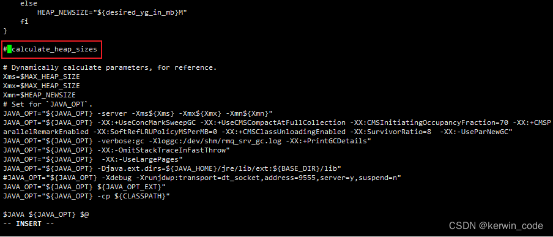
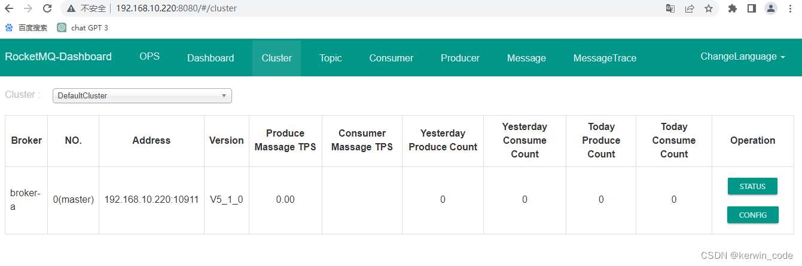

官网地址：https://rocketmq.apache.org/


## 镜像拉取

> 使用apache/rocketmq镜像包含NameServer+Broker+Proxy…

```sh
docker pull swr.cn-north-4.myhuaweicloud.com/ddn-k8s/docker.io/apache/rocketmq:5.3.0
docker tag  swr.cn-north-4.myhuaweicloud.com/ddn-k8s/docker.io/apache/rocketmq:5.3.0 rocketmq:5.3.0
docker rmi swr.cn-north-4.myhuaweicloud.com/ddn-k8s/docker.io/apache/rocketmq:5.3.0
```

## 部署NameServer

NameServer是一个简单的 `Topic` 路由注册中心，支持 `Topic`、`Broker` 的动态注册与发现，几乎无状态节点，因此可集群部署，节点之间无任何信息同步，所谓的集群部署和单机部署其实是一样的，需要多个NameServer保持高可用只需独立部署即可。

### 创建挂载文件夹

```powershell
# 日志目录
mkdir /home/docker_volume/rockermq/nameserver/logs -p
# 脚本目录
mkdir /home/docker_volume/rockermq/nameserver/bin -p
```

设置权限：如果不设置会导致NameServer容器内部无法写`日志文件`

```powershell
# 777 文件所属者、文件所属组和其他人有读取 & 写入 & 执行全部权限。rwxrwxrwx
chmod 777 -R /home/docker_volume/rockermq/nameserver/*
```

### 创建挂载文件

NameServer启动脚本中有一个自动计算最大堆内存和新生代内存的函数会导致在不同硬件环境下设置最大堆内存和新生代内存环境变量不被应用，这里先提前copy一份容器内部启动脚本做挂载，如果想自定义内存可以自己调整。

1、启动容器

```powershell
docker run -d \
--privileged=true \
--name rmqnamesrv \
rocketmq:5.3.0 sh mqnamesrv
```

2、复制容器内启动脚本到挂载目录/home/docker_volume/rockermq/nameserver/bin

```powershell
docker cp rmqnamesrv:/home/rocketmq/rocketmq-5.3.0/bin/runserver.sh /home/docker_volume/rockermq/nameserver/bin/runserver.sh
```

3、修改runserver.sh

```powershell
# 打开脚本文件
vi /home/docker_volume/rockermq/nameserver/bin/runserver.sh 
```

找到调用`calculate_heap_sizes`函数的位置注释掉保存即可，拉到脚本最底部就能找到

> ### 注释掉 `calculate_heap_sizes` 的影响
>
> 1. **固定堆参数**：
>     - 由于 `calculate_heap_sizes` 被注释掉了，`Xms`、`Xmx` 和 `Xmn` 这些变量的值将直接从环境变量 `MAX_HEAP_SIZE` 和 `HEAP_NEWSIZE` 获取，而不是通过动态计算得到。
>     - 这意味着堆的初始大小 (`-Xms`)、最大大小 (`-Xmx`) 和新生代大小 (`-Xmn`) 将始终保持固定的值，这些值由环境变量决定。
> 2. **灵活性降低**：
>     - 动态计算堆参数可以使得应用程序更好地适应不同的运行环境和负载情况。注释掉 `calculate_heap_sizes` 后，这些参数变得固定，可能无法最优地利用系统资源。
> 3. **调试和测试**：
>     - 注释掉 `calculate_heap_sizes` 可能是为了简化调试或测试过程。在某些情况下，使用固定的堆参数可以更容易地重现问题或进行性能测试。
> 4. **部署一致性**：
>     - 在某些生产环境中，使用固定的堆参数可以确保每次启动时的配置一致，避免因动态计算带来的不确定性。
>
> ### 总结
>
> 注释掉 `calculate_heap_sizes` 通常是为了在特定场景下使用固定的堆参数，这样可以简化调试、测试或确保部署的一致性。如果你需要恢复动态计算堆参数的功能，可以取消注释 `calculate_heap_sizes` 并确保该函数正确实现。


4、停止&删除容器

```powershell
docker stop rmqnamesrv
docker rm rmqnamesrv
```

### 启动NameServer

```powershell
sudo docker run -d \
--privileged=true \
--restart=always \
--name rmqnamesrv \
-p 9876:9876  \
-v /home/docker_volume/rockermq/nameserver/logs:/home/rocketmq/logs \
-v /home/docker_volume/rockermq/nameserver/bin/runserver.sh:/home/rocketmq/rocketmq-5.3.0/bin/runserver.sh \
-e "MAX_HEAP_SIZE=256M" \
-e "HEAP_NEWSIZE=128M" \
rocketmq:5.3.0 sh mqnamesrv
```


- 参数说明

注意个别参数有两个减号

|                             参数                             |                             说明                             |
| :----------------------------------------------------------: | :----------------------------------------------------------: |
|                              -d                              |                     以守护进程的方式启动                     |
|                       –restart=always                        |                  docker重启时候容器自动重启                  |
|                       –name rmqnamesrv                       |                 把容器的名字设置为rmqnamesrv                 |
|                         -p 9876:9876                         | 把容器内的端口9876挂载到宿主机9876上面，宿主机端口:容器内部端口 |
| -v /home/docker_volume/rockermq/nameserver/logs:/home/rocketmq/logs |                        挂载容器内日志                        |
| -v /home/docker_volume/rockermq/nameserver/bin/runserver.sh:/home/rocketmq/rocketmq-5.1.0/bin/runserver.sh |                         挂载启动脚本                         |
|                   -e “MAX_HEAP_SIZE=256M”                    |                设置最大堆内存和堆内存初始大小                |
|                    -e “HEAP_NEWSIZE=128M”                    |                      设置新生代内存大小                      |
|                        rocketmq:5.3.0                        |                     使用的镜像名称+版本                      |
|                         sh mqnamesrv                         |                       启动namesrv服务                        |

## 部署Broker

### 创建需要映射的文件夹和文件

#### 创建的挂载文件夹

提前创建挂载目录用于挂载容器内部数据、配置文件、以及日志。

```powershell
# 创建需要的挂载目录
mkdir /home/docker_volume/rockermq/broker/logs -p \
mkdir /home/docker_volume/rockermq/broker/data -p \
mkdir /home/docker_volume/rockermq/broker/conf -p \
mkdir /home/docker_volume/rockermq/broker/bin -p
```

设置权限

```powershell
# 777 文件所属者、文件所属组和其他人有读取 & 写入 & 执行全部权限。rwxrwxrwx
chmod 777 -R /home/docker_volume/rockermq/broker/*
```

#### 创建broker.conf文件

在/home/docker_volume/rockermq/broker/conf文件夹下创建broker.conf文件

```powershell
vi /home/docker_volume/rockermq/broker/conf/broker.conf
```

添加以下配置信息到broker.conf，这里不对参数做过多的说明，在下面Broker配置详解中有对Broker常用参数做详细介绍

```powershell
# nameServer 地址多个用;隔开 默认值null
# 例：127.0.0.1:6666;127.0.0.1:8888 
namesrvAddr = 192.168.56.102:9876
# 集群名称
brokerClusterName = DefaultCluster
# 节点名称
brokerName = broker-a
# broker id节点ID， 0 表示 master, 其他的正整数表示 slave，不能小于0 
brokerId = 0
# Broker服务地址	String	内部使用填内网ip，如果是需要给外部使用填公网ip
brokerIP1 = 192.168.56.102
# Broker角色
brokerRole = ASYNC_MASTER
# 刷盘方式
flushDiskType = ASYNC_FLUSH
# 在每天的什么时间删除已经超过文件保留时间的 commit log，默认值04
deleteWhen = 04
# 以小时计算的文件保留时间 默认值72小时
fileReservedTime = 72
# 是否允许Broker 自动创建Topic，建议线下开启，线上关闭
autoCreateTopicEnable=true
# 是否允许Broker自动创建订阅组，建议线下开启，线上关闭
autoCreateSubscriptionGroup=true
```

> 说明：建立`broker.conf`文件，通过这个文件`把RocketMQ`的`broker`管理起来

#### 拷贝容器内Broker启动脚本到宿主机（如果不需要自定义堆内存可以跳过）

Broker启动脚本中有一个自动计算最大堆内存和新生代内存的函数会导致在不同硬件环境下设置最大堆内存和新生代内存环境变量不被应用，这里先提前copy一份容器内部启动脚本做挂载，如果想自定义内存可以自己调整。

1、启动容器

```powershell
docker run -d \
--name rmqbroker \
--privileged=true \
rocketmq:5.3.0 \
sh mqbroker
```

2、复制容器内启动脚本到挂载目录/home/docker_volume/rockermq/nameserver/bin

```powershell
docker cp rmqbroker:/home/rocketmq/rocketmq-5.3.0/bin/runbroker.sh /home/docker_volume/rockermq/broker/bin/runbroker.sh
```

3、修改runbroker.sh

```powershell
# 打开脚本文件
vi /home/docker_volume/rockermq/broker/bin/runbroker.sh 
```

找到调用`calculate_heap_sizes`函数的位置`注释掉`保存即可，拉到脚本最底部就能找到


4、停止&删除容器

```powershell
docker stop rmqbroker
docker rm rmqbroker
```

### 启动Broker

```powershell
docker run -d \
--restart=always \
--name rmqbroker \
-p 10911:10911 -p 10909:10909 \
--privileged=true \
-v /home/docker_volume/rockermq/broker/logs:/root/logs \
-v /home/docker_volume/rockermq/broker/store:/root/store \
-v /home/docker_volume/rockermq/broker/conf/broker.conf:/home/rocketmq/broker.conf \
-v /home/docker_volume/rockermq/broker/bin/runbroker.sh:/home/rocketmq/rocketmq-5.3.0/bin/runbroker.sh \
-e "MAX_HEAP_SIZE=512M" \
-e "HEAP_NEWSIZE=256M" \
rocketmq:5.3.0 \
sh mqbroker -c /home/rocketmq/broker.conf
```


- 参数说明

注意个别参数有两个减号

|                             参数                             |                             说明                             |
| :----------------------------------------------------------: | :----------------------------------------------------------: |
|                              -d                              |                     以守护进程的方式启动                     |
|                       –restart=always                        |                  docker重启时候容器自动重启                  |
|                       –name rmqbroker                        |                 把容器的名字设置为rmqbroker                  |
|                        -p 10911:10911                        | 把容器内的端口10911 挂载到宿主机10911 上面，宿主机端口:容器内部端口 |
|                        -p 10909:10909                        | 把容器内的端口10909 挂载到宿主机10909 上面，宿主机端口:容器内部端口 |
|    -v /home/docker_volume/rockermq/broker/logs:/root/logs    |                        挂载容器内日志                        |
|   -v /home/docker_volume/rockermq/broker/store:/root/store   |                         挂载数据目录                         |
| -v /home/docker_volume/rockermq/broker/conf/broker.conf:/home/rocketmq/broker.conf |                       挂载启动配置文件                       |
| -v /home/docker_volume/rockermq/broker/bin/runbroker.sh:/home/rocketmq/rocketmq-5.1.0/bin/runbroker.sh |         挂载broker启动脚本，需要自己定义堆内存时使用         |
|                   -e “MAX_HEAP_SIZE=512M”                    |                设置最大堆内存和堆内存初始大小                |
|                    -e “HEAP_NEWSIZE=256M”                    |                      设置新生代内存大小                      |
|                    apache/rocketmq:5.1.0                     |                     使用的镜像名称+版本                      |
|          sh mqbroker -c /home/rocketmq/broker.conf           |              启动broker服务 使用自定义配置文件               |

### 防火墙允许端口访问

```sh
# 添加允许 9876 端口的规则：
sudo ufw allow 9876
sudo ufw allow 10911
sudo ufw allow 10909

# netstat -ntlp | grep 9876
```

## 部署Proxy

这里暂时不对Proxy进行部署，单机版本没必要，不使用Proxy和之前的4.x版本基本一致

## 部署RocketMQ控制台（rocketmq-dashboard）

### 镜像拉取

拉取最新版即可

```powershell
docker pull swr.cn-north-4.myhuaweicloud.com/ddn-k8s/docker.io/apacherocketmq/rocketmq-dashboard:1.0.0
docker tag  swr.cn-north-4.myhuaweicloud.com/ddn-k8s/docker.io/apacherocketmq/rocketmq-dashboard:1.0.0 rocketmq-dashboard:1.0.0
docker rmi swr.cn-north-4.myhuaweicloud.com/ddn-k8s/docker.io/apacherocketmq/rocketmq-dashboard:1.0.0
```

### 启动RocketMQ控制台（rocketmq-dashboard）

```powershell
docker run -d \
--restart=always \
--name rmqdashboard \
-e "JAVA_OPTS=-Xmx256M -Xms256M -Xmn128M -Drocketmq.namesrv.addr=192.168.56.102:9876 -Dcom.rocketmq.sendMessageWithVIPChannel=false" \
-p 8808:8080 \
rocketmq-dashboard:1.0.0
```



## Broker配置详解

```powershell
# nameServer 地址多个用;隔开 默认值null
# 例：127.0.0.1:6666;127.0.0.1:8888 
namesrvAddr = 127.0.0.1:6666
# 集群名称 单机配置可以随意填写，如果是集群部署在同一个集群中集群名称必须一致类似Nacos的命名空间
brokerClusterName = DefaultCluster
# broker节点名称 单机配置可以随意填写，如果是集群部署在同一个集群中节点名称不要重复
brokerName = broker-a
# broker id节点ID， 0 表示 master, 其他的正整数表示 slave，不能小于0 
brokerId = 0
# Broker 对外服务的监听端口 默认值10911
# 端口（注意：broker启动后，会占用3个端口，分别在listenPort基础上-2，+1，供内部程序使用，所以集群一定要规划好端口，避免冲突）
listenPort=10911
# Broker服务地址	String	内部使用填内网ip，如果是需要给外部使用填公网ip
brokerIP1 = 127.0.0.1
# BrokerHAIP地址，供slave同步消息的地址 内部使用填内网ip，如果是需要给外部使用填公网ip
brokerIP2 = 127.0.0.1

# Broker角色 默认值ASYNC_MASTER
# ASYNC_MASTER 异步复制Master，只要主写成功就会响应客户端成功，如果主宕机可能会出现小部分数据丢失
# SYNC_MASTER 同步双写Master，主和从节点都要写成功才会响应客户端成功，主宕机也不会出现数据丢失
# SLAVE
brokerRole = ASYNC_MASTER
# 刷盘方式
# SYNC_FLUSH（同步刷新）相比于ASYNC_FLUSH（异步处理）会损失很多性能，但是也更可靠，所以需要根据实际的业务场景做好权衡，默认值ASYNC_FLUSH
flushDiskType = ASYNC_FLUSH
# 在每天的什么时间删除已经超过文件保留时间的 commit log，默认值04
deleteWhen = 04
# 以小时计算的文件保留时间 默认值72小时
fileReservedTime = 72

# 消息大小 单位字节 默认1024 * 1024 * 4
maxMessageSize=4194304

# 在发送消息时，自动创建服务器不存在的Topic，默认创建的队列数，默认值4
defaultTopicQueueNums=4
# 是否允许Broker 自动创建Topic，建议线下开启，线上关闭
autoCreateTopicEnable=true
# 是否允许Broker自动创建订阅组，建议线下开启，线上关闭
autoCreateSubscriptionGroup=true

# 失败重试时间，默认重试16次进入死信队列，第一次1s第二次5s以此类推。
# 延时队列时间等级默认18个，可以设置多个比如在后面添加一个1d(一天)，使用的时候直接用对应时间等级即可,从1开始到18，如果添加了第19个直接使用等级19即可
messageDelayLevel=1s 5s 10s 30s 1m 2m 3m 4m 5m 6m 7m 8m 9m 10m 20m 30m 1h 2h

# 指定TM在20秒内应将最终确认状态发送给TC，否则引发消息回查。默认为60秒
transactionTimeout=20
# 指定最多回查5次，超过后将丢弃消息并记录错误日志。默认15次。
transactionCheckMax=5
# 指定设置的多次消息回查的时间间隔为10秒。默认为60秒。
transactionCheckInterval=10
```

```
rocketmq.NameServer.producer.group="springboot_producer_group"
```
