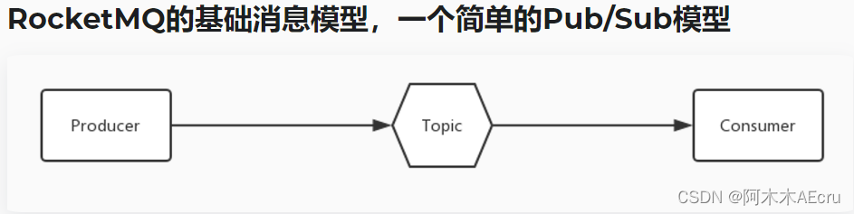
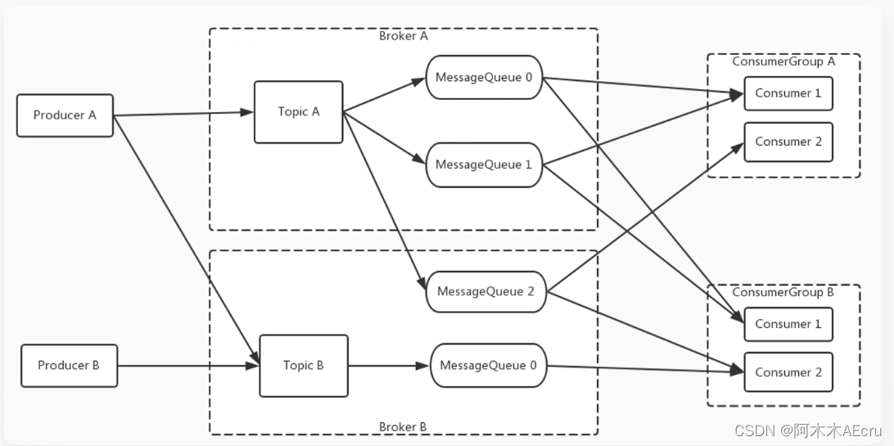
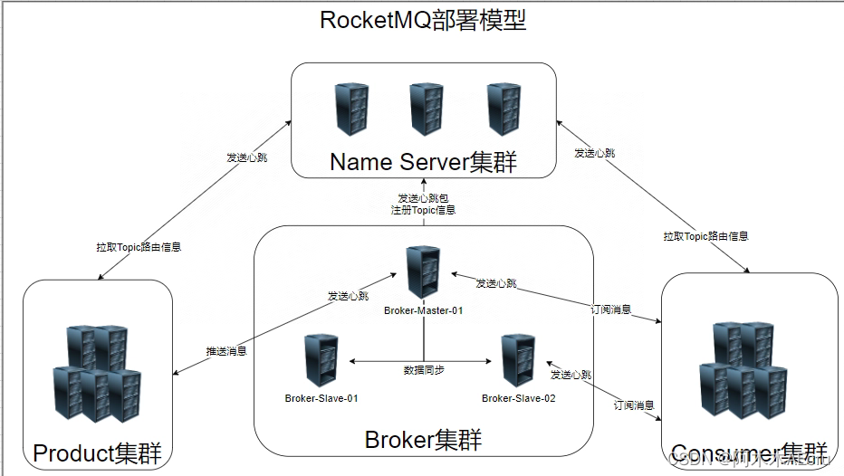

> 原文：https://blog.csdn.net/weixin_43336075/article/details/136358550

## 一、RocketMQ 介绍

### 1.1 发展史

RocketMQ是一个由[阿里巴巴](https://so.csdn.net/so/search?q=阿里巴巴&spm=1001.2101.3001.7020)开源的分布式消息中间件，具有高性能、高可靠、高实时和分布式等特点。它支持事务消息、顺序消息、批量消息、定时消息和消息回溯等功能。阿里在2016年底捐赠给Apache开源基金会成为孵化项目,2017年正式成为了Apache顶级项目。
Apache RocketMQ 自诞生以来，因其架构简单、业务功能丰富、具备极强可扩展性等特点被众多企业开发者以及云厂商广泛采用。历经十余年的大规模场景打磨，RocketMQ 已经成为业内共识的金融级可靠业务消息首选方案，被广泛应用于互联网、大数据、移动互联网、物联网等领域的业务场景。

### 1.2 基本概念


这是最基础的消息模型，一个生产者，一个消息主题，一个消费者。
扩展后的消息模型如下:

它拥有多个生产者，多个消息主题（每个主题中存在多个分区），两组消费者(每组中存在多个消费者)。

- 为了消息写入能力的水平扩展，在这里的消息主题中被进行了分区，也就是俗称的"队列"。
- 为了消费能力的水平扩展，ConsumerGroup “消费者组” 的概念诞生了，可以存在多个消费者组，而每个消费者组中又存在着多个消费者。如何提高消费能力呢，
    即广播模式，和集群模式。而图中使用的是集群模式。

这两种模式是有却别的

1. 广播模式: 使用这种模式时， 所有的Consumer都会消费到每个 队列 中消息。例如 “MessageQueue 0” 队列中存在一条消息为 “你好” ， 则所有 Consumer 都会消费到 “你好” 这条消息，相当于 村里的广播，一条消息，所有人都能听到。
2. 集群模式: 使用这种模式时，每个 ConsumerGroup 中的 Consumer 是负载均衡消费的，例如图中 ConsumerGroup A 中的 两个 Consumer 是监听消费了 不同的 MessageQueue 。

### 1.3 部署模型



- 每个 Broker 与 NameServer 集群中的所有节点建立长连接，定时注册 Topic 信息到所有 NameServer。
- Producer 与 NameServer 集群中的其中一个节点建立长连接，定期从 NameServer 获取Topic路由信息，并向提供 Topic 服务的 Master 建立长连接，且定时向 Master 发送心跳。Producer 完全无状态。
- Consumer 与 NameServer 集群中的其中一个节点建立长连接，定期从 NameServer 获取 Topic路由信息，并向提供 Topic 服务的 Master、Slave 建立长连接，且定时向 Master、Slave发送心跳。Consumer
    既可以从 Master 订阅消息，也可以从Slave订阅消息。

### 1.4 集群工作流程

1. 启动NameServer。NameServer启动后监听端口，等待Broker、Producer、Consumer连接，相当于一个路由控制中心。
2. 启动 Broker。与所有 NameServer 保持长连接，定时发送心跳包。心跳包中包含当前 Broker 信息以及存储所有 Topic 信息。注册成功后，NameServer 集群中就有 Topic跟Broker 的映射关系。
3. 创建 Topic 时需要指定该 Topic 要存储在哪些 Broker 上，也可以在发送消息时自动创建Topic。
4. 生产者发送消息。启动时先跟 NameServer 集群中的其中一台建立长连接，并从 NameServer 中获取当前发送的 Topic存在于哪些 Broker 上，轮询从队列列表中选择一个队列，然后与队列所在的 Broker建立长连接从而向 Broker发消息。
5. 消费者接受消息。跟其中一台NameServer建立长连接，获取当前订阅Topic存在哪些Broker上，然后直接跟Broker建立连接通道，然后开始消费消息。

### 1.5 优势及使用场景

#### 1.5.1 优势：

- 高性能：RocketMQ在消息的存储、传输和消费等各个环节都进行了优化，能够提供高性能的消息传递能力。
- 可靠性：RocketMQ采用了分布式架构，支持消息的持久化存储，具备高可靠性和数据安全性。
- 高吞吐量：RocketMQ支持集群部署，能够通过增加消费者和消息队列的方式来提高系统的吞吐量。
- 消息顺序性：RocketMQ支持消息的顺序消费，能够保证按照消息发送的顺序进行消费，适用于对消息顺序有严格要求的场景。
- 分布式事务：RocketMQ支持分布式事务消息的处理，能够保证在分布式环境下的事务的一致性和可靠性。

#### 1.5.2使用场景：

- 大规模分布式系统：RocketMQ适用于大规模分布式系统，能够进行高并发的消息传递，保证系统的稳定性和可靠性。
- 实时数据流处理：RocketMQ能够支持实时的数据流处理，适合用于实时监控、实时日志处理等场景。
- 异步任务处理：RocketMQ支持异步消息发送和消费，适用于异步任务处理、解耦系统组件等场景。
- 顺序消息处理：RocketMQ能够保证消息的顺序性，适用于需要严格保证消息顺序的场景，如订单处理、流程控制等。

## 二、RocketMQ 部署

### 2.1 部署Name Server

#### 2.1.1 拉取镜像

```shell
docker pull swr.cn-north-4.myhuaweicloud.com/ddn-k8s/docker.io/foxiswho/rocketmq:server
docker tag  swr.cn-north-4.myhuaweicloud.com/ddn-k8s/docker.io/foxiswho/rocketmq:server  rocketmq:server
docker rmi  swr.cn-north-4.myhuaweicloud.com/ddn-k8s/docker.io/foxiswho/rocketmq:server
```

#### 2.1.2 创建持久化挂载文件

```
mkdir -p /home/docker_volume/rockermq/rocketmq-server
```

#### 2.1.3 运行name server镜像

```powershell
docker run -d \
--restart=always \
--name rmq-namesrver \
-p 9878:9876 \
-v /home/docker_volume/rockermq/rocketmq-server/logs:/root/logs \
-v /home/docker_volume/rockermq/rocketmq-server/store:/root/store \
-e "MAX_POSSIBLE_HEAP=100000000" \
rocketmq:server  \
sh mqnamesrv
```

**指令解析:**

> - –restart=always: 容器停止后自动重启
> - –name rmqnamesrv: 容器的名称为"rmqnamesrv"
> - -p 9878:9876: 将主机的9878端口映射到容器的9876端口
> - -v /usr/local/rockermq/rocketmq-server/logs:/root/logs: 将主机的/usr/local/rockermq/rocketmq-server/logs目录挂载到容器的/root/logs目录
> - -v /usr/local/rockermq/rocketmq-server/store:/root/store: 将主机的/usr/local/rockermq/rocketmq-server/store目录挂载到容器的/root/store目录
> - -e “MAX_POSSIBLE_HEAP=100000000”: 设置环境变量MAX_POSSIBLE_HEAP为100000000
>     sh mq-namesrver: 在容器内执行shmq-namesrver命令

#### 验证

```sh
docker logs -f rmq-namesrver

我们可以看到 'The Name Server boot success..'， 表示NameServer 已成功启动。
```


#### 2.1.4 开放防火墙端口

```powershell
firewall-cmd --zone=public --add-port=9878/tcp --permanent
systemctl restart firewalld.service
```

注: 如果使用的云服务器，还需要再安全组加上白名单。

### 2.2 部署Broker

#### 2.2.1 拉取镜像

```
docker pull swr.cn-north-4.myhuaweicloud.com/ddn-k8s/docker.io/foxiswho/rocketmq:broker
docker tag  swr.cn-north-4.myhuaweicloud.com/ddn-k8s/docker.io/foxiswho/rocketmq:broker rocketmq:broker
docker rmi  swr.cn-north-4.myhuaweicloud.com/ddn-k8s/docker.io/foxiswho/rocketmq:broker
```

#### 2.2.2 创建挂载文件以及配置文件

```
mkdir -p /home/docker_volume/rockermq/rocketmq-broker/conf
touch /home/docker_volume/rockermq/rocketmq-broker/conf/broker.conf
vim /home/docker_volume/rockermq/rocketmq-broker/conf/broker.conf
```

broker.conf配置文件内容如下

```conf
# 所属集群名字
brokerClusterName=DefaultCluster

# broker 名字，注意此处不同的配置文件填写的不一样，如果在 broker-a.properties 使用: broker-a,
# 在 broker-b.properties 使用: broker-b
brokerName=broker-a

# 0 表示 Master，> 0 表示 Slave
brokerId=0

# nameServer地址，多个的话用分号分割
# namesrvAddr=rocketmq-nameserver1:9876;rocketmq-nameserver2:9876
namesrvAddr=[服务器ip]:9878

# 启动IP,如果 docker 报 com.alibaba.rocketmq.remoting.exception.RemotingConnectException: connect to <192.168.0.120:10909> failed
# 解决方式1 加上一句 producer.setVipChannelEnabled(false);
# 解决方式2 brokerIP1 设置宿主机IP，不要使用docker 内部IP (建议直接设置)
brokerIP1=[服务器ip]

# 在发送消息时，自动创建服务器不存在的topic，默认创建的队列数
#defaultTopicQueueNums=4

# 是否允许 Broker 自动创建 Topic，建议线下开启，线上关闭 ！！！这里仔细看是 false，false，false
#autoCreateTopicEnable=false

# 是否允许 Broker 自动创建订阅组，建议线下开启，线上关闭
#autoCreateSubscriptionGroup=false

# Broker 对外服务的监听端口
listenPort=10911

# 删除文件时间点，默认凌晨4点
deleteWhen=04

# 文件保留时间，默认48小时
fileReservedTime= 120

# commitLog 每个文件的大小默认1G
#mapedFileSizeCommitLog=1073741824

# ConsumeQueue 每个文件默认存 30W 条，根据业务情况调整
#mapedFileSizeConsumeQueue=300000

# destroyMapedFileIntervalForcibly=120000
# redeleteHangedFileInterval=120000
# 检测物理文件磁盘空间
#diskMaxUsedSpaceRatio=88
# 存储路径
# storePathRootDir=/home/ztztdata/rocketmq-all-4.1.0-incubating/store
# commitLog 存储路径
# storePathCommitLog=/home/ztztdata/rocketmq-all-4.1.0-incubating/store/commitlog
# 消费队列存储
# storePathConsumeQueue=/home/ztztdata/rocketmq-all-4.1.0-incubating/store/consumequeue
# 消息索引存储路径
# storePathIndex=/home/ztztdata/rocketmq-all-4.1.0-incubating/store/index
# checkpoint 文件存储路径
# storeCheckpoint=/home/ztztdata/rocketmq-all-4.1.0-incubating/store/checkpoint
# abort 文件存储路径
# abortFile=/home/ztztdata/rocketmq-all-4.1.0-incubating/store/abort
# 限制的消息大小
maxMessageSize=65536

# flushCommitLogLeastPages=4
# flushConsumeQueueLeastPages=2
# flushCommitLogThoroughInterval=10000
# flushConsumeQueueThoroughInterval=60000

# Broker 的角色
# - ASYNC_MASTER 异步复制Master
# - SYNC_MASTER 同步双写Master
# - SLAVE
brokerRole=ASYNC_MASTER

# 刷盘方式
# - ASYNC_FLUSH 异步刷盘
# - SYNC_FLUSH 同步刷盘
flushDiskType=ASYNC_FLUSH

# 发消息线程池数量
# sendMessageThreadPoolNums=128
# 拉消息线程池数量
# pullMessageThreadPoolNums=128
```

#### 2.2.3 运行broker镜像

```
docker run -d  \
--restart=always \
--name rmq-broker \
--link rmq-namesrver \
-p 10911:10911 \
-p 10909:10909 \
-v  /home/docker_volume/rockermq/rocketmq-broker/logs:/root/logs \
-v  /home/docker_volume/rockermq/rocketmq-broker/store:/root/store \
-v  /home/docker_volume/rockermq/rocketmq-broker/conf:/opt/rocketmq/conf \
-e "NAMESRV_ADDR=192.168.56.102:9878" \
-e "MAX_POSSIBLE_HEAP=200000000" \
-e "autoCreateTopicEnable=true" \
rocketmq:broker  \
sh mqbroker -c /opt/rocketmq/conf/broker.conf
```

**指令解析:**

> - –restart=always: 如果容器发生错误或被停止，自动重新启动。
> - –name rmq-broker: 容器的名称为rmq-broker。
> - –link rmq-namesrv:namesrv: 将rmq-namesrv容器链接到rmq-broker容器，以便它们可以相互通信。
> - -p 10911:10911: 将主机的10911端口映射到容器的10911端口，用于消息存储。
> - -p 10909:10909: 将主机的10909端口映射到容器的10909端口，用于管理控制台。
> - -v /usr/local/rockermq/rocketmq-broker/logs:/root/logs: 将主机的日志目录挂载到容器内的日志目录。
> - -v /usr/local/rockermq/rocketmq-broker/store:/root/store: 将主机的存储目录挂载到容器内的存储目录。
> - -v /usr/local/rockermq/rocketmq-broker/conf:/opt/rocketmq-4.7.0/conf: 将主机的配置文件目录挂载到容器内的配置文件目录。
> - -e “NAMESRV_ADDR=namesrv:9876”: 设置环境变量NAMESRV_ADDR为namesrv:9876，指定NameServer的地址和端口。
> - -e “MAX_POSSIBLE_HEAP=200000000”: 设置环境变量MAX_POSSIBLE_HEAP为200000000，指定Broker的堆内存大小。
> - -e “autoCreateTopicEnable=true”: 设置环境变量autoCreateTopicEnable为true，启用自动创建Topic功能。
> - foxiswho/rocketmq:broker-4.7.0: 使用名为foxiswho/rocketmq的镜像的broker-4.7.0标签。
> - sh mqbroker -c /opt/rocketmq-4.7.0/conf/broker.conf: 在容器内执行启动Broker的命令，并指定配置文件的路径。

#### 验证

```sh
docker exec -it rmq-broker bash -c "tail -n 10 /home/rocketmq/logs/rocketmqlogs/proxy.log"
```

#### 2.2.4 开放防火墙端口

```powershell
firewall-cmd --zone=public --add-port=10911/tcp --permanent
systemctl restart firewalld.service
```

注: 如果使用的云服务器，还需要再安全组加上白名单。

实际上部署到这已经是可以使用了，为了更方便的查看消息的发送和消费，最好再多部署一个RocketMQ的客户端界面。

### 2.3 部署client客户端界面

#### 2.3.1 拉取并运行镜像

```sh
docker pull swr.cn-north-4.myhuaweicloud.com/ddn-k8s/docker.io/gguilin/rocketmq-console-ng:2.0.0
docker tag  swr.cn-north-4.myhuaweicloud.com/ddn-k8s/docker.io/gguilin/rocketmq-console-ng:2.0.0  rocketmq-console-ng:2.0.0
docker rmi  swr.cn-north-4.myhuaweicloud.com/ddn-k8s/docker.io/gguilin/rocketmq-console-ng:2.0.0 
```


```
docker run -itd \
--restart=always \
-e "JAVA_OPTS=-Drocketmq.namesrv.addr=192.168.56.102:9878 \
-Dcom.rocketmq.sendMessageWithVIPChannel=false" \
-p 9877:8080 \
--name rmq-console \
-t rocketmq-console-ng:2.0.0
```

如果镜像不存在 则会自动拉取并启动
**指令解析:**

> - -itd：创建一个交互式容器，并在后台运行。
> - -e “JAVA_OPTS=-Drocketmq.namesrv.addr=[服务器ip]:9876 \ -Dcom.rocketmq.sendMessageWithVIPChannel=false”：设置容器内的环境变量，指定RocketMQ的地址和端口。
> - -p 8082:8080：将容器内的8080端口映射到主机的8082端口。
> - –name rmq-client：给容器指定一个名称为rmq-client。
> - -t styletang/rocketmq-console-ng:latest：指定容器使用的镜像为styletang/rocketmq-console-ng:latest。

ps: 这里需要注意的是，-Drocketmq.namesrv.addr=[服务器ip]:9876 这段启动参数的中的服务器ip最好与 broker配置文件中的 ip 一致，否则会导致连接不上broker服务

开启防火墙端口

```sh
firewall-cmd --zone=public --add-port=9877/tcp --permanent
systemctl restart firewalld.service
```

#### 2.3.2 客户端界面展示
