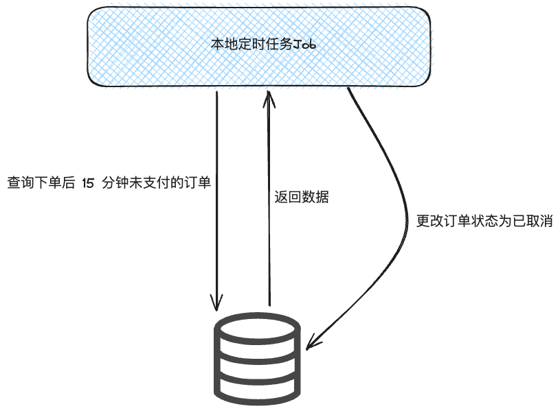
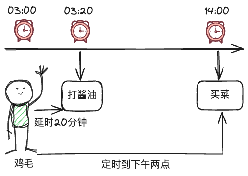
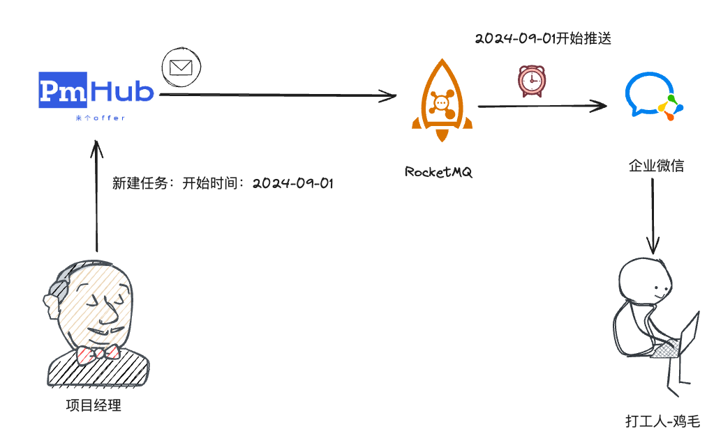
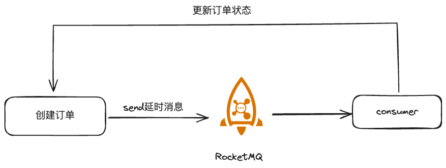
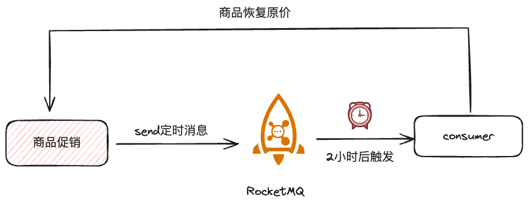
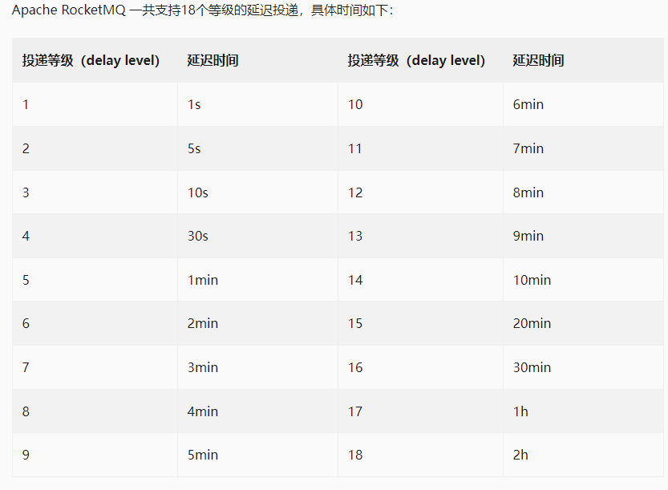
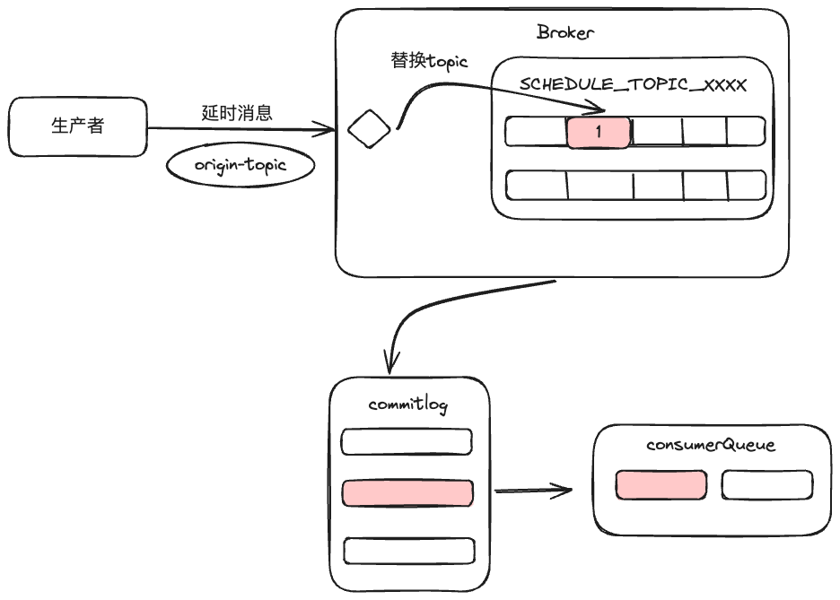
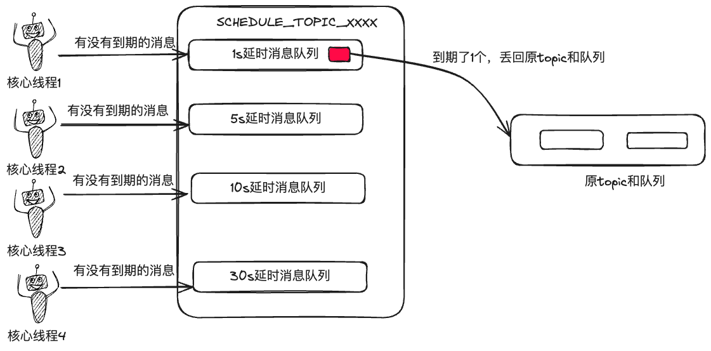

> 原文地址：https://blog.csdn.net/qq_43270074/article/details/141028713

# 图解RocketMQ之如何实现定时延时消息

当我们在淘宝下单后，会有提示说"下单后 15 分钟未支付将会自动取消订单"，大家有没有想过是如何实现这个功能呢？

不管你想没想过，我是没想过，除非我来设计，否则就是写教程，但你不能像我一样，你得好好想想这个问题😀

如果抛去高并发及高可用等情况，我可以这样简单设计：

本地起一个[定时任务](https://so.csdn.net/so/search?q=定时任务&spm=1001.2101.3001.7020)，然后去扫描订单表，找出订单状态为未支付的所有订单，并计算当前时间和下单时间差值，再筛选出时间间隔为 15 分钟的订单，将这些订单的状态变为已取消，就能实现功能。



这个方案小打小闹还行，一旦订单量增加，比如双十一上亿的订单，定期扫描整个订单表会变得非常耗时。

且查询和更新对数据也会造成很大的压力，且在[分布式系统](https://so.csdn.net/so/search?q=分布式系统&spm=1001.2101.3001.7020)中，订单状态的一致性变得更加复杂。

所以在大型项目中，我们通常不会通过这种方式来操作，那有什么梗优雅的方式吗？

当然有，那就是通过 RocketMQ 的**定时/延时消息**来实现。

### 什么是定时/延时消息

定时好理解呀，就像鸡毛设定了一个下午两点要去买菜的闹钟，延时就是鸡毛 20 分钟后要去打酱油。**定时是设定未来具体时间要干某事，延时则是推迟多久干某事**。



知道了什么是定时和延时，那定时消息和延时消息就是消息队列中一种特殊类型的消息，作用就是起到定时和延时的作用。

定时消息是生产者指定一个确切的时间点，消息会在该时间点被投递。比如在 2024年12月25日00:00:00 发送一条"圣诞快乐"的消息。

延时消息是生产者指定一个延迟时间，消息会在发送后经过指定的延迟时间后被投递。例如：发送一条消息，15分钟后投递，用于实现订单自动取消。（本篇最开始的例子）

### 定时/延时消息使用场景

定时消息和延时消息的使用场景还是蛮多的，大家可以放开了脑袋想，只要是业务中需要定时或者延时的场景，都可以使用到。

苍何就举几个典型的场景吧：

#### 典型场景一：分布式定时任务

在分布式系统中，实现高可用、高性能和可扩展的定时任务调度系统，有很多方案，但通过定时消息也可以实现精准、可靠的定时事件触发。

比如 PmHub 的任务下发场景，项目经理建任务并设置好任务开始时间和任务执行人，到了任务指定时间，通过 RocketMQ 的定时消息发送给任务执行人。



相对于传统的基于数据库的定时调度方案，通过 RocketMQ 的定时消息能在分布式场景下具有高性能、高可扩展、高可靠（简称三高😂）。

#### 典型场景二：超时处理

在一开始的订单超时未支付的场景，我们使用的是基于数据库的任务调度方案，在分布式系统中没几个正经人会用这方案。

所以，我们完全可以利用 RocketMQ 的延迟消息方案来设计，废话不多说，先来张手绘图压压惊：



这种方案开发门槛低，业务无需去重订单，相较于传统方式，扩展性也更强，不用频繁调用接口去扫描表，只需要愉快的横向扩展 RocketMQ 服务，你说香不香？


#### 典型场景三：限时优惠活动

还有一种场景是，商品需要促销，通常是促销个把小时，这时可以在活动开始时，发送一个两小时后触发的定时消息，用于在活动结束时恢复原价。



#### 其他场景

除了上面三种典型的场景，还有一些利用定时/延时消息的场景：

| 场景               | 描述                                                        | 实现                                                         |
| ------------------ | ----------------------------------------------------------- | ------------------------------------------------------------ |
| 延迟发送邮件       | 用户注册后 24 小时发送一封"欢迎使用"的邮件                  | 1. 用户注册时，创建一个延时消息，设置 24 小时后触发。 2. 消息内容包含用户 ID 和邮件类型。 3. 24 小时后，消息队列触发该消息。 4. 消费者接收到消息后，查询用户信息并发送欢迎邮件。 |
| 分布式锁的自动释放 | 防止因程序崩溃导致的死锁，确保锁在一定时间后自动释放        | 1. 获取锁时，同时发送一个延时消息，设置为锁的最大持有时间。 2. 消息内容包含锁的标识信息。 3. 正常情况下，操作完成后主动释放锁并取消延时消息。 4. 如果程序崩溃，延时消息到期后自动触发。 5. 消费者收到消息后，检查锁是否仍然被持有，如果是，则强制释放锁。 |
| 延迟重试机制       | 某些操作（如第三方 API 调用）失败后，需要延迟一段时间再重试 | 1. 操作失败时，创建一个延时消息，设置适当的延迟时间（如 1 分钟）。 2. 消息内容包含操作的相关信息和当前重试次数。 3. 延时后，消息队列触发该消息。 4. 消费者收到消息后，重新尝试该操作。 5. 如果再次失败，且未超过最大重试次数，则重复步骤 1-4。 6. 如果成功或超过最大重试次数，则结束重试流程。 |
| 工作流程控制       | 在工作流的某个步骤完成后，需要等待一段时间再进行下一步      | 1. 当前步骤完成时，发送一个延时消息，设置所需的等待时间。 2. 消息内容包含工作流 ID、当前步骤信息和下一步骤信息。 3. 等待时间到后，消息队列触发该消息。 4. 消费者收到消息后，检查工作流当前状态。 5. 如果状态正确，则执行下一个步骤；如果状态不符（可能由于人工干预等原因），则记录日志但不执行下一步。 |

### 定时/延时消息技术原理

知其然而后知其所以然，那么 RocketMQ 是如何实现定时/延时消息的呢？因定时和延时消息原理相同，这里就以延时消息来做探讨。

在 RocketMQ 中，一共内置了 18 个等级的延时时间，也就是 Producer 无法随便选择延时时间，而是只能在这 18 个时间里面选择。



为什么要预设延时时间，但不允许用户自定义呢？还得从其内部原理说起。

Producer 发送延时消息后，会立马给到 Broker，和普通消息不同的是，这时候 Broker 干了一件**偷梁换柱**的事情。

Broker 将会将该消息发送到一个新的专门存放延时消息的 Topic，这个 Topic 的名字就叫 SCHEDULE_TOPIC_XXXX，嗯，这很见名思意😀。这个 Topic 中一共有 18 个队列用来对应 18 个等级的延时 level。

而原 Topic 和队列信息则被换到了消息的扩展属性里面。进入 SCHEDULE_TOPIC_XXXX 的消息会按照消息延时 level （从预设的 18 个里面选）进入到不同的队列中。

这个和原先那套存储类似，Broker 会将消息存储到 commitlog 下，也会保存一份数据到 consumerQueue（这里有些懵的可以看之前的存储篇）。

延时消息就这样和其他消息一样被安详的存在了该存在的地方。



这个时候，问题很多的小明他就奇怪了，这也还没有延时的功能啊，只是把消息存在了一个新的队列而已。

没错，这个时候就需要有线程来消费这些延时队列才行啊。在 Broker 内部有核心线程池，里面有 18 个关于延时消息的线程，专门用来监察有没得延时消息。

每个线程消费对应队列的消息，每 100 ms 消费一次，消费逻辑就是得到队列中的 consumerQueue 和 offset，就可以获得延时消息，拿到延时消息的延迟时间和[当前时间](https://so.csdn.net/so/search?q=当前时间&spm=1001.2101.3001.7020)对比，判断是否到期，如果到期，则会将消息丢回原 Topic 和队列。

没到期则会继续消费，每 100 ms 一次，不断循环着。



这样设计就可以让消费者无需自定逻辑过滤未到时间的消息，RocketMQ 内部做了过滤，没有到时间的消息压根都不会投递给消费者。

你也可以理解是 RocketMQ 的一种消息过滤，在消息过滤篇也提过一嘴，但内部实现原理就是基于 Broker 内部线程池定时调度消费延时队列中消息。

所以回到上面的问题，为什么要不允许用户自定义延时时间呢？原因还是 RocketMQ 内置了不同 level 队列对应的线程，这样能**减少时间轮的复杂度**，避免系统滥用，减少了动态计算和管理不同延时时间的复杂性，性能方面也得到了极致的优化。

### 实战——如何实现定时/延时消息

下面我们直接看看在实际业务中如何使用延时消息呢？直接上代码：

1、创建消息生产者：

```Java
import org.apache.rocketmq.client.producer.DefaultMQProducer;
import org.apache.rocketmq.client.producer.SendResult;
import org.apache.rocketmq.common.message.Message;

public class DelayMessageProducer {
    public static void main(String[] args) throws Exception {
        // 创建一个生产者，并指定生产者组名
        DefaultMQProducer producer = new DefaultMQProducer("delay_producer_group");
        
        // 指定NameServer地址
        producer.setNamesrvAddr("localhost:9876");
        
        // 启动生产者
        producer.start();

        for (int i = 0; i < 10; i++) {
            // 创建消息实例，指定主题、标签和消息体
            Message msg = new Message("DelayTopic", "DelayTag", 
                ("Hello RocketMQ " + i).getBytes());
            
            // 设置延时等级3，对应10s
            msg.setDelayTimeLevel(3);
            
            // 发送消息
            SendResult sendResult = producer.send(msg);
            System.out.printf("发送结果：%s%n", sendResult);
        }

        // 关闭生产者
        producer.shutdown();
    }
}
```

2、创建消息消费者

```Java
import org.apache.rocketmq.client.consumer.DefaultMQPushConsumer;
import org.apache.rocketmq.client.consumer.listener.ConsumeConcurrentlyContext;
import org.apache.rocketmq.client.consumer.listener.ConsumeConcurrentlyStatus;
import org.apache.rocketmq.client.consumer.listener.MessageListenerConcurrently;
import org.apache.rocketmq.common.message.MessageExt;

import java.util.List;

public class DelayMessageConsumer {
    public static void main(String[] args) throws Exception {
        // 创建一个消费者，并指定消费者组名
        DefaultMQPushConsumer consumer = new DefaultMQPushConsumer("delay_consumer_group");
        
        // 指定NameServer地址
        consumer.setNamesrvAddr("localhost:9876");
        
        // 订阅主题和标签
        consumer.subscribe("DelayTopic", "*");

        // 注册回调接口来处理从broker拉取的消息
        consumer.registerMessageListener(new MessageListenerConcurrently() {
            @Override
            public ConsumeConcurrentlyStatus consumeMessage(List<MessageExt> msgs, 
                                                            ConsumeConcurrentlyContext context) {
                for (MessageExt msg : msgs) {
                    System.out.printf("接收到消息：%s %n", new String(msg.getBody()));
                }
                // 标记该消息已经被成功消费
                return ConsumeConcurrentlyStatus.CONSUME_SUCCESS;
            }
        });

        // 启动消费者
        consumer.start();

        System.out.println("消费者已启动");
    }
}
1234567891011121314151617181920212223242526272829303132333435363738
```

这样就可以看到，消息在大约10秒后被接收和处理。当然实际业务可能需要添加更多逻辑，上面仅仅作为示例代码。

### 最后

这一篇，我们深入研究了 RocketMQ 延时消息的实现机理，明白了原来内部做了偷梁换柱的操作，会将延时消息发送到延时队列。

内部通过启动线程池来定时扫描延时队列里的消息，到了设定时间，就把消息发送原来队列，然后消费者就可以消费了。

可以看到其实 Broker 内部每 100 ms 扫描一次，所以严格来说，通过 RocketMQ 发送延时消息，精度不会太高，但对于应用场景来说，大部分情况下还是可以接受的。
