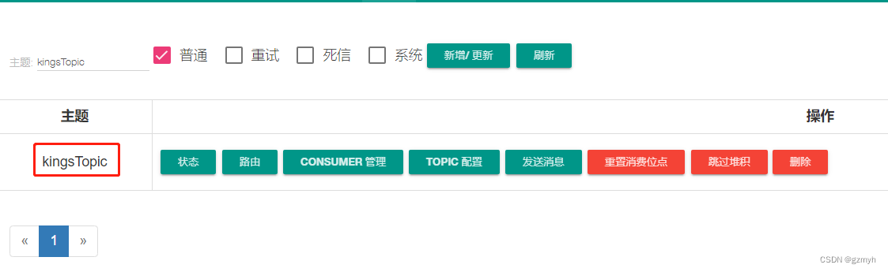

> 原文地址：https://blog.csdn.net/gzmyh/article/details/130222388

### 2.准备工作

#### 2.1引入依赖

```xml
<!--rocketMq -->
<dependency>
    <groupId>org.apache.rocketmq</groupId>
    <artifactId>rocketmq-spring-boot-starter</artifactId>
    <version>2.3.1</version>
</dependency>

<!-- hutool工具类-->
<dependency>
    <groupId>cn.hutool</groupId>
    <artifactId>hutool-all</artifactId>
    <version>5.8.32</version>
</dependency>

<dependency>
    <groupId>org.projectlombok</groupId>
    <artifactId>lombok</artifactId>
</dependency>
```

#### 2.2配置文件

```yaml
server:
  port: 9002

rocketmq:
  # 服务地址，多个用逗号分开
  name-server: 192.168.10.100:9876
  producer:
    # 发送消息超时时间，默认3000
    send-message-timeout: 30000
    # 生产者组
    group: group1
    # 发送消息失败重试次数，默认2
    retryTimesWhenSendFailed: 2
    # 异步消息重试此处，默认2
    retryTimesWhenSendAsyncFailed: 2
    # 消息最大长度，默认1024 * 1024 * 4(默认4M)
    maxMessageSize: 4096
    # 压缩消息阈值，默认4k(1024 * 4)
    compressMessageBodyThreshold: 4096
    # 是否在内部发送失败时重试另一个broker，默认false
    retryNextServer: false
```

#### 2.3创建RocketMQTemplate

封装了RocketMQ的生产者API，提供了一系列简单易用的方法，用于发送不同类型的消息， 后面的例子都会用到它

我们要新建一个ExtRocketMQTemplate类去继承RocketMQTemplate

```java
@ExtRocketMQTemplateConfiguration(nameServer = "${rocketmq.name-server}")
public class ExtRocketMQTemplate extends RocketMQTemplate {
}
```

后面发送消息都用这个类

#### 2.4创建一个主题

利用上面的RocketMQ仪表盘新建一个主题，后面用得到



### 3.发送消息

#### 3.1普通消息

普通消息为 Apache RocketMQ 中最基础的消息 ， 普通消息一般应用于微服务解耦、事件驱动、数据集成等场景，这些场景大多数要求数据传输通道具有可靠传输的能力，且对消息的处理时机、处理顺序没有特别要求。

**3.1.1单向消息**

指发送消息后，不需要等待Broker的响应，直接返回。这种方式适用于不需要关注消息发送结果的场景，如日志记录、统计信息等。

```java
@RestController
@RequestMapping("/send")
@RequiredArgsConstructor
@Slf4j
public class NormalProduceController {
    private final RocketMQTemplate extRocketMQTemplate;

    //private final String topic = "topic_test_info";
    //给消息打上射手的标签。主题+tag，中间用“:”分隔,主要是用于消息的过滤，比如说在消费的时候，只消费ESS标签下的消息
    private final String topic = "topic_test_info".concat(":shooter");

    /**
     * 单向消息:
     * 指发送消息后，不需要等待Broker的响应，直接返回。
     * 这种方式适用于不需要关注消息发送结果的场景，如日志记录、统计信息等。
     */
    @GetMapping("/oneWay")
    public String oneWay() {
        //Message<String> msg = MessageBuilder.withPayload("Hello,RocketMQ").build();

        MqMessage msgObj = new MqMessage();
        msgObj.setKey("1");
        msgObj.setMessage("测试单向消息");

        Message<String> msgs = MessageBuilder.withPayload(JSON.toJSONString(msgObj))
                //设置消息KEYS,一般是数据的唯一ID,主要用于在仪表盘中方便搜索
                .setHeader("KEYS", msgObj.getKey())
                .build();

        //给消息打上射手的标签。主题+tag，中间用“:”分隔,主要是用于消息的过滤，比如说在消费的时候，只消费ESS标签下的消息
        //String topic = "topic_test_info".concat(":shooter");
        extRocketMQTemplate.sendOneWay(topic, msgs);

        return "生产者发送了一条单向消息";
    }
}
```

**3.1.2同步发送消息**

`syncSend`方法会阻塞当前线程，直到消息发送完成并收到了消息服务器的响应。如果消息发送成功，`syncSend`方法会返回一个`SendResult`对象，包含了消息的发送状态、消息ID等信息。如果消息发送失败，`syncSend`方法会抛出一个`MessagingException`异常。

```java
public void syncSend(){
    HeroDTO heroDTO = new HeroDTO();
    heroDTO.setId("luban");
    heroDTO.setName("小鲁班");

    Message<String> msgs = MessageBuilder.withPayload(JSON.toJSONString(heroDTO))
        .setHeader("KEYS", heroDTO.getId()).build();

    SendResult sendResult = extRocketMQTemplate.syncSend("kingsTopic".concat(":shooter"), msgs);

    log.info(sendResult.toString());
}
```

**3.1.3异步发送消息**

`asyncSend`方法不会阻塞当前线程，而是在另一个线程中异步发送消息。因此，`asyncSend`方法会立即返回，不会等待消息发送完成。如果需要等待消息发送完成并处理发送结果，可以使用`SendCallback`回调接口。

```java
public void asyncSend(){
    HeroDTO heroDTO = new HeroDTO();
    heroDTO.setId("sunshangxiang");
    heroDTO.setName("孙尚香");

    Message<String> msgs = MessageBuilder.withPayload(JSON.toJSONString(heroDTO)).setHeader("KEYS", heroDTO.getId()).build();

    extRocketMQTemplate.asyncSend("kingsTopic".concat(":shooter"), msgs, new SendCallback() {
        @Override
        public void onSuccess(SendResult sendResult) {
            log.info(sendResult.toString());
        }

        @Override
        public void onException(Throwable e) {
            log.info(e.getMessage());
        }
    });
}
```

#### 3.2顺序消息

顺序消息是 Apache RocketMQ 提供的一种高级消息类型，支持消费者按照发送消息的先后顺序获取消息，从而实现业务场景中的顺序处理。 相比其他类型消息，顺序消息在发送、存储和投递的处理过程中，更多强调多条消息间的先后顺序关系。

**3.2.1单向顺序消息**

```java
public void sendOneWayOrderly(){
    HeroDTO heroDTO = new HeroDTO();
        heroDTO.setId("zhangfei");
        heroDTO.setName("张飞");

        Message<String> msgs = MessageBuilder.withPayload(JSON.toJSONString(heroDTO))
            .setHeader("KEYS", heroDTO.getId()).build();
		
    //顺序消息比普通消息多一个参数，第三个参数只要唯一就行，比如ID
        extRocketMQTemplate.sendOneWayOrderly("kingsTopic".concat(":tank"), msgs,heroDTO.getId());
}
```

**3.2.2同步发送顺序消息**

```java
public void syncSendOrderly(){
    HeroDTO heroDTO = new HeroDTO();
    heroDTO.setId("niumo");
    heroDTO.setName("牛魔");

    Message<String> msgs = MessageBuilder.withPayload(JSON.toJSONString(heroDTO))
        .setHeader("KEYS", heroDTO.getId()).build();

    SendResult sendResult = extRocketMQTemplate.syncSendOrderly("kingsTopic".concat(":tank"), msgs, heroDTO.getId());
    log.info(sendResult.toString());
}
```

**3.2.3异步发送顺序消息**

```java
public void asyncSendOrderly(){
    HeroDTO heroDTO = new HeroDTO();
    heroDTO.setId("xiangyu");
    heroDTO.setName("项羽");

    Message<String> msgs = MessageBuilder.withPayload(JSON.toJSONString(heroDTO)).setHeader("KEYS", heroDTO.getId()).build();

    extRocketMQTemplate.asyncSendOrderly("kingsTopic".concat(":tank"), msgs, heroDTO.getId(), new SendCallback() {
        @Override
        public void onSuccess(SendResult sendResult) {
            log.info(sendResult.toString());
        }

        @Override
        public void onException(Throwable e) {
            log.info(e.getMessage());
        }
    });
}
```

#### 3.3定时/延时消息

定时消息是 Apache RocketMQ 提供的一种高级消息类型，消息被发送至服务端后，在指定时间后才能被消费者消费。通过设置一定的定时时间可以实现分布式场景的延时调度触发效果。

**3.3.1发送延迟消息**

场景一：任务超时处理

```java
public void syncSendDelayTimeSeconds(){
    HeroDTO heroDTO = new HeroDTO();
    heroDTO.setId("baiqi");
    heroDTO.setName("白起");

    Message<String> msgs = MessageBuilder.withPayload(JSON.toJSONString(heroDTO)).setHeader("KEYS", heroDTO.getId()).build();

    //10秒后才能消费这条消息
    SendResult sendResult = extRocketMQTemplate.syncSendDelayTimeSeconds("kingsTopic".concat(":tank"), msgs, 10L);
    //10毫秒后才能消费这条消息
    //extRocketMQTemplate.syncSendDelayTimeMills("kingsTopic".concat(":tank"), msgs, 10L);
    log.info(sendResult.toString());
}
```

场景二：定时处理

```java
public void syncSendDeliverTimeMills(){
    HeroDTO heroDTO = new HeroDTO();
    heroDTO.setId("liubang");
    heroDTO.setName("刘邦");

    Message<String> msgs = MessageBuilder.withPayload(JSON.toJSONString(heroDTO)).setHeader("KEYS", heroDTO.getId()).build();

    //每天凌晨处理
    long time = LocalDate.now().atStartOfDay().atZone(ZoneId.systemDefault()).toInstant().toEpochMilli();
    SendResult sendResult = extRocketMQTemplate.syncSendDeliverTimeMills("kingsTopic".concat(":tank"), msgs, time);

    log.info(sendResult.toString());
}
```

所有任务都在每天凌晨0点统一处理

#### 3.4事务消息

事务消息是 Apache RocketMQ 提供的一种高级消息类型，支持在分布式场景下保障消息生产和本地事务的最终一致性

```java
 public void sendMessageInTransaction() throws InterruptedException {
     HeroDTO heroDTO = new HeroDTO();
     heroDTO.setId("houyi");
     heroDTO.setName("后裔");

     Message<String> msgs = MessageBuilder.withPayload(JSON.toJSONString(heroDTO))
         .setHeader("KEYS", heroDTO.getId())
         //设置事务ID
         .setHeader(RocketMQHeaders.TRANSACTION_ID,"KEY_"+heroDTO.getId())
         .build();

     TransactionSendResult transactionSendResult = extRocketMQTemplate.sendMessageInTransaction("kingsTopic".concat(":shooter"), msgs, null);
     log.info(transactionSendResult.toString());
 }
```

另外还需要创建监听器

```java
@RocketMQTransactionListener(rocketMQTemplateBeanName = "extRocketMQTemplate")
@Slf4j
public class TransactionListenerImpl implements RocketMQLocalTransactionListener {
    private AtomicInteger transactionIndex = new AtomicInteger(0);

    private ConcurrentHashMap<String, Integer> localTrans = new ConcurrentHashMap<String, Integer>();

    /**
     *执行事务
     */
    @Override
    public RocketMQLocalTransactionState executeLocalTransaction(Message msg, Object arg) {
        //事务ID
        String transId = (String) msg.getHeaders().get(RocketMQHeaders.TRANSACTION_ID);

        int value = transactionIndex.getAndIncrement();
        int status = value % 3;
        assert transId != null;
        localTrans.put(transId, status);

        if (status == 0) {
            log.info("success");
            //成功，提交事务
            return RocketMQLocalTransactionState.COMMIT;
        }

        if (status == 1) {
            log.info("failure");
            //失败，回滚事务
            return RocketMQLocalTransactionState.ROLLBACK;
        }

        log.info("unknown");
        //中间状态
        return RocketMQLocalTransactionState.UNKNOWN;
    }

    /**
     *检查事务状态
     */
    @Override
    public RocketMQLocalTransactionState checkLocalTransaction(Message msg) {
        String transId = (String) msg.getHeaders().get(RocketMQHeaders.TRANSACTION_ID);
        RocketMQLocalTransactionState retState = RocketMQLocalTransactionState.COMMIT;
        Integer status = localTrans.get(transId);
        if (null != status) {
            switch (status) {
                case 0:
                    retState = RocketMQLocalTransactionState.COMMIT;
                    break;
                case 1:
                    retState = RocketMQLocalTransactionState.ROLLBACK;
                    break;
                case 2:
                    retState = RocketMQLocalTransactionState.UNKNOWN;
                    break;

                default: break;
            }
        }
        log.info("msgTransactionId:{},TransactionState:{},status:{}",transId,retState,status);
        return retState;
    }
}
```

#### 3.5批量发送

```java
public void syncSendBatchMessage() throws InterruptedException {
    List<HeroDTO> heroList = new ArrayList<>();
    HeroDTO heroDTO = new HeroDTO();
    heroDTO.setId("geya");
    heroDTO.setName("戈娅");
    heroList.add(heroDTO);

    HeroDTO heroDTO1 = new HeroDTO();
    heroDTO.setId("direnjie");
    heroDTO.setName("狄仁杰");
    heroList.add(heroDTO1);

    List<Message> msgs = new ArrayList<Message>();
    for (HeroDTO hero : heroList){
        Message<String> message = MessageBuilder.withPayload(JSON.toJSONString(heroDTO))
            .setHeader("KEYS", heroDTO.getId())
            .build();
        msgs.add(message);
    }

    SendResult sendResult = extRocketMQTemplate.syncSend("kingsTopic".concat(":shooter"), msgs);
    log.info(sendResult.toString());
}
```

### 4.消费消息

消费消息的代码就很简单，新建一个HeroConsumer，继承RocketMQListener监听器

```java
@Service
@Slf4j
@RocketMQMessageListener(topic = "kingsTopic", consumerGroup = "hero",selectorExpression = "shooter")
public class HeroConsumer implements RocketMQListener<String> {

    @Override
    public void onMessage(String message) {
        log.info(message);
    }
}
```

接下来了解一下@RocketMQMessageListener这个注解

**topic**：主题，指消费者组订阅的消息服务

**consumerGroup**：消费者组，一个组可以有多个消费者，主要的作用是集群模式负载均衡的实现，广播模式的通知的实现

**consumeModel**：控制消费模式，你可以选择并发或有序接收消息

**messageModel**：控制消息模式，广播模式-所有消费者都能接收到信息， 集群模式：无论有多少个消费者，只有一个消费者能够接收到信息，也就是说消息一旦被消费了，其它消费者就不能消费该条消息

**selectorExpression**：选择哪个标签(tag)下的信息，默认是消费该主题下的所有信息

**源码**：https://gitee.com/myha/spring-cloud-study-demo/tree/master/rocketmq

### 注意点

#### RocketMQ一个消费组内订阅同一个主题不同的TAG会丢消息

参考：

- https://zhuanlan.zhihu.com/p/370059224
- https://zhuanlan.zhihu.com/p/427907350

总结：我们应该如何使用topic和tag了

根据[rocketmq](https://zhida.zhihu.com/search?content_id=183219940&content_type=Article&match_order=15&q=rocketmq&zhida_source=entity) 的官方文档建议指出：

> **消息类型是否一致**：如普通消息、事务消息、定时（延时）消息、顺序消息，不同的消息类型使用不同的Topic，无法通过Tag进行区分。
>
> **业务是否相关联**：没有直接关联的消息，如淘宝交易消息，京东物流消息使用不同的Topic进行区分；而同样是天猫交易消息，电器类订单、女装类订单、化妆品类订单的消息可以用Tag进行区分。
>
> **消息优先级是否一致**：如同样是物流消息，盒马必须小时内送达，天猫超市24小时内送达，淘宝物流则相对会慢一些，不同优先级的消息用不同的Topic进行区分。
>
> **消息量级是否相当**：有些业务消息虽然量小但是实时性要求高，如果跟某些万亿量级的消息使用同一个Topic，则有可能会因为过长的等待时间而“饿死”，此时需要将不同量级的消息进行拆分，使用不同的Topic。
