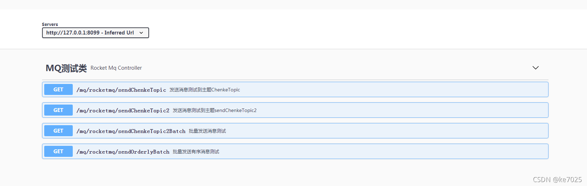
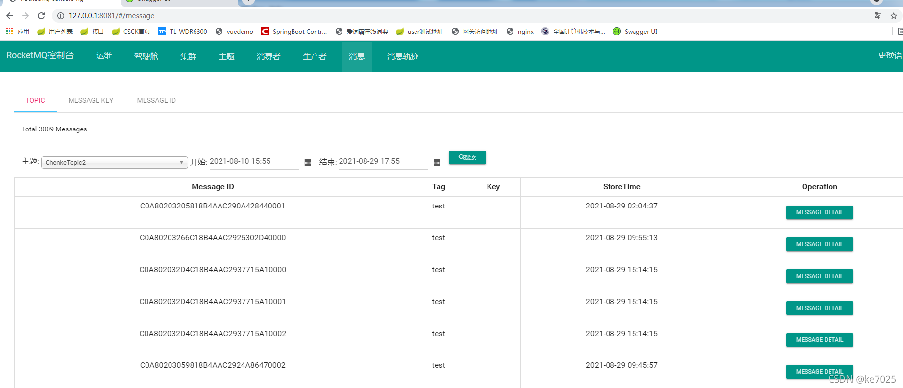

> 原文地址:https://blog.csdn.net/ke7025/article/details/119982155

# springboot整合rocketmq，支持多连接生产者和消费者配置。不同topic适配不同业务处理类

### 1.代码仓库

rocketmq版本4.5.2
直接上代码，下面再逐步讲解，[仓库地址](https://gitee.com/wuhan-chenke/rocketmq-demo)
本地启动后，访问[swagger](https://so.csdn.net/so/search?q=swagger&spm=1001.2101.3001.7020)地址测试，http://127.0.0.1:8099/mq/swagger-ui/index.html


### 2.创建发生消息生产者

引入pom.xml坐标

```xml
<dependency>
	<groupId>org.apache.rocketmq</groupId>
    <artifactId>rocketmq-client</artifactId>
    <version>4.5.2</version>
</dependency>
```

配置application.yml，其中producerlist是集合，即支持多个连接配置

```yaml
rocketmq:
  producer:
    # 支持配置多个连接
    producerlist:
      - groupName: ${spring.application.name}
        # 生产者唯一标识
        producerId: chenkeTest
        # mq的nameserver地址
        namesrvAddr: 127.0.0.1:9876
        # 消息最大长度 默认 1024 * 4 (4M)
        maxMessageSize: 4096
        # 发送消息超时时间，默认 3000
        sendMsgTimeOut: 3000
        # 发送消息失败重试次数，默认2
        retryTimesWhenSendFailed: 2
```

读取生产者配置

```java
@Component
@Configuration
@ConfigurationProperties(prefix = "rocketmq.producer")
public class MqProducerConfig {

    private List<MqProducerVo> producerlist;

    public List<MqProducerVo> getProducerlist() {
        return producerlist;
    }

    public void setProducerlist(List<MqProducerVo> producerlist) {
        this.producerlist = producerlist;
    }
}
```

使用spring启动监听来启动所有连接，并且装入全局集合，yml配置中的producerId作为MAP的key，方便后续获取连接，配置多连接关键代码

```java
@Component
@Order(value = 9)
public class InitMqProducer implements ApplicationListener<ApplicationReadyEvent> {

    private static final Logger LOG = LoggerFactory.getLogger(InitMqProducer.class);

    @Autowired
    private MqProducerConfig mqProducerConfig;

    /**
     * 存放所有生产者
     */
    public static Map<String, DefaultMQProducer> producerMap = new HashMap<>();

    @Override
    public void onApplicationEvent(ApplicationReadyEvent applicationReadyEvent) {

        List<MqProducerVo> producerlist = mqProducerConfig.getProducerlist();
        if (CollectionUtils.isEmpty(producerlist)) {
            LOG.info("无MQ生产者---------------------------------------");
        }

        for (MqProducerVo vo : producerlist) {
            try {
                DefaultMQProducer producer = new DefaultMQProducer(vo.getGroupName());
                producer.setNamesrvAddr(vo.getNamesrvAddr());
                producer.setVipChannelEnabled(false);
                producer.setMaxMessageSize(vo.getMaxMessageSize());
                producer.setSendMsgTimeout(vo.getSendMsgTimeOut());
                producer.setRetryTimesWhenSendAsyncFailed(vo.getRetryTimesWhenSendFailed());
                producer.start();
                producerMap.put(vo.getProducerId(), producer);
                LOG.info("mq生产者{},{}启动成功", vo.getGroupName(), vo.getNamesrvAddr());
            } catch (MQClientException e) {
                LOG.error("mq生产者{},{}启动失败", vo.getGroupName(), vo.getNamesrvAddr(), e);
            }
        }

    }

}
```

对外提供工具类获取连接

```java
public class MqUtil {

    /**
     * 根据生成者唯一标识获取发送实例
     *
     * @param producerId
     * @return org.apache.rocketmq.client.producer.DefaultMQProducer
     * @throws
     * @author chenke
     * @date 2021/8/29 16:18
     */
    public static DefaultMQProducer getProducer(String producerId) {
        if (CollectionUtils.isEmpty(InitMqProducer.producerMap)) {
            return null;
        } else {
            return InitMqProducer.producerMap.get(producerId);
        }
    }

}
```

测试MQ发生消息，请查看RocketMqController类，Message对象为发生对象，此处是消息批量发生，可以单条记录发送。其中ChenkeTopic2=topic，test=tag。

```java
@ApiOperation("批量发送消息测试")
    @GetMapping(value = "/sendChenkeTopic2Batch")
    public void sendChenkeTopic2Batch() throws Exception {
        List<Message> msgList = new ArrayList<>();
        for (int i = 1; i <= 3000; i++) {
            String msg = "发生测试消息" + i;
            Message sendMsg = new Message("ChenkeTopic2", "test", msg.getBytes(RemotingHelper.DEFAULT_CHARSET));
            msgList.add(sendMsg);

            if (i % 5 == 0) {
                SendResult sendResult = MqUtil.getProducer("chenkeTest").send(msgList);
                LOG.info("发送消息结果:" + sendResult);
                msgList.clear();
            }
        }
    }
```

发生成功后，可以在MQ管理界面查看，至于管理界面如何访问，可以百度下rocketmq-console-ng-2.0.0.jar直接java -jar rocketmq-console-ng-2.0.0.jar启动


### 3.配置消费者

配置YML文件，从下列配置中可看出consumerlist支持数组，即配置多连接。
**每个topic需要实现自己的业务处理类，即实现MqConsumerInterface接口，并且springBean名称有一定规则，后续要讲到**
每个属性作用请看下面解释，针对重要属性单独讲解
consumeThreadMin与consumeThreadMax是配置消费者连接池最小和最大消费线程数，根据CPU核数配置一般在核数X1-核数X1.5之间
orderly是有序消费标识，后面会讲到有序消费，有序消费相比并发消费速度要慢，如无特殊场景不配置，一个连接中其中一个topic需要有序消费，其他不需要，单独配置一个连接，注意groupName不能一致，否则会报错

```yaml
consumer:
    # 支持配置多个连接
    consumerlist:
      - groupName: mqdemo
        # mq的nameserver地址
        namesrvAddr: 127.0.0.1:9876
        # 消费者订阅的主题topic和tags,tagName=*则代表监听topic所有,tagName=tag1||tag2||tags3则代表监听部分
        # 实际业务处理类必须实现MqConsumerInterface接口
        # 每个topic对应一个处理类,根据topicName获取对应类,例如:mqConsumerHandle.ChenkeTopic,mqConsumerHandle固定值
        topics:
          - topicName: ChenkeTopic
            tagName: test
          - topicName: ChenkeTopic2
            tagName: '*'
        # 消费者线程数据量
        consumeThreadMin: 4
        consumeThreadMax: 4
        # 设置一次消费的条数，默认1
        consumeMessageBatchMaxSize: 1
        # 是否顺序消费
        orderly: false
        # 消费模式
        messageModel: CLUSTERING
      - groupName: mqdemoOrderly
        # mq的nameserver地址
        namesrvAddr: 127.0.0.1:9876
        # 消费者订阅的主题topic和tags,tagName=*则代表监听topic所有,tagName=tag1||tag2||tags3则代表监听部分
        # 实际业务处理类必须实现MqConsumerInterface接口
        # 每个topic对应一个处理类,根据topicName获取对应类,例如:mqConsumerHandle.ChenkeTopic,mqConsumerHandle固定值
        topics:
          - topicName: ChenkeTopic3
            tagName: '*'
        # 消费者线程数据量
        consumeThreadMin: 4
        consumeThreadMax: 4
        # 设置一次消费的条数，默认1
        consumeMessageBatchMaxSize: 1
        # 是否顺序消费
        orderly: true
        # 消费模式
        messageModel: CLUSTERING
```

启动消费者监听，与启动生产者类似，需要springboot启动监听中启动。启动有序消费和并发消费，注册消费监听不一样。有序消费需要注册MessageListenerOrderly而并发注册MessageListenerConcurrently。此段代码中需要注意，会根据topic适配实际业务处理类，避免监听类if else写一堆

```java
@Override
    public void onApplicationEvent(ApplicationReadyEvent applicationReadyEvent) {
        LOG.info("正在创建消费者---------------------------------------");
        List<MqConsumerVo> consumerlist = mqConsumerConfig.getConsumerlist();
        // 初始化消费者
        if (CollectionUtils.isEmpty(consumerlist)) {
            LOG.info("无MQ消费者---------------------------------------");
        }

        consumerlist.forEach(consumer -> {
            // 此步可以针对配置参数进行校验，校验consumer格式，符合规则才启动--待完善

            DefaultMQPushConsumer start = new DefaultMQPushConsumer(consumer.getGroupName());
            start.setNamesrvAddr(consumer.getNamesrvAddr());
            start.setConsumeThreadMin(consumer.getConsumeThreadMin());
            start.setConsumeThreadMax(consumer.getConsumeThreadMax());
            start.setConsumeMessageBatchMaxSize(consumer.getConsumeMessageBatchMaxSize());
            // 设置消费模型，集群(MessageModel.CLUSTERING)还是广播(MessageModel.BROADCASTING)，默认为集群
            String messageModel = consumer.getMessageModel();
            if (StringUtils.isBlank(messageModel) || StringUtils.equals("CLUSTERING", messageModel)) {
                start.setMessageModel(MessageModel.CLUSTERING);
            } else {
                start.setMessageModel(MessageModel.BROADCASTING);
            }
            // 设置consumer第一次启动是从队列头部开始还是队列尾部开始,否则按照上次消费的位置继续消费
            start.setConsumeFromWhere(ConsumeFromWhere.CONSUME_FROM_LAST_OFFSET);

            // 设置监听,判断是否为顺序消费
            Boolean orderly = consumer.getOrderly();
            if (orderly == null || orderly) {
                // 顺序消费
                start.registerMessageListener(new MessageListenerOrderly() {
                    @Override
                    public ConsumeOrderlyStatus consumeMessage(List<MessageExt> list, ConsumeOrderlyContext consumeOrderlyContext) {
                        if (CollectionUtils.isEmpty(list)) {
                            return ConsumeOrderlyStatus.SUCCESS;
                        }
                        // MQ不会一次拉取多个不同Topic消息,直接取第一个
                        String topicName = list.get(0).getTopic();

                        // 获取对应实际处理类
                        MqConsumerInterface mqConsumerInterface = SpringBeanUtil.getBean("mqConsumerHandle." + topicName, MqConsumerInterface.class);

                        if (mqConsumerInterface == null) {
                            LOG.info("未根据topic:{}找到对应处理类,请检查代码", topicName);
                            return ConsumeOrderlyStatus.SUSPEND_CURRENT_QUEUE_A_MOMENT;
                        }

                        MqConsumerResult result = mqConsumerInterface.handle(new MqConsumerParamBuilder().list(list).orderlyContext(consumeOrderlyContext).build());

                        if (result.isSaveConsumeLog()) {
                            // 判断是否需要记录日志,落库或者缓存
                        }

                        // 判断是否成功
                        if (result.isSuccess()) {
                            return ConsumeOrderlyStatus.SUCCESS;
                        } else {
                            // 失败是否需要重试
                            if (result.isReconsumeLater()) {
                                // 有序消费,最好在业务消费类中加入消费次数记录，当消费达到多少次之后，还是失败则返回成功，并且加入日志加预警功能
                                // 因为有序消费返回SUSPEND_CURRENT_QUEUE_A_MOMENT会一直消费，导致其他消息处理不了
                                return ConsumeOrderlyStatus.SUSPEND_CURRENT_QUEUE_A_MOMENT;
                            } else {
                                return ConsumeOrderlyStatus.SUCCESS;
                            }
                        }
                    }
                });
            } else {
                start.registerMessageListener(new MessageListenerConcurrently() {
                    @Override
                    public ConsumeConcurrentlyStatus consumeMessage(List<MessageExt> list, ConsumeConcurrentlyContext consumeConcurrentlyContext) {

                        if (CollectionUtils.isEmpty(list)) {
                            return ConsumeConcurrentlyStatus.CONSUME_SUCCESS;
                        }
                        // MQ不会一次拉取多个不同Topic消息,直接取第一个
                        String topicName = list.get(0).getTopic();

                        // 获取对应实际处理类
                        MqConsumerInterface mqConsumerInterface = SpringBeanUtil.getBean("mqConsumerHandle." + topicName, MqConsumerInterface.class);

                        if (mqConsumerInterface == null) {
                            LOG.info("未根据topic:{}找到对应处理类,请检查代码", topicName);
                            return ConsumeConcurrentlyStatus.RECONSUME_LATER;
                        }

                        MqConsumerResult result = mqConsumerInterface.handle(new MqConsumerParamBuilder().list(list).concurrentlyContext(consumeConcurrentlyContext).build());

                        if (result.isSaveConsumeLog()) {
                            // 判断是否需要记录日志,落库或者缓存--待完善
                        }

                        // 判断是否成功
                        if (result.isSuccess()) {
                            return ConsumeConcurrentlyStatus.CONSUME_SUCCESS;
                        } else {
                            // 失败是否需要重试,默认失败次数达到16次消息会进入死信队列
                            if (result.isReconsumeLater()) {
                                return ConsumeConcurrentlyStatus.RECONSUME_LATER;
                            } else {
                                return ConsumeConcurrentlyStatus.CONSUME_SUCCESS;
                            }
                        }
                    }
                });
            }

            List<MqTopicVo> topics = consumer.getTopics();
            if (CollectionUtils.isEmpty(topics)) {
                // 未配置主题，则不启动
                return;
            }

            try {
                for (MqTopicVo topic : topics) {
                    start.subscribe(topic.getTopicName(), StringUtils.isBlank(topic.getTagName()) ? "*" : topic.getTagName());
                }
                start.start();
                startConsumer.add(start);
                LOG.info("MQ消费者group:{},namesrv:{}启动成功", consumer.getGroupName(), consumer.getNamesrvAddr());
            } catch (MQClientException e) {
                LOG.error("MQ消费者group:" + consumer.getGroupName() + ",namesrv:" + consumer.getNamesrvAddr() + "启动失败", e);
            }

        });

    }
```

topic根据上述代码(InitMqConsumer类)中此段代码匹配实际处理类


topic对应实际业务处理类开发，其中Component注解需要注意，mqConsumerHandle固定值，ChenkeTopic3则对应topic名称，所有对应topic消息会进入此消费。

```java
@Component("mqConsumerHandle.ChenkeTopic3")
public class MqConsumerChenkeTopic3 implements MqConsumerInterface {

    private static final Logger LOG = LoggerFactory.getLogger(MqConsumerChenkeTopic3.class);

    @Override
    public MqConsumerResult handle(MqConsumerParam param) {
        // 消费逻辑自行完善，简单写下
        List<MessageExt> list = param.getList();
        for (MessageExt messageExt : list) {
            try {
                String msg = new String(messageExt.getBody(), RemotingHelper.DEFAULT_CHARSET);
                LOG.info("线程名"+Thread.currentThread().getName()+",顺序消费内容:{}", msg);
            } catch (Exception e) {
                LOG.error("顺序消费失败,消息ID:" + messageExt.getMsgId(), e);
            }
        }
        return MqConsumerResultBuilder.success();
    }

}
```

### 4.有序消费

RocketMQ支持局部顺序消费，但不支持全局，换句话说针对Topic中的每个queue是可以按照FIFO进行消费。
简单讲，发送方需要保证同一类消息发送到一个queue，消费方采用MessageListenerOrderly监听消费，可保证有序消费。

发送方如何保证同一类消息进入相同队列，例如相同订单数据进入同一个队列。保证同一类数据选择的队列是一致即可


消费方核心代码。


### 5.发送延迟消息

发送延迟消息，只需要在发送方设置参数DelayTimeLevel即可，消费端和原来一样。例如延迟30分钟，
发送方发送消息>30分钟后，才会被消费端拉取到消息

```java
@ApiOperation("发送延迟消息")
    @GetMapping(value = "/sendDelayMeg")
    public void sendDelayMeg() throws Exception {
        SimpleDateFormat sdf = new SimpleDateFormat("yyyy-MM-dd HH:mm:ss");
        String msg = "发生延迟消息,延迟30分钟,当前时间" + sdf.format(new Date());
        Message sendMsg = new Message("ChenkeTopic2", "test", msg.getBytes(RemotingHelper.DEFAULT_CHARSET));
        // 延迟级别对应延迟时间 1s 5s 10s 30s 1m 2m 3m 4m 5m 6m 7m 8m 9m 10m 20m 30m 1h 2h
        sendMsg.setDelayTimeLevel(16);
        SendResult sendResult = MqUtil.getProducer("chenkeTest").send(sendMsg);
        LOG.info("发送消息结果:" + sendResult);
    }
```
