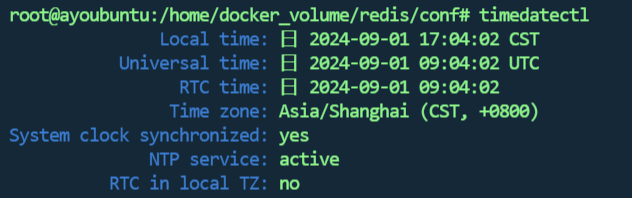

## 1.时间问题


此时查看部署的服务器的时间

```shell
timedatectl
```



而当前的系统时间为


可以看出整整差了一天

执行下列代

```shell
网上同步时间

1.  安装ntpdate工具
# sudo apt-get install ntpdate

2.  设置系统时间与网络时间同步
# ntpdate cn.pool.ntp.org

# 3. 硬件时区为本地时区(不建议操作)
# sudo timedatectl set-local-rtc 1
```

