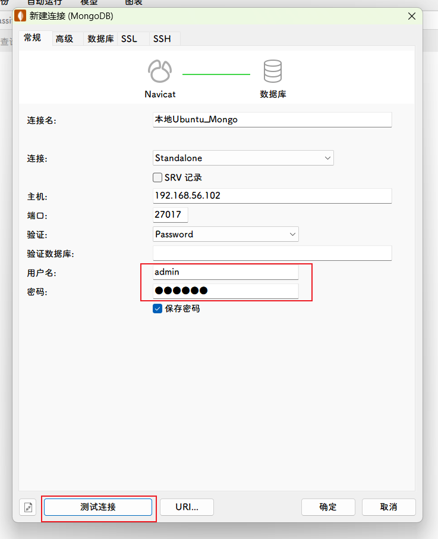
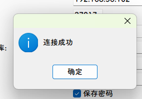

## MongoDB8.0

> 容器对象嘎嘎重启，测试换4.4吧

### 拉取镜像

```shell
docker pull swr.cn-north-4.myhuaweicloud.com/ddn-k8s/docker.io/bitnami/mongodb:8.0.0
docker tag  swr.cn-north-4.myhuaweicloud.com/ddn-k8s/docker.io/bitnami/mongodb:8.0.0 mongodb:8.0.0
docker rmi swr.cn-north-4.myhuaweicloud.com/ddn-k8s/docker.io/bitnami/mongodb:8.0.0
```

### 部署运行容器

准备数据挂载目录

```sh
mkdir -p /home/docker_volume/mongodb/data
mkdir -p /home/docker_volume/mongodb/config
```

拷贝文件

```shell
docker run --restart=always -d \
--name mongodb \
-p 27017:27017 \
-e LANG=C.UTF-8 \
-e MONGO_INITDB_ROOT_USERNAME=admin \
-e MONGO_INITDB_ROOT_PASSWORD=123456 \
mongodb:8.0.0 

# 查看端口占用情况
# sudo lsof -i :27017
# sudo netstat -tuln | grep 27017

# 删除对应的PID应用
# sudo kill -9 <PID>


# 拷贝文件
docker cp mongodb:/data/db /home/docker_volume/mongodb/data

# 授权文件
chmod -R 777 home/docker_volume/mongodb/data/{db,log}

# 删除容器
docker rm -f mongo
```


创建容器并运行

```sh
docker run -d \
--restart=always \
--name mongodb \
-p 27017:27017 \
-v /home/docker_volume/mongodb/data:/data/db \
-v /home/docker_volume/mongodb/config:/data/configdb \
-e LANG=C.UTF-8 \
-e MONGO_INITDB_ROOT_USERNAME=admin \
-e MONGO_INITDB_ROOT_PASSWORD=123456 \
mongodb:8.0.0 

# docker stop mongodb
# docker rm mongodb
```

### 配置账号密码

进入容器

```sh
docker exec -it mongodb bash
```

### 问题

##### 1. mongo 容器 Restarting (132) 2 seconds ago

近期接手一个后端项目，发现使用docker 创建mongodb的容器时，总是显示一直重启，显示`Restarting (132) 2 seconds ago` ， 然而在我自己的window10电脑上却无法复现，或者换一台机器也不会出现类似的问题。
查了下万能的google 终于找到了问题所在。
原文链接：https://stackoverflow.com/questions/60930359/docker-containers-exit-code-132

主要原因为： **机器不支持avx指令，可以通过`cat /proc/cpuinfo | grep avx` or `sudo cat /proc/cpuinfo | grep avx` 查看你的系统是否支持avx 指令** ，如果有匹配的值说明是支持avx的，如果返回是空的，说明不支持avx。

不支持avx 则可能导致上述mongo容器一致重启的问题，解决办法：
1） 选择一台支持avx指令的机器，就可以解决了 。
2） 将mongo 的版本下调至4.4版本。因为最新的mongo只能在支持amd64-avx的机器上运行，而4.4的版本可以在没有avx的机器运行的 ( 例如:docker pull mongo:4.4 )

3）如果使用Windows+VirtualBox

- **打开 VirtualBox**，选择你的虚拟机，然后点击“设置”。

- 导航到“系统”>“处理器”选项卡。

- 在“扩展特性”部分，确保“启用 PAE/NX”被勾选。

- 如果存在“启用 VM-x/VM-y”选项，请确保它也被勾选（这取决于你的宿主机操作系统和处理器类型）。

    ```shell
    #默认情况下VirtualBox下无法启用嵌套的VT-X/AMD-v。
    #首先需要在宿主机windows上使用VboxManager命令列出所有的vm
    # 1. 列出所有的vm列表
    VBoxManage.exe list vms
    # 2.修改指定的vm，开启nested-hw-virt
    VBoxManage.exe modifyvm "xxxx" --nested-hw-virt on
    # 3.勾选VT-x/AMD-V
    
    # 示例
    C:\Program Files\Oracle\VirtualBox>VBoxManage.exe list vms
    "ubuntu-24.04" {732caf3e-9072-464d-a173-afa41f9da49b}
    C:\Program Files\Oracle\VirtualBox>VBoxManage.exe modifyvm "ubuntu-24.04" --nested-hw-virt on
    ```

- 关闭设置窗口并重新启动虚拟机。

管理用户启动cmd
执行命令

```bash
bcdedit /set hypervisorlaunchtype off
```

重新开启命令

```bash
bcdedit /set hypervisorlaunchtype auto
```

重新启动计算机

##### 2. mongo 容器 Restarting (62) 2 seconds ago

这里我拉了一个mongo:4.4的镜像，然后尝试了下启动容器，发现另一个报错信息： `Restarting (62) 2 seconds ago`, 于是查了下docker exit code 62的说明， 找到了问题所在：
原文链接：https://stackoverflow.com/questions/47850004/mongodb-shutting-down-with-code62

主要原因为新版本4.4的mongo和之前mongo（最新版）的数据存在冲突，因此删除之前MongoDB 存储的数据即可。
例如我这里的路径是 `./mongodb_data` ,直接`rm -r ./mongodb_data/*` 。删除之后在使用docker启动容器就没有问题了。

## Mongo4.4

>- **`mongo`**：这是 MongoDB 官方提供的标准镜像名称。你可以通过 `docker pull mongo` 来拉取最新的 MongoDB 镜像。
>- **`mongodb`**：在某些情况下，`mongodb` 也指向官方的 MongoDB 镜像，但并不是所有 Docker 镜像仓库都保证这一点。为了确保使用官方镜像，建议使用 `mongo`。

### 拉去镜像

```sh
docker pull swr.cn-north-4.myhuaweicloud.com/ddn-k8s/docker.io/mongo:4.4.29
docker tag  swr.cn-north-4.myhuaweicloud.com/ddn-k8s/docker.io/mongo:4.4.29 mongo:4.4.29
docker rmi swr.cn-north-4.myhuaweicloud.com/ddn-k8s/docker.io/mongo:4.4.29
```

### 部署运行容器

准备数据挂载目录

```sh
mkdir -p /home/docker_volume/mongodb/data
mkdir -p /home/docker_volume/mongodb/config
```

创建容器并运行

```sh
docker run -d \
--restart=always \
--name mongo \
-p 27017:27017 \
-v /home/docker_volume/mongodb/data:/data/db \
-v /home/docker_volume/mongodb/config:/data/configdb \
-e LANG=C.UTF-8 \
-e MONGO_INITDB_ROOT_USERNAME=admin \
-e MONGO_INITDB_ROOT_PASSWORD=123456 \
mongo:4.4.29 \
--auth 

# --auth表示连接mongodb时需要认证

# docker stop mongodb
# docker rm mongodb
```

### 测试





### 创建用户

```sh
#进入容器
docker exec -it mongo mongo admin
# 添加管理员用户
db.createUser({ user:'admin',pwd:'123456',roles:[ { role:'userAdminAnyDatabase', db: 'admin'}]});
# 切换到admin数据库
use admin
# 登录认证
db.auth('admin', '123456')
# 查看数据库
show dbs
```

### 创建数据库并设置密码

```shell
# 创建yuan库
use yuan
# 设置yuan库的用户和密码
db.createUser({user:'yuan',pwd:'sysyuan',roles:['readWrite']})
#通过账号密码登录并添加users集合数据
db.auth("yuan","sysyuan")
db.users.insert( { name:"jinshengyuan", age:22} )

# 删除用户
db.dropUser('yuan')
```
