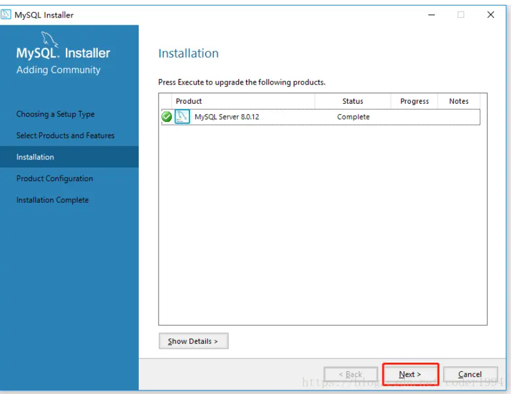
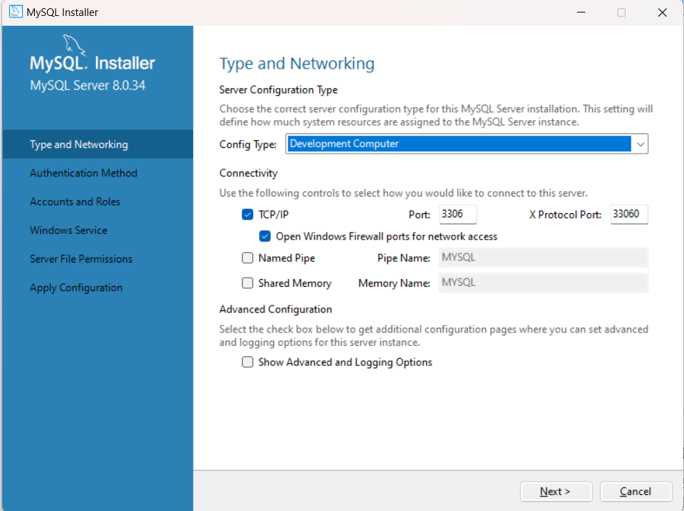

> 官网：https://www.mysql.com/
>
> 滑到最底下
>
> 

## 下载页面

> 下载地址：https://dev.mysql.com/downloads/

Window下载地址：https://dev.mysql.com/downloads/installer/


## 安装	


这里我们选`Custom`


**`Data Directory`:**是存放我们自己创建的数据库文件，可以改为自己存放数据的文件夹中




官方推荐第一种, 我们就用第一种


> 千万注意  ! ! ! 如果后面我们要用到**数据库图形化工具**的话(navicat举例)
>
> 如果navicat版本太老, 比如11, 会产生数据库连接错误
>
> 就建议**选择第二个密码选项** 或者升级软件**图形化工具**的版本

学习MySQL的话, 就随便取个好记的密码(忘密码比较麻烦)


## 检查

### 验证一：

查看系统服务是否启动，服务名称为安装时设置的服务名称，8.0默认名称为MySQL8.0


### 验证二：

通过Navcat进行密码连接的登陆测试


### 验证三：

首先进入mysql的安装bin目录


将该路径地址配置环境变量

然后打开`cmd`输入

```shell
mysql -u root -p
```

接着如果出现输入密码，则已经表示安装成功


输入密码，即成功连接mysql服务，此时地址位置显示`mysql`


输入`exit`退出连接

> 具体参考：https://blog.csdn.net/qq_43774897/article/details/88821811

## 新建库表

```mysql
# 新的项目启动后，创建数据库使用的一般需要创建默认字符集（CHARACTER）和排序规则(COLLATE)。
# 以下是我创建表使用的字符集和排序规则。
CREATE DATABASE `demo` DEFAULT CHARACTER SET utf8mb4 COLLATE utf8mb4_unicode_ci ;

# utf8 vs utf8mb4（字符集）
# utf8 和utf8mb4 是以unicode字符集使用UTF-8编码输出的不同的字符集。
# utf8就是utf8mb3的别称，是unicode字符集使用UTF-8编码用3个字节（bytes）标识一个字符（character）的方式输出的字符集；
# MySQL官网已经明确说了，utf8mb3 is deprecated 会将之后的版本中移除掉。并且建议使用utf8mb4替换。
# utf8mb4是unicode字符集使用UTF-8编码用4个字节（bytes）标识一个字符（character）的方式输出的字符集；
# 在保存内容中有表情符号emoji时,使用utf8会有缺失情况(emoji表情 4 btyes)，而utf8mb4天然支持。拓展性、兼容性更好。

# utf8mb4_general_ci vs utf8mb4_unicode_ci（排序规则）
# utf8mb4_general_ci在识别上不是那么精准，所以在查询检索效率上更高。
# utf8mb4_unicode_ci会更规范，在识别上非常精准，所以对应的查询检索效率上会低一点。
```

