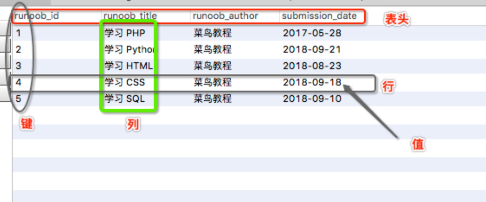

什么是`SQL`？简单地说，`SQL`就是`访问`和`处理`关系数据库的计算机标准语言。也就是说，无论用什么编程语言（`Java`、`Python`、`C++`……）编写程序，只要涉及到**操作关系数据库**，比如，一个电商网站需要把用户和商品信息存入数据库，或者一个手机游戏需要把用户的道具、通关信息存入数据库，都必须通过`SQL`来完成。

所以，现代程序离不开`关系数据库`，要使用`关系数据库`就必须掌握`SQL`。

在本教程中，你将学到`关系数据库`的**基本概念**，如何使用`SQL`操作`数据库`，以及一种最流行的开源数据库`MySQL`的基本安装和使用方法。

> **SQL** (Structured Query Language:结构化查询语言) 是用于管理关系数据库管理系统（RDBMS）。 SQL 的范围包括数据插入、查询、更新和删除，数据库模式创建和修改，以及数据访问控制。

### SQL 是什么？

- SQL 指结构化查询语言，全称是 Structured Query Language。
- SQL 让您可以访问和处理数据库，包括数据插入、查询、更新和删除。
- SQL 在1986年成为 ANSI（American National Standards Institute 美国国家标准化组织）的一项标准，在 1987 年成为国际标准化组织（ISO）标准。

### SQL 能做什么？

- SQL 面向数据库执行查询
- SQL 可从数据库取回数据
- SQL 可在数据库中插入新的记录
- SQL 可更新数据库中的数据
- SQL 可从数据库删除记录
- SQL 可创建新数据库
- SQL 可在数据库中创建新表
- SQL 可在数据库中创建存储过程
- SQL 可在数据库中创建视图
- SQL 可以设置表、存储过程和视图的权限

### SQL 是一种标准 - 但是...

虽然 SQL 是一门 ANSI（American National Standards Institute 美国国家标准化组织）标准的计算机语言，但是仍然存在着多种不同版本的 SQL 语言。

然而，为了与 ANSI 标准相兼容，它们必须以相似的方式共同地来支持一些主要的命令（比如 SELECT、UPDATE、DELETE、INSERT、WHERE 等等）。

> **注释：**除了 SQL 标准之外，大部分 SQL 数据库程序都拥有它们自己的专有扩展！

### RDBMS

`RDBMS` 指关系型数据库管理系统，全称 Relational Database Management System。

`RDBMS` 是 `SQL` 的基础，同样也是所有现代数据库系统的基础，比如 `MS SQL Server`、`IBM DB2`、`Oracle`、`MySQL` 以及 `Microsoft Access`。

RDBMS 中的数据存储在被称为表的数据库对象中。

表是相关的数据项的集合，它由列和行组成。

### NoSQL

你可能还听说过`NoSQL`数据库，也就是`非SQL`的`数据库`，包括`MongoDB`、`Cassandra`、`Dynamo`等等，它们都不是`关系数据库`。有很多人鼓吹现代Web程序已经无需关系数据库了，只需要使用NoSQL就可以。但事实上，**SQL数据库从始至终从未被取代过**。回顾一下NoSQL的发展历程：

- 1970: NoSQL = We have no SQL
- 1980: NoSQL = Know SQL
- 2000: NoSQL = No SQL!
- 2005: NoSQL = Not only SQL
- 2013: NoSQL = No, SQL!

今天，`SQL数据库`仍然承担了各种应用程序的核心数据存储，而NoSQL数据库作为SQL数据库的补充，两者不再是二选一的问题，而是主从关系。所以，无论使用哪种编程语言，无论是Web开发、游戏开发还是手机开发，掌握SQL，是所有软件开发人员所必须的。

### 什么是数据库

`数据库`（Database）是**按照数据结构来组织、存储和管理数据的仓库**。

每个数据库都有一个或多个不同的 API 用于创建，访问，管理，搜索和复制所保存的数据。

我们也可以将数据存储在文件中，但是在文件中读写数据速度相对较慢。

所以，现在我们使用`关系型数据库管理系统`（`RDBMS`）来存储和管理大数据量。所谓的**关系型数据库，是建立在关系模型基础上的数据库，借助于集合代数等数学概念和方法来处理数据库中的数据。**

`RDBMS` 即`关系数据库管理系统`(Relational Database Management System)的特点：

1. 数据以表格的形式出现
2. 每行为各种记录名称
3. 每列为记录名称所对应的数据域
4. 许多的行和列组成一张表单
5. 若干的表单组成database

### RDBMS 术语

在我们开始学习`MySQL` 数据库前，让我们先了解下`RDBMS`的一些`术语`：

- **数据库:** 数据库是一些关联表的集合。
- **数据表:** 表是数据的矩阵。在一个数据库中的表看起来像一个简单的电子表格。
- **列:** 一列(数据元素) 包含了相同类型的数据, 例如邮政编码的数据。
- **行：**一行（元组，或记录）是一组相关的数据，例如一条用户订阅的数据。
- **冗余**：存储两倍数据，冗余降低了性能，但提高了数据的安全性。
- **主键**：主键是唯一的。一个数据表中只能包含一个主键。你可以使用主键来查询数据。
- **外键：**外键用于关联两个表。
- **复合键**：复合键（组合键）将多个列作为一个索引键，一般用于复合索引。
- **索引：**使用索引可快速访问数据库表中的特定信息。索引是对数据库表中一列或多列的值进行排序的一种结构。类似于书籍的目录。
- **参照完整性:** 参照的完整性要求关系中不允许引用不存在的实体。与实体完整性是关系模型必须满足的完整性约束条件，目的是保证数据的一致性。

`MySQL` 为`关系型数据库`(Relational Database Management System), 这种所谓的"`关系型`"可以理解为"`表格`"的概念, 一个**关系型数据库**由`一个`或`数个` `表格`组成, 如图所示的一个表格:

- 表头(header): 每一列的名称;
- 列(col): 具有相同数据类型的数据的集合;
- 行(row): 每一行用来描述某条记录的具体信息;
- 值(value): 行的具体信息, 每个值必须与该列的数据类型相同;
- **键(key)**: 键的值在当前列中具有唯一性。

## MySQL数据库

`MySQL` 是一个关系型数据库管理系统，由瑞典` MySQL AB 公司`开发，目前属于 `Oracle 公司`。MySQL 是一种关联数据库管理系统，关联数据库将数据保存在不同的表中，而不是将所有数据放在一个大仓库内，这样就增加了速度并提高了灵活性。

- MySQL 是开源的，目前隶属于 Oracle 旗下产品。
- MySQL 支持大型的数据库。可以处理拥有上千万条记录的大型数据库。
- MySQL 使用标准的 SQL 数据语言形式。
- MySQL 可以运行于多个系统上，并且支持多种语言。这些编程语言包括 C、C++、Python、Java、Perl、PHP、Eiffel、Ruby 和 Tcl 等。
- MySQL 对 PHP 有很好的支持，PHP 是很适合用于 Web 程序开发。
- MySQL 支持大型数据库，支持 5000 万条记录的数据仓库，32 位系统表文件最大可支持 4GB，64 位系统支持最大的表文件为8TB。
- MySQL 是可以定制的，采用了 GPL 协议，你可以修改源码来开发自己的 MySQL 系统。