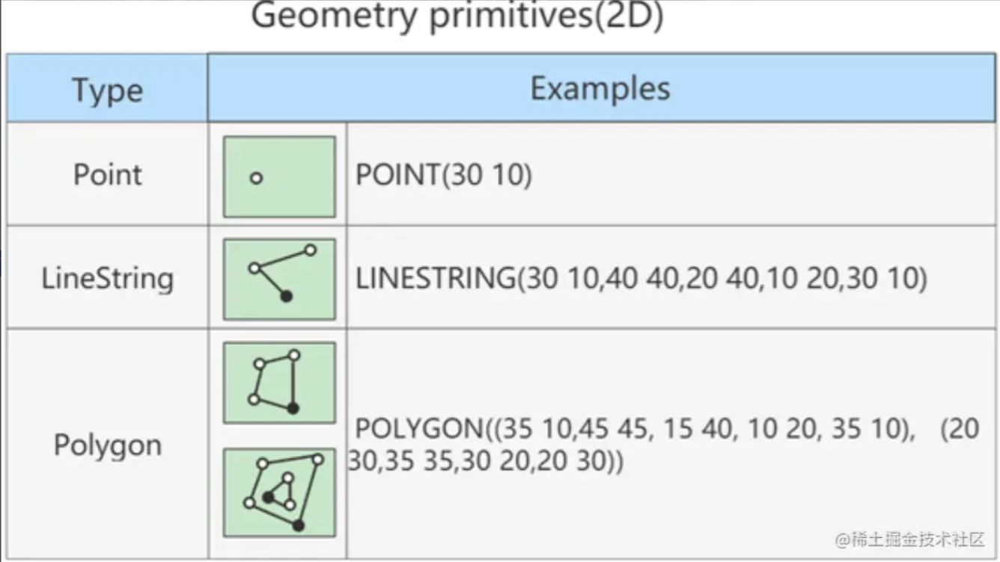
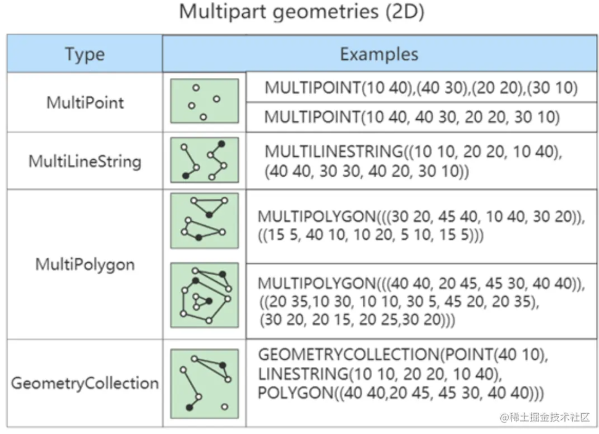

> 以 MySQL 8.0 为标准，部分弃用属性或功能将不在这里提及。
>
> ​	


## 1. MySQL中的数据类型

|        类型        |                           类型举例                           |
| :----------------: | :----------------------------------------------------------: |
|      整数类型      |    tinyint、smallint、mediumint、int(或者integer)、bigint    |
|      浮点类型      |                        float、double                         |
|     定点数类型     |                           decimal                            |
|       位类型       |                             bit                              |
|    日期时间类型    |            year、time、date、datetime、timestamp             |
|   文本字符串类型   |     char、varchar、tinytext、text、mediumtext、longtext      |
|      枚举类型      |                             enum                             |
|      集合类型      |                             set                              |
|  二进制字符串类型  |   binary、varbinary、tinyblob、blob、mediumblob、longblob    |
|      JSON类型      |                      json对象、json数组                      |
| 空间数据(单值)类型 |             geometry、point、linestring、polygon             |
| 空间数据(集合)类型 | multipoint、multilinestring、multipolygon、geometrycollection |

常见关键字，如下：

|       MySQL关键字        |           含义           |
| :----------------------: | :----------------------: |
|           null           |    数据列可包含null值    |
|         not null         |  数据列不允许包含null值  |
|         default          |          默认值          |
|       primary key        |           主键           |
|      auto_increment      | 自动递增，适用于整数类型 |
|         unsigned         |          无符号          |
| character set 字符集名称 |      指定一个字符集      |

> 加了`unsigned`之后，数据的取值范围**正数范围**翻一倍，无法再取值负数

## 2. 整数类型

### 2.1 类型介绍

整数类型一共有 5 种，包括 `TINYINT`、`SMALLINT`、`MEDIUMINT`、`INT（INTEGER）`、 `BIGINT`。 它们的区别如下表所示：

| 整数类型     | 字节 | 有符号取值范围                           | 无符号取值范围         |
| ------------ | ---- | ---------------------------------------- | ---------------------- |
| TINYINT      | 1    | -128~127                                 | 0~255                  |
| SMALLINT     | 2    | -32768~32767                             | 0~65535                |
| MEDIUMINT    | 3    | -8388608~8388607                         | 0~16777215             |
| INT、INTEGER | 4    | -2147483648~2147483647                   | 0~4294967295           |
| BIGINT       | 8    | -9223372036854775808~9223372036854775807 | 0~18446744073709551615 |

### 2.2 可选属性

整数类型的可选属性有三个：

#### 2.2.1 M 显示宽度

M : 表示显示宽度，M的取值范围是(0, 255)。例如，int(5)：当数据宽度小于5位的时候在数字前面需要用字符填满宽度。

该项功能需要配合“ `ZEROFILL` ”使用，表示`用“0”填满宽度`，否则指定显示宽度无效。 

如果设置了显示宽度，那么插入的数据宽度超过显示宽度限制，会不会截断或插入失败？

 答案：不会对插入的数据有任何影响，还是按照类型的实际宽度进行保存，即 显示宽度与类型可以存储的值范围无关 。

从`MySQL 8.0.17`开始，整数数据类型不推荐使用显示宽度属性。

 整型数据类型可以在定义表结构时指定所需要的显示宽度，如果不指定，则系统为每一种类型指定默认的宽度值。 **举例：**

```mysql
-- 创建表
CREATE TABLE test_int1 ( x TINYINT, y SMALLINT, z MEDIUMINT, m INT, n BIGINT );

-- 查看表结构 （MySQL5.7中显式如下，MySQL8中不再显式范围）
mysql> desc test_int1;
+-------+--------------+------+-----+---------+-------+
| Field | Type         | Null | Key | Default | Extra |
+-------+--------------+------+-----+---------+-------+
|   x   | tinyint(4)   | YES  |     | NULL    |       |
|  y   | smallint(6)  | YES  |     | NULL    |       |
|  z   | mediumint(9) | YES  |     | NULL    |       |
|  m   | int(11)      | YES  |     | NULL    |       |
|  n   | bigint(20)   | YES  |     | NULL    |       |
+-------+--------------+------+-----+---------+-------+
5 rows in set (0.00 sec)
```

`TINYINT`**有符号**数和**无符号**数的取值范围分别为 **-128~~127** 和 **0~~255**，**由于负号占了一个数字位，因此 TINYINT默认的显示宽度为4**。同理，其他整数类型的默认显示宽度与其有符号数的最小值的宽度相同。 **举例：**

```mysql
CREATE TABLE test_int2(
f1 INT,
f2 INT(5),
f3 INT(5) ZEROFILL
)

DESC test_int2;

INSERT INTO test_int2(f1,f2,f3) VALUES(1,123,123);

INSERT INTO test_int2(f1,f2) VALUES(123456,123456);

INSERT INTO test_int2(f1,f2,f3) VALUES(123456,123456,123456);


mysql> SELECT * FROM test_int2;
+--------+--------+--------+
| f1     | f2     | f3     |
+--------+--------+--------+
|      1 |    123 |  00123 |
| 123456 | 123456 |   NULL |
| 123456 | 123456 | 123456 |
+--------+--------+--------+
3 rows in set (0.00 sec)
```

#### 2.2.2 UNSIGNED

UNSIGNED : `无符号类型（非负）`，**所有的整数**类型都有一个**可选的属性**`UNSIGNED`（无符号属性），无符号整数类型的最小取值为0。所以，如果需要在MySQL数据库中保存非负整数值时，可以将整数类型设置为无符号类型。

>  int类型默认显示宽度为int(11)，无符号int类型默认显示宽度为int(10)。

```mysql
CREATE TABLE test_int3(
  f1 INT UNSIGNED
);

mysql> desc test_int3;
+-------+------------------+------+-----+---------+-------+
| Field | Type             | Null | Key | Default | Extra |
+-------+------------------+------+-----+---------+-------+
| f1    | int(10) unsigned | YES  |     | NULL    |       |
+-------+------------------+------+-----+---------+-------+
1 row in set (0.00 sec)

mysql> INSERT INTO test_int3(f1) VALUES(-2);
ERROR 1264 (22003): Out of range value for column 'f1' at row 1

mysql> INSERT INTO test_int3(f1) VALUES(2),(3),(4);
Query OK, 3 rows affected (0.04 sec)
Records: 3  Duplicates: 0  Warnings: 0

mysql> select * from test_int3;
+------+
| f1   |
+------+
|    2 |
|    3 |
|    4 |
+------+
3 rows in set (0.00 sec)
```

#### 2.2.3 ZEROFILL

`ZEROFILL` : **0填充,**（如果某列是ZEROFILL，那么MySQL会自动为当前列添加UNSIGNED属性），如果指定了`ZEROFILL`只是表示不够M位时，用0在左边填充，如果超过M位，只要不超过数据存储范围即可。 原来，在 int(M) 中，M 的值跟 int(M) 所占多少存储空间并无任何关系。 int(3)、int(4)、int(8) 在磁盘上都是占用 4 bytes 的存储空间。也就是说，**int(M)，必须和UNSIGNED ZEROFILL一起使用才有意义**。如果整数值超过M位，就按照实际位数存储。只是无须再用字符 0 进行填充。

### 2.3 适用场景

- `TINYINT` ：一般用于枚举数据，比如系统设定取值范围很小且固定的场景。
- `SMALLINT` ：可以用于较小范围的统计数据，比如统计工厂的固定资产库存数量等。
- `MEDIUMINT `：用于较大整数的计算，比如车站每日的客流量等。
- `INT` / `INTEGER `：取值范围足够大，一般情况下不用考虑超限问题，用得最多。比如商品编号。
- `BIGINT` ：只有当你处理特别巨大的整数时才会用到。比如双十一的交易量、大型门户网站点击量、证券公司衍生产品持仓等。

### 2.4 如何选择？

在评估用哪种整数类型的时候，你需要考虑 存储空间 和 可靠性 的平衡问题：一方 面，用占用字节数少的整数类型可以节省存储空间；另一方面，要是为了节省存储空间， 使用的整数类型取值范围太小，一旦遇到超出取值范围的情况，就可能引起 系统错误 ，影响可靠性。

举个例子，商品编号采用的数据类型是 INT。原因就在于，客户门店中流通的商品种类较多，而且，每天都有旧商品下架，新商品上架，这样不断迭代，日积月累。 如果使用 SMALLINT 类型，虽然占用字节数比 INT 类型的整数少，但是却不能保证数据不会超出范围65535。相反，使用 INT，就能确保有足够大的取值范围，不用担心数据超出范围影响可靠性的问题。 

你要注意的是，在实际工作中，系统故障产生的成本远远超过增加几个字段存储空间所产生的成本。因此，我建议你首先确保数据不会超过取值范围，在这个前提之下，再去考虑如何节省存储空间。

## 3. 浮点类型

### 3.1 类型介绍

浮点数和定点数类型的特点是可以 处理小数 ，你可以把整数看成小数的一个特例。因此，浮点数和定点数的使用场景，比整数大多了。 MySQL支持的浮点数类型，分别是 `FLOAT、DOUBLE、REAL`。

- `FLOAT` 表示`单精度`浮点数；
- `DOUBLE` 表示`双精度`浮点数；
- `REAL`**默认就是 DOUBLE**。如果你把 **SQL 模式**设定为启用“ **REAL_AS_FLOAT** ”，那 么，**MySQL** 就认为**REAL 是 FLOAT**。如果要启用“REAL_AS_FLOAT”，可以通过以下 SQL 语句实现：`SET sql_mode = "REAL_AS_FLOAT";`

|  类型  |                       有符号数取值范围                       |                   无符号数取值范围                   | 占用字节数 |
| :----: | :----------------------------------------------------------: | :--------------------------------------------------: | :--------: |
| FLOAT  | (-3.402823466E+38,-1.175494351E-38),0,(1.175494351E-38,3.402823466351E+38) |         0,(1.175494351E-38,3.402823466E+38)          |     4      |
| DOUBLE | （-1.7976931348623157E+308，-2.2250738585072014E-308），0，(2.2250738585072014E-308,1.7976931348623157E+308) | 0，(2.2250738585072014E-308,1.7976931348623157E+308) |     8      |

**问题1：FLOAT 和 DOUBLE 这两种数据类型的区别是啥呢？**

 `FLOAT` 占用字节数少，取值范围小；`DOUBLE` 占用字节数多，取值范围也大。

**问题2：为什么浮点数类型的无符号数取值范围，只相当于有符号数取值范围的一半，也就是只相当于有符号数取值范围大于等于零的部分呢？**

 MySQL 存储浮点数的格式为： 符号(S) 、 尾数(M) 和 阶码(E) 。因此，无论有没有符号，MySQL 的浮 点数都会存储表示符号的部分。因此， **所谓的无符号数取值范围，其实就是有符号数取值范围大于等于 零的部分。**

### 3.2 数据精度说明

对于浮点类型，在MySQL中单精度值使用 4 个字节，双精度值使用 8 个字节。

- MySQL允许使用 非标准语法 （其他数据库未必支持，因此如果涉及到数据迁移，则最好不要这么用）： `FLOAT(M,D)` 或` DOUBLE(M,D) `。这里，**M称为 精度 ，D称为 标度** 。(M,D)中 M=整数位+小数位，D=小数位。 D<=M<=255，0<=D<=30。例如，定义为FLOAT(5,2)的一个列可以显示为-999.99~999.99。如果超过这个范围会报错。
- FLOAT和DOUBLE类型在不指定(M,D)时，默认会按照实际的精度（由实际的硬件和操作系统决定）来显示。说明：**浮点类型，也可以加 UNSIGNED ，但是不会改变数据范围**，例如：FLOAT(3,2) UNSIGNED仍然只能表示0~9.99的范围。
- 不管是否显式设置了精度(M,D)，这里MySQL的处理方案如下：
    - 如果存储时，整数部分超出了范围，MySQL就会报错，不允许存这样的值
    - 如果存储时，小数点部分若超出范围，就分以下情况：
        - 若四舍五入后，整数部分没有超出范围，则只警告，但能成功操作并四舍五入删除多余的小数位后保存。例如在`FLOAT(5,2)`列内插入999.009，近似结果是999.01。
        - 若四舍五入后，整数部分超出范围，则MySQL报错，并拒绝处理。如`FLOAT(5,2)`列内插入999.995和-999.995都会报错。
- 从MySQL 8.0.17开始，`FLOAT(M,D)` 和`DOUBLE(M,D)`用法在官方文档中已经明确不推荐使用，将来可能被移除。另外，关于浮点型`FLOAT`和`DOUBLE`的`UNSIGNED`也不推荐使用了，将来也可能被移除。

```mysql	
CREATE TABLE test_double1(
f1 FLOAT,
f2 FLOAT(5,2),
f3 DOUBLE,
f4 DOUBLE(5,2)
);

DESC test_double1;

INSERT INTO test_double1
VALUES(123.456,123.456,123.4567,123.45);
#Out of range value for column 'f2' at row 1

INSERT INTO test_double1
VALUES(123.456,1234.456,123.4567,123.45); 

SELECT * FROM test_double1;
```

### 3.3 精度误差说明

浮点数类型有个缺陷，就是不精准。下面我来重点解释一下为什么 MySQL 的浮点数不够精准。比如，我们设计一个表，有f1这个字段，插入值分别为0.47,0.44,0.19，我们期待的运行结果是：0.47 + 0.44 + 0.19 =1.1。而使用sum之后查询：

```mysql
CREATE TABLE test_double2(
  f1 DOUBLE
);

INSERT INTO test_double2 VALUES(0.47),(0.44),(0.19);

mysql> SELECT SUM(f1)
    -> FROM test_double2;
+--------------------+
| SUM(f1)            |
+--------------------+
| 1.0999999999999999 |
+--------------------+
1 row in set (0.00 sec)

mysql> SELECT SUM(f1) = 1.1,1.1 = 1.1
    -> FROM test_double2;
+---------------+-----------+
| SUM(f1) = 1.1 | 1.1 = 1.1 |
+---------------+-----------+
|             0 |         1 |
+---------------+-----------+
1 row in set (0.00 sec)
```

查询结果是 1.0999999999999999。看到了吗？虽然误差很小，但确实有误差。 你也可以尝试把数据类型改成 `FLOAT`，然后运行求和查询，得到的是， 1.0999999940395355。显然，误差更大了。 那么，为什么会存在这样的误差呢？问题还是出在 MySQL 对浮点类型数据的存储方式上。 MySQL 用 4 个字节存储 `FLOAT` 类型数据，用 8 个字节来存储 `DOUBLE` 类型数据。无论哪个，都是采用二进制的方式来进行存储的。比如 9.625，用二进制来表达，就是 1001.101，或者表达成 1.001101×2^3。如果尾数不是 0 或 5（比如 9.624），你就无法用一个二进制数来精确表达。进而，就只好在取值允许的范围内进行四舍五入。 在编程中，如果用到浮点数，要特别注意误差问题，**因为浮点数是不准确的，所以我们要避免使用“=”来判断两个浮点数是否相等**。同时，在一些对精确度要求较高的项目中，千万不要使用浮点数，不然会导致结果错误，甚至是造成不可挽回的损失。那么，MySQL 有没有精准的数据类型呢？当然有，这就是定点数类型： `DECIMAL` 。

## 4. 定点数类型

### 4.1 类型介绍

MySQL中的**定点数类型**只有 `DECIMAL` 一种类型。

| 数据类型                 | 字节数  | 含义               |
| ------------------------ | ------- | ------------------ |
| DECIMAL(M,D),DEC,NUMERIC | M+2字节 | 有效范围由M和D决定 |

使用 `DECIMAL(M,D)` 的方式表示`高精度小数`。其中，`M被称为精度`，`D被称为标度`。**0<=M<=65，0<=D<=30，D<M**。例如，定义DECIMAL（5,2）的类型，表示该列取值范围是-999.99~999.99。

- `DECIMAL(M,D)`的**最大取值范围与DOUBLE类型一样**，但是**有效的数据范围是由M和D决定**的。
- `DECIMAL` 的存储空间并不是固定的，由`精度值`M决定，总共占用的存储空间为M+2个字节。也就是说，在一些对精度要求不高的场景下，比起占用同样字节长度的定点数，浮点数表达的数值范围可以更大一些。
- 定点数在MySQL内部是**以 字符串 的形式进行存储**，这就决定了它一定是精准的。
- 当DECIMAL类型不指定精度和标度时，其**默认为DECIMAL(10,0)**。当数据的精度`超出`了定点数类型的精度范围时，则MySQL同样会进行`四舍五入`处理。
- 浮点数 vs 定点数
    - 浮点数相对于定点数的优点是在长度一定的情况下，浮点类型取值范围大，但是不精准，适用于需要取值范围大，又可以容忍微小误差的科学计算场景（比如计算化学、分子建模、流体动力学等）
    - 定点数类型取值范围相对小，但是精准，没有误差，适合于对精度要求极高的场景 （比如涉及金额计算的场景）
- 举例

```sql
CREATE TABLE test_decimal1(
  f1 DECIMAL,
  f2 DECIMAL(5,2)
);

DESC test_decimal1;

INSERT INTO test_decimal1(f1,f2)
VALUES(123.123,123.456);
#Out of range value for column 'f2' at row 1

INSERT INTO test_decimal1(f2)
VALUES(1234.34);

mysql> SELECT * FROM test_decimal1;
+------+--------+
| f1   | f2     |
+------+--------+
|  123 | 123.46 |
+------+--------+
1 row in set (0.00 sec)
```

- 举例

```sql
-- 我们运行下面的语句，把test_double2表中字段“f1”的数据类型修改为 DECIMAL(5,2)：
ALTER TABLE test_double2 MODIFY f1 DECIMAL(5,2);

-- 然后，我们再一次运行求和语句：
mysql> SELECT SUM(f1)
    -> FROM test_double2;
+---------+
| SUM(f1) |
+---------+
|    1.10 |
+---------+
1 row in set (0.00 sec)

mysql> SELECT SUM(f1) = 1.1
    -> FROM test_double2;
+---------------+
| SUM(f1) = 1.1 |
+---------------+
|             1 |
+---------------+
1 row in set (0.00 sec)
```

### 4.2 开发中经验

“由于 DECIMAL 数据类型的精准性，在我们的项目中，除了极少数（比如商品编号）用到整数类型外，其他的数值都用的是 DECIMAL，原因就是这个项目所处的零售行业，要求精准，一分钱也不能差。 ” ——来自某项目经理

## 5. 位类型：BIT

BIT类型中存储的是二进制值，类似010110。

| 二进制字符串类型 | 长度 | 长度范围 | 占用空间             |
| ---------------- | ---- | -------- | -------------------- |
| BIT(M)           | M    | 1<=M<=64 | 约为（M+7）/ 8个字节 |

BIT类型，如果没有指定(M)，**默认是1位**。这个1位，表示只能存1位的二进制值。这里(M)是表示二进制的位数，位数**最小值为1，最大值为64**。

```mysql
CREATE TABLE test_bit1(
  f1 BIT,
  f2 BIT(5),
  f3 BIT(64)
);

INSERT INTO test_bit1(f1) VALUES(1);

mysql> INSERT INTO test_bit1(f1) VALUES(2);
ERROR 1406 (22001): Data too long for column 'f1' at row 1

mysql> INSERT INTO test_bit1(f2) VALUES(23);
Query OK, 1 row affected (0.01 sec)
```

> 注意：在向BIT类型的字段中插入数据时，一定要确保插入的数据在BIT类型支持的范围内。 使用SELECT命令查询位字段时，可以用 `BIN() `或 `HEX() `函数进行读取。

```mysql
mysql> SELECT * FROM test_bit1;
+------------+------------+------------+
| f1         | f2         | f3         |
+------------+------------+------------+
| 0x01       | NULL       | NULL       |
| NULL       | 0x17       | NULL       |
+------------+------------+------------+
2 rows in set (0.00 sec)

mysql> SELECT BIN(f2),HEX(f2)
    -> FROM test_bit1;
+---------+---------+
| BIN(f2) | HEX(f2) |
+---------+---------+
| NULL    | NULL    |
| 10111   | 17      |
+---------+---------+
2 rows in set (0.00 sec)

mysql> SELECT f2 + 0 FROM test_bit1;
+--------+
| f2 + 0 |
+--------+
|   NULL |
|     23 |
+--------+
2 rows in set (0.00 sec)
```

可以看到，使用b+0查询数据时，可以直接查询出存储的十进制数据的值。

## 6. 日期与时间类型

日期与时间是重要的信息，在我们的系统中，几乎所有的数据表都用得到。原因是客户需要知道数据的时间标签，从而进行数据查询、统计和处理。 MySQL有多种表示日期和时间的数据类型，不同的版本可能有所差异

MySQL8.0版本支持的日期和时间类型主要有：`YEAR`类型、`TIME`类型、`DATE`类型、`DATETIME`类型和`TIMESTAMP`类型。

- `YEAR` 类型通常用来表示`年`
- `DATE` 类型通常用来表示`年、月、日`
- `TIME `类型通常用来表示`时、分、秒`
- `DATETIME `类型通常用来表示`年、月、日、时、分、秒`
- `TIMESTAMP` 类型通常用来表示`带时区`的`年、月、日、时、分、秒`

| 类型      | 名称     | 字节 | 日期格式            | 最小值                  | 最大值                  |
| --------- | -------- | ---- | ------------------- | ----------------------- | ----------------------- |
| YEAR      | 年       | 1    | YYYY或YY            | 1901                    | 2155                    |
| TIME      | 时间     | 3    | HH:MM:SS            | -838:59:59              | 838:59:59               |
| DATE      | 日期     | 3    | YYYY-MM-DD          | 1000-01-01              | 9999-12-03              |
| DATETIME  | 日期时间 | 8    | YYYY-MM-DD HH:MM:SS | 1000-01-01 00:00:00     | 9999-12-31 23:59:59     |
| TIMESTAMP | 日期时间 | 4    | YYYY-MM-DD HH:MM:SS | 1000-01-01 00:00:00 UTC | 2038-01-19 03:14:07 UTC |

可以看到，不同数据类型表示的时间内容不同、取值范围不同，而且占用的字节数也不一样，你要根据 实际需要灵活选取。 

为什么时间类型 `TIME` 的取值范围不是 -23:59:59～23:59:59 呢？原因是 MySQL 设计的 TIME 类型**，不光表 示一天之内的时间，而且可以用来表示一个时间间隔**，这个时间间隔可以超过 24 小时。

### 6.1 YEAR类型

**YEAR类型用来表示年份**，在所有的日期时间类型中所占用的存储空间最小，只需要 1个字节 的存储空间。 在MySQL中，YEAR有以下几种存储格式：

- 以4位字符串或数字格式表示YEAR类型，其格式为YYYY，最小值为1901，最大值为2155。
- 以2位字符串格式表示YEAR类型，最小值为00，最大值为99。
    - 当取值为01到69时，表示2001到2069；
    - 当取值为70到99时，表示1970到1999；
    - 当取值整数的0或00添加的话，那么是0000年；
    - 当取值是日期/字符串的'0'添加的话，是2000年。

**从MySQL5.5.27开始，2位格式的YEAR已经不推荐使用。YEAR默认格式就是“YYYY”，没必要写成YEAR(4)，** **从MySQL 8.0.19开始，不推荐使用指定显示宽度的YEAR(4)数据类型。**

```sql
CREATE TABLE test_year(
  f1 YEAR,
  f2 YEAR(4)
);

mysql> DESC test_year;
+-------+---------+------+-----+---------+-------+
| Field | Type    | Null | Key | Default | Extra |
+-------+---------+------+-----+---------+-------+
| f1    | year(4) | YES  |     | NULL    |       |
| f2    | year(4) | YES  |     | NULL    |       |
+-------+---------+------+-----+---------+-------+
2 rows in set (0.00 sec)

INSERT INTO test_year VALUES('2020','2021');

mysql> SELECT * FROM test_year;
+------+------+
| f1   | f2   |
+------+------+
| 2020 | 2021 |
+------+------+
1 rows in set (0.00 sec)

INSERT INTO test_year VALUES('45','71');

INSERT INTO test_year VALUES(0,'0');

mysql> SELECT * FROM test_year;
+------+------+
| f1   | f2   |
+------+------+
| 2020 | 2021 |
| 2045 | 1971 |
| 0000 | 2000 |
+------+------+
3 rows in set (0.00 sec)
```

### 6.2 DATE类型

**DATE类型表示日期，没有时间部分，格式为 YYYY-MM-DD ，**其中，**YYYY表示年份，MM表示月份，DD表示日期**。需要 3个字节 的存储空间。在向DATE类型的字段插入数据时，同样需要满足一定的格式条件。

- 以 `YYYY-MM-DD` 格式或者 `YYYYMMDD` 格式表示的字符串日期，其最小取值为1000-01-01，最大取值为9999-12-03。`YYYYMMDD`格式**会被转化**为`YYYY-MM-DD`格式。
- 以 `YY-MM-DD `格式或者 `YYMMDD` 格式表示的字符串日期，此格式中，年份为两位数值或字符串满足YEAR类型的格式条件为：**当年份取值为00到69时，会被转化为2000到2069；当年份取值为70到99时，会被转化为1970到1999**。
- 使用 `CURRENT_DATE()` 或者` NOW() `函数，会**插入当前系统的日期**。

*举例：* *创建数据表，表中只包含一个DATE类型的字段f1。*

```sql
CREATE TABLE test_date1(
  f1 DATE
);
Query OK, 0 rows affected (0.13 sec)
```

插入数据：

```sql
INSERT INTO test_date1
VALUES ('2020-10-01'), ('20201001'),(20201001);

INSERT INTO test_date1
VALUES ('00-01-01'), ('000101'), ('69-10-01'), ('691001'), ('70-01-01'), ('700101'), 
('99-01-01'), ('990101');

INSERT INTO test_date1
VALUES (000301), (690301), (700301), (990301); 

INSERT INTO test_date1
VALUES (CURRENT_DATE()), (NOW());

SELECT * FROM test_date1;
```

### 6.3 TIME类型

**TIME类型用来表示时间，不包含日期部分。**在MySQL中，需要 3个字节 的存储空间来存储TIME类型的数 据，可以使用“`HH:MM:SS`”格式来表示TIME类型，其中，HH表示小时，MM表示分钟，SS表示秒。 在MySQL中，向`TIME`类型的字段插入数据时，也可以使用几种不同的格式。 

（1）可以使用带有冒号的 字符串，比如' `D HH:MM:SS`' 、' `HH:MM:SS` '、' `HH:MM` '、' `D HH:MM `'、' `D HH `'或' `SS` '格式，都能被正 确地插入`TIME`类型的字段中。其中`D表示天`，其`最小值为0`，`最大值为34`。**如果使用带有`D`格式的字符串 插入`TIME`类型的字段时，`D`会被转化为`小时`，计算格式为`D*24+HH`**。当使用**带有冒号并且不带D的字符串 表示时间时，表示当天的时间**，比如12:10表示12:10:00，而不是00:12:10。 

（2）可以使用不带有冒号的 字符串或者数字，格式为' `HHMMSS` '或者 `HHMMSS` 。如果插入一个**不合法**的字符串或者数字，MySQL在存 储数据时，会将其**自动转化为00:00:00进行存储**。比如1210，MySQL会将最右边的两位解析成秒，表示 00:12:10，而不是12:10:00。 

（3）使用 `CURRENT_TIME()` 或者 `NOW()` ，会插入当前系统的时间。

*举例：* *创建数据表，表中包含一个TIME类型的字段f1。*

```sql
CREATE TABLE test_time1(
  f1 TIME
);
Query OK, 0 rows affected (0.02 sec)

INSERT INTO test_time1
VALUES('2 12:30:29'), ('12:35:29'), ('12:40'), ('2 12:40'),('1 05'), ('45');

INSERT INTO test_time1
VALUES ('123520'), (124011),(1210);

INSERT INTO test_time1
VALUES (NOW()), (CURRENT_TIME());

SELECT * FROM test_time1;
```

### 6.4 DATETIME类型

DATETIME类型在所有的日期时间类型中占用的存储空间最大，总共需要 ==8 个字节==的存储空间。**在格式上为DATE类型和TIME类型的组合**，可以表示为 YYYY-MM-DD HH:MM:SS ，其中YYYY表示年份，MM表示月份，DD表示日期，HH表示小时，MM表示分钟，SS表示秒。 在向DATETIME类型的字段插入数据时，同样需要满足一定的格式条件。

- 以 `YYYY-MM-DD HH:MM:SS` 格式或者 `YYYYMMDDHHMMSS `格式的字符串插入DATETIME类型的字段时，最小值为1000-01-01 00:00:00，最大值为9999-12-03 23:59:59。
- 以YYYYMMDDHHMMSS格式的数字插入DATETIME类型的字段时，会被转化为YYYY-MM-DDHH:MM:SS格式。
- 以 YY-MM-DD HH:MM:SS 格式或者 YYMMDDHHMMSS 格式的字符串插入DATETIME类型的字段时，两位数的年份规则符合YEAR类型的规则，00到69表示2000到2069；70到99表示1970到1999。
- 使用函数 `CURRENT_TIMESTAMP()` 和 `NOW()` ，可以向DATETIME类型的字段插入系统的当前日期和时间。

*举例：* *创建数据表，表中包含一个DATETIME类型的字段dt。*

```sql
CREATE TABLE test_datetime1(
  dt DATETIME
);
Query OK, 0 rows affected (0.02 sec)

-- 插入数据：
INSERT INTO test_datetime1
VALUES ('2021-01-01 06:50:30'), ('20210101065030');

INSERT INTO test_datetime1
VALUES ('99-01-01 00:00:00'), ('990101000000'), ('20-01-01 00:00:00'), 
('200101000000');

INSERT INTO test_datetime1
VALUES (20200101000000), (200101000000), (19990101000000), (990101000000);
 
INSERT INTO test_datetime1
VALUES (CURRENT_TIMESTAMP()), (NOW());
```

### 6.5 TIMESTAMP类型

TIMESTAMP类型也可以表示日期时间，其显示格式与DATETIME类型相同，都是 `YYYY-MM-DD HH:MM:SS` ，需要==4个字节==的存储空间。但是TIMESTAMP存储的时间范围比DATETIME要小很多，只能存储“1970-01-01 00:00:01 UTC”到“2038-01-19 03:14:07 UTC”之间的时间。其中，==UTC表示世界统一时间==，也叫作世界标准时间。 存储数据的时候需要对当前时间所在的时区进行转换，查询数据的时候再将时间转换回当前的时区。因此，使用TIMESTAMP存储的同一个时间值，在不同的时区查询时会显示不同的时间。 向TIMESTAMP类型的字段插入数据时，当插入的数据格式满足YY-MM-DD HH:MM:SS和YYMMDDHHMMSS时，两位数值的年份同样符合YEAR类型的规则条件，只不过表示的时间范围要小很多。 **如果向TIMESTAMP类型的字段插入的时间超出了TIMESTAMP类型的范围，则MySQL会抛出错误信息。**

*举例：* *创建数据表，表中包含一个TIMESTAMP类型的字段ts。*

```sql
CREATE TABLE test_timestamp1(
  ts TIMESTAMP
);

INSERT INTO test_timestamp1
VALUES ('1999-01-01 03:04:50'), ('19990101030405'), ('99-01-01 03:04:05'), 
('990101030405');

INSERT INTO test_timestamp1
VALUES ('2020@01@01@00@00@00'), ('20@01@01@00@00@00');

INSERT INTO test_timestamp1
VALUES (CURRENT_TIMESTAMP()), (NOW());

#Incorrect datetime value
INSERT INTO test_timestamp1
VALUES ('2038-01-20 03:14:07');
```

> **==TIMESTAMP==和==DATETIME==的区别：**
>
> - `TIMESTAMP`存储空间比较小，表示的日期时间范围也比较小
> - 底层存储方式不同，`TIMESTAMP`底层存储的是`毫秒值`，距离1970-1-1 0:0:0 0毫秒的毫秒值。
> - 两个日期比较大小或日期计算时，`TIMESTAMP`更方便、更快。
> - `TIMESTAMP`和时区有关。`TIMESTAMP`会根据用户的时区不同，显示不同的结果。而`DATETIME`则只能反映出插入时当地的时区，其他时区的人查看数据必然会有误差的。
>
> ```sql
> mysql> CREATE TABLE temp_time(
>     ->   d1 DATETIME,
>     ->   d2 TIMESTAMP
>     -> );
> Query OK, 0 rows affected (0.03 sec)
> 
> mysql> INSERT INTO temp_time VALUES('2022-6-10 22:17:52','2022-6-10 22:17:52');
> Query OK, 1 row affected (0.06 sec)
> 
> mysql> INSERT INTO temp_time VALUES(NOW(),NOW());
> Query OK, 1 row affected (0.01 sec)
> 
> mysql> SELECT * FROM temp_time;
> +---------------------+---------------------+
> | d1                  | d2                  |
> +---------------------+---------------------+
> | 2022-06-10 22:17:52 | 2022-06-10 22:17:52 |
> | 2022-06-10 22:17:33 | 2022-06-10 22:17:33 |
> +---------------------+---------------------+
> 2 rows in set (0.00 sec)
> 
> #修改当前的时区
> mysql> SET time_zone = '+9:00';
> Query OK, 0 rows affected (0.00 sec)
> 
> mysql> SELECT * FROM temp_time;
> +---------------------+---------------------+
> | d1                  | d2                  |
> +---------------------+---------------------+
> | 2022-06-10 22:17:52 | 2022-06-10 23:17:52 |
> | 2022-06-10 22:17:33 | 2022-06-10 23:17:33 |
> +---------------------+---------------------+
> 2 rows in set (0.00 sec)
> ```

### 6.6 开发经验

用得最多的日期时间类型，就是 `DATETIME` 。虽然 MySQL 也支持 YEAR（年）、 TIME（时间）、DATE（日期），以及 TIMESTAMP 类型，但是在实际项目中，**尽量用 DATETIME 类型**。因为这个数据类型包括了完整的日期和时间信息，取值范围也最大，使用起来比较方便。毕竟，如果日期时间信息分散在好几个字段，很不容易记，而且查询的时候，SQL 语句也会更加复杂。 

此外，一般存注册时间、商品发布时间等，`不建议`使用`DATETIME`存储，而是使用 `时间戳` ，因为DATETIME虽然直观，但不便于计算。

```sql
mysql> SELECT UNIX_TIMESTAMP();
+------------------+
| UNIX_TIMESTAMP() |
+------------------+
|       1654870792 |
+------------------+
1 row in set (0.00 sec)
```

## 7. 文本字符串类型☆☆☆

在实际的项目中，我们还经常遇到一 种数据，就是字符串数据。 MySQL中，文本字符串总体上分为 `CHAR 、 VARCHAR 、 TINYTEXT 、 TEXT 、 MEDIUMTEXT 、LONGTEXT 、 ENUM 、 SET `等类型。

|    类型    | 值的长度 |     长度范围     |     占用空间     |
| :--------: | :------: | :--------------: | :--------------: |
|  Char(M)   |    M     |    0<=M<=255     |     M个字节      |
| varchar(M) |    M     |   0<=M<=65535    |    M+1个字节     |
|  tinytext  |    L     |    0<=L<=255     |    L+2个字节     |
|    text    |    L     |   0<=L<=65535    |    L+2个字节     |
| mediumtext |    L     |  0<=L<=16777215  |    L+3个字节     |
|  longtext  |    L     | 0<=L<=4294967295 |    L+4个字节     |
|    enum    |    L     |   1<=L<=65535    |    1或2个字节    |
|    set     |    L     |     0<=L<=64     | 1,2,3,4或8个字节 |

### 7.1 CHAR与VARCHAR类型

CHAR和VARCHAR类型都可以存储比较短的字符串。

| 字符串（文本类型） |   特点   | 长度 |  长度范围   |    占用的存储空间    |
| :----------------: | :------: | :--: | :---------: | :------------------: |
|      char(M)       | 固定长度 |  M   |  0<=M<=255  |       M个字节        |
|     varchar(M)     | 可变长度 |  M   | 0<=M<=65535 | （实际长度+1）个字节 |

**CHAR类型：**

- `CHAR(M)` 类型一般**需要预先定义字符串长度**。如果`不指定`(M)，则表示长度`默认是1`个字符。
- 如果保存时，**数据的实际长度**比`CHAR类型`声明的长度`小`，则会在 右侧填充 空格以达到指定的长度。当MySQL检索`CHAR`类型的数据时，`CHAR`类型的字段会去除尾部的空格。
- 定义`CHAR`类型字段时，声明的**字段长度**即为CHAR类型字段所占的**存储空间的字节数**。

```sql
mysql> CREATE TABLE test_char1(
    -> c1 CHAR,
    -> c2 CHAR(5)
    -> );
Query OK, 0 rows affected (0.07 sec)

mysql> DESC test_char1;
+-------+---------+------+-----+---------+-------+
| Field | Type    | Null | Key | Default | Extra |
+-------+---------+------+-----+---------+-------+
| c1    | char(1) | YES  |     | NULL    |       |
| c2    | char(5) | YES  |     | NULL    |       |
+-------+---------+------+-----+---------+-------+
2 rows in set (0.02 sec)

mysql> INSERT INTO test_char1
    -> VALUES('a','Tom');
Query OK, 1 row affected (0.02 sec)

mysql> SELECT c1,CONCAT(c2,'***') FROM test_char1;
+------+------------------+
| c1   | CONCAT(c2,'***') |
+------+------------------+
| a    | Tom***           |
+------+------------------+
1 row in set (0.01 sec)

mysql> INSERT INTO test_char1(c2)
    -> VALUES('a  ');
Query OK, 1 row affected (0.04 sec)

mysql> SELECT CHAR_LENGTH(c2)
    -> FROM test_char1;
+-----------------+
| CHAR_LENGTH(c2) |
+-----------------+
|               3 |
|               1 |
+-----------------+
2 rows in set (0.00 sec)
```

**VARCHAR类型：**

- `VARCHAR(M)` 定义时， **必须指定** 长度`M`，否则报错。
- MySQL`4.0`版本以下，varchar(20)：指的是`20字节`，如果存放UTF8汉字时，只能存6个（每个汉字3字节） ；MySQL`5.0`版本以上，varchar(20)：指的是`20字符`。
- 检索`VARCHAR`类型的字段数据时，会保留数据尾部的空格。`VARCHAR`类型的字段所占用的**存储空间**为`字符串实际长度加1个字节`。

```sql
CREATE TABLE test_varchar1(
  NAME VARCHAR  #错误
);

#Column length too big for column 'NAME' (max = 21845);
CREATE TABLE test_varchar2(
  NAME VARCHAR(65535)  #错误
);

CREATE TABLE test_varchar3(
  NAME VARCHAR(5)
);
INSERT INTO test_varchar3
VALUES('尚硅谷'),('尚硅谷教育');

#Data too long for column 'NAME' at row 1
INSERT INTO test_varchar3
VALUES('尚硅谷IT教育');
```

**哪些情况使用 CHAR 或 VARCHAR 更**

|   类型   |   特点   |    空间上    | 时间上 |       适用场景       |
| :------: | :------: | :----------: | :----: | :------------------: |
| CHAR(M)  | 固定长度 | 浪费存储空间 | 效率高 | 存储不大，速度要求高 |
| VARCHART | 可变长度 | 节省存储空间 | 效率低 |     非CHAR的情况     |

**情况1：存储很短的信息。** 比如门牌号码101，201……这样很短的信息应该用`char`，因为`varchar`还要占个`byte`用于存储信息长度，本来打算节约存储的，结果得不偿失。 

**情况2：固定长度的。** 比如使用`uuid`作为主键，那用char应该更合适。因为他固定长度，varchar动态根据长度的特性就消失了，而且还要占个长度信息。

 **情况3：十分频繁改变的column。** 因为varchar每次存储都要有额外的计算，得到长度等工作，如果一个非常频繁改变的，那就要有很多的精力用于计算，而这些对于char来说是不需要的。 

**情况4：具体存储引擎中的情况：**

- `MyISAM 数据存储引擎`和数据列：MyISAM数据表，最好使用固定长度(**CHAR**)的数据列代替可变长度(VARCHAR)的数据列。这样使得整个表静态化，从而使 数据检索更快 ，用空间换时间。
- `MEMORY 存储引擎`和数据列：MEMORY数据表目前都使用固定长度的数据行存储，因此无论使用CHAR或VARCHAR列都没有关系，**两者都**是作为CHAR类型处理的。
- `InnoDB 存储引擎`，建议使用**VARCHAR类型**。因为对于InnoDB数据表，内部的行存储格式并没有区分固定长度和可变长度列（所有数据行都使用指向数据列值的头指针），而且主要影响性能的因素是数据行使用的存储总量，由于char平均占用的空间多于varchar，所以除了简短并且固定长度的，其他考虑varchar。这样节省空间，对磁盘I/O和数据存储总量比较好。

### 7.2 TEXT类型

在`MySQL`中，`TEXT`用来保存`文本类型的字符串`，总共包含4种类型，分别为`TINYTEXT`、`TEXT`、`MEDIUMTEXT` 和 `LONGTEXT` 类型。 在向`TEXT`类型的字段`保存`和`查询数据`时，系统**自动按照实际长度存储，不需要预先定义长度**。这一点和`VARCHAR`类型相同。 每种`TEXT`类型保存的数据长度和所占用的存储空间不同，如下：

| 文本字符串类型 |        特定        | 长度 |          长度范围           | 占用的存储空间 |
| :------------: | :----------------: | :--: | :-------------------------: | :------------: |
|    TINYTEXT    |  小文本，可变长度  |  L   |          0<=L<=255          |   L+2个字节    |
|      TEXT      |   文本，可变长度   |  L   |         0<=L<=65535         |   L+2个字节    |
|   MEDIUMTEXT   | 中等文本，可变长度 |  L   |       0<=L<=16777215        |   L+3个字节    |
|    LONGTEXT    |  大文本，可变长度  |  L   | 0<=L<=4294967295(相当于4GB) |   L+4个字节    |

由于实际存储的长度不确定，`MySQL` **不允许** `TEXT` 类型的字段做`主键`。遇到这种情况，你只能采用`CHAR(M)`，或者 `VARCHAR(M)`。

举例：

```sql
CREATE TABLE test_text(
tx TEXT
);

INSERT INTO test_text VALUES('atguigu   ');

SELECT CHAR_LENGTH(tx) FROM test_text; #10
```

说明在保存和查询数据时，**并没有删除**`TEXT`类型的**数据尾部的空格**。

**开发中经验：** `TEXT`文本类型，可以存比较大的文本段，搜索速度稍慢，因此如果不是特别大的内容，建议使用`CHAR`，`VARCHAR`来代替。还有`TEXT`类型**不用加默认值，加了也没用**。而且`text`和`blob`类型的数据删除后容易导致“空洞”，使得文件碎片比较多，所以**频繁使用的表不建议包含TEXT类型字段，建议单独分出去，单独用一个表**。

## 8. ENUM类型

`ENUM`类型也叫作`枚举类型`，`ENUM`类型的**取值范围需要在定义字段时进行指定**。

设置字段值时，`ENUM`类型**只允许从成员中选取单个值，不能一次选取多个值**。 其所需要的存储空间由定义`ENUM`类型时指定的`成员个数`决定。

| 文本字符串类型 | 长度 |  长度范围   | 占用的存储空间 |
| :------------: | :--: | :---------: | :------------: |
|      ENUM      |  L   | 0<=L<=65535 |   1或2个字节   |

- 当`ENUM`类型包含`1～255`个成员时，需要`1个字节`的存储空间；
- 当`ENUM`类型包含`256～65535`个成员时，需要`2个字节`的存储空间。
- `ENUM`类型的成员`个数`的`上限`为`65535`个。

*举例：*

```sql
CREATE TABLE test_enum(
season ENUM('春','夏','秋','冬','unknow')
);

INSERT INTO test_enum
VALUES('春'),('秋');

# 忽略大小写
INSERT INTO test_enum
VALUES('UNKNOW');

# 允许按照角标的方式获取指定索引位置的枚举值
INSERT INTO test_enum
VALUES('1'),(3);

# Data truncated for column 'season' at row 1
INSERT INTO test_enum
VALUES('ab');

# 当ENUM类型的字段没有声明为NOT NULL时，插入NULL也是有效的
INSERT INTO test_enum
VALUES(NULL);
```

## 9. SET类型

`SET`表示`一个字符串对象`，可以包含`0个`或`多个`成员，但成员`个数`的`上限`为 `64` 。设置字段值时，可以取取值范围内的 **0 个或多个值**。 当`SET`类型包含的成员个数不同时，其所占用的存储空间也是不同的，具体如下：

| 成员个数范围（L表示实际的成员个数） | 占用的存储空间 |
| :---------------------------------: | :------------: |
|               1<=L<=8               |    1个字节     |
|              9<=L<=16               |    2个字节     |
|              17<=L<=24              |    3个字节     |
|              25<=L<=32              |    4个字节     |
|              33<=L<=64              |    8个字节     |

`SET`类型在存储数据时成员`个数`越多，其`占用`的`存储空间越大`。

注意：`SET`类型在选取成员时，可以`一次选择多个成员`，这一点与`ENUM`类型`不同`。

*举例1：*

```sql
CREATE TABLE test_set(
s SET ('A', 'B', 'C')
);

INSERT INTO test_set (s) VALUES ('A'), ('A,B');

#插入重复的SET类型成员时，MySQL会自动删除重复的成员
INSERT INTO test_set (s) VALUES ('A,B,C,A');

#向SET类型的字段插入SET成员中不存在的值时，MySQL会抛出错误。
INSERT INTO test_set (s) VALUES ('A,B,C,D');

SELECT * FROM test_set;
```

*举例2：*

```sql
CREATE TABLE temp_mul(
gender ENUM('男','女'),
hobby SET('吃饭','睡觉','打豆豆','写代码')
);

INSERT INTO temp_mul VALUES('男','睡觉,打豆豆'); #成功

# Data truncated for column 'gender' at row 1
INSERT INTO temp_mul VALUES('男,女','睡觉,写代码'); #失败

# Data truncated for column 'gender' at row 1
INSERT INTO temp_mul VALUES('妖','睡觉,写代码');#失败

INSERT INTO temp_mul VALUES('男','睡觉,写代码,吃饭'); #成功
```

## 10. 二进制字符串类型

`MySQL`中的`二进制字符串`类型主要存储一些**二进制数据**，比如可以存储`图片`、`音频`和`视频`等**二进制**数据。 `MySQL`中支持的`二进制`字符串类型主要包括`BINARY`、`VARBINARY`、`TINYBLOB`、`BLOB`、`MEDIUMBLOB` 和`LONGBLOB`类型。

#### BINARY与VARBINARY类型

`BINARY`和`VARBINARY`类似于`CHAR`和`VARCHAR`，只是它们存储的是`二进制字符串`。

` BINARY (M)`为`固定长度`的二进制字符串，M表示最多能存储的字节数，取值范围是`0~255个字符`。如果**未指定**(M)，表示只能存储 **1个字节** 。例如`BINARY (8)`，表示`最多`能存储`8个字节`，如果`字段值不足`(M)个字节，将在`右边`填充'`\0'`以`补齐`指定长度。

` VARBINARY (M)`为`可变长度`的二进制字符串，M表示最多能存储的字节数，总字节数`不能超过`行的字节长度限制`65535`，另外还要考虑额外字节开销，`VARBINARY`类型的数据除了`存储数据本身`外，还需要`1或2个字节`来存储数据的`字节数`。**VARBINARY类型 必须指定(M) ，否则报错。**

| 二进制字符串类型 |   特定   |    值的长度    | 占用空间  |
| :--------------: | :------: | :------------: | :-------: |
|    BINARY(M)     | 固定长度 |  M(0<=M<=255)  |  M个字节  |
|   VARBINARY(M)   | 可变长度 | M(0<=M<=65535) | M+1个字节 |

*举例：*

```sql
CREATE TABLE test_binary1(
f1 BINARY,
f2 BINARY(3),
# f3 VARBINARY,
f4 VARBINARY(10)
);

INSERT INTO test_binary1(f1,f2)
VALUES('a','a');

INSERT INTO test_binary1(f1,f2)
VALUES('尚','尚');#失败

INSERT INTO test_binary1(f2,f4)
VALUES('ab','ab');

mysql> SELECT LENGTH(f2),LENGTH(f4)
    -> FROM test_binary1;
+------------+------------+
| LENGTH(f2) | LENGTH(f4) |
+------------+------------+
|          3 |       NULL |
|          3 |          2 |
+------------+------------+
2 rows in set (0.00 sec)
```

#### BLOB类型

`BLOB`是一个 `二进制大对象` ，可以容纳`可变数量`的数据。 `MySQL`中的`BLOB`类型包括`TINYBLOB`、`BLOB`、`MEDIUMBLOB`和`LONGBLOB `4种类型，它们可容纳值的最大长度不同。可以存储一个`二进制的大对象`，比如 `图片` 、 `音频` 和 `视频` 等。 需要注意的是，在实际工作中，**往往不会在MySQL数据库中使用BLOB类型存储大对象数据**，通常会将`图片`、`音频`和`视频`文件存储到 `服务器的磁盘`上 ，并将`图片`、`音频`和`视频`的访`问路径`存储到`MySQL`中。

| 二进制字符串类型 | 值的长度 |          长度范围           | 占用空间  |
| :--------------: | :------: | :-------------------------: | :-------: |
|     TINYBLOB     |    L     |          0<=L<=255          | L+1个字节 |
|       BLOB       |    L     |   0<=L<=65535(相当于64KB)   | L+2个字节 |
|    MEDIUMBLOB    |    L     | 0<=L<=16777215(相当于16MB)  | L+3个字节 |
|     LONGBLOB     |    L     | 0<=L<=4294967295(相当于4GB) | L+4个字节 |

*举例：*

```sql
CREATE TABLE test_blob1(
 id INT,
 img MEDIUMBLOB
);
```

**`TEXT`和`BLOB`的使用注意事项：** 在使用text和blob字段类型时要注意以下几点，以便更好的发挥数据库的性能。 

1. `BLOB`和`TEXT`值也会引起自己的一些问题，特别是执行了`大量`的`删除`或`更新`操作的时候。删除这种值会在数据表中留下很大的" 空洞 "，以后填入这些"空洞"的记录可能长度不同。为了提高性能，建议`定期`使用 `OPTIMIZE TABLE` 功能对这类表进行 `碎片整理` 。
2.  如果需要对`大文本字段`进行`模糊查询`，MySQL 提供了 `前缀索引` 。但是仍然要在不必要的时候`避免检索`**大型的**`BLOB`或`TEXT`值。例如，`SELECT * `查询就不是很好的想法，除非你能够确定作为约束条件的WHERE子句只会找到所需要的数据行。否则，你可能毫无目的地在网络上传输大量的值。
3.  把`BLOB`或`TEXT`列 分离到`单独的表` 中。在某些环境中，如果把这些数据列移动到第二张数据表中，可以让你把原数据表中的数据列转换为`固定长度`的数据行格式，那么它就是有意义的。这会 `减少主表中的碎片` ，使你得到固定长度数据行的性能优势。它还使你在主数据表上运行 `SELECT * `查询的时候不会通过网络传输大量的`BLOB`或`TEXT`值。

## 11. JSON 类型

`JSON`（JavaScript Object Notation）是一种`轻量级`的 `数据交换格式` 。简洁和清晰的层次结构使得 `JSON `成为理想的数据交换语言。它易于人阅读和编写，同时也易于机器解析和生成，并有效地提升网络传输效率。`JSON` 可以将` JavaScript `对象中表示的一组数据转换为`字符串`，然后就可以在网络或者程序之间轻松地传递这个`字符串`，并在需要的时候将它还原为各编程语言所支持的数据格式。 在`MySQL 5.7`中，就已经支持`JSON`数据类型。在`MySQL 8.x`版本中，`JSON类型`提供了可以进行`自动验证的JSON文档`和`优化的存储结构`，使得在`MySQL`中存储和读取`JSON`类型的数据更加方便和高效。

*举例：*

```sql
mysql> CREATE TABLE test_json(
    -> js json
    -> );
Query OK, 0 rows affected (0.07 sec)

mysql> INSERT INTO test_json (js)
    -> VALUES ('{"name":"songhk", "age":18, "address":{"province":"beijing",
    '> "city":"beijing"}}');
Query OK, 1 row affected (0.03 sec)

mysql> SELECT * FROM test_json;
+--------------------------------------------------------------------------------------+
| js                                                                                   |
+--------------------------------------------------------------------------------------+
| {"age": 18, "name": "songhk", "address": {"city": "beijing", "province": "beijing"}} |
+--------------------------------------------------------------------------------------+
1 row in set (0.01 sec)

```

当需要`检索JSON`类型的字段中`数据`的`某个具体值`时，可以使用“`->`”和“`->>`”符号。

```sql
mysql> SELECT js -> '$.name' AS NAME,js -> '$.age' AS age ,js -> '$.address.province' AS province, js -> '$.address.city' AS city FROM test_json;
+----------+------+-----------+-----------+
| NAME     | age  | province  | city      |
+----------+------+-----------+-----------+
| "songhk" | 18   | "beijing" | "beijing" |
+----------+------+-----------+-----------+
1 row in set (0.04 sec)
```

通过“`->`”和“`->>`”符号，从`JSON字段`中正确`查询`出了`指定的JSON数据的值`。

## 12. 空间类型

`MySQL` **空间类型扩展**支持`地理特征`的`生成`、`存储`和`分析`。这里的地理特征表示**世界上具有位置的任何东西**，可以是一个**实体**，例如一座山；可以是**空间**，例如一座办公楼；也可以是一个**可定义的位置**，例如一个十字路口等等。`MySQL`中使用 `Geometry`（几何） 来`表示所有地理特征`。`Geometry`指`一个点`或`点的集合`，**代表世界上任何具有位置的事物**。 

`MySQL`的`空间数据类型`（Spatial Data Type）对应于`OpenGIS`类，

包括**单值类型**：`GEOMETRY`、`POINT`、`LINESTRING`、`POLYGON`

**以及集合类型**：`MULTIPOINT`、`MULTILINESTRING`、`MULTIPOLYGON`、`GEOMETRYCOLLECTION `。

- `Geometry`是**所有空间集合类型的`基类`**，其他类型如`POINT`、`LINESTRING`、`POLYGON`都是`Geometry`的`子类`。
    - `Point`，顾名思义就是`点`，有一个`坐标值`。例如POINT(121.213342 31.234532)，POINT(30 10)，`坐标值支持DECIMAL类型`，**经度（longitude）在前，维度（latitude）在后，用空格分隔**。
    - `LineString`，`线`，由一**系列点连接而成**。如果线从头至尾`没有交叉`，那就是简单的（`simple`）；如果`起点和终点重叠`，那就是封闭的（`closed`）。例如LINESTRING(30 10,10 30,4040)，**点与点之间用逗号分隔，一个点中的经纬度用空格分隔**，与POINT格式一致。
    - `Polygon`，`多边形`。可以是一个实心平面形，即没有内部边界，也可以有空洞，类似纽扣。最简单的就是只有一个外边界的情况，例如POLYGON((0 0,10 0,10 10, 0 10))。

下面展示几种常见的几何图形元素：



- `MultiPoint`、`MultiLineString`、`MultiPolygon`、`GeometryCollection` 这4种类型都是`集合类`，是**多个Point、LineString或Polygon组合而成**。

下面展示的是多个同类或异类几何图形元素的组合：



## 13. 小结及选择建议

在定义数据类型时，如果**确定是 整数 就用 `INT`** ； 如果是 **小数 ，一定用定点数类型`DECIMAL(M,D)`** ； 如果是**日期与时间，就用 `DATETIME`** 。 

这样做的好处是，**首先确保你的系统不会因为数据类型定义出错**。不过，凡事都是有两面的，可靠性好，并不意味着高效。比如，TEXT 虽然使用方便，但是效率不如 CHAR(M) 和 VARCHAR(M)。 关于字符串的选择，建议参考如下阿里巴巴的《Java开发手册》规范： **阿里巴巴《Java开发手册》之MySQL数据库：**

- 任何字段如果为非负数，必须是 UNSIGNED
- 【 强制 】小数类型为 DECIMAL，禁止使用 FLOAT 和 DOUBLE。

> 说明：在存储的时候，FLOAT 和 DOUBLE 都存在精度损失的问题，很可能在比较值的时候，得到不正确的结果。如果存储的数据范围超过 DECIMAL 的范围，建议将数据拆成整数和小数并分开存储。

- 【 强制 】如果存储的字符串长度几乎相等，使用 CHAR 定长字符串类型。
- 【 强制 】VARCHAR 是可变长字符串，不预先分配存储空间，长度不要超过 5000。如果存储长度大于此值，定义字段类型为 TEXT，独立出来一张表，用主键来对应，避免影响其它字段索引效率。