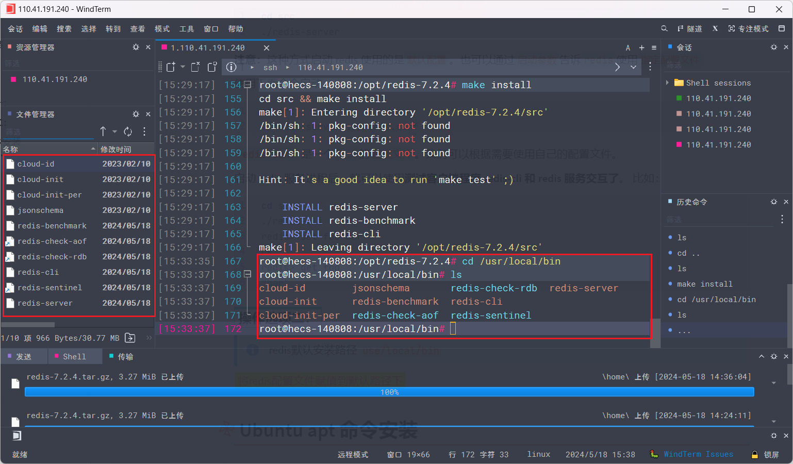

# Redis安装


[toc]

## 下载地址

> 开源地址：https://github.com/redis/redis/releases
>
> 历史版本：https://download.redis.io/releases/

## Windows 下安装

**下载地址：**https://github.com/tporadowski/redis/releases。

这里下载的是 `Redis-x64-5.0.10.msi`

直接安装，安装过程勾选`添加环境变量`，其他都 next（可以自定义修改安装路径）

### 安装目录文件


### 运行 Redis

**安装目录下**，输入运行命令行：

```shell
redis-server.exe redis.windows.conf
```

> 如果想方便的话，可以把 `redis 的路径`加到`系统的环境变量`里，这样就省得再输路径了，后面的那个 redis.windows.conf 可以省略，如果省略，会启用默认的。输入之后，会显示如下界面：


这时候**另启**一个 `cmd 窗口`，**原来的不要关闭**，不然就无法访问服务端了。

切换到 redis 目录下运行（配置了环境变量可以直接用户目录下运行）:

```shell
#redis-cli -h 地址 -p 端口
redis-cli.exe -h 127.0.0.1 -p 6379
```

`设置`**键值对**:

```shell
set myKey abc
```

`取出`**键值对**:

```shell
get myKey
```


> 注意：windows 下`首次运行`可能会`失败`，具体请看下面的解决方案

### 运行失败的情况

如图，首次运行的时候出现了：

```shell
[18756] 10 Feb 17:55:53.864 # Could not create server TCP listening socket 127.0.0.1:6379: bind: 操作成功完成。
```


#### 解决方法

在安装目录下，输入以下命令

```shell
redis-cli.exe
127.0.0.1:6379>shutdown
not connected>exit
```

然后重新输入运行命令：

```shell
redis-server.exe redis.windows.conf
```

### 设置密码

###### 1、cli 修改

在安装目录下，输入以下命令

```shell
redis-cli.exe
127.0.0.1:6379> config set requirepass 123456
```

这里将密码设置为 `123456`

密码设置之后，当你退出`再次连上redis`的时候，就需`要输入密码`了，**不然是无法操作的**。

> **注：这种方式设置密码，每次`重启`计算机密码就失效**

##### 2、配置文件修改 

修改配置文件 `redis.windows.conf`

```shell
# requirepass foobared
requirepass 123456
```

之后启动 `redis` 以这个配置文件启动：

```shell
redis-server.exe redis.windows.conf
```

### 设置密码以后如何进入 Redis

##### 进入 redis-cli.exe 时，附带密码

```shell
redis-cli.exe -a 123456
```

##### 进入以后，再输入密码

```shell
redis-cli.exe
127.0.0.1:6379> auth 123456
```

### 有可能出现的坑

##### 1、进入 redis-cli.exe 时报错

```shell
提示：Could not connect to Redis at 127.0.0.1:6379: 由于目标计算机积极拒绝，无法连接。
```

**原因**：没有打开 `Redis 服务`

**解决1**：在`安装目录下`，输入运行`命令`行：`redis-server.exe redis.windows.conf`

**解决2**：在`安装目录下`，直接`双击`运行：`redis-server.exe`

## Linux 源码安装

#### 安装

- 1、下载对应的安装包

    

- 2、程序一般在opt目录下，移动文件到对应的位置下

    ```shell
    mv redis-7.2.4.tar.gz /opt/redis
    ```

- 3、解压文件

    ```shell
    tar xzf redis-7.2.4.tar.gz
    ```

    

- 4、进入文件夹

    

> 因为redis是c写的，所以我们在make之前需要安装c语言环境
>
> ```shell
> yum install gcc-c++ tcl
> ```
>
> 然后执行`make`命令，redis6以上make会出错，要升级gcc版本
>
> ```shell
> Redis6以上需要gcc版本在7以上。
> 运行下面命令升级gcc
> #第一步
> sudo yum install centos-release-scl
> #第二步
> sudo yum install devtoolset-7-gcc*
> #第三步
> scl enable devtoolset-7 bash
> ```

- 5、执行`make`安装

    

`make`完成之后多出一个`src`文件


- 6、`make install`

    

> `make`与`make install`
>
> `make` 是用来编译的，它从Makefile中读取指令，然后编译。
>
> 
>
> `make install`是用来安装的，它也从Makefile中读取指令，安装到指定的位置
>
> 这条命令来进行安装（当然有些软件需要先运行 make check 或 make test 来进行一些测试），这一步一般需要你有 root 权限（因为要向系统写入文件）。

#### 操作选项一：

执行完 **make** 命令后，redis-6.0.8 的 **src** 目录下会出现编译后的 redis 服务程序 redis-server，还有用于测试的客户端程序 redis-cli：

**下面启动 redis 服务：**

```shell
cd src
./redis-server
```

**注意：**这种方式启动 redis 使用的是`默认配置`。也可以通过`启动参数`告诉` redis `使用`指定配置文件`

使用下面命令启动。

```shell
cd src
./redis-server ../redis.conf
```

**`redis.conf`** 是一个`默认`的`配置文件`。我们可以根据需要使用自己的配置文件。

启动 redis 服务进程后，就可以使用**测试客户端程序 redis-cli 和 redis 服务交互了**。 比如：

```shell
cd src
./redis-cli
redis> set foo bar
OK
redis> get foo
"bar"
```

#### 操作选项二(推荐)：

> redis默认安装路径 `usr/local/bin`
>
> 

==将redis配置文件赋值到默认路径下==

这样的好处，安全性高一些，我们这里的配置文件坏了，我们还可以使用原生的配置文件

```shell
cp /opt/redis-7.2.4/redis.conf redis_conf #redis_conf是自己创建的文件夹，来保存配置文件
```

之后就可以通过这个配置文件来启动redis

==设置为后台运行==

redis默认不是后台启动的，我们要修改配置文件，修改为后台运行


将`daemonize`的值修改为`yes`

daemonize是守护进程的意思，那么什么是守护进程呢？

> 守护进程(daemon)是一类在后台运行的特殊进程，用于执行特定的系统任务。很多守护进程在系统引导的时候启动，并且一直运行直到系统关闭。另一些只在需要的时候才启动，完成任务后就自动结束

==通过指定的配置文件启动redis服务==

```shell
redis-server redis_conf/redis.conf
```

> `出现报错`
>
> 
>
>  警告超委托内存设置为0！后台保存可能在低内存条件下失败。要解决此问题，请将“vm.overcommit_.=1”添加到/etc/sysctl.conf，然后重新启动或运行命令“sysctl vm.overcommit_.=1”，以使其生效。
>
> 
>
> `解决办法`
>
>  其实报错信息中已经给出了处理办法，进入到/etc/sysctl.conf文件中，将vm.overcommit_.=1添加到sysctl.conf文件中就可以了。
>
> 1. 方法一：
>
>     执行命令：echo 1 > /proc/sys/vm/overcommit_memory，可能用一般用户没办法执行该命令，那就直接su root，使用root用户执行命令就行了。该命令的优点是直接生效，不用重启redis服务，缺点是如果redis服务重启就会继续报该错误，需要再次执行上述命令
>
>     ```shell
>     sudo echo 1 > /proc/sys/vm/overcommit_memory
>     ```
>
> 2. 方法二：
>
>     进入/etc/sysctl.conf文件中，添加vm.overcommit_.=1，重启之后，报错就会消失；该方法的优点是无论以后如何重启redis服务都不会再报该错误，缺点是不能立即生效，必须重启redis服务。
>
>     ```conf
>     vm.overcommit_memory=1
>     ```

==使用redis-cli客户端使用redis==

```shell
redis-cli -p 6379
```

-p是用来指定端口，这里为什么redis的端口是6379呢？大家可以查一查


查看启动的服务进程

```shell
ps -ef|grep redis
```


关闭Redis服务退出redis终端

```shell
shutdown #关闭服务
exit #退出终端
```


## Ubuntu apt 命令安装

在 `Ubuntu 系统`安装 Redis 可以使用以下命令:

```shell
sudo apt update
sudo apt install redis-server
```

##### 启动 Redis

```shell
redis-server	
```

##### 查看 redis 是否启动？

```shell
redis-cli
```

以上命令将打开以下终端：

```shell
redis 127.0.0.1:6379>
```

127.0.0.1 是本机 IP ，6379 是 redis 服务端口。现在我们输入 PING 命令。

```shell
redis 127.0.0.1:6379> ping
PONG
```

以上说明我们已经成功安装了redis。

## docker安装

### 1.拉取镜像

```shell
docker pull swr.cn-north-4.myhuaweicloud.com/ddn-k8s/docker.io/redis:7.2.5
docker tag swr.cn-north-4.myhuaweicloud.com/ddn-k8s/docker.io/redis:7.2.5 redis:7.2.5
docker rmi swr.cn-north-4.myhuaweicloud.com/ddn-k8s/docker.io/redis:7.2.5
```

### 2.创建挂载目录

```shell
mkdir /home/docker_volume/redis
cd /home/docker_volume/redis
mkdir conf data logs
cd conf
touch redis.conf
cd /home/docker_volume/redis/logs
touch redis.log

#赋予配置文件和日志文件权限
#命令：chmod 777 /home/redis/conf/redis.conf /home/redis/log/redis.log
```

### 3.准备redis.conf文件

```conf
# #######################
# Redis服务器配置
# #######################

# 绑定IP地址
# 解除本地限制 注释bind 127.0.0.1  
# 指定redis只接收来自于该IP地址的请求看，如果不进行设置，那么将处理所有请求。在生产环境中最好设置该项。
# bind 127.0.0.1  
 
# 指定redis运行的端口，默认是6379。  
port 6379 
 
# 配置密码，不要可以删掉
requirepass syf133618
 
# 这个配置不要会和docker -d 命令 冲突
# 服务器运行模式，Redis以守护进程方式运行,默认为no，改为yes意为以守护进程方式启动，可后台运行，除非kill进程，
# 改为yes会使配置文件方式启动redis失败，如果后面redis启动失败，就将这个注释掉
daemonize no
 
# 当Redis以守护进程方式运行时(后台运行)，Redis默认会把pid写入/var/run/redis.pid文件，你可以配置到其他位置。
# 当运行多个redis服务时，需要指定不同的pid文件和端口。
# pidfile /data/dockerData/redis/run/redis6379.pid  
 
# 默认为no，redis持久化，可以改为yes
appendonly yes
 
# 当客户端闲置多长时间后关闭连接，如果指定为0，表示关闭该功能
timeout 60
# 服务器系统默认配置参数影响 Redis 的应用
maxclients 10000
tcp-keepalive 300
 
# 指定在多长时间内，有多少次更新操作，就将数据同步到数据文件rdb，
# 相当于条件触发抓取快照，这个可以多个条件配合。
# 可以多个条件配合（分别表示900秒（15分钟）内有1个更改，300秒（5分钟）内有10个更改以及60秒内有10000个更改）
save 900 1
save 300 10
save 60 10000
# save 3600 1 300 100 60 10000 
 
# 按需求调整 Redis 线程数
tcp-backlog 511
 
# 设置数据库数量，默认值为16，默认数据库对象为0，数据库范围在0~15之间切换，彼此隔离。
databases 16
 
# 启用 AOF, AOF常规配置
appendonly yes
appendfsync everysec
no-appendfsync-on-rewrite no
auto-aof-rewrite-percentage 100
auto-aof-rewrite-min-size 64mb
 
# 慢查询阈值
slowlog-log-slower-than 10000
slowlog-max-len 128
 
# 是否记录系统日志，默认为yes  
syslog-enabled yes  
 
# 指定日志记录级别，Redis总共支持四个级别：debug、verbose、notice、warning，默认为verbose
# debug表示记录很多信息,用于开发和测试
# verbose表示记录有用的信息, 但不像debug会记录那么多
# notice表示普通的verbose，常用于生产环境
# warning 表示只有非常重要或者严重的信息会记录到日志
loglevel notice
  
# 指定了记录日志的文件。空字符串的话，日志会打印到标准输出设备。标准输出设备是/dev/null。  
# logfile stdout
logfile "/data/redis/redis-log/redis.log"
 
# 系统内存调优参数   
# 按需求设置
hash-max-ziplist-entries 512
hash-max-ziplist-value 64
list-max-ziplist-entries 512
list-max-ziplist-value 64
set-max-intset-entries 512
zset-max-ziplist-entries 128

```

> `配置文件详解`
>
> ```conf
> 
> daemonize no
> 默认情况下，redis不是在后台运行的。如果需要在后台运行，把该项的值更改为yes。
>  
> pidfile /var/run/redis.pid
> 当redis在后台运行的时候，redis默认会把pid文件放在/var/run/redis.pid，你可以配置到其他位置。当运行多个redis服务时，需要指定不同的pid文件和端口。
>  
> port 6379
> 指定redis运行的端口，默认是6379。
>  
> bind 127.0.0.1
> 指定redis只接收来自于该IP地址的请求看，如果不进行设置，那么将处理所有请求。在生产环境中最好设置该项。
>  
> loglevel debug
> 指定日志记录级别，其中redis总共支持四个级别：debug、verbose、notice、warning，默认为verbose。
> 1 . debug表示记录很多信息,用于开发和测试
> 2．verbose表示记录有用的信息, 但不像debug会记录那么多
> 3．notice表示普通的verbose，常用于生产环境
> 4．warning 表示只有非常重要或者严重的信息会记录到日志
>  
> logfile "/data/redis/redis-log/redis.log"
> 配置log文件地址,默认值为stdout。若后台模式会输出到/dev/null。
>  
> databases 16
> 可用数据库数，默认值为16，默认数据库为0，数据库范围在0~15之间切换，彼此隔离。
>  
> save
> 保存数据到磁盘，格式为save，指出在多长时间内，有多少次更新操作，就将数据同步到数据文件rdb。相当于条件触发抓取快照，这个可以多个条件配合。
> save 9001就表示900秒内至少有1个key被改变就保存数据到磁盘。
>  
> rdbcompression yes
> 存储至本地数据库时(持久化到rdb文件)是否压缩数据，默认为yes。
>  
> dbfilename dump.rdb
> 本地持久化数据库文件名，默认值为dump.rdb。
>  
> dir ./
> 工作目录，数据库镜像备份的文件放置的路径。这里的路径跟文件名要分开配置是因为redis在进行备份时，先会将当前数据库的状态写入到一个临时文件中，等备份完成时，再把该临时文件替换为上面所指定的文件。 而这里的临时文件和上面所配置的备份文件都会放在这个指定的路径当中，AOF文件也会存放在这个目录下面。 注意这里必须指定一个目录而不是文件。
>  
> slaveof
> 主从复制，设置该数据库为其他数据库的从数据库。设置当本机为slave服务时，设置master服务的IP地址及端口。 在redis启动时,它会自动从master进行数据同步。
>  
> masterauth
> ​当master服务设置了密码保护时(用requirepass制定的密码)slave服务连接master的密码。
>  
> slave-serve-stale-data yes
> 当从库同主机失去连接或者复制正在进行，从机库有两种运行方式：
> 如果slave-serve-stale-data设置为 yes(默认设置)，从库会继续相应客户端的请求。
> 如果slave-serve-stale-data是指为no，除去INFO和SLAVOF命令之外的任何请求都会返回一个错误"SYNC with master in progress"。
>  
> repl-ping-slave-period 10
> 从库会按照一个时间间隔向主库发送PING，可以通过repl-ping-slave-period设置这个时间间隔,默认是10秒。
>  
> repl-timeout 60
> 设置主库批量数据传输时间或者ping回复时间间隔，默认值是60秒，一定要确保repl-timeout大于repl-ping-slave-period。
>  
> requirepass foobared
> 设置客户端连接后进行任何其他指定前需要使用的密码。因为redis速度相当快，所以在一台比较好的服务器平台下, 一个外部的用户可以在一秒钟进行150K次的密码尝试，这意味着你需要指定非常强大的密码来防止暴力破解。
>  
> rename​command CONFIG “”
> 命令重命名，在一个共享环境下可以重命名相对危险的命令，比如把CONFIG重名为一个不容易猜测的字符：
> rename-command CONFIG b840fc02d524045429941cc15f59e41cb7be6c52
> 如果想删除一个命令，直接把它重命名为一个空字符""即可：rename-command CONFIG “”。
>  
> maxclients 128
> 设置同一时间最大客户端连接数，默认无限制。redis可以同时打开的客户端连接数为redis进程可以打开的最大文件描述符数。
> 如果设置 maxclients 0，表示不作限制。当客户端连接数到达限制时，redis会关闭新的连接并向客户端返回max number of clients reached错误信息。
>  
> maxmemory
> 指定redis最大内存限制。redis在启动时会把数据加载到内存中，达到最大内存后，redis会先尝试清除已到期或即将到期的key，redis同时也会移除空的list对象。当此方法处理后,仍然到达最大内存设置，将无法再进行写入操作，但仍然可以进行读取操作。
> 注意：redis新的vm机制，会把key存放内存，value会存放在swap区。
>  
> maxmemory-policy volatile-lru
> 当内存达到最大值的时候redis会选择删除哪些数据呢？有五种方式可供选择：
> 1．volatile-lru代表利用LRU算法移除设置过期时间的key(LRU：最近使用LeastRecentlyUsed)
> 2．allkeys-lru代表利用LRU算法移除任何key
> 3．volatile-random代表移除设置过过期时间的随机key
> 4．allkeys_random代表移除一个随机的key
> 5． volatile-ttl代表移除即将过期的key(minor TTL)
> 6． noeviction代表不移除任何key，只是返回一个写错误
> 注意：对于上面的策略，如果没有合适的key可以移除，写的时候redis会返回一个错误。
>  
> appendonly no
> 默认情况下，redis会在后台异步的把数据库镜像备份到磁盘，但是该备份是非常耗时的，而且备份也不能很频繁。 如果发生诸如拉闸限电、拔插头等状况，那么将造成比较大范围的数据丢失，所以redis提供了另外一种更加高效的数据库备份及灾难恢复方式。
> 开启append only模式之后，redis会把所接收到的每一次写操作请求都追加到appendonly. aof文件中。当redis重新启动时，会从该文件恢复出之前的状态，但是这样会造成appendonly. aof文件过大，所以redis还支持BGREWRITEAOF指令对appendonly.aof。
>  
> appendfilename appendonly.aof
> AOF文件名称，默认为"appendonly.aof"。
>  
> appendfsync everysec
> redis支持三种同步AOF文件的策略：
> 1．no代表不进行同步,系统去操作
> 2．always代表每次有写操作都进行同步
> 3．everysec代表对写操作进行累积，每秒同步一次，默认是"everysec"，按照速度和安全折中这是最好的
>  
> slowlog-log-slower-than 10000
> 记录超过特定执行时间的命令。执行时间不包括I/O计算，比如连接客户端，返回结果等。只是命令执行时间，可以通过两个参数设置slow log：一个是告诉Redis执行超过多少时间被记录的参数slowlog-log-slower-than(微妙)，另一个是slow log 的长度。
> 当一个新命令被记录的时候最早的命令将被从队列中移除，下面的时间以微妙微单位，因此1000000代表一分钟。注意制定一个负数将关闭慢日志，而设置为0将强制每个命令都会记录。
>  
> hash-max-zipmap-entries 512 && hash-maxz-ipmap-value 64
> 当hash中包含超过指定元素个数并且最大的元素没有超过临界时，hash将以一种特殊的编码方式(大大减少内存使用)来存储，这里可以设置这两个临界值。Redis Hash对应Value内部实际就是一个HashMap，实际这里会有2种不同实现。这个Hash的成员比较少时redis为了节省内存会采用类似一维数组的方式来紧凑存储，而不会采用真正的HashMap结构，对应的value redisObject的encoding为zipmap。当成员数量增大时会自动转成真正的HashMap，此时encoding为ht。
>  
> hash-max-zipmap-entries 512 512
> list数据类型多少节点以下会采用去指针的紧凑存储格式。
>  
> list-max-ziplist-value 64
> 数据类型节点值大小小于多少字节会采用紧凑存储格式。
>  
> setmaxintsetentries 512
> set数据类型内部数据如果全部是数值型,且包含多少节点以下会采用紧凑格式存储。
>  
> zsetmaxziplistentries 128
> zsort数据类型多少节点以下会采用去指针的紧凑存储格式。
>  
> zsetmaxziplistvalue 64
> zsort数据类型节点值大小小于多少字节会采用紧凑存储格式。
>  
> activerehashing yes
> redis将在每100毫秒时使用1毫秒的CPU时间来对redis的hash表进行重新hash，可以降低内存的使用。
> 当你的使用场景中，有非常严格的实时性需要，不能够接受redis时不时的对请求有2毫秒的延迟的话，把这项配置为no。如果没有这么严格的实时性要求，可以设置为yes，以便能够尽可能快的释放内存。
> ```

### 4.创建容器并运行

```shell
#docker run -it -d \
#--name redis \
#--restart=always \
#-p 6379:6379 \
#-v /home/docker_volume/redis/conf/redis.conf:/etc/redis/redis.conf \ 
#-v /home/docker_volume/redis/data:/var/lib/redis \ 
#-v /home/docker_volume/redis/logs:/logs \ 
#redis:7.2.5 redis-server /etc/redis/redis.conf \
#--appendonly yes

docker run -it -d \
--name redis \
--restart=always \
-p 6379:6379 \
-v /home/docker_volume/redis/conf/redis.conf:/etc/redis/redis.conf \
-v /home/docker_volume/redis/data:/var/lib/redis \
-v /home/docker_volume/redis/logs/redis.log:/data/redis/redis-log/redis.log \
redis:7.2.5 \
redis-server /etc/redis/redis.conf
```

`-p 6379:6379`:把容器内的6379端口映射到宿主机6379端口 

`--restart=always` 容器跟着docker一块启动

`-v /data/redis/redis.conf:/etc/redis/redis.conf`：把宿主机配置好的redis.conf放到容器内的这个位置中 

`-v /data/redis/data:/data`：把redis持久化的数据在宿主机内显示，做数据备份

`redis-server /etc/redis/redis.conf`：这个是关键配置，让redis不是无配置启动，而是按照这个redis.conf的配置启动

 `–appendonly yes`：redis启动后数据持久化

### 5.测试

```shell
#1-进入redis容器
docker exec -it redis bash
 
#2-连接redis
redis-cli
 
#3-输入密码
auth 1234

```

