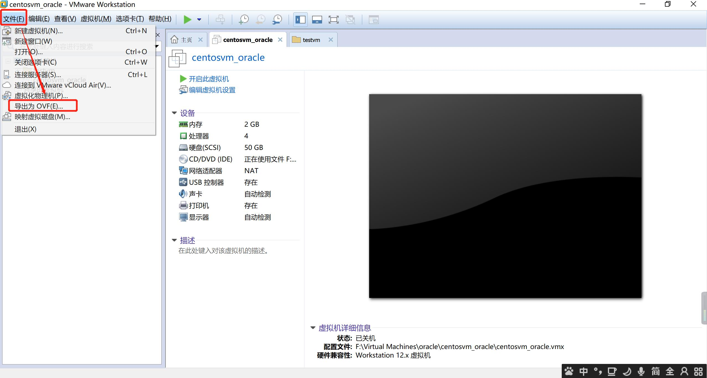
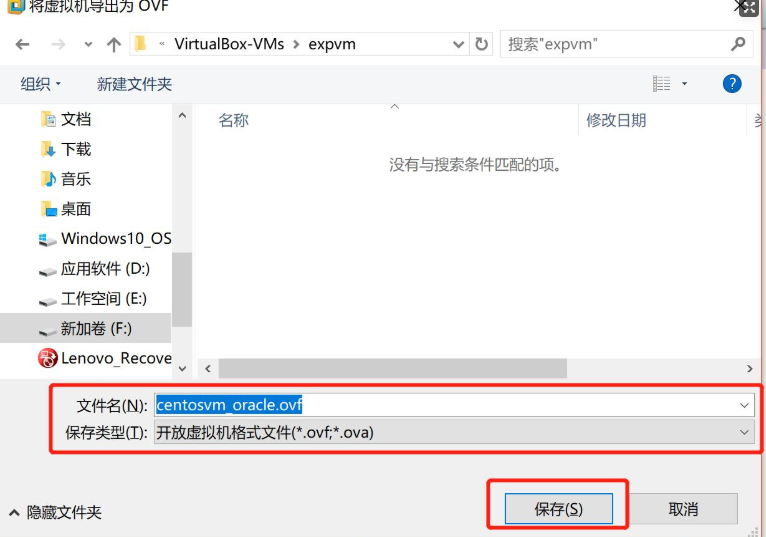
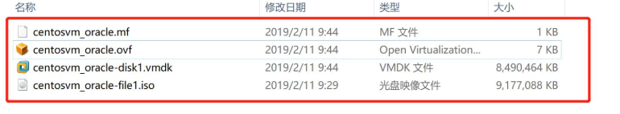
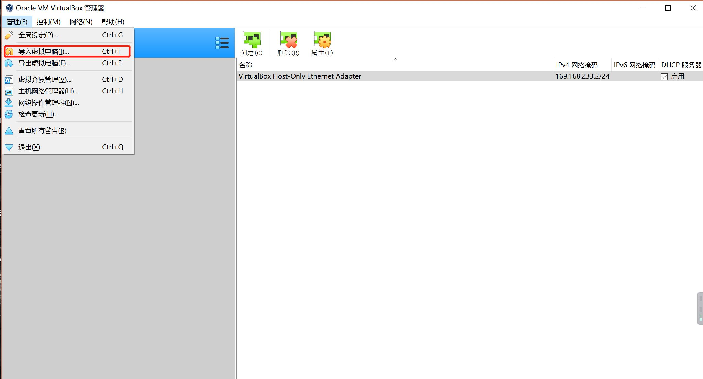
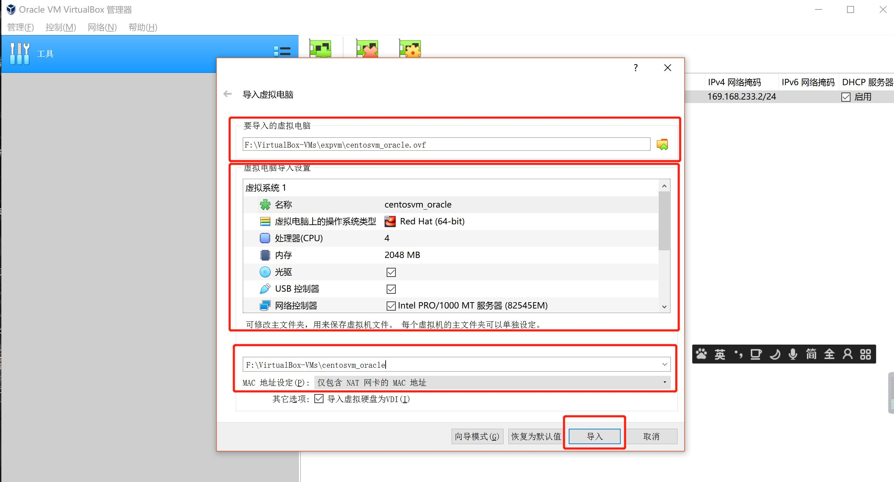
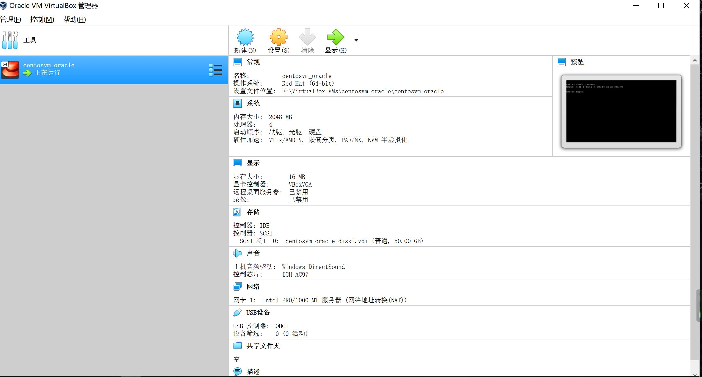
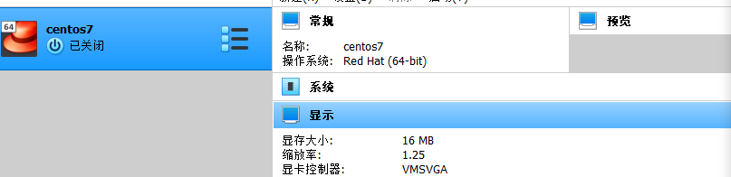
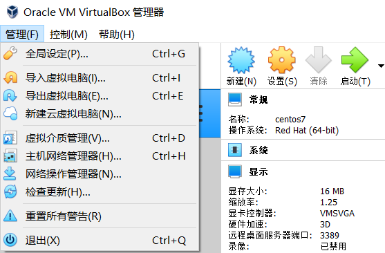
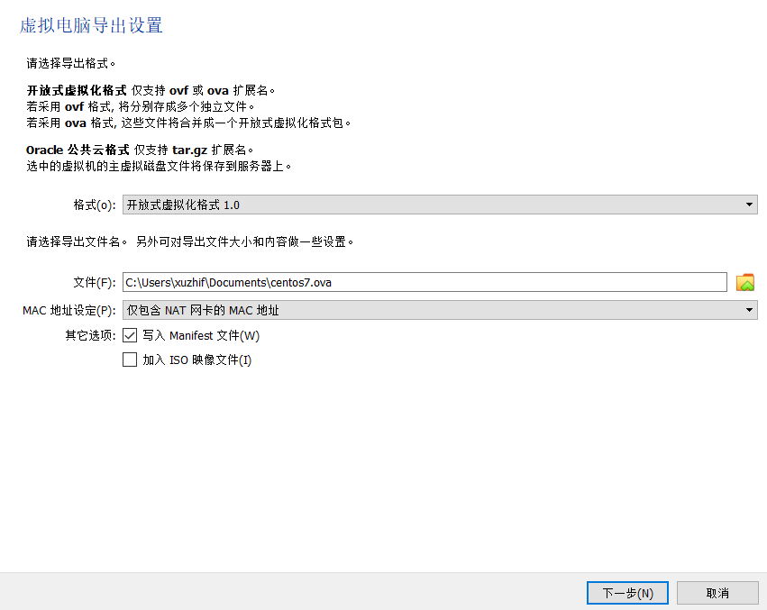

# VMware和VirtuaBox之间虚拟机相互转换

 VirtualBox 和 VMware 使用不同的虚拟机格式，不过他们都支持标准的开放式[虚拟化](https://so.csdn.net/so/search?q=虚拟化&spm=1001.2101.3001.7020)格式。将已经存在的虚拟机转换为 OVF/OVA 格式就可以导入其他的虚拟机程序。

### 导出VMware中的虚拟机

- 导出开放式格式.ovf的虚拟机

- 至此导出操作完成

### 导入虚拟机到VirtualBox

- 将.ovf格式的虚拟机导入到VirtualBox中

#### 问题记录

##### 网络问题

**桥接模式**

- 迁移完成后，打开虚拟机，执行ifconfig命令发现网卡名称与我们配置的网卡名称不一致，最简单的解决办法是重命名我们配置的网卡信息与ifconfig中的名称一致即可。

**NAT模式**

- VirtualBox如果实现VM Ware中的访问模式，需要配置两个网卡，将当前的网卡指定为（host-only）模式，在新建一个nat网卡即可。

### VirtualBox转化为VMware

使用Virtualbox转化就简单很多了，可以直接导出。

前提：

 虚拟机处于关机状态。

转化：

###### 1.确定关机状态

显示为关机。

###### 2.选择导出虚拟机

###### 3.使用VMware找到文件打开即可
