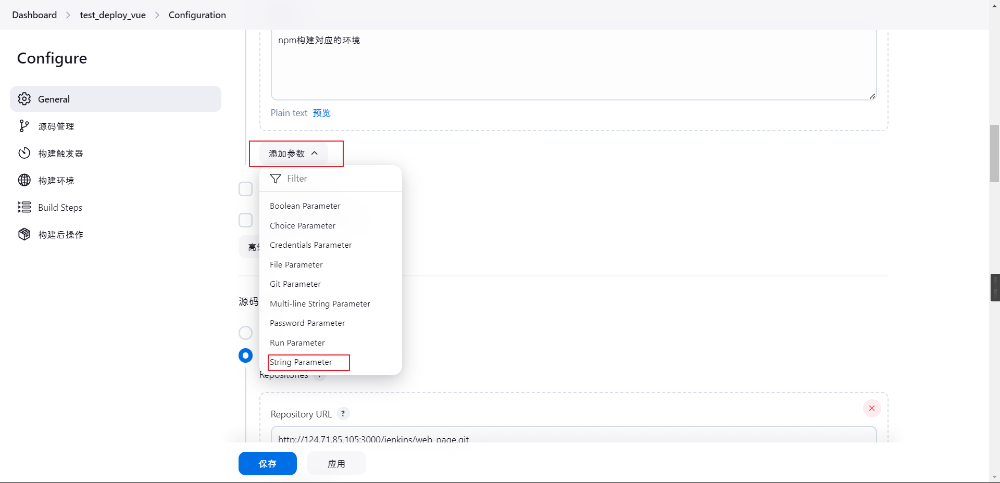

## 准备插件

选择 `Manage Jenkins` ->` Plugins`->`Available plugins`选项，安装以下插件：

- `NodeJS`
- `Publish Over SSH`（用于远程部署）
- `Git Parameter`（构建时选择参数）
- `Role-based Authorization Strategy`（角色权限管理）


#### 安装NodeJs

选择`Manage Jenkins` -> `Tool` -> `NodeJS` 选择安装对应的`nodejs`版本并保存，如果源比较慢就使用国内的地址：`https://npm.taobao.org/mirrors/node/`


> 别名别乱起，建议是`node+版本`，因为这个如果你要用`pipeline`脚本就可以通过`tool`来指定需要的`node`版本
>
> ```shell
> pipeline {
>     agent any
>     tools {
>         nodejs 'node20.14.0'
>         maven 'mvn3.9.9'
>     }
>     stages {
>         stage('test') {
>             steps {
>                 script {
>                     sh """
>                         docker -v
>                         which docker
>                         echo '===================='
>                         java -version
>                         which java
>                         echo '===================='
>                         mvn -v
>                         which mvn
>                         echo '===================='
>                         node -v
>                         which node
>                         echo '===================='
>                         npm -v
>                         which npm
>                         echo '===================='
>                         git --version
>                         which git
>                     """
>                 }
>             }
>         }
>     }
> }
> ```

#### 配置ssh信息

选择`Manage Jenkins` -> `System` 填写相关配置


展开`高级`


收纳`高级`选项后,测试结果


#### 配置全局凭据


添加一个作用域，类似于`文件夹`的概念


填写基本信息


在作用域中添加一个`凭证信息`


## 部署流程

#### 服务器准备部署文件

在服务器上准备一个要执行部署的sh文件，这里我放在`/home/deploy_sh/web_page/deploy.sh`下，内容如下

```sh
#!/bin/bash
# /home/deploy_sh/web_page/deploy.sh
echo "==========服务器操作执行开始============"

# 服务器上要操作的目标tar包
temp_curr_tar="/home/cache/dist/web_page/dist.tar.gz"

# 获取当前日期和时间，格式化为 YYYY.MM.DD_hh:mm:ss
temp_current_datetime=$(date +%Y.%m.%d_%H.%M.%S)
# 重命名tar包使用的名字 => 用户备份 => 方便回滚
temp_tar_backup="dist_${temp_current_datetime}.tar.gz"

# nginx部署路径 => 即tar包文件的解压路径
temp_nginx_path="/home/docker_volume/nginx/html/web/web_page"
# -p 验证不存在就创建
mkdir -p "${temp_nginx_path}"
# 移除nginx部署路径下的所有文件
rm -rf "${temp_nginx_path}/*"

# tar包进行备份位置 => 方便版本回滚
temp_backup_path="/home/docker_volume/nginx/html/backup/web_page"
mkdir -p "${temp_backup_path}"

# 解压 tar 包到指定路径
tar -zxvf "${temp_curr_tar}" -C "${temp_nginx_path}"

# 移动 tar 包到指定路径进行备份
mv "${temp_curr_tar}" "${temp_backup_path}/${temp_tar_backup}"

# 删除 sh 脚本
# rm -f "$0"

echo "==========服务器操作执行结束============"
```

进入路径通过检查sh文件是否有执行权限

```shell
cd /home/deploy_sh/web_page
ll deploy.sh
```


> ```shell
> -rw------- (600)    只有拥有者有读写权限。
> -rw-r--r-- (644)    只有拥有者有读写权限；而属组用户和其他用户只有读权限。
> -rwx------ (700)    只有拥有者有读、写、执行权限。
> -rwxr-xr-x (755)    拥有者有读、写、执行权限；而属组用户和其他用户只有读、执行权限。
> -rwx--x--x (711)    拥有者有读、写、执行权限；而属组用户和其他用户只有执行权限。
> -rw-rw-rw- (666)    所有用户都有文件读、写权限。
> -rwxrwxrwx (777)    所有用户都有读、写、执行权限。
> ```
>
> 想了解详细情况参考：https://juejin.cn/spost/7420321142400073763

这里看到该文件是没有可执行权限的

```shell
# 提权
chmod +x deploy.sh
```


到此部署文件准备完成

#### Jenkins创建项目

##### 准备项目

选择 新建Item -> 创建一个`自由风格`的软件项目


##### 准备参数

在`General`中，勾选`This project is parameterized`选项。

新增`Git参数`设置参数名称`Branch`，参数类型为`分支` ，默认值`origin/main`

> 默认值`origin/main`中的`main`对应你git仓库里某一分支，填一个你要用的主分支名就行，但其实不影响实际操作，因为后续会配置git连接，这个值最终是从git仓库查出的分支列表里选的，这里主要是为了规范


> <span style="color:red">This project is parameterized下任意变量起的名称都不能为java的关键字，别问我怎么知道的，说多了都是泪</span>

新增`Choice Parameter`参数，设置参数名称为`Env`，可选项为`dev`和`test` ，在后续构建脚本可以通过`${Env}`获取到对应的值。


新增一个`文本参数`用来指示`服务器`上`sh文件`所在的`路径`



> 现在这个Jenkins项目就有了三个全局变量，分别为
>
> - `Branch`：目标分支
> - `Env`：npm构建对应的环境
> - `Sh_Path`：服务器部署项目的sh路径

##### 配置git

获取git`仓库地址`


配置`Git`


设置仓库地址，以及通行凭证和使用的分支，这里的`Branch`就是我们前面配置的Git参数


##### 配置node

设置对应的node，勾选`Provide Node & npm bin/ folder to PATH`

，

选择你要的node版本，若是没有对应的node版本，去`Manage Jenkins` -> `Tool` -> `NodeJS` 选择安装对应的`nodejs`即可


##### 添加构建步骤


shell命令如

```shell
# 切换npm镜像
npm config set registry https://registry.npmmirror.com/
echo "当前的镜像源为：`npm config get registry`"
echo "========开始构建========"

npm install
# 构建 ${Env}就是我们上面Chioce Parameter设置的值
npm run build --env=${Env}

# dist 目录下文件打包之后的tar包名称
temp_tar="dist.tar.gz"
# 将构建产物打包 zcvf打包 zxvf解压 => 切换到 dist 目录并打包
tar -zcvf "${temp_tar}" -C dist .

echo "========构建结束========"

# 删除构建产物
rm -rf dist/
```

##### 添加构建后操作


注意`deploy.sh`文件里`temp_curr_tar="/home/cache/dist/web_page/dist.tar.gz"`，表示我后续操作是要将Jenkins上打包好的tar包文件上传到这个位置，而这个位置前面的`/home/cache`路径我们在前面`SSH配置`的时候已经填过了，所以这里`Remote directory`我们的只需要填`/dist/web_page`


点击保存

## 验证结果


这里成功了，若是报错就去控制台查看结果

> 但是这块控制台报错如果涉及但是服务器里的报错默认是不会在控制台的输出的，只会反馈一个成功还是失败的结果
>
> 
>
> 如下就只有服务器的一个连接的输出
>
> 
>
> 这个时候你就得去配置里开启`Verbose output in console`功能进行调试
>
> 
>
> 

服务器上验证结果

去到对应的页面，这里看到备份的tar包绑定的时间和Jenkins是一致的


tar包解压缩出来的文件时间和Jenkins也是一致的


到这里就结束了

```
# gitea public key                                                                                                                                                                         
command="/usr/local/bin/gitea --config=/data/gitea/conf/app.ini serv key-3",no-port-forwarding,no-X11-forwarding,no-agent-forwarding,no-pty,no-user-rc,restrict ssh-rsa AAAAB3NzaC1yc2EAAAA
DAQABAAABgFCWSu26E/qar92uLsgpsKRFCsTi+o6NwCIXtoXNvFGTZTDeQTlMGpBjPqMntSzpb1VQ3d0PbC6ZHVvRVRaosfPvpOqRyXfuPoShCl7wN0HS7ScioRkfPcRyjW1WZAESQBOzdP0Zi71AEX5wVi5qEtxhVKqVWO6rkCDCpmw+PVUt+qD0dr
ZPHRiZBMt8kGbf4FGKGUNcJJHsIbs2Jkf6b6M4YVH5Ik1mEYEYvaT637xeMk36vrGGs5vLmx9GT9o6GHFZN0o32NYrroOhsGMFQravBqcoIimyeMLMwL4KCD2Um8XaYuIbRNf9qTDPFVljaUfEZg9IMJ5sOAyvN28HSt79IshQGVTNPNIjiSksl67X8
wJMBwGsstQNgoivy1Pa08zZuaJmCxUfCVgQd3uMlTLTxUZEBEzBGcidtiZfQn2UjENfDdk9CuG2REiEL9SLyKr7jl1Ln8t4nUjzjuEjZqqKjaiqtn4Dvmjmg1OnJmbrhKf652QYoCBe1/Jc3XUypw== 2192475085@qq.com                  
# gitea public key                                                                                                                                                                         
command="/usr/local/bin/gitea --config=/data/gitea/conf/app.ini serv key-9",no-port-forwarding,no-X11-forwarding,no-agent-forwarding,no-pty,no-user-rc,restrict ssh-rsa AAAAB3NzaC1yc2EAAAA
DAQABAAABgQCaaHDR+UZOWKtcm9j+mgPDPKiLilrPYLIpuHeeSQhYNM8TAcllMIQDUQ5nduElZQlCzPc/OYY40ktMqHS/kdxABHUcMJlBD7dsWJhUrOYcmhN9dIq9VSoiuLwKRdorBBPu5l/QR8Pl6cUGF984fs9LqIBLULyA1unWS0fqF7emUPRfyr
QgI0xAq2uJkmYMjIXiOvea5h108zPB/MHl9KeReTUFVgNbkcghAeNeduIySGWPqCXGnl+nRZBDq+Y8IYDWhNGVnOAo9NcWqlT0mhyK0iLyjt2+jl9WYtNP6upHsIwh3Sf3brjLRjcJsI6oDW1/qkDTPIxIINg8OdKM2Sq1940cTp7xrZQqW6RxPWmxC
4K6jBmRnIWJXLEnoEt7MS8giPCSaNUD1lEA1Qxd5fO3Tbmuv9buUu+QtzR9LWiSsPfXCY9xE5IhU6gE9T54qzdxk8Anl+owQWmShC201ubclf8kAFU2U+GDlS7Su6hU+IKeMXBlH4XbpRzDyTSvYyM= suyan.ad.3110@qq.com               
# gitea public key                                                                                                                                                                         
command="/usr/local/bin/gitea --config=/data/gitea/conf/app.ini serv key-12",no-port-forwarding,no-X11-forwarding,no-agent-forwarding,no-pty,no-user-rc,restrict ssh-rsa AAAAB3NzaC1yc2EAAA
ADAQABAAABgQC5jzAjtUTlNAz7xe2ZUk6600ryJk2QVYbHeoXVHt04RSLHTrlxWp6UmhQWs1CDETxGZMdg3iUC0ODatNHPNpFsSzbxRzOCu/mCeTCeoBtwwFlHT6EQFddgHkNRz6LSIOCfZWyccp22h8Yj3BEnVWRx2i0ExciGHMWNqUacX+s64Iaza
CQtT/szyT2ha8qT3LktX2NXX6mZ4VO+S8bvoWpSUjwheayv6zYXuesu1hB40RdLHu/athsJWXr54X85Cl0CToDYrLJstb/Octigv4XhiLhtfz7qt0HgUq5chaI8ApKXhIeMhI3JQoUThVw8EIRNHdwY4D/V0lHPLG5ZN7GxIM7/XIPPVf8h8ZzW0Ywe
5QILUHif2Wwr7/kKmUVP/5FdkBu94bQrSlqEULcANUXAITltm4RqxkGE24s2nZXiyf99YHtMn8jJcrmeErWb1/9cZs39XlnsbKuJNiVnJVUMVxpA2lP9WaruYUxxRUFhCohy2E+emVCqFsvEA2yZEvs= suyan.ad.3110@qq.com              
534c45fae670:~$
```

echo -n '29e62fa63df0e86d5d1b9f6cd65e0f2c40596f93485bd4f16e3ed182a2e12547' | ssh-keygen -Y sign -n gitea -f  "C:\Users\AyoUser\.ssh\id_rsa"
