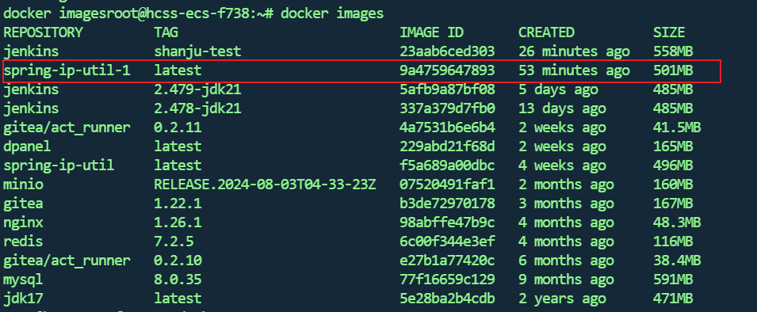

## Gitea仓库准备代码


如图，这是一个根据用户请求获取用户IP所在地的接口服务

#### Dockerfile

其中Dockerfile的内容如下

```sh
# 1、第一行必须指定 基础镜像信息
FROM jdk17
 
# 2、维护者信息
LABEL maintainer="空耳 <2192475085@qq.com>"

#设定时区
ENV TZ=Asia/Shanghai

# 切换到 root 用户，并设置时区
USER root
# 设置时区
RUN ln -snf /usr/share/zoneinfo/$TZ /etc/localtime && echo $TZ > /etc/timezone

# 设置工作目录为根目录
WORKDIR /

# 拷贝主机上的 JAR 文件到容器中
COPY getIpInfo.jar app.jar

# 定义入口点
ENTRYPOINT ["java", "-jar", "app.jar"]

```

从`COPY getIpInfo.jar app.jar`命令可以看到，docker构建镜像的时候要求`getIpInfo.jar`文件和`Dockerfile`在同一个路径下

#### docker-compose.yml

docker-compose.yml内容如下

```yaml
name: ip-util-compose
#docker compose -p blog-compose ps => 查看启动状态
services:
  ip_util_server:
    restart: always
    # 设置镜像名称为 "spring-ip-util-1"
    image: spring-ip-util-1
    build:
      # 设置 Dockerfile 所在的路径
      # context: /home/docker_volume/servers/ipUtil1
      context: .
      # 指定 Dockerfile 的文件名
      dockerfile: Dockerfile
    #容器名
    container_name: ip-util-1
    # 对外映射的ip
    ports:
      - "1818:1818"
    # 加入网络
    networks:
      - net_ip
networks:
  # docker的网络别名
  net_ip:
    # docker的网络
    name: net-ip-util
```

从`context: .`知道当执行docker的compose命令时，要求`Dockerfile`文件和`docker-compose.yml`文件在同一路径下

## 检查Jenkins容器的环境

进入容器

```sh
docker exec -it jenkins bash
```

检查环境

```sh
java -version

mvn -v

docker version
```


可以看到东西都是有的

退出容器

```sh
exit
```

## 准备部署用的sh文件

自己定义一个位置放置sh文件，用了执行mvn打包后将资源上传到服务器后的后续操作


```sh
#!/bin/bash
# /home/deploy_sh/ipUtil1/deploy.sh
echo "==========服务器操作执行开始============"

# 获取当前日期和时间，格式化为 YYYY.MM.DD_hh:mm:ss
temp_current_datetime=$(date +%Y.%m.%d_%H.%M.%S)

# docker的compose名称
COMPOSE_NAME="get-ip-util-compose"
# 容器名称
# CONTAINER_NAME="ip-util-1"
# 服务工作路径 => 打包镜像并部署容器所在的路径
SERVER_PATH="/home/docker_volume/servers/ipUtil1/workspce"
# 目标jar文件
TARGET_JAR="getIpInfo.jar"
# 备份路径 => 方便历史回滚
BACKUP_PATH="/home/docker_volume/servers/ipUtil1/backup/${temp_current_datetime}"
# Jenkins上传到服务器的资源 => /target/xxx.jar Dockerfile docker-compose.yml
RESOURCE_PATH="/home/cache/servers/ipUtil1"
RESOURCE_NAME="${TARGET_JAR} Dockerfile docker-compose.yml"
####################################################
echo "资源排版准备中..."
# 进入路径
cd $RESOURCE_PATH
# 找到RESOURCE_PATH下的target目录下的文件jar文件并重命名移出
find target -name '*.jar' -exec mv {} $TARGET_JAR \;
# 删除无用的 target 目录
rmdir target

# -p 验证不存在就创建
mkdir -p "${SERVER_PATH}"
mkdir -p "${BACKUP_PATH}"
####################################################
echo "资源备份中..."
cp $RESOURCE_NAME $BACKUP_PATH
####################################################
echo "Docker服务开始构建..."
mv $RESOURCE_NAME $SERVER_PATH
cd $SERVER_PATH

echo "检查是否存在compose对象：【${COMPOSE_NAME}】..."
if docker-compose -p $COMPOSE_NAME ps; then
  echo "存在容器compose对象【${COMPOSE_NAME}】，触发移除操作..."
  docker compose -p $COMPOSE_NAME down
  echo "移除成功。"
#else
  #echo "No containers found for $COMPOSE_NAME."
fi

docker images

echo "检查是否存在镜像：【spring-ip-util-1】..."
if docker images | grep -q "spring-ip-util-1"; then
  echo "存在镜像【spring-ip-util-1】，触发移除操作..."
  docker rmi spring-ip-util-1
  echo "移除成功。"
#else
  #echo "Image spring-ip-util-1 does not exist."
fi

echo "开始启动服务..."
docker compose -p $COMPOSE_NAME up -d
####################################################
echo "服务启动成功！！！！"


## 判断容器是否存在
#if [ "$(docker ps -aq -f name=${CONTAINER_NAME})" ]; then
##   判断容器是否正在运行
#    if [ "$(docker ps -q -f name=${CONTAINER_NAME})" ]; then
#        echo "容器 ${CONTAINER_NAME} 正在运行，暂停容器..."
#        docker pause ${CONTAINER_NAME}
#    else
#        echo "容器 ${CONTAINER_NAME} 已存在但未运行。"
#    fi

##   删除容器
#    echo "删除容器 ${CONTAINER_NAME}..."
#    docker rm -f ${CONTAINER_NAME}
#else
#    echo "容器 ${CONTAINER_NAME} 不存在。"
#fi

echo "==========服务器操作执行结束============"
```

保存上述内容后为文件添加可执行权限

```sh
cd /home/deploy_sh/ipUtil1
chmod +x deploy.sh
```

## Jenkisn的Item配置

### 准备Item


新建一个FeelStyle项目


### item配置

准备git的分支参数，用于后续指定要拉取的代码的目标分支


配置git的仓库


新增一个构建步骤 -> 调用顶层maven目标

选择我们的maven版本，然后设置maven命令


```sh
clean package -U -Dmaven.test.skip=true -Dmaven.repo.local=${MAVEN_REPO_LOCAL}
```

1. **clean**:

    - 这个阶段用于清除项目的 `target` 目录，其中包含上一次构建生成的所有文件。这有助于确保构建过程从一个干净的状态开始。

2. **package**:

    - 这个阶段会编译代码并打包成可发布的格式，例如 JAR 或 WAR 文件。它是 Maven 生命周期的一部分，通常在 `compile` 阶段之后执行。

3. **-U**:

    - 这个选项表示强制更新快照（snapshot）版本。如果你依赖的某些库是快照版本，Maven 会检查远程仓库以获取最新的快照版本，而不是使用本地缓存的版本。

4. **-Dmaven.test.skip=true**:

    - 这个选项用于跳过测试的执行。在构建过程中，Maven 默认会运行项目中的测试，但使用这个参数可以加快构建速度，因为它不运行任何测试代码。

5. **-Dmaven.repo.local=${MAVEN_REPO_LOCAL}**:

    - 这个选项指定 Maven 本地仓库的位置。`${MAVEN_REPO_LOCAL}` 是一个环境变量，代表本地 Maven 仓库的路径。这样做的目的是让构建使用指定的本地仓库，而不是默认的 `~/.m2/repository`。例如我这里的环境变量值为

        

增加一个构建后的步骤


​	

配置如下


保存然后执行


## 检查最终结果

在服务器输入

```sh
docker images
docker ps
```

来检查镜像是否成功打包以及容器是否正常运行

比对docker-compose.yml文件` image: spring-ip-util-1`,发现镜像成功构建



比对docker-compose.yml文件`container_name: ip-util-1`发现容器成功运行


