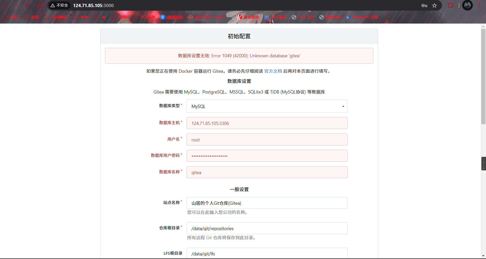
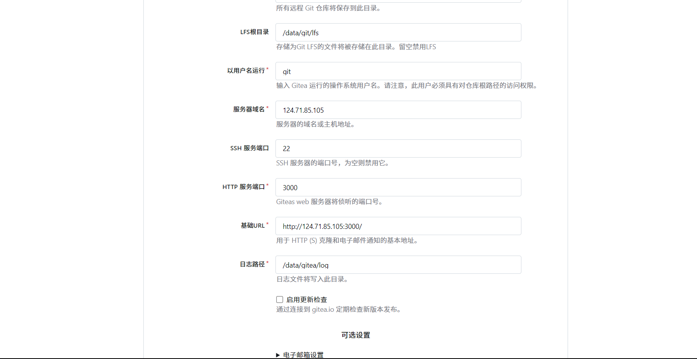

> 官网：https://about.gitea.com/
>
> 文档：https://docs.gitea.com/zh-cn/

## 一、介绍

其实开源的仓库私有服务很多，比如一般公司采用的`gitlab`，还有轻量级的`gogs`。而我今天要推荐的是另一款，从gogs的分支来的项目`gitea`。那么针对这三个仓库有什么区别呢？

### **Gitlab**

GitLab有自己的官方开源仓库以及提供私有部署的开源并免费的GitLab CE版本。其官方的开源仓库不仅仅是GitHub的一个替代品，它更像是一个完整的DevOps平台。GitLab几乎是软件开发机构必备的基础设施，因为它提供了代码和项目管理工具问题报告、持续交付和监控。Gitlab基于Ruby on Rails构建,功能强大，很多公司都是用的它。gitlab有很强大的功能以及丰富的生态，对于公司仓库来说，它绝对是首选，但是对于个人来说，它对服务器的性能要求也大得多，官方推荐最低配置是4核4G，并且gitlab新版本的界面我个人是一直感觉很别扭，也许等习惯就好了。

- 功能强大
- CI/CD
- 界面复杂
- 性能要求较高

### **Gogs&Gitea**

Gogs是使用G语言开发的100% 开源并可无条件免费使用的项目。所有的源代码均通过 MIT 授权协议 托管在 GitHub 上.任何 Go 语言 支持的平台都可以运行 Gogs，包括 Windows、Mac、Linux 以及 ARM。一个廉价的树莓派的配置足以满足 Gogs 的最低系统硬件要求。有些用户甚至还将 Gogs 运行在 NAS 设备上。

Gitea的从Gogs Fork而来，Gitea的首要目标是创建一个极易安装，运行非常快速，安装和使用体验良好的自建 Git 服务。我们采用Go作为后端语言，这使我们只要生成一个可执行程序即可。并且他还支持跨平台，支持 Linux, macOS 和 Windows 以及各种架构，除了x86，amd64，还包括 ARM 和 PowerPC。

gitea既然来源于gogs，那么它们具体有什么相同点和区别呢？

#### 相同点：

1.轻量级：Gitea和Gogs都是轻量级的Git服务，安装、配置和使用都非常简单。

2.易于部署：Gitea和Gogs可以在各种平台上部署，包括Docker、Kubernetes、Linux、Windows和macOS等。

3.高效性：Gitea和Gogs都性能出色，能够处理大规模的代码库和大量的并发访问。

4.开源免费：Gitea和Gogs都是开源的，可以免费使用。

5.功能强大：Gitea和Gogs支持多种协议，如Git、SSH、HTTP等，并具备与Github类似的功能，如Pull Request、问题跟踪、维基等

#### 不同点:

##### 1.Gogs的优劣势

**优势**

1.简便易用：Gogs安装、配置和使用都相当方便。

2.体积小巧：Gogs没有太多复杂的功能和高端的特性，体积小巧，运行速度快。

3.免费开源：Gogs是开源免费的Git服务。

4.界面简洁：Gogs的Web界面不错，非常简洁，易于使用。

**劣势**

1.维护困难：Gogs开发维护力量个人或小团队，或许在长期的发展过程中会出现维护困难问题。

2.社区活力不足：Gogs保持了可持续发展可能性，但相对活跃度比较低。

##### 2.Gitea的优劣势

**优势**

1.使用方便：Gitea的安装和配置非常简单，网页化界面也更加友好，代码模块化设计，基于数据处理引擎等新科技，内存和 CPU 利用率都得到极大的提升。

2.功能齐全：Gitea的功能非常齐全，多人协同开发、权限管理、问题和回答、动态和评论项目、人员管理等，几乎涵盖了所有的必要功能。

3.安全性好：Gitea已经发现的几个漏洞在较短时间内就得到了彻底解决，并且Gitea拥有一个活跃的社区，能够及时修复漏洞。

**劣势**

1.版本较新：Gitea是较新的一款Git服务，尚未广泛使用。

2.移植性不足：Gitea移植性不如Gogs，目前只支持x86、ARM和mips CPU架构。

## 二、搭建Gitea

### 拉取镜像

```shell
docker pull swr.cn-north-4.myhuaweicloud.com/ddn-k8s/docker.io/gitea/gitea:1.22.1
docker tag swr.cn-north-4.myhuaweicloud.com/ddn-k8s/docker.io/gitea/gitea:1.22.1  gitea:1.22.1
docker rmi swr.cn-north-4.myhuaweicloud.com/ddn-k8s/docker.io/gitea/gitea:1.22.1
```

### 启动容器

 创建挂载文件夹，并且进行文件权限授予

```shell
cd /home/docker_volume
mkdir gitea
cd gitea
mkdir data
```

启动容器

```shell
# 官网启动方式
docker run -d \
--name=gitea \
-p 10022:22 -p 10080:3000 \
-v /home/docker_volume/gitea/data:/data \
gitea:1.22.1

#############################################
# 本次启动方式(新增两个参数，可以根据需要选择)
docker run -d \
--privileged=true \
--restart=always \
--name=gitea \
-p 10022:22 \
-p 3000:3000 \
-v /home/docker_volume/gitea/data:/data \
gitea:1.22.1 


#############################################
docker run -d \
--privileged=true \
--restart=always \
--name=gitea \
-p 3001:22 \
-p 3000:3000 \
-v /home/docker_volume/gitea/data:/data \
--network server-net \
gitea:1.22.1 
```

`--privileged=true` 容器内的root拥有真正的root权限（可根据需要选择是否要该参数）
`--restart=always`  自动重启容器（可根据需要选择是否要该参数）

`-p 3000:3000`前端页面端口

`-p 3001:22`ssh认证端口

### 访问




