>个人理解就`Gitea`触发动作(`push`或者`合并`等)后执行某些命令，可以不借助像`Jenkins`这类工具直接实现`CI/CD`流程

### Gitea准备Act Runner

`Act Runner` 是一个 `Gitea 运行器`，通过自行部署，可以实现类似于 GitHub Actions 的运行器，且可以兼容 GitHub Actions 配置文件

> 官方发布地址：https://gitea.com/gitea/act_runner/releases

#### 工具简介

`Gitea Actions` 是一个类似 `GitHub Actions` 的`自动化工作流工具`，可以帮助开发者在代码仓库中实现各种自动化任务。`Runner `则是负责执行这些工作流任务的代理端。

在实际应用中，使用 `Docker` 部署` Gitea Actions` 的 `Runner `具有诸多优势。

首先，Docker 提供一致的运行环境，消除了因系统配置差异而导致的潜在问题。

其次，它简化了部署过程，使得安装、配置更加便捷高效

#### 获取密钥

登录到 `Gitea` 实例，转到存储仓库页面，点击页面上方设置，在左侧菜单选择 `Actions`，将在页面上看到 `Runners` 部分，后点击创建` Runner `按钮，将获得一个 `REGISTRATION TOKEN`，复制它并妥善保存：

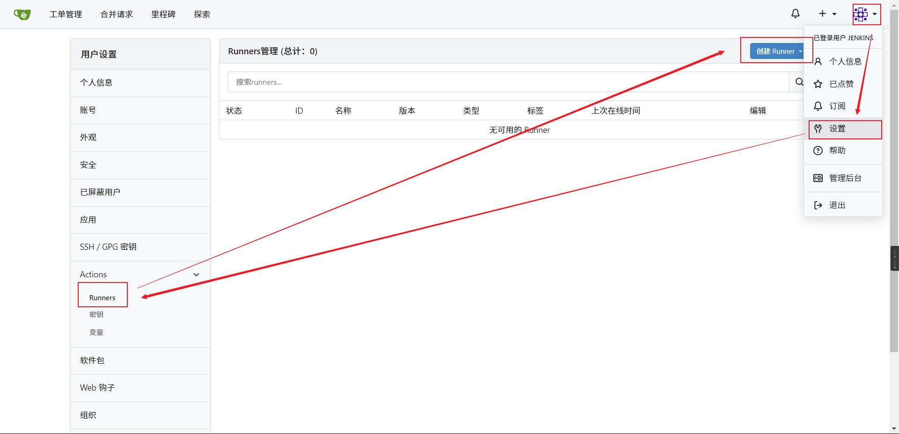

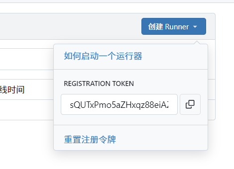

```shell
nE9wypMi4tt7Q4byHQoNsEf08Rc5RHxVTkfwcPxq
```

#### Gitea Action注册runner

##### 	docker下载镜像

```shell
docker pull swr.cn-north-4.myhuaweicloud.com/ddn-k8s/docker.io/gitea/act_runner:0.2.11
docker tag swr.cn-north-4.myhuaweicloud.com/ddn-k8s/docker.io/gitea/act_runner:0.2.11 gitea/act_runner:0.2.11
docker rmi swr.cn-north-4.myhuaweicloud.com/ddn-k8s/docker.io/gitea/act_runner:0.2.11
```

##### 准备目录

```shell
cd /home/docker_volume/gitea
mkdir act_runner
cd act_runner
mkdir data
```

##### 生成runner配置

```shell
docker run --entrypoint="" \
--rm -it gitea/act_runner:0.2.11 \
act_runner generate-config > \
/home/docker_volume/gitea/act_runner/config.yaml
```

1. **`docker run`**:
    - 用于启动一个新的 Docker 容器并运行指定的命令。
2. **`--entrypoint=""`**:
    - 指定容器的入口点（entrypoint）。默认情况下，Docker 镜像可能已经定义了一个入口点。使用 `--entrypoint=""` 可以覆盖默认的入口点，使其为空。这样，你可以在 `docker run` 命令中指定其他命令。
3. **`--rm`**:
    - 在容器退出时自动删除容器。这对于一次性任务非常有用，可以避免留下不必要的容器。
4. **`-it`**:
    - `-i` 表示以交互模式运行容器。
    - `-t` 表示分配一个伪终端（pseudo-TTY），这通常用于与容器进行交互。
5. **`gitea/act_runner:0.2.11`**:
    - 指定要运行的 Docker 镜像。这里使用的是 `gitea/act_runner` 镜像的 `0.2.11` 标签。
6. **`act_runner`**:
    - 在 `--entrypoint=""` 的情况下，这是要运行的命令。这里指定运行 `act_runner` 命令。
7. **`generate-config`**:
    - 这是 `act_runner` 命令的一个子命令，用于生成配置文件。
8. **`> /home/docker_volume/gitea/act_runner/config.yaml`**:
    - 这是一个重定向操作符，将 `act_runner generate-config` 命令的输出重定向到主机上的 `/home/docker_volume/gitea/act_runner/config.yaml` 文件。注意，这里重定向的目标是主机文件系统上的路径，而不是容器内的路径。

> 这条命令的目的是启动一个 `gitea/act_runner` 容器，运行 `act_runner generate-config` 命令，并将生成的配置文件输出到主机上的 `/home/docker_volume/gitea/act_runner/config.yaml` 文件中。

##### 运行runners

首先在docker里获得gitea的ip

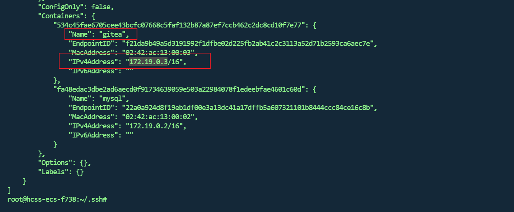

```shell
docker run -d \
--restart=always \
--name act_runner \
-v /home/docker_volume/gitea/act_runner/config.yaml:/config.yaml \
-v /home/docker_volume/gitea/act_runner/data:/data \
-v /var/run/docker.sock:/var/run/docker.sock \
-e CONFIG_FILE=/config.yaml \
-e GITEA_INSTANCE_URL=http://172.19.0.3:3000/ \
-e GITEA_RUNNER_REGISTRATION_TOKEN=nE9wypMi4tt7Q4byHQoNsEf08Rc5RHxVTkfwcPxq \
-e GITEA_RUNNER_NAME=act_runner \
-e GITEA_RUNNER_LABELS=act_runner \
--network server-net \
gitea/act_runner:0.2.11
```

> 注意：`-e GITEA_RUNNER_REGISTRATION_TOKEN`值填你自己的

1. **`-v /home/docker_volume/gitea/act_runner/config.yaml:/config.yaml`**:
    - 将主机上的 `/home/docker_volume/gitea/act_runner/config.yaml` 文件挂载到容器内的 `/config.yaml` 路径。这使得容器可以访问主机上的配置文件。
2. **`-v /home/docker_volume/gitea/act_runner/data:/data`**:
    - 将主机上的 `/home/docker_volume/gitea/act_runner/data` 目录挂载到容器内的 `/data` 路径。这使得容器可以访问主机上的数据目录。
3. **`-v /var/run/docker.sock:/var/run/docker.sock`**:
    - 将主机上的 Docker 套接字文件 `/var/run/docker.sock` 挂载到容器内的相同路径。这使得容器可以与主机上的 Docker 守护进程通信，从而能够运行 Docker 命令。
4. **`-e CONFIG_FILE=/config.yaml`**:
    - 设置环境变量 `CONFIG_FILE`，其值为 `/config.yaml`。这告诉 `act_runner` 使用挂载的配置文件。
5. **`-e GITEA_INSTANCE_URL=http://192.168.0.20:3000`**:
    - 设置环境变量 `GITEA_INSTANCE_URL`，其值为 `http://192.168.0.20:3000`。这指定了 Gitea 实例的 URL。
6. **`-e GITEA_RUNNER_REGISTRATION_TOKEN=sQUTxPmo5aZHxqz88eiAZrWaoay9KvJ5PVN1m6zw`**:
    - 设置环境变量 `GITEA_RUNNER_REGISTRATION_TOKEN`，其值为 `sQUTxPmo5aZHxqz88eiAZrWaoay9KvJ5PVN1m6zw`。这是用于注册 Runner 的令牌。
7. **`-e GITEA_RUNNER_NAME=act_runner`**:
    - 设置环境变量 `GITEA_RUNNER_NAME`，其值为 `act_runner`。这是 Runner 的名称。
8. **`-e GITEA_RUNNER_LABELS=act_runner`**:
    - 设置环境变量 `GITEA_RUNNER_LABELS`，其值为 `act_runner`。这是 Runner 的标签，用于标识 Runner。

> 通过这条命令，你可以启动并配置一个 `act_runner` 容器，使其能够与 Gitea 实例进行通信并执行 CI/CD 任务。

##### 验证

刷新前端页面

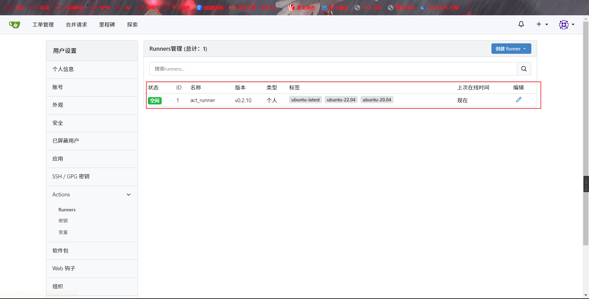

##### 修改conf.yaml:

如果想修改conf.yaml配置把镜像更换成国内镜像如下:

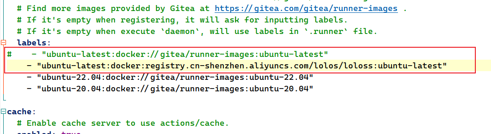

阿里云镜像

```shell
registry.cn-shenzhen.aliyuncs.com/lolos/loloss:ubuntu-latest
```

运行时，提示缓存配置错误，将下面内容保存到 `config.yaml` 文件中即可：

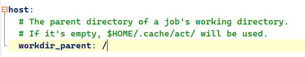

重启`runners`来更新配置

```shell
docker restart act_runner
```


##### 测试Action

新建一个测试仓库

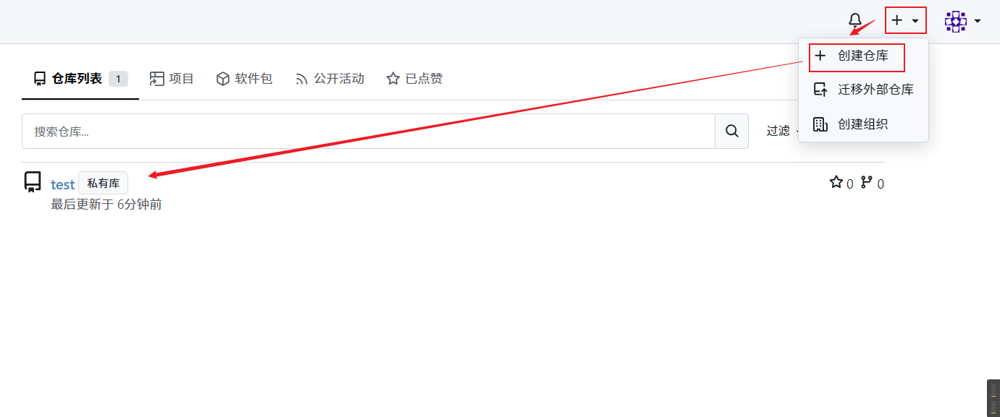

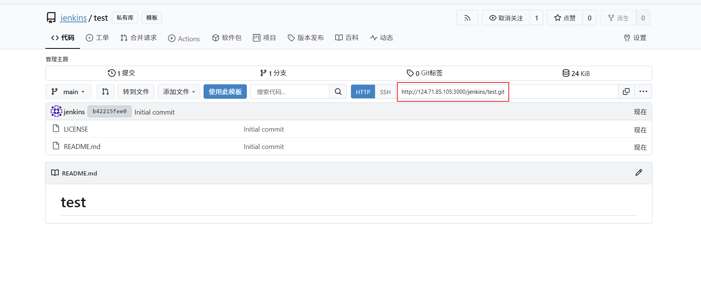

在本地通过`git`拉取

```bash
git clone http://124.71.85.105:3000/jenkins/test.git
```

第一次拉取会在浏览器弹出授权页面，直接授权即可，我这里由于已经授权了，就直接下载下来了

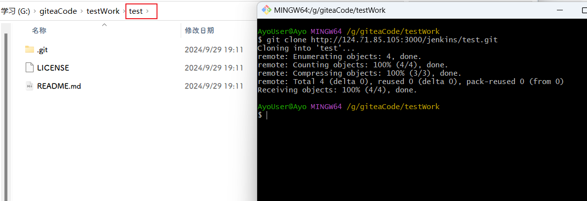

`git`面板进入工作目录

```bash
cd test
```

在`test`目录下新建文件夹`.gitea\workflows`

`.gitea\workflows`目录即用来存放Action动作的`yaml`文件

创建一个`demo.yaml`填入测试内容

> 参考：https://blog.csdn.net/yjw2017/article/details/131112507

```yaml
name: Gitea Actions Demo
run-name: ${{ gitea.actor }} is testing out Gitea Actions 🚀
on: [push]

jobs:
  Explore-Gitea-Actions:
    runs-on: ubuntu-latest
    steps:
      - run: echo "🎉 自动触发 ${{ gitea.event_name }} 事件."
      - run: echo "🐧 这个任务现在运行在由Gitea托管的 ${{ runner.os }} 服务器上!"
      - run: echo "🔎 您的分支名称是： ${{ gitea.ref }} 以及您的存储库为： ${{ gitea.repository }}."
      - name: Check out repository code
        uses: actions/checkout@v3
      - run: echo "💡 这个存储库 ${{ gitea.repository }} 已克隆到运行程序."
      - run: echo "🖥️ 现在已经准备好在工作流运行器上测试您的代码."
      - name: List files in the repository
        run: |
          ls ${{ gitea.workspace }}
      - run: echo "🍏 这个任务的状态为： ${{ job.status }}."
```

然后提交代码

```bash
git add .gitea/workflows/demo.yaml
git commit -m "添加一个Action"
git push -u origin main
```

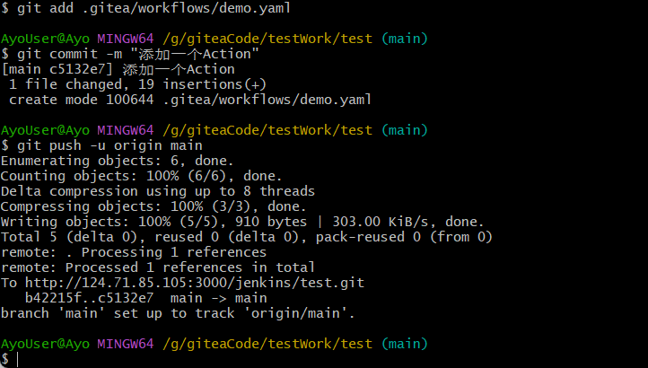

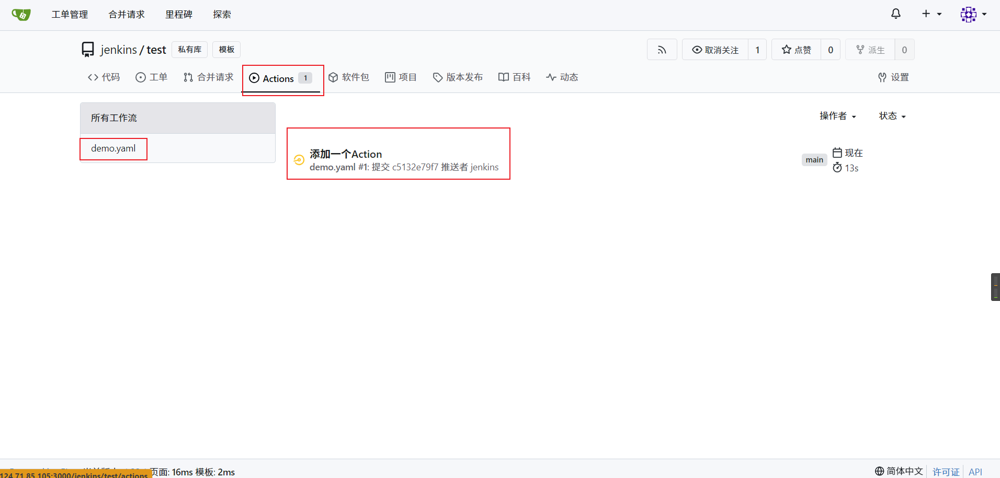

注意yaml里有句话

```yaml
jobs:
  Explore-Gitea-Actions:
    runs-on: ubuntu-latest
```

`ubuntu-latest`即为`runner`里`config.yaml`配置的`label`的其中一个

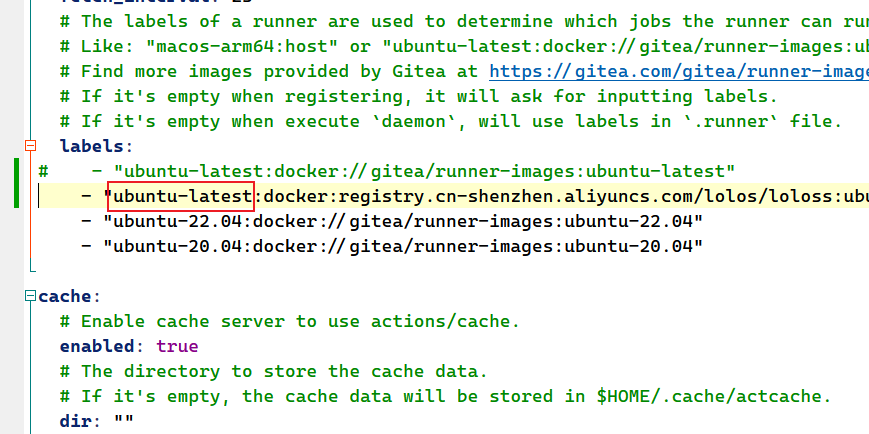

可以看到`ubuntu-latest`执行的动作是使用 `registry.cn-shenzhen.aliyuncs.com/lolos/loloss:ubuntu-latest` 镜像的 Docker Runner

> - `runs-on: ubuntu-latest`
>     - 这个指令告诉 Gitea 选择一个带有 `ubuntu-latest` 标签的 Runner 来运行作业。
>     - 如果你注册的 Runner 有 `ubuntu-latest` 标签，Gitea 会选择这些 Runner。
>     - 如果你没有注册label，则action会一直`等待`,知道出现对应lable为止【修改config.yaml后重启容器】
>
> 你也可以直接在runs-on这么些
>
> ```yaml
> jobs:
>   Explore-Gitea-Actions:
>     runs-on: ubuntu-latest:docker:registry.cn-shenzhen.aliyuncs.com/lolos/loloss:ubuntu-latest
> ```

来来回回出错后（修改了配置文件未重启容器），最终调好的结果如下

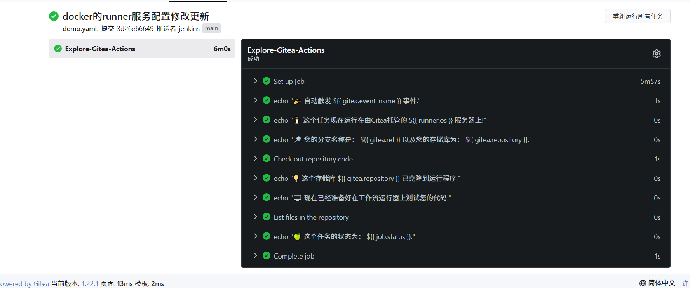

### 总结

主要就是`.gitea\workflows`下的yaml文件的编写，后续我们更新相关笔记，自学的话参考`GitHub`的`Actions`

### 问题

注册一直报错

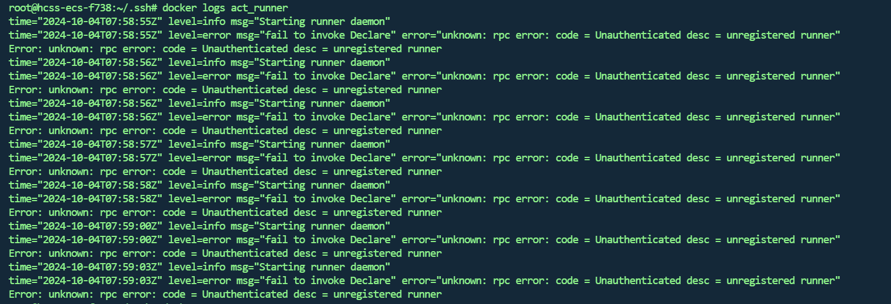

这个错误信息表明你的Gitea Runner在尝试注册时未能成功，原因可能是Runner的注册令牌不正确或已过期，或者是Gitea实例的URL配置不正确。

注意容器挂载目录里有一句`-v /home/docker_volume/gitea/act_runner/data:/data \`

当`Gitea Runner`运行成功后会自动生成一个`/home/docker_volume/gitea/act_runner/data/.runner`文件,里面就存了注册成功的信息，由于我之前注册过一个，导致挂载目录已经存咋一份旧的`.runner`文件阻止了容器挂载的信息自动生成，解决办法就是删除挂载用的`data`目录即可

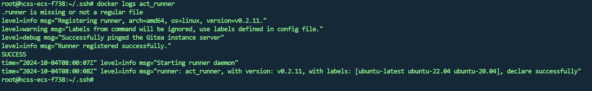
