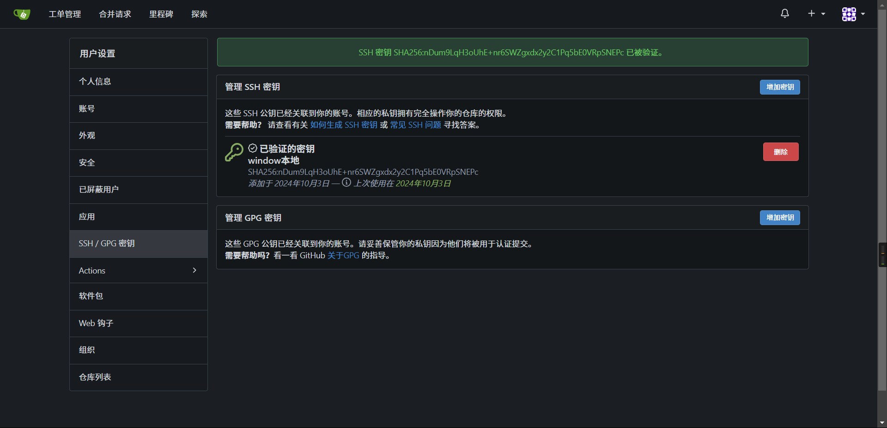

## window

### 生成密钥

密钥文件存放在本地的

```sh
C:\Users\当前账户\.ssh
```

如果存在就跳过，直接进入Gitea密钥配置

管理员打开`powershell`使用以下命令生成SSH

```shell
 ssh-keygen -t rsa -b 3071 -C "2192475085@qq.com"
```


一直回车即可，去往用户的`.ssh`目录查看文件


### Gitea密钥配置

去往`gitea`页面


其中密钥内容即为`id_rsa.pub`下的内容，这里我已经添加了就不重复添加了

### gitea验证


在`powershell`输入以下命令,其中的`/path_to_PrivateKey_or_RelatedPublicKey`为你的公钥文件路径

```shell
echo -n 'a31f7e60059c9babaaaa4f0372ca728eca235b3849eba263c1595e827e03026a' | ssh-keygen -Y sign -n gitea -f "C:\Users\AyoUser\.ssh\id_rsa.pub"
```


将生成的值填入`增强 SSH 签名`里验证


结果如下



### 本地验证

使用如下命令

```sh
ssh -T git@giteaIP地址
```


输出

```sh
Hi there, jenkins! You've successfully authenticated with the key named xxxxx, but Gitea does not provide shell access.
If this is unexpected, please log in with password and setup Gitea under another user.
```

即表示成功

### 问题

#### gitea验证


我这里是截图导致上述的验证过期了，gitea生成的签名有时间限制，重新来一遍就好了

#### 本地验证


还是需要密码

这个原因是gitea里的ssh认证默认是使用22端口的，我们在gitea部署的时候映射了3001端口


而且服务器的22端口默认开放给了服务器本身的ssh，导致

```sh
ssh -T git@giteaIP地址
```

命令是通过不了，我们指定端口试试

```sh
ssh -T -p 3001 git@giteaIP地址
```

如果输出成功信息则到此结束，如果没有则接着往下

这里有两种解决方法

##### 第一种

`第一种`参考官方给出的解决方案`SSH容器直通`地址如下

> https://docs.gitea.com/zh-cn/next/installation/install-with-docker#ssh-%E5%AE%B9%E5%99%A8%E7%9B%B4%E9%80%9A

##### 第二种

`第二种`，修改gitea的配置`app.ini`,他在gitea服务的`data/gitea/conf`下面，这里我做了data文件的外部挂载，就直接在挂载目录修改了


将`SSH_PORT`改成你映射的端口即可


改完重启容器，再次验证


可以发现，第二种是需要指定端口的，因为ssh默认访问的就是22端口

还有点就是你如果第一次触发ssh的服务认证，会有个确认输入，我这里之前测试的时候已经验证过了，所以才没有，确认一般如下


