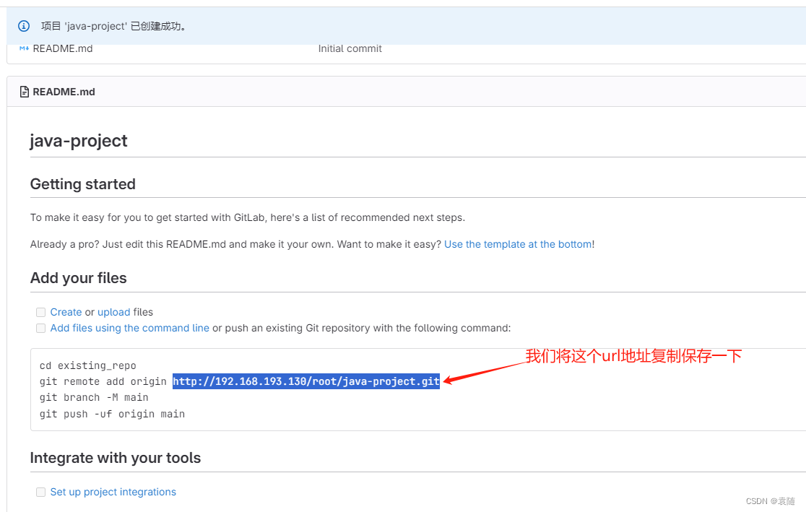
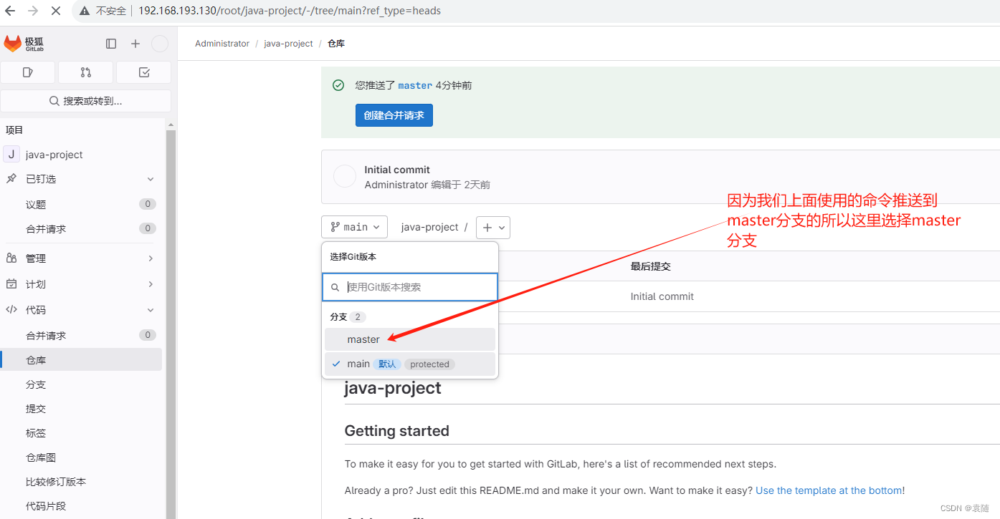

## 安装

#### 1、服务器环境

> **名称**               **系统**                  **IP               	备注**
>
> [gitlab](https://so.csdn.net/so/search?q=gitlab&spm=1001.2101.3001.7020)        ubuntu20.04.2图形化     192.168.26.130    要求有6G的内存

#### 2、做时间同步（所有服务器都要执行）

> timedatectl set-timezone "Asia/Shanghai"    #时区改为上海
>
> ntpdate "ntp.aliyun.com"                 #更正时间


出现下图错误 说明本机没有安装ntpdate 


解决办法

```shell
sudo apt install ntpdate
```

#### 3、安装gitlab极狐

```shell
 #更新系统的软件包列表和版本信息
sudo apt-get update           
```


```bash
# 安装依赖
sudo apt-get upgrade
sudo apt-get install curl openssh-server ca-certificates postfix
#sudo apt-get install curl ca-certificates postfix
```


接下来会遇到如下界面，Tab切换到“确定”按钮，然后回车。


还是照样Tab切换到“确定”按钮，然后回车。


### 安装Gitlab

先执行命令

```bash
curl -s https://packages.gitlab.com/install/repositories/gitlab/gitlab-ce/script.deb.sh | sudo bash
```

（我这里不小心执行了两次，一次即可）

前往Gitlab官网：https://packages.gitlab.com/gitlab/gitlab-ce，找到最新版本的`gitlab-ce`[安装包](https://so.csdn.net/so/search?q=安装包&spm=1001.2101.3001.7020)，注意版本是`ubuntu/focal`。


安装命令：

```bash
wget --content-disposition https://packages.gitlab.com/gitlab/gitlab-ce/packages/ubuntu/focal/gitlab-ce_17.4.1-ce.0_amd64.deb/download.deb
```

然后再解压：`sudo dpkg -i gitlab-ce_17.4.1-ce.0_amd64.deb`

> 如果运行`dpkg`报openssh-server相关的错误，请先执行下面三个命令：
>
> ```bash
> sudo apt --fix-broken install
> sudo apt-get update
> sudo apt-get upgrade
> ```
>
>
> 分区已满报错：
>
> ```shell
> root@ayoubuntu:/home/cache# sudo dpkg -i gitlab-ce_17.4.1-ce.0_amd64.deb
> (正在读取数据库 ... 系统当前共安装有 124885 个文件和目录。)
> 准备解压 gitlab-ce_17.4.1-ce.0_amd64.deb  ...
> 正在解压 gitlab-ce (17.4.1-ce.0) ...
> dpkg: 处理归档 gitlab-ce_17.4.1-ce.0_amd64.deb (--install)时出错：
>  无法为 './opt/gitlab/embedded/sbin/nginx' 拷贝解压的文件至 '/opt/gitlab/embedded/sbin/nginx.dpkg-new'： 写入失败 (设备上没有空间)
> dpkg-deb: 错误: 粘贴 子进程被信号(断开的管道) 终止了
> 在处理时有错误发生：
>  gitlab-ce_17.4.1-ce.0_amd64.deb
> ```
>
> ```shell
> #******************************
> #查看分区情况： df -h 
> #******************************
> root@ayoubuntu:/home/cache# df -h
> 文件系统                           大小  已用  可用 已用% 挂载点
> tmpfs                              392M  1.6M  391M    1% /run
> /dev/mapper/ubuntu--vg-ubuntu--lv   12G  9.6G  1.2G   90% /
> tmpfs                              2.0G     0  2.0G    0% /dev/shm
> tmpfs                              5.0M     0  5.0M    0% /run/lock
> /dev/sda2                          2.0G  182M  1.7G   10% /boot
> tmpfs                              392M   12K  392M    1% /run/user/0
> #******************************
> # 查看opt路径归属哪个分区： df /opt 
> #******************************
> root@ayoubuntu:/home/cache# df /opt
> 文件系统                            1K的块    已用    可用 已用% 挂载点
> /dev/mapper/ubuntu--vg-ubuntu--lv 11758760 9967008 1172644   90% /
> #目标分区为/dev/mapper/ubuntu--vg-ubuntu--lv
> 
> #******************************
> #确认有可用的空间：sudo vgdisplay
> #******************************
> root@ayoubuntu:/home/cache# sudo vgdisplay
>   --- Volume group ---
>   VG Name               ubuntu-vg
>   System ID             
>   Format                lvm2
>   Metadata Areas        1
>   Metadata Sequence No  2
>   VG Access             read/write
>   VG Status             resizable
>   MAX LV                0
>   Cur LV                1
>   Open LV               1
>   Max PV                0
>   Cur PV                1
>   Act PV                1
>   VG Size               <23.00 GiB
>   PE Size               4.00 MiB
>   Total PE              5887
>   Alloc PE / Size       2943 / <11.50 GiB
>   Free  PE / Size       2944 / 11.50 GiB
>   VG UUID               SXrXOL-MeRo-feec-fME7-2naP-Ujj6-bC2Vdh
>   
> #卷组的名称： ubuntu-vg
> #使用的逻辑卷管理器版本: lvm2
> #存储元数据的区域数量: 1
> #元数据的序列号，表示当前的元数据版本: 2
> #卷组的访问权限，这里表示可以读写: read/write
> #卷组的状态，表示可以调整大小: resizable
> #最大逻辑卷数量为 0，这意味着没有限制: 0
> #当前逻辑卷的数量，这里表示有 1 个逻辑卷: 1
> #当前打开的逻辑卷数量，表示正在使用的逻辑卷: 1
> #最大物理卷数量为 0，这意味着没有限制: 0
> #当前物理卷的数量，这里表示有 1 个物理卷: 1
> #活动的物理卷数量，这里表示有 1 个正在使用的物理卷: 1
> #卷组的总大小，这里表示约为 23.00 GiB: <23.00 GiB
> #每个物理扩展（PE）的大小，这里为 4.00 MiB: 4.00 MiB
> #总共有的物理扩展数量: 5887
> #已分配的物理扩展数量及其对应大小，表示当前已使用约 11.50 GiB 的空间: 2943 / <11.50 GiB
> #剩余的物理扩展数量及其对应大小，表示还有约 11.50 GiB 可用空间可供扩展: 2944 / 11.50 GiB
> #卷组的唯一标识符: SXrXOL-MeRo-feec-fME7-2naP-Ujj6-bC2Vdh
> ######################
> #从这个输出中可以看出，ubuntu-vg 卷组总共有大约 23.00 GiB 的空间，
> #目前已使用约 11.50 GiB，还有约 11.50 GiB 的空间是可用的。
> #这表明可以安全地扩展逻辑卷，因为有足够的未分配空间可供使用。
> ######################
> 
> #******************************
> #确认文件系统类型
> #******************************
> root@ayoubuntu:/home/cache# df -T
> 文件系统                          类型      1K的块    已用    可用 已用% 挂载点
> tmpfs                             tmpfs     401012    1540  399472    1% /run
> /dev/mapper/ubuntu--vg-ubuntu--lv ext4    11758760 9966916 1172736   90% /
> tmpfs                             tmpfs    2005048       0 2005048    0% /dev/shm
> tmpfs                             tmpfs       5120       0    5120    0% /run/lock
> /dev/sda2                         ext4     1992552  185812 1685500   10% /boot
> tmpfs                             tmpfs     401008      12  400996    1% /run/user/0
> #可以看到目标分区为/dev/mapper/ubuntu--vg-ubuntu--lv类型为ext4
> 
> 
> #******************************
> #扩展逻辑卷
> #******************************
> # 使用 -l +100%FREE 来使用所有可用的空闲空间
> sudo lvextend -l +100%FREE /dev/mapper/ubuntu--vg-ubuntu--lv
> # 指定具体的大小，例如增加 10GB，可以使用
> sudo lvextend -L +10G /dev/mapper/ubuntu--vg-ubuntu--lv
> 
> #******************************
> #扩展文件系统：扩展逻辑卷后，您需要扩展文件系统以使用新增加的空间
> #******************************
> # ext4 文件系统，使用
> sudo resize2fs /dev/mapper/ubuntu--vg-ubuntu--lv
> # 文件系统是 xfs，使用
> sudo xfs_growfs /dev/mapper/ubuntu--vg-ubuntu--lv
> 
> 
> #******************************
> #验证扩展结果
> #******************************
> df -h /dev/mapper/ubuntu--vg-ubuntu--lv
> 
> ```
>
> 


运行完`sudo dpkg`后如果出现下面的界面就表示gitlab安装成功。


### 配置Gitlab

运行

```bash
sudo vim /etc/gitlab/gitlab.rb
```

来查看当前gitlab网页ip和端口号。

如果出现vim识别不了的报错，运行下面两行命令即可

```shell
sudo rm /var/lib/dpkg/lock*
sudo apt-get update && sudo apt-get install vim
```

如果运行上述命令出现权限问题，运行下列命令即可：

```bash
chmod -R 755 /var/log/gitlab
```


然后再运行

```bash
sudo vim /etc/gitlab/gitlab.rb
```

进入gitlab的配置文件修改界面，输入i进入编辑模式，然后找到`external_url`字段（在第32行），改成自己需要设置的IP和端口号，IP我设置为本机的ipv4地址。


修改完毕以后按`esc键`退出编辑模式，然后输入`:wq`保存即可。接下来通过下列命令重启服务。

```bash
# 停止gitlab服务 
sudo gitlab-ctl stop

# 启动gitlab服务 
sudo gitlab-ctl reconfigure

# 重启所有gitlab组件 
sudo gitlab-ctl restart

# 启动所有gitlab组件 
sudo gitlab-ctl start

# 启用开机自启动
sudo systemctl enable gitlab-runsvdir.service
# 停止服务
sudo systemctl stop gitlab-runsvdir.service
# 禁用该服务，使其不会在系统启动时自动启动
sudo systemctl disable gitlab-runsvdir.service

```


### 初始化root的密码

按照如下命令初始化管理员账户的密码：

```shell
#切换路径
cd /opt/gitlab/bin/

#打开控制台
sudo gitlab-rails console -e production
 
#查询用户账号信息并赋值给u
u=User.where(id:1).first

#设置root的密码
u.password='ayo123456'
u.password='Ay76PzcaXyCbqzV2kgRT'

#确认密码
u.password_confirmation='ayo123456'
u.password_confirmation='Ay76PzcaXyCbqzV2kgRT'

#保存信息(注意有个感叹号）
u.save!

#退出
exit
```


### 开放端口（ufw）

UFW 是标准 [Ubuntu](https://so.csdn.net/so/search?q=Ubuntu&spm=1001.2101.3001.7020) 20.04 安装过程中的一部分，它应该已经在系统上存在。如果因为某些原因，它没有被安装，可以通过输入下面的命令安装它：

```shell
sudo apt update
sudo apt install ufw
```

安装过程不会自动激活防火墙，以避免服务器被锁住。可以检查 UFW 的状态，输入：

```shell
sudo ufw status verbose
```

ufw命令行示例：

```shell
ufw enable/disable：打开/关闭防火墙
ufw reload：重启防火墙
ufw status：查看已经定义的ufw规则
ufw default allow/deny：外来访问默认允许/拒绝
ufw allow/deny 20：允许/拒绝访问20端口，20后可跟/tcp或/udp，表示tcp或udp封包。
sudo ufw allow proto tcp from 192.168.0.0/24 to any port 22：允许自192.168.0.0/24的tcp封包访问本机的22端口。
ufw delete allow/deny 20：删除以前定义的"允许/拒绝访问20端口"的规则
```

ufw打开或关闭某个端口，例如：

```shell
#允许外部访问9200端口(tcp/udp)
sudo ufw allow 8807 
#允许外部访问3690端口(svn)
sudo ufw allow 3690 
#允许此IP访问所有的本机端口
sudo ufw allow from 192.168.25.125 
#允许指定的IP段访问特定端口
sudo ufw allow proto tcp from 192.168.0.0/24 to any port 22 
#删除上面建立的某条规则，比如删除svn端口就是 sudo ufw delete allow 3690 
sudo ufw delete allow smtp 
```

### gitlab常用命令

```shell
gitlab-ctl start # 启动所有gitlab组件
gitlab-ctl stop # 停止所有gitlab组件
gitlab-ctl restart # 重启所有gitlab组件
gitlab-ctl status # 查看服务状态
gitlab-ctl reconfigure # 启动服务
vim /etc/gitlab/gitlab.rb # 修改默认的配置文件
gitlab-ctl tail # 查看日志
```


### 登陆web页面查看

接下来就可以通过`http://192.168.17.128:8077`来登录gitlab了。登录的地址是你之前设置`external_url`字段的值。


**注：如果出现502错误 可以等一会再刷新看看** 


登录进去大概长这样：


### 将gitlab页面设置为中文

按下面的步骤将gitlab语言设置为中文：
注意点击`Preferences`。


点击`Save changes`，刷新即可。

### Gitlab注册新用户

通过以下步骤来注册新用户：


注册之后会显示需要管理员批准，这样才算真正注册成功。


再次登录`root`账户，点击配置Gitlab：


查看最新的用户：


点击等待批准，然后批准该用户进入群组。


### 新建项目

新建项目


选择创建空白项目




### 使用命令行的方式向gitlab推送代码

```shell
 git branch -a           #查看分支的命令
git status              #查看当前工作目录的状态
```


找一个文件上传到你目录下 我的是在/root 目录下


```shell
#设置用户名、邮箱为gitlab上设置的邮箱
git config --global user.name "yuansui@2527.com"
git config --global user.email "yuansui@2527.com"
git config --global --list      #查看邮箱
```


```shell
#然后输入上面保存的地址
git clone http://192.168.193.130/root/java-project.git
```


```shell
git add .          #把目录下的所有文件上传到git
```


```shell
git commit -m "你的描述"        #提交信息格式
git commit -m "测试"
```


```shell
git push <链接（orgin是别名）> <本地仓库>:<远程分支>
git push origin master
```


然后我们在浏览器可以看到下面的消息


**我们上面操作推送代码的时候选择的的maser分支所以这里选择maser分支查看**



下图可以看出我们推送的文件


## 彻底卸载GitLab

如果你决定不再使用GitLab，并希望彻底卸载它，可以按照以下步骤进行：

1. 停止GitLab服务：

    ```vbscript
    sudo gitlab-ctl stop
    ```

2. 卸载GitLab软件包：

    ```undefined
    sudo apt purge gitlab-ce
    ```

3. 删除GitLab数据和配置文件：

    ```cobol
    sudo rm -rf /etc/gitlab /var/opt/gitlab /var/log/gitlab
    ```

4. 删除GitLab用户和组：

    ```undefined
    sudo deluser git
    
    sudo delgroup git
    ```
    
5. 更新系统的包列表：

    ```sql
    sudo apt update
    ```

6. 清理不需要的依赖：

    ```undefined
    sudo apt autoremove
    ```

现在，你的系统已经彻底卸载了GitLab，并清理了相关的数据和配置文件。请注意，这将清除所有GitLab的设置和数据，包括项目和用户数据。请在执行卸载前备份重要数据。
