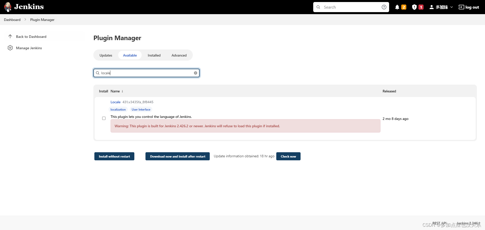

虽然说网上有很多关于 `Jenkins` 安装的教程，但是大部分都不够详细，或者是需要搭配 `docker` 或者 `k8s` 等进行安装，对于新手小白而已，学习的成本确实有点大，所以该篇博客就是使用最原始的方式进行 `Jenkins` 的安装

## 一、简介


官网：[https://www.jenkins.io](https://www.jenkins.io/)

中文文档：https://www.jenkins.io/zh/

清华大学开源下载地址：https://mirrors.tuna.tsinghua.edu.cn/jenkins/war/latest/


`Jenkins` 是一个开源的持续集成（CI）工具，用于自动化构建、测试和部署软件项目。它提供了一个易于使用和可扩展的平台，帮助团队更高效地开发和交付软件。

## 	二、安装前准备

从 [Jenkins 的入门指南](https://www.jenkins.io/zh/doc/pipeline/tour/getting-started/) 中可以了解到


Jenkins` 对机器的要求是至少要 `256 MB` 的内存，还需要安装 `Java

可以 `java -version` 命令来检查是否已经安装了 `Java`，如果有打印出 `Java` 的版本信息则表示已经安装过了


如何在 `Linux` 上安装 `Java`，具体步骤百度

假如你需要像我一样使用 `Jenkins` 在 `Linux` 上构建 `Java` 项目，可先安装一下 `maven`，步骤自行百度

在 `Linux` 上安装 `Jenkins` 非常简单，如果只是为了学习没必要非得使用 `docker`，和在 `Windows` 上用 `war` 包进行安装差不多，因为 `war` 是跨平台的，只需要系统上安装了 `Java` ，均可以 `java -jar` 的命令运行起来

## 三、下载与安装

进入 `Jenkins` 的 [官方下载页面](https://www.jenkins.io/download/)


`LTS` 是长期支持的版本，是稳定的版本

在下载安装包之前要先确定应该下载哪个版本的 `Jenkins`，`Jenkins` 的版本依赖于 `Java` 的版本，可在 [Jenkins-Java Support Policy](https://www.jenkins.io/doc/book/platform-information/support-policy-java/) 中进行查看


如果你下载的 `Jenkins` 版本与本地 `Java` 不支持，那么 `Jenkins` 是无法安装成功的，比如说我服务器上 `JDK` 的版本是 `1.8.0_311`，也就是 `Java 8`，那么我只能安装 `2.346.1` 或者该版本之前的，在 `Past Releases` 上可以查看到历史版本

注意：不过还是建议大家去安装 `JDK-21`，直接下载最新版本的 `Jenkins`，要不然插件安装会比较麻烦


页面如下 ：


比如我要下载 `2.346.1` 版本的，就下载该版本的 `jenkins.war` 文件


下载完成之后就把该 `war` 包上传至服务器

这里我会先在服务器上创建一个 `/soft/jenkins` 的文件夹用于存放 `jenkins` 的安装包，并进入到该目录下

```shell
# 创建 /soft/jenkins 文件夹
mkdir /soft/jenkins
# 进入到 /soft/jenkins 文件夹下
cd /soft/jenkins
```


使用 `rz` 命令将下载好的安装包上传到该目录下


可以用 `ls` 命令查看是否上传成功


上传成功之后就可以直接用 `java -jar` 命令启动起来，可以通过 `httpPort` 来指定端口号

```shell
java -jar jenkins.war --httpPort=8080
```


首次启动会比较慢，因为需要初始化和存放一些文件到 `.jenkins` 的目录下


在启动过程中会打印出 `管理员账户密码`

这个时候就可以去游览器上访问下 `ip:port`，`ip` 是服务器的 `ip` 地址，`port` 是启动 `jenkins` 的端口，比如：`192.163.10.12:8080` ，如果你用的是 `云服务器`，可别忘了在云服务器上开放该端口号


在游览器上展示页面如下，就可以进行初始化了


将 `管理员账户密码` 复制到对应的地方，点击 `继续`


这里建议点击 `选择插件来安装`，在点击 `无` ，不安装任何插件，再点击 `安装`，因为我们没有配置镜像，安装插件是从外网下载过来的，会比较慢，并且下载的插件可能会出现不兼容等状况，导致失败率很高


进入到创建管理员页面，填写账户信息后 `保存并完成`


进入以下页面配置 `jenkins` 的 `url` ，一般使用默认的就行了，`保存并完成`


初始化完成


可以点击 `开始使用 Jenkins` 直接登录进入 `Jenkins`


## 四、配置镜像地址

之前启动 `Jenkins` 时会打印出管理员账户密码所在文件，例如：`/root/.jenkins/secrets/initialAdminPassword`，`/root/.jenkins` 就是 `jenkins` 的工作目录，在 `jenkins` 的工作目录 `.jenkins` 中，找到 `hudson.model.UpdateCenter.xml` 文件打开


将 `https://updates.jenkins.io/update-center.json` 替换成国内镜像网址并 `保存`

- [国内镜像网址](https://mirrors.tuna.tsinghua.edu.cn/)：`https://mirrors.tuna.tsinghua.edu.cn/jenkins/updates/update-center.json`
- [国外镜像网址](https://mirror.xmission.com/)：`https://mirror.xmission.com/jenkins/updates/update-center.json`


再进入到 `updates` 目录下，编辑 `default.json` 文件，将该文件中国外的地址全部替换成国内的


- `https://www.google.com` 全部替换成 `https://cn.bing.com`
- 或者`https://www.google.com` 全部替换成 `https://www.baidu.com`


- `https://updates.jenkins.io/download` 全部替换成 `https://mirrors.tuna.tsinghua.edu.cn/jenkins`

​	

## 五、启动与关闭


#### **1. 启动**

前文是有用到 `java -jar` 的命令启动了 `Jenkins`，这里简单总结以下：

- 前台启动

    ```shell
    #特点：当前ssh窗口被锁定，可按 CTRL+C 打断程序运行，或直接关闭窗口，程序退出
    java -jar jenkins.war --httpPort=8080
    
    #特定：当前ssh窗口不被锁定，但是当窗口关闭时，程序中止运行
    java -jar jenkins.war --httpPort=8080 & 
    ```

- 后台启动

    ```shell
    # nohup 意思是不挂断运行命令，当账户退出或终端关闭时，程序仍然运行
    # 当用 nohup 命令执行作业时，缺省情况下该作业的所有输出被重定向到 nohup.out 的文件中
    nohup java -jar jenkins.war --httpPort=8080 &
    
    # 这种方法会把日志文件输入到你指定的文件 jenkins.log 中，没有则会自动创建
    nohup java -jar jenkins.war --httpPort=8080 >jenkins.log &
    123456
    ```

如果用的是云服务器，直接后台启动就行了，即使关闭终端，程序依然可以运行

#### **2. 关闭**

可以先查询 `Jenkins` 的进程

```shell
ps -ef | grep jenkins
```


然后再通过 `kill` 命令来关闭程序

```bash
# 彻底杀死进程号为 pid 的进程
kill -9 pid
```

## 六、常用插件的安装

`Jenkins` 相当于一个平台，它很多的功能都是通过对应的插件去实现的，所以插件安装对于使用 `Jenkins` 非常的重要

在 `Jenkins` 中常用的插件如下：

- [Folders](https://updates.jenkins.io/download/plugins/cloudbees-folder/)
- [OWASP Markup Formatter](https://updates.jenkins.io/download/plugins/antisamy-markup-formatter/)
- [Build Timeout](https://updates.jenkins.io/download/plugins/build-timeout/)
- [Credentials Binding](https://updates.jenkins.io/download/plugins/credentials-binding/)
- [Timestamper](https://updates.jenkins.io/download/plugins/timestamper/)
- [Workspace Cleanup](https://updates.jenkins.io/download/plugins/ws-cleanup/)
- [Ant](https://updates.jenkins.io/download/plugins/ant/)
- [Gradle](https://updates.jenkins.io/download/plugins/gradle/)
- [Pipeline](https://updates.jenkins.io/download/plugins/workflow-aggregator/)
- [GitHub Branch Source](https://updates.jenkins.io/download/plugins/github-branch-source/)
- [Pipeline:GitHub Groovy Libraries](https://updates.jenkins.io/download/plugins/pipeline-github-lib/)
- [Pipeline:Stage View](https://updates.jenkins.io/download/plugins/pipeline-stage-view/)
- [Git](https://updates.jenkins.io/download/plugins/git/)
- [SSH Build Agents](https://updates.jenkins.io/download/plugins/ssh-slaves/)
- [Matrix Authorization Strategy](https://updates.jenkins.io/download/plugins/matrix-auth/)
- [PAM Authentication](https://updates.jenkins.io/download/plugins/pam-auth/)
- [LDAP](https://updates.jenkins.io/download/plugins/ldap/)
- [Email Extension](https://updates.jenkins.io/download/plugins/email-ext/)
- [Mailer](https://updates.jenkins.io/download/plugins/mailer/)
- [Dark Theme](https://updates.jenkins.io/download/plugins/dark-theme/)
- [Localization: Chinese (Simplified)](https://updates.jenkins.io/download/plugins/localization-zh-cn/)

下面我以安装插件 `Loale` 为例，演示安装插件的大概步骤

访问 `Jenkins` ，选择 `Manage Jenkins`


选择 `Manage Plugins`


选择 `Available`


搜索栏中搜索 `Locale`



如果下载页面没有红色的警告，点击 `Download now and install after restart` 就会下载最新版本的插件，安装并重启，[跳转至重启后 -->](https://blog.csdn.net/xhmico/article/details/136535498#LOCALE_RESTART)

如果有类似：`Warning: This plugin is built for Jenkins 2.426.2 or newer. Jenkins will refuse to load this plugin if installed.` 这样的提示，就表明当前插件的版本和你所下载的 `Jenkins` 的版本不兼容，很大概率会安装不成功，这个时候就需要去下载兼容该 `Jenkins` 版本的插件

点击插件的名称，打开该插件对应的网址


点击 `Releases`


再点击 `checksums`，就可以看到插件对应的版本了


比如说我下载的 `Jenkins` 版本是 `2.346.1`，那我下载 `180.v207501dff9b_a_`，点击即可


插件下载完成


回到 `Jenkins` 中，点击 `Advanced`


下拉找到 `Deploy Plugin`，这里可以上传本地下载好的插件，上传完之后点击 `Deploy`


就会开始安装该插件


可以在 `Installed` 中看到刚刚手动安装的插件了


接着就重启 `Jenkins` 使该插件生效

重启方法：在 `URL` 的后面加上 `restart`，例如：`http://localhost:8080/restart`


点击 `Yes` 即可重启


重启完成，再次登录并选择 `Manage Jenkins`


选择 `Configure System`


找到 `Locale` 选项，输入 `zh_CN` 勾选下面的选项，点击 `Apply` 和 `save`


如果以上方法已经生效了，表明汉化插件已经安装完成，如果没有生效，则还需要安装一个汉化包

搜索插件 `Localization: Chinese`


按照上述方式进行安装重启


重启之后可以看到汉化完成
