## 准备工作

- 下载java JDK

## 1. 下载Jenkins

官网：https://jenkins.io/zh/download/

登录官网，根据系统的类型，下载不同版本的Jenkins。

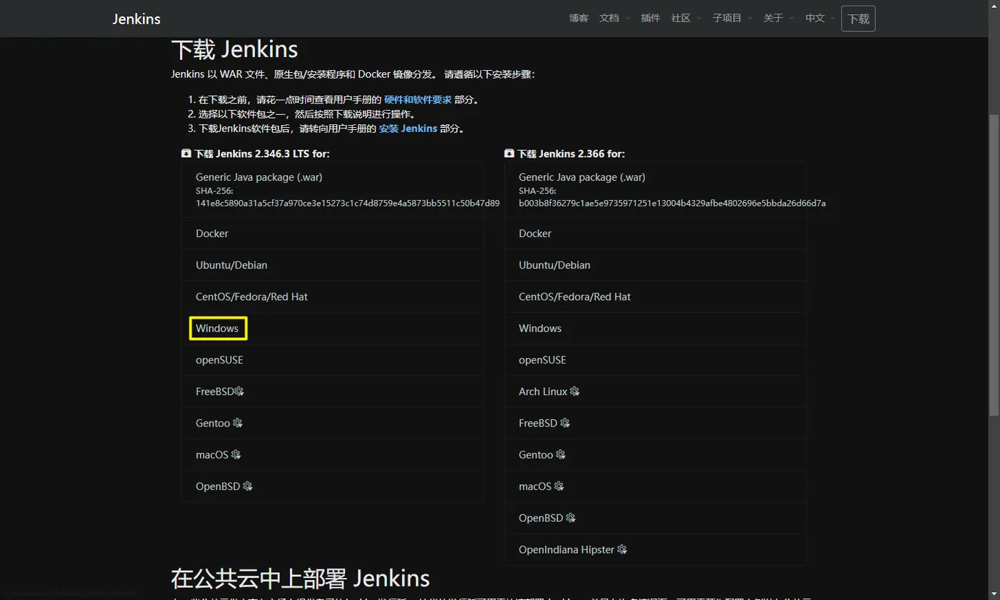

## 2. 安装Jenkins

1）点击安装包

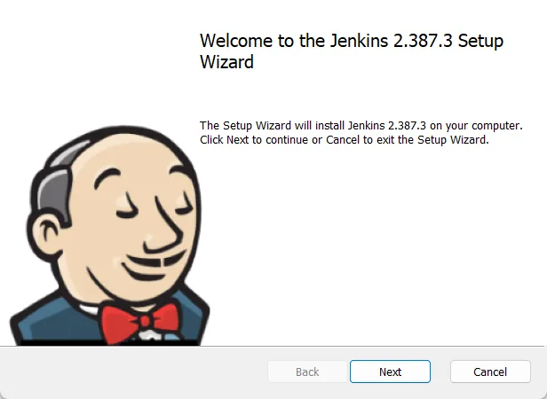

2）下一步选择安装路径

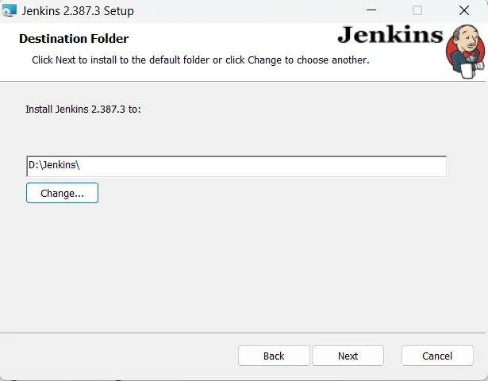3)选择本地系统

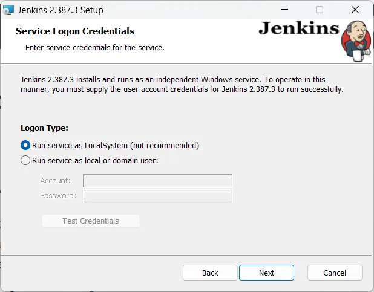

4） 选择端口

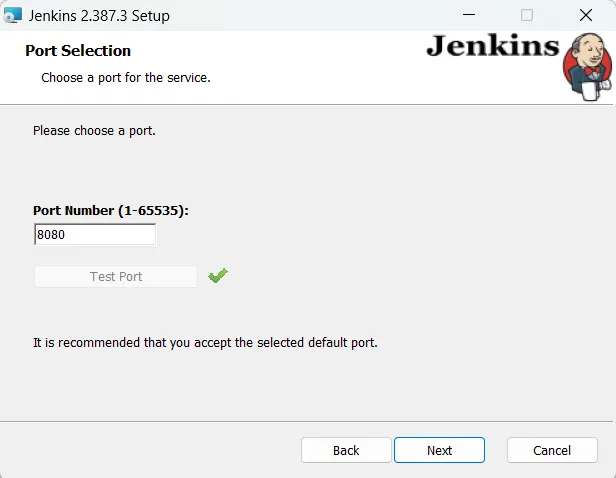

5）安装

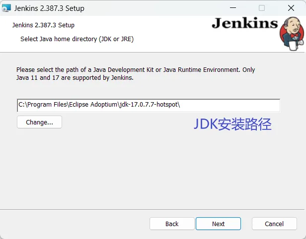

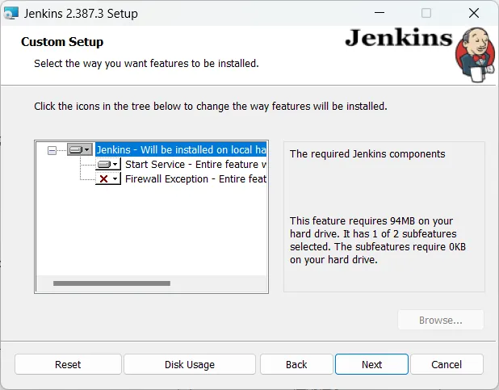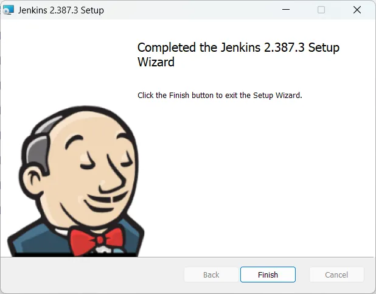

直接安装即可。

## 3. 运行Jenkins

1）打开cmd，切换到jenkins的安装路径下

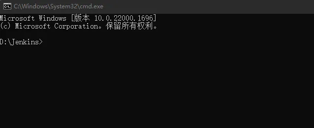

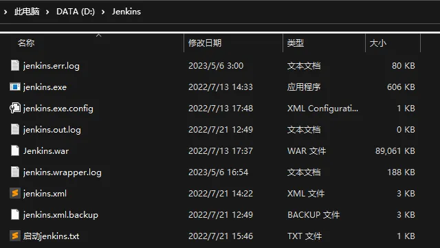

2）输入启动命令，启动jenkis

输入如下命令来启动jenkis：

```shell
java -jar jenkins.war --httpPort=8083
```

启动成功后，显示如下：

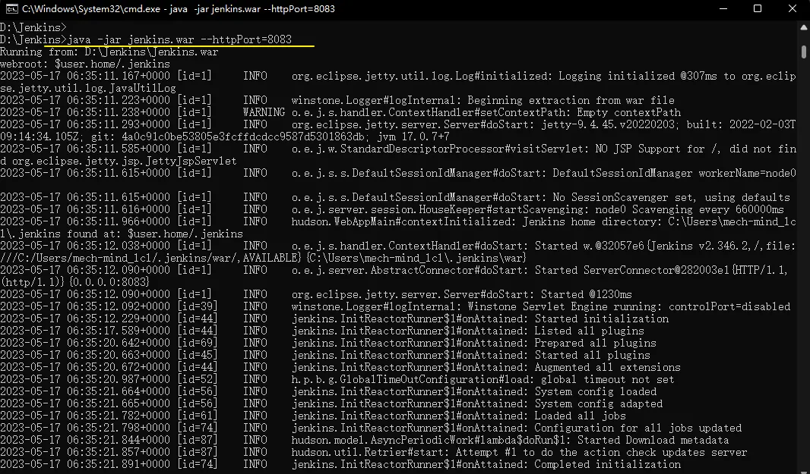

3）打开网页查看jenkis

打开浏览器输入`http://localhost:8083`。可以看到Jenkins已经启动。

> 注意：这里的端口号要与启动时的端口号一致。

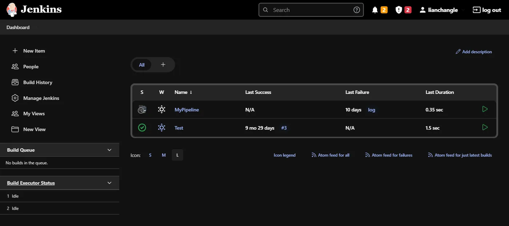
