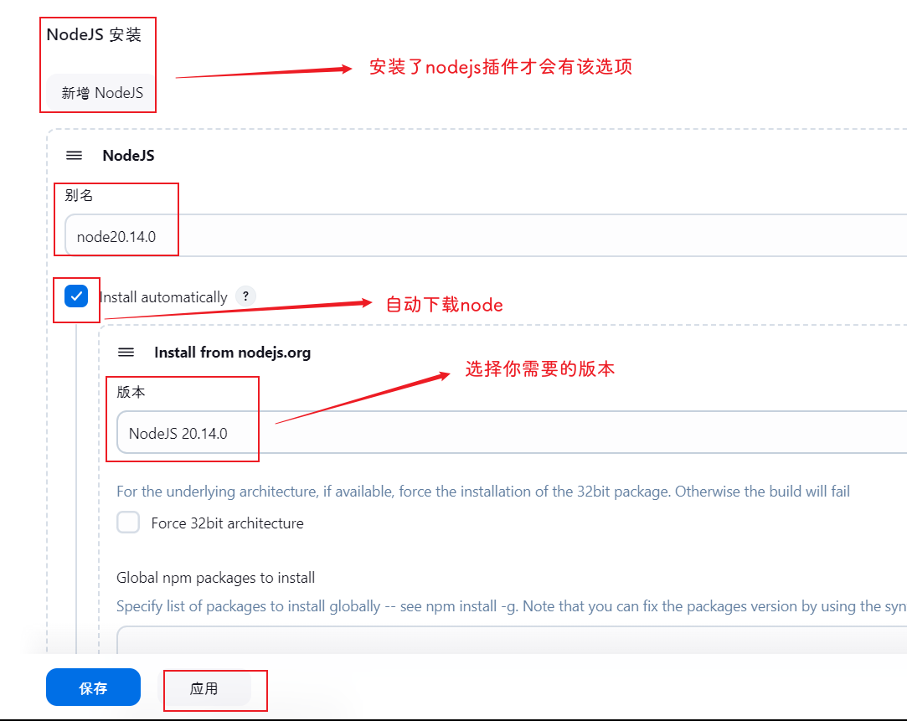
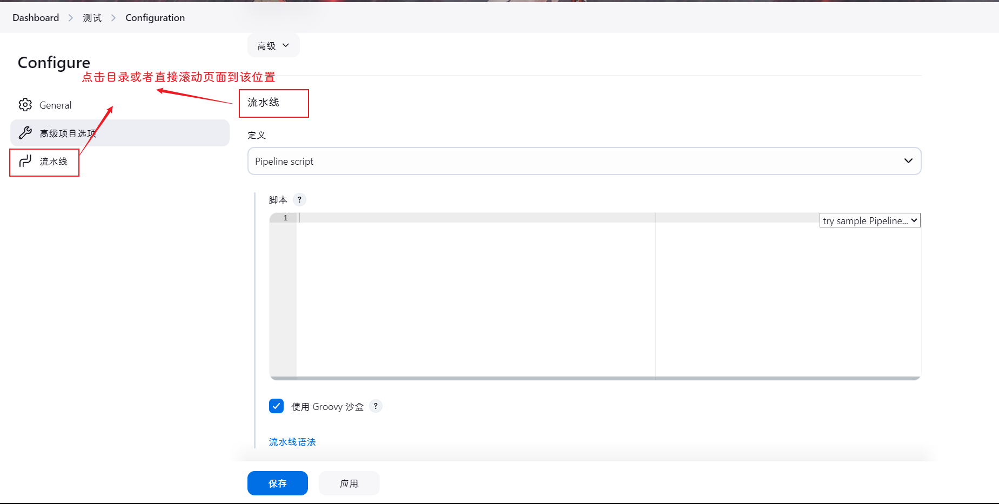

> `jenkins`对应的`JDK`版本:
>
> https://www.jenkins.io/doc/book/platform-information/support-policy-java/

## 前言

提到 *`Jenkins`*，首先会想到的概念就是 *`DevOps`* 和 *`CI/CD`*。

*`DevOps`* 是 *`Development`* 和 *`Operations`* 的组合，是一种方法论，*`DevOps`* 是一种重视开发人员和运维人员之间沟通、协作的流程。通过自动化的软件交付，使软件的构建、测试、发布更加快捷、频繁、可靠。

**CI**

*`CI`* **的英文名称是\*`Continuous Integration`*，也就是持续集成的意思。

假如我们在开发过程中不断的提交、进行单元测试、发布测试版本，这个过程无疑是极其痛苦的，不管是运维还是开发都需要花费大量时间和精力在这上面。持续集成`CI`是在源代码变更后自动检测、拉取、构建的过程。

**CD**

*`CD`* 对应的是持续交付 *`Continuous Delivery`* 和持续部署 *`Continuous Deployment`*

**持续交付**

在 *`CI`* 自动化流程阶段后，运维团队可以快速、轻松地将产出交付给到最终使用的用户。

从前端的角度来看就是可持续性交付构建出的产物给到运维或者后端进行部署

**持续部署**

持续交付的延伸，可以自动将应用发布到目标服务器

## 安装

#### 镜像拉取

```shell
docker pull swr.cn-north-4.myhuaweicloud.com/ddn-k8s/docker.io/jenkins/jenkins:2.479-jdk21
docker tag  swr.cn-north-4.myhuaweicloud.com/ddn-k8s/docker.io/jenkins/jenkins:2.479-jdk21  jenkins:2.479-jdk21
docker rmi swr.cn-north-4.myhuaweicloud.com/ddn-k8s/docker.io/jenkins/jenkins:2.479-jdk21
```

#### 查看镜像

```shell
docker images
```

## 启动Jenkins容器

 创建挂载文件夹，并且进行文件权限授予

```shell
cd /home/docker_volume
mkdir jenkins
cd jenkins
mkdir home etc env ssh

#权限
chmod 777 /home/docker_volume/jenkins
```

### 启动并运行容器

```shell
docker run -d \
--name jenkins \
--restart=always \
-u root \
-p 9095:8080 \
-v /home/docker_volume/jenkins/home:/var/jenkins_home \
-v /etc/localtime:/etc/localtime \
jenkins:2.479-jdk21


docker run -d \
--name jenkins \
--restart=always \
-u root \
-p 9095:8080 \
-v /etc/localtime:/etc/localtime \
jenkins:2.479-jdk21
```

拷贝出opt下的文件到opt目录下

```shell
docker cp jenkins:/opt /home/docker_volume/jenkins
docker cp jenkins:/root/.bashrc /home/docker_volume/jenkins/env/.bashrc
```

删除jenkins容器

```shell
docker stop jenkins
docker rm jenkins
```

重新部署，挂载环境目录

```shell
docker run -d \
--name jenkins \
--restart=always \
-u root \
-p 9095:8080 \
-v /home/docker_volume/jenkins/home:/var/jenkins_home \
-v /home/docker_volume/jenkins/opt:/opt \
-v /home/docker_volume/jenkins/etc/profile:/etc/profile \
-v /home/docker_volume/jenkins/etc/environment:/etc/environment \
-v /etc/localtime:/etc/localtime \
-v /etc/timezone:/etc/timezone \
-v /var/run/docker.sock:/var/run/docker.sock \
-v $(which docker):/usr/bin/docker \
jenkins:2.479-jdk21

################################################
-e JAVA_OPTS="-Dsun.jnu.encoding=UTF-8 -Dfile.encoding=UTF-8" \
-e JENKINS_JAVA_OPTS="-Dsun.jnu.encoding=UTF-8 -Dfile.encoding=UTF-8" \
-e LANG="zh_CN.UTF-8" \
################################################（下方是我复制用的）
docker run -d \
--name jenkins \
--restart=always \
-u root \
-p 9095:8080 \
-v /home/docker_volume/jenkins/home:/var/jenkins_home \
-v /home/docker_volume/jenkins/opt:/opt \
-v /etc/localtime:/etc/localtime \
-v /etc/timezone:/etc/timezone \
-v /etc/default/locale:/etc/default/locale \
-v /var/run/docker.sock:/var/run/docker.sock \
-v $(which docker):/usr/bin/docker \
-v /home/docker_volume/jenkins/env/.bashrc:/root/.bashrc \
-v /home/docker_volume/jenkins/ssh:/root/.ssh \
-e LANG="C.UTF-8" \
-e JAVA_OPTS="-Dsun.jnu.encoding=UTF-8 -Dfile.encoding=UTF-8" \
-e LC_ALL="C.UTF-8" \
-e LANGUAGE="C.UTF-8" \
jenkins:2.479-jdk21
####################################################检查
# java -XshowSettings:properties -version
```

| 命令                                                         | 描述                                                         |
| :----------------------------------------------------------- | :----------------------------------------------------------- |
| -d                                                           | 后台运行容器，并返回容器ID                                   |
| -uroot                                                       | 使用 root 身份进入容器，推荐加上，避免容器内执行某些命令时报权限错误 |
| -p 9095:8080                                                 | 将容器内8080端口映射至宿主机9095端口，这个是访问jenkins的端口 |
| -p 50000:50000                                               | 将容器内50000端口映射至宿主机50000端口                       |
| --name jenkins                                               | 设置容器名称为jenkins                                        |
| -v /home/jenkins_home:/var/jenkins_home                      | :/var/jenkins_home目录为容器jenkins工作目录，我们将硬盘上的一个目录挂载到这个位置，方便后续更新镜像后继续使用原来的工作目录 |
| -v /etc/localtime:/etc/localtime \<br/>-v /etc/timezone:/etc/timezone \<br/>-v /etc/default/locale:/etc/default/locale \ | 让容器使用和服务器同样的时间设置                             |
| -v /home/docker_volume/jenkins/opt:/opt                      | 环境挂载目录(Java/maven)                                     |
| -v /var/run/docker.sock:/var/run/docker.sock                 | 将宿主机的 Docker 套接字挂载到 Jenkins 容器，Jenkins 容器可以与宿主机的 Docker 守护进程进行通信，从而执行 Docker 命令。 |
| -v $(which docker):/usr/bin/docker                           | 为jenkins容器能调用host主机的docker所做的映射                |
| jenkins/jenkins                                              | 镜像的名称，这里也可以写镜像ID                               |

> `注意`
>
> - `-v /var/run/docker.sock:/var/run/docker.sock`
>
> - `-v $(which docker):/usr/bin/docker`
>
> 会有杀死自己的风险

```shell
#日志查看
docker logs jenkins
```


### 准备环境

#### maven

下载离线的tar包

```shell
https://maven.apache.org/download.cgi
```


- `tar.gz`是`linux`的压缩包，`.zip`是`windows`的压缩包

- `bin`代表二进制class文件(由java文件编译而成)，`src`代表源码（java源码），源码source比binary大一些，**一般正常使用下载bin类型即可，如果要学习源码下载src类型**

下载tar包并上传到服务器地址，我这里放在`/home/cache`

```shell
cd /home/cache
```


解压tar包到指定位置

```shell
tar -xzf apache-maven-3.9.9-bin.tar.gz -C /home/docker_volume/jenkins/opt
```

Maven在3.8.1后默认阻止了http仓库访问，具体参考[点我](https://blog.csdn.net/hadues/article/details/119038072)，这里我直接注释掉 `$MAVEN_HOME/conf/settings.xml` 中的拦截标签

- 找到Maven安装目录`/conf/settings.xml`
- 注释如下代码

```xml
<mirror>
    <id>maven-default-http-blocker</id>
    <mirrorOf>external:http:*</mirrorOf>
    <name>Pseudo repository to mirror external repositories initially using HTTP.</name>
    <url>http://0.0.0.0/</url>
    <blocked>true</blocked>
</mirror>
```

`/conf/settings.xml`添加阿里云镜像

```xml
<mirror>
    <id>alimaven</id>
    <name>aliyun maven</name>
    <url>http://maven.aliyun.com/nexus/content/groups/public/ </url>
    <mirrorOf>central</mirrorOf>
</mirror>
```

## 访问Jenkins 

在浏览器中输入:[http://serverIp:port/](https://links.jianshu.com/go?to=http%3A%2F%2Fserverip%3A8080%2F)访问jenkins，serverIp为docker宿主机的ip，port即为宿主机映射的端口。我的即为：

`http://192.168.56.102:9095/`


这里要求输入初始的管理员密码，根据提示密码在`/var/jenkins_home/secrets/initialAdminPassword`这个文件中，注意这个路径是[Docker容器](https://so.csdn.net/so/search?q=Docker容器&spm=1001.2101.3001.7020)中的，所以我们通过如下命令获取一下

```shell
docker exec jenkins cat /var/jenkins_home/secrets/initialAdminPassword
```


输入上面获取的密码，即可解锁。别忘了我们映射了本地数据卷`/opt/jenkins_data/`，所以也可以通过如下命令输出：

```shell
cat /home/docker_volume/jenkins/secrets/initialAdminPassword
```

还有我们的日志文件就可以看见密码，可以直接使用。 

## 访问页面

#### 跳过安装插件


这里建议点击 `选择插件来安装`，在点击 `无` ，不安装任何插件，再点击 `安装`，因为我们没有配置镜像，安装插件是从外网下载过来的，会比较慢，并且下载的插件可能会出现不兼容等状况，导致失败率很高


进入到创建管理员页面，填写账户信息后 `保存并完成`


进入以下页面配置 `jenkins` 的 `url` ，一般使用默认的就行了，`保存并完成`


初始化完成


可以点击 `开始使用 Jenkins` 直接登录进入 `Jenkins`


#### 常用插件的安装

`Jenkins` 相当于一个平台，它很多的功能都是通过对应的插件去实现的，所以插件安装对于使用 `Jenkins` 非常的重要

在 `Jenkins` 中常用的插件如下：

- [Folders](https://updates.jenkins.io/download/plugins/cloudbees-folder/)
- [OWASP Markup Formatter](https://updates.jenkins.io/download/plugins/antisamy-markup-formatter/)
- [Build Timeout](https://updates.jenkins.io/download/plugins/build-timeout/)
- [Credentials Binding](https://updates.jenkins.io/download/plugins/credentials-binding/)
- [Timestamper](https://updates.jenkins.io/download/plugins/timestamper/)
- [Workspace Cleanup](https://updates.jenkins.io/download/plugins/ws-cleanup/)
- [Ant](https://updates.jenkins.io/download/plugins/ant/)
- [Gradle](https://updates.jenkins.io/download/plugins/gradle/)
- [Pipeline](https://updates.jenkins.io/download/plugins/workflow-aggregator/)
- [GitHub Branch Source](https://updates.jenkins.io/download/plugins/github-branch-source/)
- [Pipeline:GitHub Groovy Libraries](https://updates.jenkins.io/download/plugins/pipeline-github-lib/)
- [Pipeline:Stage View](https://updates.jenkins.io/download/plugins/pipeline-stage-view/)
- [Git](https://updates.jenkins.io/download/plugins/git/)
- [SSH Build Agents](https://updates.jenkins.io/download/plugins/ssh-slaves/)
- [Matrix Authorization Strategy](https://updates.jenkins.io/download/plugins/matrix-auth/)
- [PAM Authentication](https://updates.jenkins.io/download/plugins/pam-auth/)
- [LDAP](https://updates.jenkins.io/download/plugins/ldap/)
- [Email Extension](https://updates.jenkins.io/download/plugins/email-ext/)
- [Mailer](https://updates.jenkins.io/download/plugins/mailer/)
- [Dark Theme](https://updates.jenkins.io/download/plugins/dark-theme/)
- [Localization: Chinese (Simplified)](https://updates.jenkins.io/download/plugins/localization-zh-cn/)

##### 汉化

下面我以安装插件 `Locale` 为例，演示安装插件的大概步骤

访问 `Jenkins` ，选择 `Manage Jenkins`，选择 `Plugins`


选择 `Available plugins`


搜索栏中搜索 `Locale`、`Localization: Chinese`，我这里由于安装了就贴的别人的图


勾选上后点击安装(演示用的，和实际要下载的插件流程是一致的)

就会开始安装该插件


接着就重启 `Jenkins` 使该插件生效

重启方法：在 `URL` 的后面加上 `restart`，例如：`http://localhost:8080/restart`
或者直接在下面的选中框


重启后基本上可以看到部分已经汉化了.......根本汉化不全，如下进行一些设置，反正没啥用......


##### 	流水线

参照汉化下载`Pipeline`和`Pipeline Stage view`

##### NodeJS

参照汉化下载`Nodejs`

## 配置全局环境

### 方式一：单独配置


#### 配置maven

设置全局`settings.xml`(基于jenkins容器路径)

```shell
/opt/apache-maven-3.9.9/conf/settings.xml
```


新增一个`别名`的manve方便后续调用	


点击应用

#### 配置jdk


#### 配置Node.js

前提是已经下载了`Nodejs`插件



#### 验证

​	




写入脚本

```json
pipeline {
    agent any
    tools {
    	jdk 'jdk17'
        nodejs 'node20.14.0'
        maven 'mvn3.9.9'
    }
    stages {
        stage('test') {
            steps {
                script {
                    sh """
                        docker -v
                        which docker
                        echo '===================='
                        java -version
                        which java
                        echo '===================='
                        mvn -v
                        which mvn
                        echo '===================='
                        node -v
                        which node
                        echo '===================='
                        npm -v
                        which npm
                        echo '===================='
                        git --version
                        which git
                    """
                }
            }
        }
    }
}
```

其中`tools`里面的`jdk`和`nodejs`，`maven`的值就为上述配置的别名

其中`tools`下的`jdk`可以不配，因为jenkins内置的环境变量上就有个JDK17

然后保存


可以看到成功输出的日志信息

```shell
Started by user 山居
[Pipeline] Start of Pipeline
[Pipeline] node
Running on Jenkins in /var/jenkins_home/workspace/测试
[Pipeline] {
[Pipeline] stage
[Pipeline] { (Declarative: Tool Install)
[Pipeline] tool
[Pipeline] envVarsForTool
[Pipeline] tool
[Pipeline] envVarsForTool
[Pipeline] }
[Pipeline] // stage
[Pipeline] withEnv
[Pipeline] {
[Pipeline] stage
[Pipeline] { (test)
[Pipeline] tool
[Pipeline] envVarsForTool
[Pipeline] tool
[Pipeline] envVarsForTool
[Pipeline] withEnv
[Pipeline] {
[Pipeline] script
[Pipeline] {
[Pipeline] sh
+ docker -v
Docker version 27.3.1, build ce12230
+ java -version
openjdk version "17.0.12" 2024-07-16
OpenJDK Runtime Environment Temurin-17.0.12+7 (build 17.0.12+7)
OpenJDK 64-Bit Server VM Temurin-17.0.12+7 (build 17.0.12+7, mixed mode)
+ mvn -v
Apache Maven 3.9.9 (8e8579a9e76f7d015ee5ec7bfcdc97d260186937)
Maven home: /opt/apache-maven-3.9.9
Java version: 17.0.12, vendor: Eclipse Adoptium, runtime: /opt/java/openjdk
Default locale: en, platform encoding: UTF-8
OS name: "linux", version: "5.15.0-76-generic", arch: "amd64", family: "unix"
+ node -v
v20.14.0
+ npm -v
10.7.0
[Pipeline] }
[Pipeline] // script
[Pipeline] }
[Pipeline] // withEnv
[Pipeline] }
[Pipeline] // stage
[Pipeline] }
[Pipeline] // withEnv
[Pipeline] }
[Pipeline] // node
[Pipeline] End of Pipeline
Finished: SUCCESS
```

### 方式二：使用系统环境变量

> 这种情况适用于本地Docker里的Jenkins你需要的环境都是OK的

首先获取系统环境变量值

```shell
#进入容器
docker exec -it jenkins bash
# 获取环境变量值
echo $PATH
```


复制这个值，填入Jenkins的全局环境变量里

docker退出Jenkins容器

```shell
exit
```


保存即可

#### 验证

参照方式一的验证过程，只不过脚本值改为如下的

```shell
pipeline {
    agent any
    stages {
        stage('test') {
            steps {
                script {
                    sh """
                        docker -v
                        which docker
                        echo '===================='
                        java -version
                        which java
                        echo '===================='
                        mvn -v
                        which mvn
                        echo '===================='
                        node -v
                        which node
                        echo '===================='
                        npm -v
                        which npm
                        echo '===================='
                        git --version
                        which git
                    """
                }
            }
        }
    }
}
```

可以看到这里我们就没有配置`tools`


​	成功输出的日志信息如下

```shell
Started by user 山居
[Pipeline] Start of Pipeline
[Pipeline] node
Running on Jenkins in /var/jenkins_home/workspace/test_a
[Pipeline] {
[Pipeline] stage
[Pipeline] { (test)
[Pipeline] script
[Pipeline] {
[Pipeline] sh
+ docker -v
Docker version 27.3.1, build ce12230
+ which docker
/usr/bin/docker
+ echo ====================
====================
+ java -version
openjdk version "21.0.4" 2024-07-16 LTS
OpenJDK Runtime Environment Temurin-21.0.4+7 (build 21.0.4+7-LTS)
OpenJDK 64-Bit Server VM Temurin-21.0.4+7 (build 21.0.4+7-LTS, mixed mode)
+ which java
/opt/java/openjdk/bin/java
+ echo ====================
====================
+ mvn -v
Apache Maven 3.9.9 (8e8579a9e76f7d015ee5ec7bfcdc97d260186937)
Maven home: /opt/apache-maven-3.9.9
Java version: 21.0.4, vendor: Eclipse Adoptium, runtime: /opt/java/openjdk
Default locale: en_US, platform encoding: UTF-8
OS name: "linux", version: "5.15.0-76-generic", arch: "amd64", family: "unix"
+ which mvn
/opt/apache-maven-3.9.9/bin/mvn
+ echo ====================
====================
+ node -v
v20.14.0
+ which node
/opt/nvm/versions/node/v20.14.0/bin/node
+ echo ====================
====================
+ npm -v
10.7.0
+ which npm
/opt/nvm/versions/node/v20.14.0/bin/npm
+ echo ====================
====================
+ git --version
git version 2.39.5
+ which git
/usr/bin/git
[Pipeline] }
[Pipeline] // script
[Pipeline] }
[Pipeline] // stage
[Pipeline] }
[Pipeline] // node
[Pipeline] End of Pipeline
Finished: SUCCESS
```

## Jenkins时间异常

由于我一开始配置镜像的时候没有绑定`/etc/timezone`导致时间和服务器时间对不上

```shell
1、查看容器中的时区
[root@jenkins jenkins_docker]# docker exec -it jenkins cat /etc/timezone
Etc/Utc

而本地使用的是Asia/shanghai
[root@jenkins jenkins_docker]# timedatectl | grep 'Time zone'
       Time zone: Asia/Shanghai (CST, +0800)

2、使用root 登陆容器中，修改时区
[root@jenkins jenkins_docker]# docker exec -it -u root jenkins /bin/bash
root@cf2833dd90f9:/# echo "Asia/Shanghai" > /etc/timezone
root@cf2833dd90f9:/# exit
exit
3、将本地时间拷贝
[root@jenkins jenkins_docker]# docker cp /usr/share/zoneinfo/Asia/Shanghai jenkins:/etc/localtime

4、重启Jenkins服务
[root@jenkins jenkins_docker]# docker restart jenkins
[+] Running 1/1
 ⠿ Container jenkins  Started                                                                                                                              0.5s
 
5、验证
[root@jenkins jenkins_docker]# docker exec -it -u root jenkins date
Mon Jun  5 16:57:04 CST 2023

```


