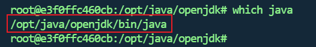
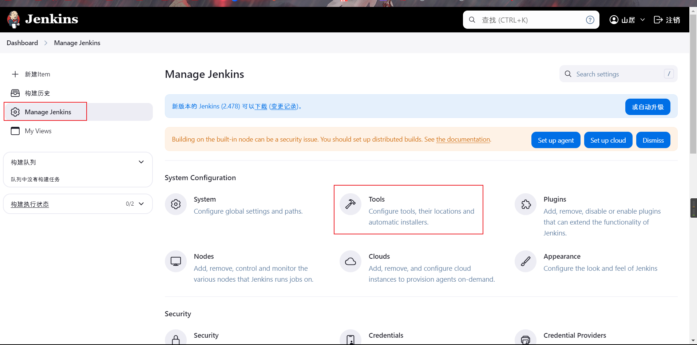
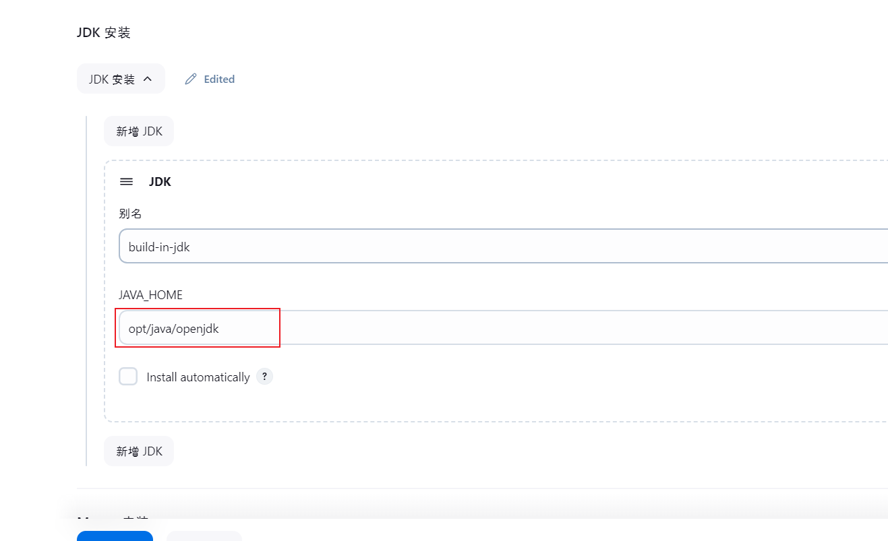
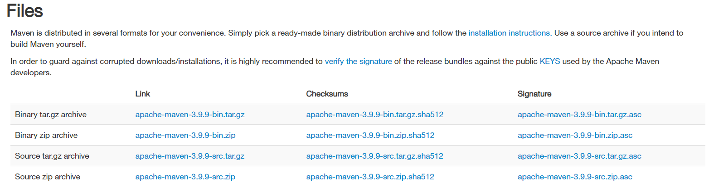
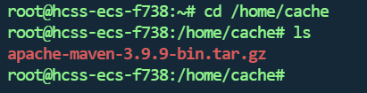

## 配置JDK环境

使用`Jenkins`容器自带的`JDK`

```bash
# 进入容器
docker exec -it jenkins bash
# 查找JDK（docker自带的功能）
which java
```



在页面配置上





## 配置Maven环境

### 线上安装

```shell
sudo apt update
sudo apt install maven
```

想要验证安装是否成功，运行`mvn -version`：

```shell
mvn -version
```

你应该能看到类似下面的信息：

```shell
Maven home: /opt/maven
Java version: 11.0.7, vendor: Ubuntu, runtime: /usr/lib/jvm/java-11-openjdk-amd64
Default locale: en_US, platform encoding: UTF-8
OS name: "linux", version: "5.4.0-26-generic", arch: "amd64", family: "unix"
```

### 离线安装

下载地址

```shell
https://maven.apache.org/download.cgi
```



- `tar.gz`是`linux`的压缩包，`.zip`是`windows`的压缩包

- `bin`代表二进制class文件(由java文件编译而成)，`src`代表源码（java源码），源码source比binary大一些，**一般正常使用下载bin类型即可，如果要学习源码下载src类型**

下载tar包并上传到服务器地址，我这里放在`/home/cache`

```shell
cd /home/cache
```



解压tar包到指定位置

```
tar -xzf apache-maven-3.9.9-bin.tar.gz -C /opt
```

配置环境变量

```shell
#编辑或创建 /etc/profile 文件，添加 Maven 的环境变量：
sudo vim /etc/profile

#在文件末尾添加以下内容：
export MAVEN_HOME=/opt/apache-maven-3.9.9
export PATH=$PATH:$MAVEN_HOME/bin
```

保存并关闭文件,使新添加的环境变量生效

```shell
source /etc/profile
```


