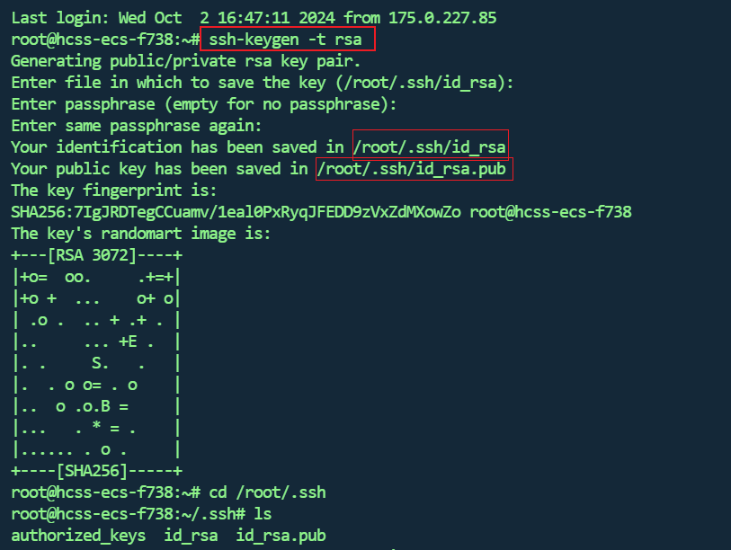

## 准备密钥
> 如果服务器上`/root/.ssh`已经存在`id_rsa.pub`以及`id_rsa`则跳过该步骤

在你Jenkins需要连接的`服务器`上输出以下命令

```sh
ssh-keygen -t rsa -C "suyan.ad.3110@qq.com"

// 密钥对生成路径，默认为/root/.ssh/id_rsa，可以手动输入其他地址
Enter file in which to save the key (/root/.ssh/id_rsa):

// 这两项可以直接敲enter
Enter passphrase (empty for no passphrase):
Enter same passphrase again:
```



## jenkins配置

Jenkins控制面板进入`Manage Jenkins`->`System`填入你要连接的服务器信息


展开高级填入服务器私钥文件里的内容

```sh
# 在服务器通过cat读取私钥内容
cat /root/.ssh/id_rsa
```


最后测试连接，成功后直接保存


