## 准备密钥文件

> 如果容器内`/root/.ssh`已经存在`id_rsa.pub`以及`id_rsa`则跳过

进入Jenkins容器

```sh
docker exec -it jenkins bash
```

在你Jenkins需要连接的服务器上输出以下命令

```sh
ssh-keygen -t rsa -C "suyan.ad.3110@qq.com"

// 密钥对生成路径，默认为/root/.ssh/id_rsa，可以手动输入其他地址
Enter file in which to save the key (/root/.ssh/id_rsa):

// 这两项可以直接敲enter
Enter passphrase (empty for no passphrase):
Enter same passphrase again:
```

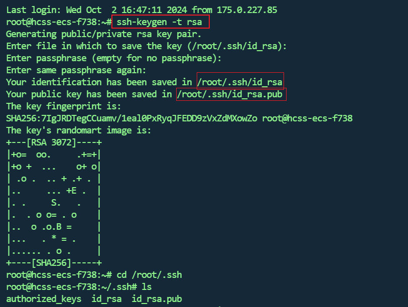

## Gitea配置SSH凭证

### 添加凭证

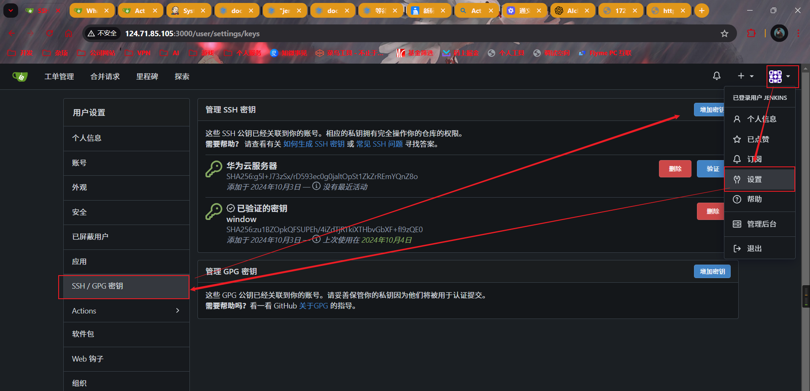

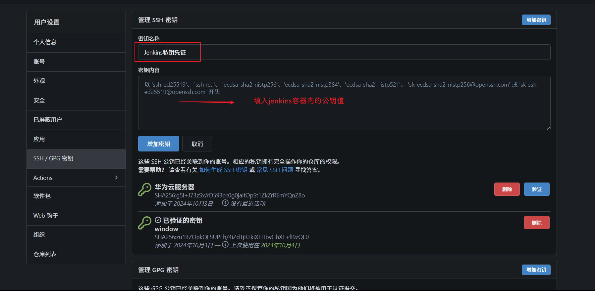

在Jenkins容器中获取公钥值

```sh
cat /root/.ssh/id_rsa.pub
```

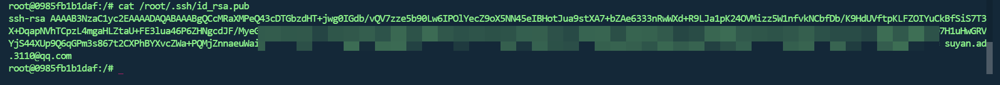

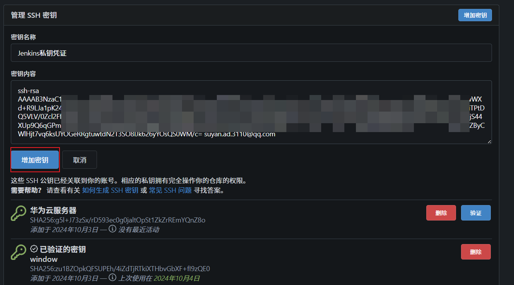

可以看到增加成功了

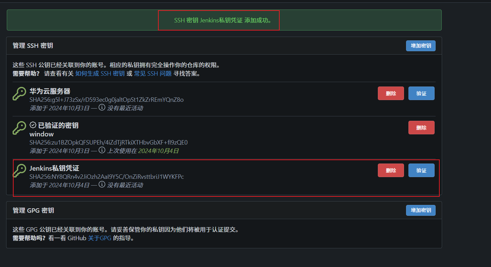

### Gitea进行验证

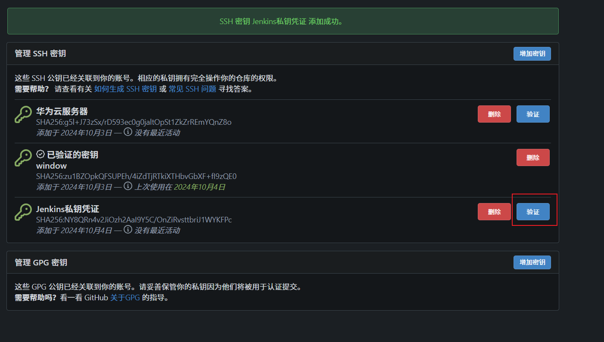

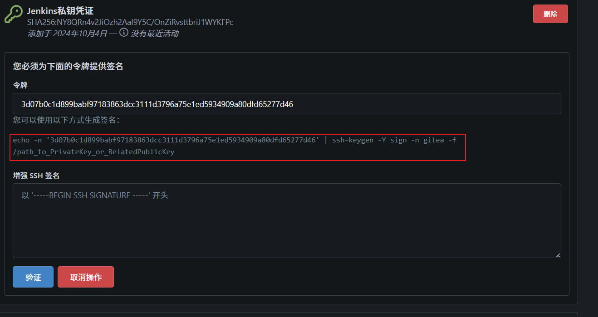

复制框起来的，其中`/path_to_PrivateKey_or_RelatedPublicKey`的值为你的`Jenkins容器`里的`私钥文件`或者`公钥文件`的路径,这里我就用公钥文件来了

```sh
echo -n '3d07b0c1d899babf97183863dcc3111d3796a75e1ed5934909a80dfd65277d46' | ssh-keygen -Y sign -n gitea -f /root/.ssh/id_rsa.pub
echo -n 'dfd40dc1c7abe96390da6d660451ab35780216d8b4aac5ad19730f6e6c08f0c4' | ssh-keygen -Y sign -n gitea -f /root/.ssh/id_rsa.pub
```

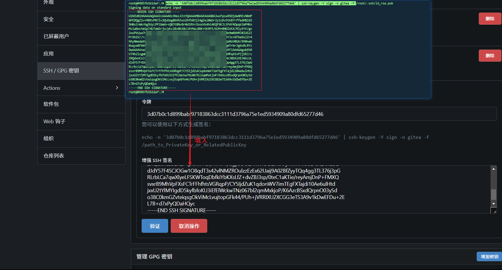

> 注意的是：这个验证是有时间限制的，超过时间还没验证就会报错，报错了话再重新验证一次就行，我这里因为写笔记导致验证失败，又重新验证了一次

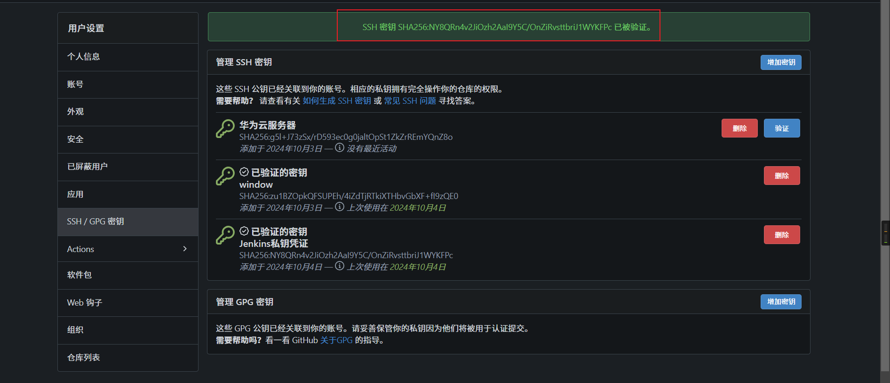

### 容器进行验证

执行下述命令进行容器验证

```sh
# ssh -T -p 你gitea的端口 git@你gitea的ip地址或者域名
ssh -T -p 3001 git@124.71.85.105
```

如果你的gitea的ssh能通过22进行访问，那` -p 你gitea的端口` 就可以不用填

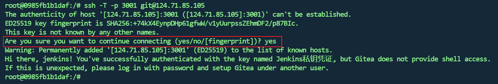

由于我这是第一次ssh连接会要求我进行一次确认，后续就不需要了

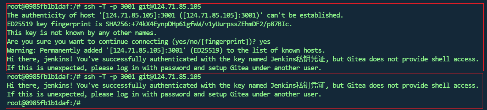

## Jenkins添加SSH的私钥凭证

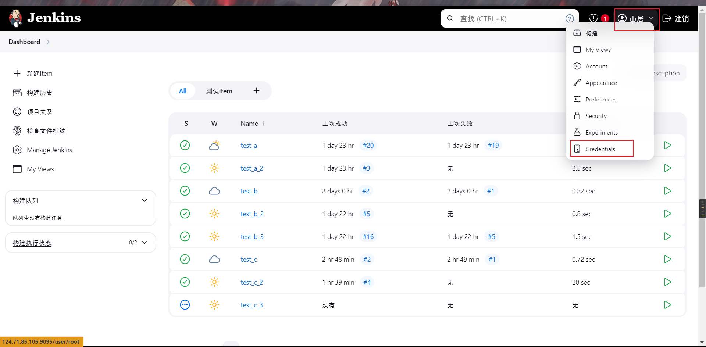

后面页面百度吧，这里截图截吐了，就只截主要的

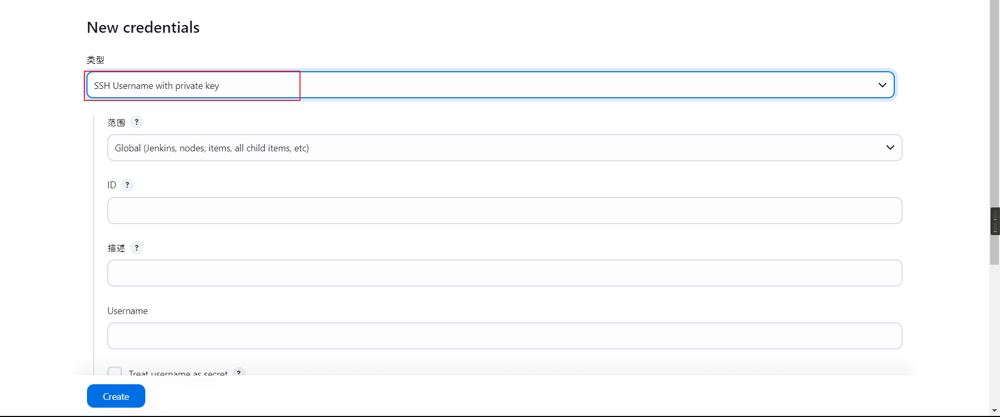

类型选择`SSH`

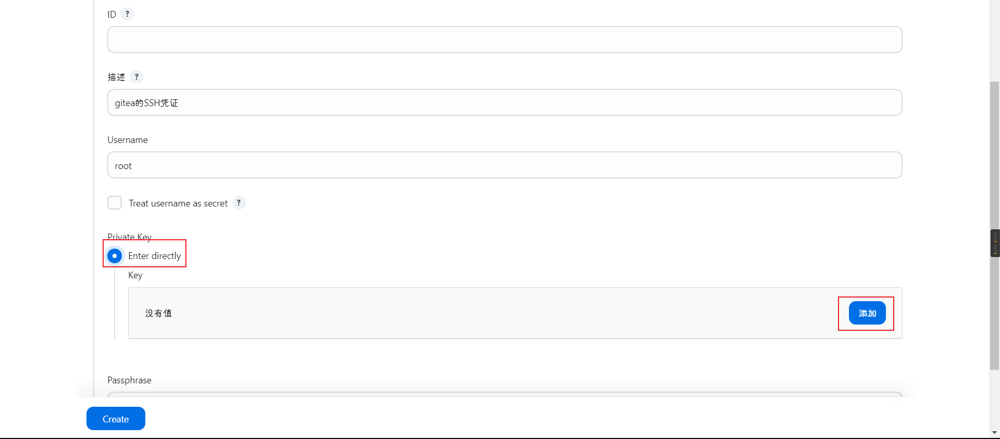

添加里填入的是容器里面`私钥`的值，即在容器里执行以下命令获取

```sh
cat /root/.ssh/id_rsa
```

然后创建即可

## 测试

Jenkins新建一个`feelstyled的item`

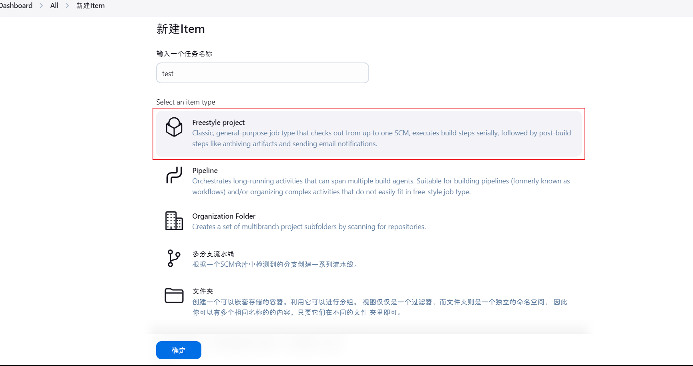

去`gitea`获取一个仓库的`ssh`地址

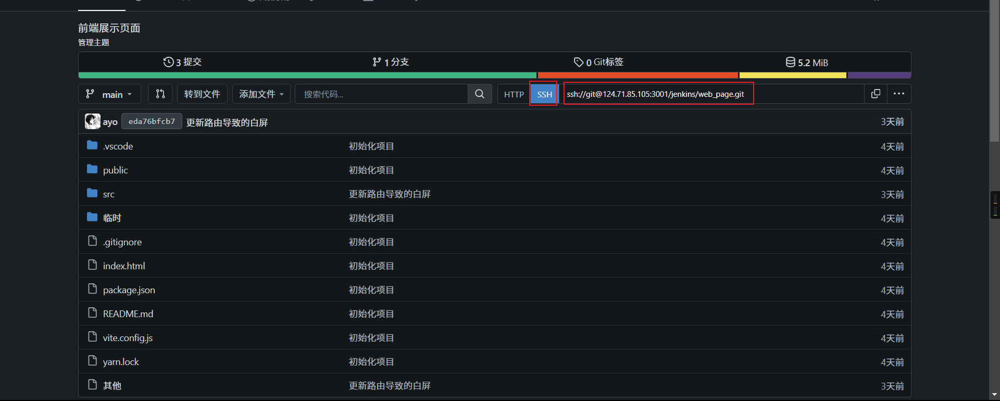

回到Jenkins的item配置页面，`源码管理`选择`Git`

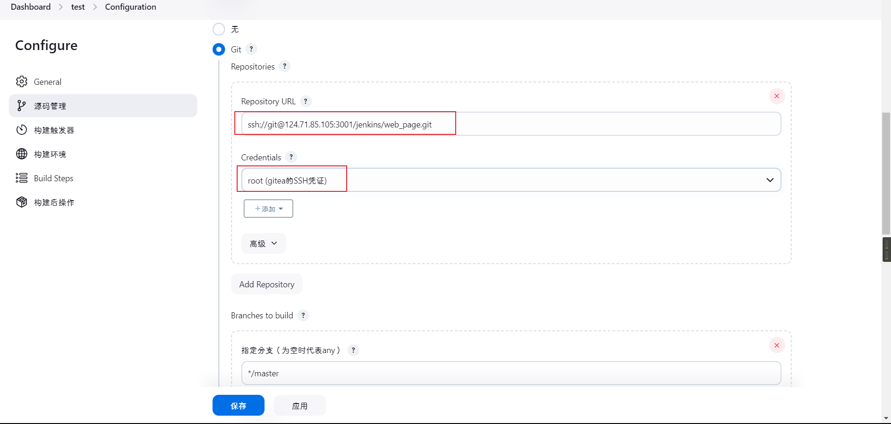

> 可以看到没有报错，那进本上就是成功了，后续的可以不管，我这里强迫症，给他走完

填写Git要操作的分支，然后保存

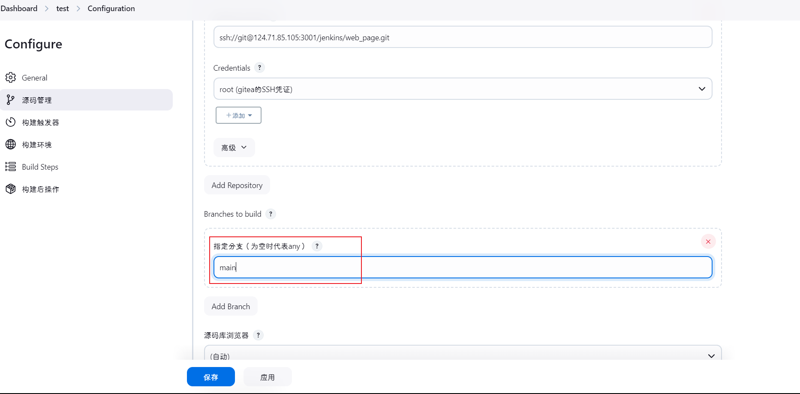

测试

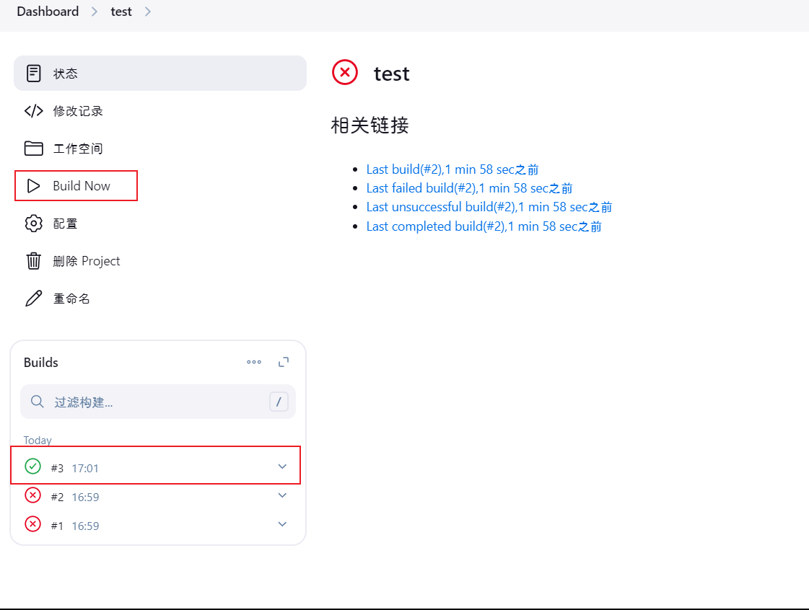

成功，我们看一下控制台输出

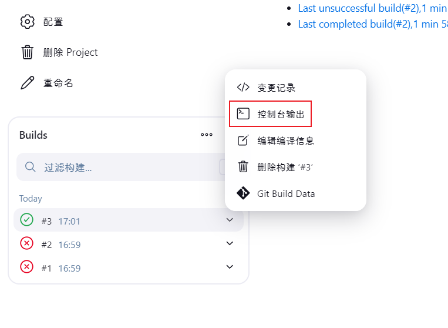

```sh
Started by user 山居
Running as SYSTEM
Building in workspace /var/jenkins_home/workspace/test
The recommended git tool is: NONE
using credential 99c8a719-e7af-4f11-b53b-878c96467808
 > git rev-parse --resolve-git-dir /var/jenkins_home/workspace/test/.git # timeout=10
Fetching changes from the remote Git repository
 > git config remote.origin.url ssh://git@124.71.85.105:3001/jenkins/web_page.git # timeout=10
Fetching upstream changes from ssh://git@124.71.85.105:3001/jenkins/web_page.git
 > git --version # timeout=10
 > git --version # 'git version 2.39.5'
using GIT_SSH to set credentials gitea的SSH凭证
Verifying host key using known hosts file
You're using 'Known hosts file' strategy to verify ssh host keys, but your known_hosts file does not exist, please go to 'Manage Jenkins' -> 'Security' -> 'Git Host Key Verification Configuration' and configure host key verification.
 > git fetch --tags --force --progress -- ssh://git@124.71.85.105:3001/jenkins/web_page.git +refs/heads/*:refs/remotes/origin/* # timeout=10
 > git rev-parse origin/main^{commit} # timeout=10
Checking out Revision eda76bfcb77a067d7f71faa52d474f7be8f962c0 (origin/main)
 > git config core.sparsecheckout # timeout=10
 > git checkout -f eda76bfcb77a067d7f71faa52d474f7be8f962c0 # timeout=10
Commit message: "更新路由导致的白屏"
First time build. Skipping changelog.
Finished: SUCCESS
```

结束
